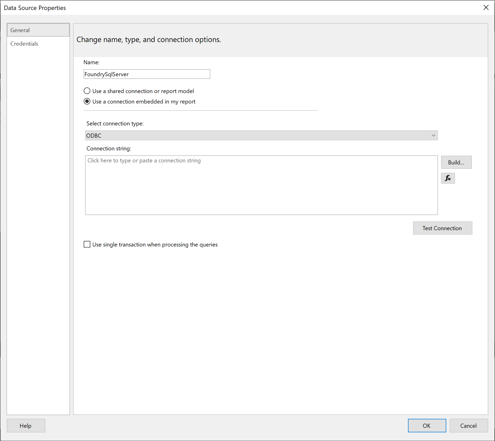
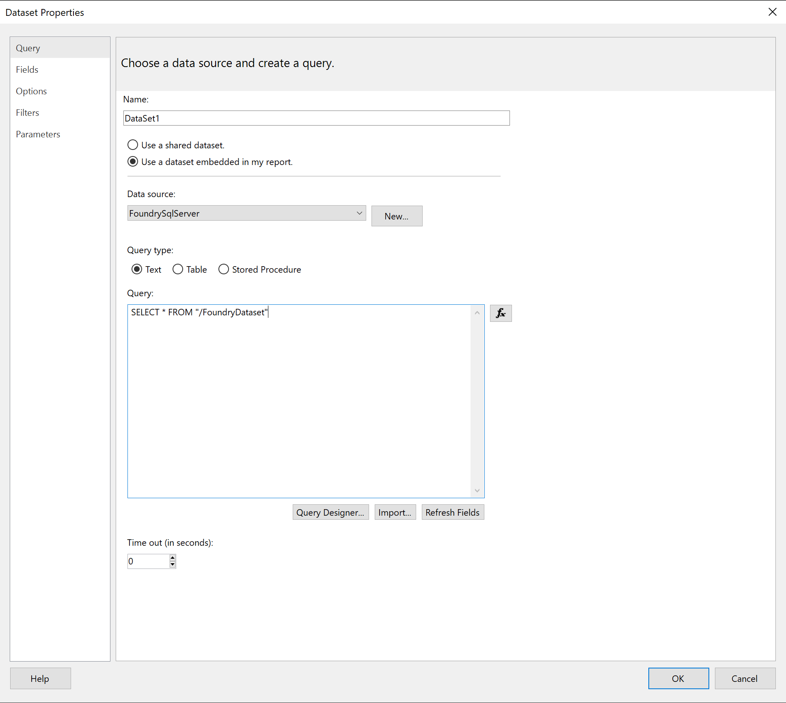

<!-- source: https://palantir.com/docs/foundry/analytics-connectivity/msft-report-builder-getting-started/ · mirrored 2026-08-06 from Palantir Foundry docs -->

# Getting started

This guide will teach you how to authenticate with Foundry via Report Builder, select a dataset, and get started building your first report.

### Add Foundry as your data source in Report Builder

* From Report Builder, click into the toolbar in the Report Data pane. Click New, and then click Data Source. The Data Source Properties dialog box opens.
* In the Name text box, type any convenient name e.g. `FoundrySqlServer`. Click the "Use a connection embedded in my report" option.
* Click into the "Select connection type" dropdown and select ODBC, so that your window looks as follows:

### Build your connection string

You'll now need to create your connection string for your Foundry connection by pasting the following Base Connection String into the Connection string text box in Report Builder, and replacing '<URL>' and '<Token>' as described below:

* **Base Connection String:** `DSN=FoundrySql;BaseUrl=<URL>;PWD=<Token>`
* **URL:** Add your Foundry connection URL as the "Base URL". Your Foundry connection URL is the link you normally use to access Foundry. To do so, replace the '<URL>' with this path by logging into Foundry, copying the URL, and deleting the `https://` prefix as well as anything after `.com`.
* **Token:** Follow the instructions on [generating a token](/docs/foundry/platform-security-third-party/user-generated-tokens/) to generate a private authentication token inside Foundry. Once you have the token, you can paste it into the '<Token>' section of the Base Connection String.
* Your Foundry data source should now be connected. You can now try clicking the "Test Connection" button. If you receive an error at this point, ensure you've completed the [installation instructions](/docs/foundry/analytics-connectivity/msft-report-builder-setup/).

:::callout{theme="neutral"}
Your credentials should now be saved in Report Builder and will continue to work as long as they are valid. You won't be prompted for a token again until your token validity has expired. At this point you can follow the above instructions again to generate a new token.
:::

Click "OK" and proceed to the next step.

### Connect to Foundry and query your dataset

* Use the Report Data pane on the left hand side again to click New, and then click Add Dataset.
* You will be prompted enter a name for your dataset. Click the "Use a dataset embedded in my report" option, and then select FoundrySqlServer from the dropdown.
* To start working with a specific dataset, copy the dataset filepath or RID into the Query text box. You can locate these values in Foundry by navigating to the desired dataset's "About" page, clicking on "see more", and copying either the "RID" value or the "Location". (See [Guides: Identifying a dataset's RID or filepath in Foundry](/docs/foundry/analytics-connectivity/identify-dataset-rid/).)
* Construct your SQL Query and proceed with building your report as usual.

