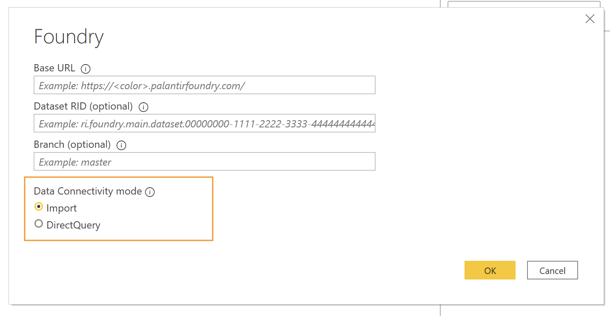
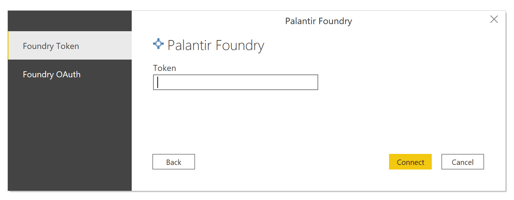
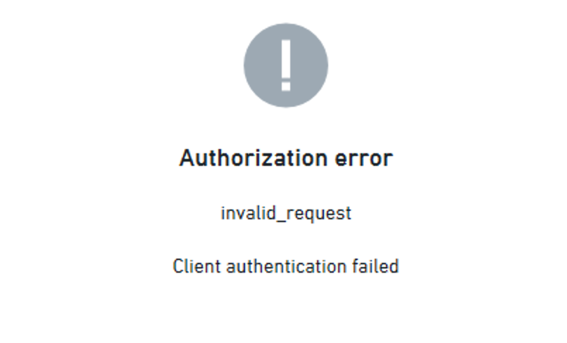

<!-- source: https://palantir.com/docs/foundry/analytics-connectivity/power-bi-faqs/ · mirrored 2026-08-22 from Palantir Foundry docs -->

# FAQs

:::callout{theme="warning"}
The following page discusses implementation of the Power BI® connector to access Foundry resources from the Power Query interface. If you are searching for information on our Microsoft Power BI® XMLA connector for data integration, refer to our [data connectivity documentation](/docs/foundry/available-connectors/microsoft-power-bi-xmla/).
:::

## General usage tips and guidance

* [Is there a size limit on how much data I can transmit?](#is-there-a-size-limit-on-how-much-data-i-can-transmit)
* [How do I optimize usage of the connector across Import and DirectQuery modes?](#how-do-i-optimize-usage-of-the-connector-across-import-and-directquery-modes)
* [How do access controls work across Foundry and Power BI®?](#how-do-access-controls-work-across-foundry-and-power-bi)
* [How do I use the Foundry integration with the Power BI® service?](#how-do-i-use-the-foundry-integration-with-the-power-bi-service)
* [How do I use the Foundry integration to create Dataflows in the Power BI® service?](#how-do-i-use-the-foundry-integration-to-create-dataflows-in-the-power-bi-service)
* [How do I configure additional ODBC driver settings with the Power BI® connector?](#how-do-i-configure-additional-odbc-driver-settings-with-the-power-bi-connector)

### Is there a size limit on how much data I can transmit?

Yes. Consult the documentation on [execution engines](/docs/foundry/analytics-connectivity/architecture/#execution-engines) for information regarding the Foundry-imposed limits on final result size when using the [Spark engine](/docs/foundry/analytics-connectivity/architecture/#spark-engine), as well as how to bypass these limits by using the [direct read engine](/docs/foundry/analytics-connectivity/architecture/#direct-read-engine).

Reference the following additional topics when working with large datasets:

* [How do I optimize usage of the connector across Import and DirectQuery modes?](#how-do-i-optimize-usage-of-the-connector-across-import-and-directquery-modes)
* [Slow import or import failure due to table size?](#slow-import-or-import-failure-due-to-table-size)

### How do I optimize usage of the connector across Import and DirectQuery modes?

The connector offers two connection mode options, which are specified when you set up a data connection.


In **Import mode**, the selected tables and columns are imported into Power BI®. As you create or interact with a visualization, Power BI® uses the imported data. To see underlying data changes since the initial import or the most recent refresh, you must refresh the data either manually or via a scheduled refresh.

* *Usage Guidance*: Import mode is recommended for dashboards you want to build with fast response times and a lot of interactivity on top of small- to medium-sized Foundry datasets. Import mode is likely preferable for most circumstances unless you are working with very large data, which cannot be pre-filtered in Foundry prior to the dashboard consumption layer.
* *Usage Limitations*: You may not be able to import large datasets due to the size limit threshold for data transmission via the connector. See [Is there a size limit on how much data I can transmit?](#is-there-a-size-limit-on-how-much-data-i-can-transmit) for more details.

In **DirectQuery mode**, the data is not imported or copied into Power BI®. As you create or interact with a visualization, Power BI® queries Foundry as the underlying data source, so you are always viewing current data, and you can push back data transformations and filtering into the Foundry layer.

* *Usage Guidance*: DirectQuery mode is recommended for simple dashboards with low interactivity that must be built on top of a very large dataset, as you can leverage Foundry’s computation engine to dynamically query and pull in results. However, the performance is slower than import mode, as you are pushing back computation to Foundry’s distributed computation engine. For this reason, we recommend keeping DirectQuery dashboards to relatively few queries.
* *Usage Limitations*: As with import mode, the user can only return up to the maximum result size to Power BI®. However, they can work with much larger datasets in Foundry, so long as the results returned are within the limit bounds.

<a target="_blank" href="https://docs.microsoft.com/en-us/power-bi/connect-data/desktop-use-directquery">Learn more about the difference between Import and DirectQuery ↗</a>.

**Broader usage recommendations**

We recommend trying to work in import mode where possible. If the data is large, consider whether it is possible to reduce the size in Foundry before importing, for example by filtering unnecessary rows, dropping columns, or pre-aggregating where possible. This Foundry preprocessing can be performed via Foundry transforms or Contour and configured as an automatic build. Alternatively, you can consider breaking your table import into smaller chunks which are within the size limit threshold, e.g. by importing one dataset for each calendar year.

When working in DirectQuery mode, we recommend keeping the dashboards to relatively few queries and simple interactivity. This approach balances the power of DirectQuery to work on very large datasets on the one hand, with end user expectations around performance on the other.

Finally, consider using a <a target="_blank" href="https://docs.microsoft.com/en-us/power-bi/transform-model/desktop-composite-models">composite model ↗</a> for a “best of both worlds” approach when working with very large data. With the composite model, a report can include both Import and DirectQuery data connections side by side. For example, you can configure an Import connection with pre-aggregated or filtered overview and key statistic data, providing fast loading times when users open the report. In the same report, you can also configure a DirectQuery connection to facilitate deeper dive on-demand analytics.

### How do access controls work across Foundry and Power BI®?

Reports developed with the Foundry Power BI® integration will automatically respect the report developer’s access rights as configured in Foundry. For example, a developer building a report in Power BI® Desktop will have access only to those datasets or restricted views in Power BI® that he would normally have access to in Foundry.

Published reports, if using data refresh, will use the credentials of the configured data source on the Power BI® Gateway rather than inheriting any credentials of the consumer of the report.

For more information about managing data sources on a gateway, see <a target="_blank" href="https://docs.microsoft.com/en-us/power-bi/connect-data/service-gateway-enterprise-manage-scheduled-refresh">
Manage your data source - import/scheduled refresh in the Microsoft Power BI® documentation ↗</a>.

### How do I use the Foundry integration with the Power BI® service?

Many of Palantir’s customers use the <a target="_blank" href="https://docs.microsoft.com/en-us/power-bi/fundamentals/power-bi-service-overview">Power BI® service ↗</a> to publish and distribute reports more broadly throughout their organizations.

In order to leverage the Foundry integration in these reports, use <a target="_blank" href="https://docs.microsoft.com/en-us/power-bi/connect-data/service-gateway-onprem">Power BI® Gateway ↗</a> with the Foundry connector and ODBC driver installed. When creating a connection on the gateway using the Foundry connection type, set the `Authentication Method` to `Key` and provide a [token](/docs/foundry/platform-security-third-party/user-generated-tokens/) generated for a service account in Foundry. The gateway will then have connectivity to Foundry, and can be used by reports hosted in Power BI® service.

:::callout{theme="neutral"}
When accessing Foundry through a Power BI® Gateway with the Foundry connector, token authentication is the only supported authentication method. OAuth authentication in the Power BI® service is not yet supported because this functionality is not available for Power BI® connectors developed by third parties. If you have a use case that requires OAuth authentication, consider adding feedback to the [Power BI® Ideas ↗](https://ideas.powerbi.com/ideas/) site, and sharing feedback with your Palantir and Microsoft representatives.
:::

The Foundry Power BI® integration functions with Power BI® Gateway in much the same way you are used to from Power BI® Desktop. Work with your Power BI® administrator to ensure that installation has been completed on the Gateway.

### How do I use the Foundry integration to create Dataflows in the Power BI® service?

The Foundry Power BI® integration is compatible with Power BI® Dataflows, using the Power Query Online editor.

:::callout{theme="neutral"}
Before you begin, ensure you have access to an on-premises gateway that is configured with an existing connection to Foundry. Creating a new gateway connection during the Dataflows setup process is currently not supported due to an active Power BI® service issue.
:::

To create a Dataflow that pulls data from Foundry, follow these steps:

1. From your Power BI® workspace, select **New**, then select **Dataflow** from the dropdown menu.
2. Select **Add new tables**.
3. On the **Choose data source** page, select **Palantir Foundry** in the list of connectors.
4. On the **Connect to data source** page, specify a **Base URL** that matches a connection already configured on your on-premises data gateway. For example, `https://<subdomain>.palantirfoundry.com/`. Optionally, provide a **Dataset RID** and **Branch**.
5. After entering the **Base URL**, ensure that the **Connection** dropdown shows the name of your on-premises gateway. If no matching gateway has appeared, check that the **Base URL** field matches exactly with the URL configured in your gateway connection, including any trailing slash.
6. Select **Next** to continue.
7. On the **Choose data** page, select the tables you require, then select **Transform data**.
8. Proceed with using the Power Query editor to create and save your Dataflow.

#### "Unexpected Error" when creating a new gateway connection for Dataflows

On the Dataflows **Connect to data source** page you may receive the following error message when trying to create a new on-premises gateway connection:

```
Unexpected error (Session ID: <UUID>, Region: <REGION>)
```

There is an active Power BI® service issue that prevents creating the gateway connection during the Dataflows setup process. To work around this, set up a Foundry connection on your gateway before you create the Dataflow. In Power BI® service, you can manage gateway connections in **Settings > Manage connections and gateways > Connections > New**.

Once you have a working connection configured on your gateway, the Dataflows **Connect to data source** page will automatically select your gateway when you provide a matching **Base URL**.

### How do I configure additional ODBC driver settings with the Power BI® connector?

You can configure ODBC driver options that are not displayed in the Power BI® connector interface, such as proxy settings.

When the ODBC driver is installed, it automatically creates a Windows System DSN called **FoundrySql**. Any additional settings configured on this DSN will be applied to the Power BI® connector (excluding the server name or authentication options which are already specified by the Power BI® connector). This DSN can be configured as normal in the Windows ODBC Data Sources Administrator application.

## Authentication FAQs

* [What is a token, and why do I need one for token-based authentication?](#what-is-a-token-and-why-do-i-need-one-for-token-based-authentication)
* [Why is OAuth authentication not working?](#why-is-oauth-authentication-not-working)
* [How do I switch from token-based to OAuth-based authentication?](#how-do-i-switch-from-token-based-to-oauth-based-authentication)
* [Unable to connect?](#unable-to-connect)
* [Blank report after downloading from Power BI® Server?](#blank-report-after-downloading-from-power-bi-server)

### What is a token, and why do I need one for token-based authentication?

You can think of an authentication token as your own private password that authorizes Power BI® to access Foundry data on your behalf. You can manage existing tokens and create new ones under the Account → Settings → Tokens page as described [in the documentation on generating tokens](/docs/foundry/platform-security-third-party/user-generated-tokens/).



### Why is OAuth authentication not working?

If you encounter an error message when trying to authenticate via OAuth, it is possible this feature has not been enabled. Your error message may look similar to the screenshot below. In order to use this feature, Power BI® must be enabled as a third-party application. The [managing third-party applications](/docs/foundry/platform-security-third-party/manage-3pa/) security documentation details how a Foundry administrator can enable this integration.

If OAuth authentication is not yet enabled you can continue to connect via the alternative [token-based authentication option](/docs/foundry/analytics-connectivity/power-bi-getting-started/#foundry-token-authentication).



### How do I switch from token-based to OAuth-based authentication?

If you have previously authenticated from Power BI® into Foundry and now want to switch proactively to using token-based authentication, you will first need to clear your existing credentials from Power BI®.

You can do so by following the instructions under [Unable to connect](#unable-to-connect) to clear your existing credentials and reauthenticate.

### Unable to connect

If you receive an "Unable to connect" message, it is likely your authentication credentials have expired. Follow the below instructions to clear your existing credentials and configure a new data source.

1. In Power BI®, navigate to "File" > "Options and Settings" > "Data Source Settings"
2. On the Palantir Foundry connector, select "Clear permissions". (If you have more than one Foundry connection, clear all of them.)
3. [Configure a new data source](/docs/foundry/analytics-connectivity/power-bi-getting-started/#select-foundry-as-your-data-source-in-power-bi) and [reauthenticate with Foundry](/docs/foundry/analytics-connectivity/power-bi-getting-started/#authenticate-with-foundry). Note that if you are using token-based authentication, you will need to generate a new token.

### Blank report after downloading from Power BI® Server

There might be a problem regarding your authentication credentials, or Power BI® might want to ask for your permissions to run a query. In that case, Power BI® might fail silently and display a blank report page with no option to "Apply Changes". In this case, you should click on "Edit Queries". It can give you options to proceed. If it does not, contact your Palantir representative and share the error message.

## Dataset FAQs

* [Why is my table not visible in the table navigator?](#why-is-my-table-not-visible-in-the-table-navigator)
* [Slow import or import failure due to table size?](#slow-import-or-import-failure-due-to-table-size)
* [Data refresh is no longer working for a dataset](#data-refresh-is-no-longer-working-for-a-dataset)

### Why is my table not visible in the table navigator?

When selecting a dataset via “Get Data” → “Palantir Foundry”, you may notice that certain tables you have access to in Foundry are not showing up under the folder navigator. This occurs when you have access to the table but not the parent folder structure.

As long as you do have Foundry access to the table, you can still pull it into Power BI® for visualization. Use the optional dialog box on the preceding page to specify the “dataset RID”. The RID is the unique identifier for the dataset and is stable even if you move the dataset. You can locate the correct RID in Foundry by navigating to the desired dataset’s “About” page, clicking on “see more” and copying the RID value.

See more detailed instructions on finding the RID under [Guides: Identifying a dataset's RID or filepath in Foundry](/docs/foundry/analytics-connectivity/identify-dataset-rid/)

### Slow import or import failure due to table size

In general, imports will take longer to process the larger the table is. Depending on your Power BI® subscription, “Import mode” in Power BI® may be limited to 1GB. The Palantir Foundry connector for Power BI® also sets limits on import size - see [Is there a size limit on how much data I can transmit?](#is-there-a-size-limit-on-how-much-data-i-can-transmit) for more details.

If your table import is failing or slow due to table size, review [How do I optimize usage of the connector across Import and DirectQuery modes?](#how-do-i-optimize-usage-of-the-connector-across-import-and-directquery-modes) for tips on using large datasets with the connector.

### Data refresh is no longer working for a dataset

If you select a dataset through the table navigator in Power BI®, your data source will rely on the dataset existing at this location. If the dataset is renamed or moved in Foundry this can lead to issues with data refresh, as Power BI® will no longer be able to locate the dataset.

If you anticipate a dataset to move it is advised to configure the data source using the dataset RID. See [Why is my table not visible in the table navigator?](#why-is-my-table-not-visible-in-the-table-navigator) for more detail on configuring a data source via RID.

*Power BI® and the Power BI® logo are trademarks of the Microsoft group of companies.*
