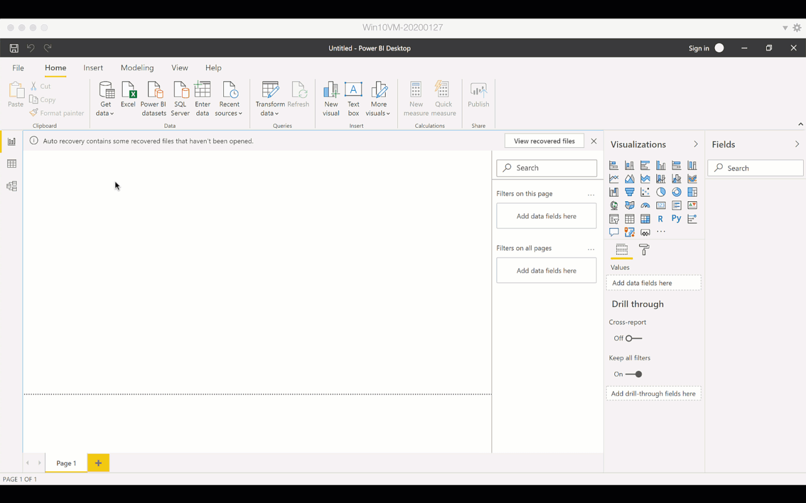
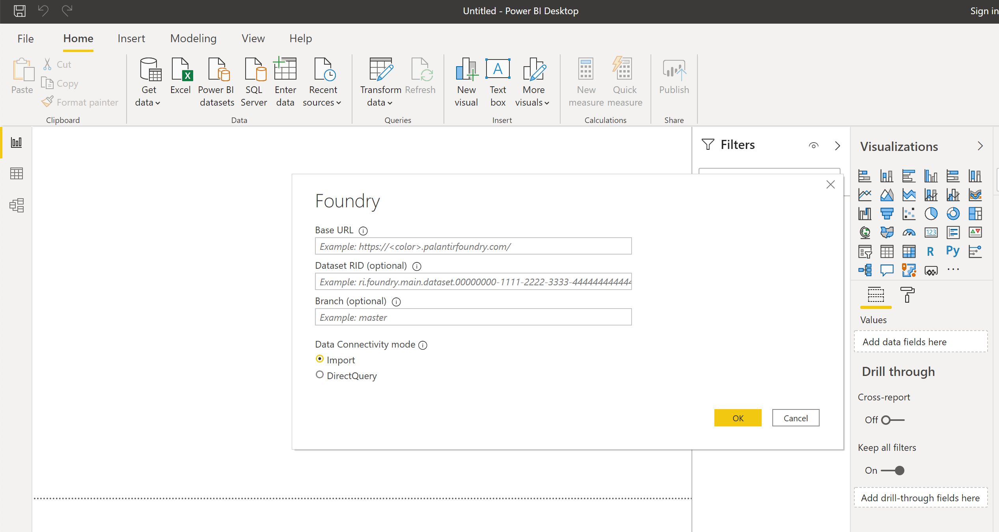
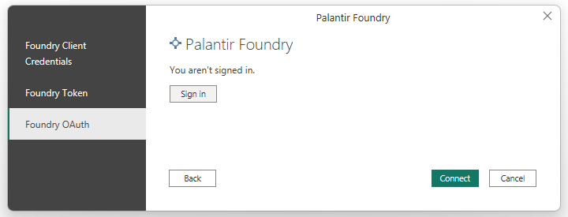
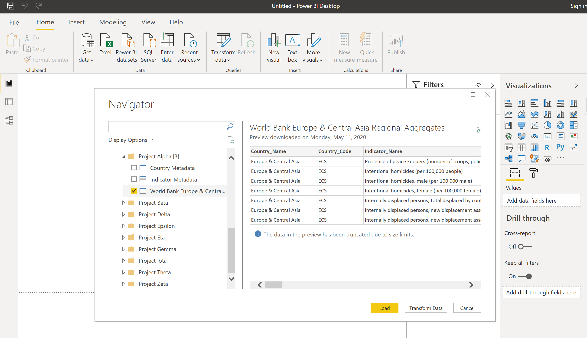

<!-- source: https://palantir.com/docs/foundry/analytics-connectivity/power-bi-getting-started/ · mirrored 2026-08-22 from Palantir Foundry docs -->

# Getting started

:::callout{theme="warning"}
The following page discusses implementation of the Power BI® connector to access Foundry resources from the Power Query interface. If you are searching for information on our Microsoft Power BI® XMLA connector for data integration, refer to our [data connectivity documentation](/docs/foundry/available-connectors/microsoft-power-bi-xmla/).
:::

This guide will teach you how to authenticate with Foundry via Power BI®, select a dataset, and get started building your first report.

### Select Foundry as your data source in Power BI®

* From Power BI®, click on "Get data" in the ribbon and select "More".
* Search for "Palantir Foundry" in the data sources list, or select it under Online Services.
* If you encounter an error at this point, ensure you have completed the [installation instructions](/docs/foundry/analytics-connectivity/power-bi-setup/).

### Configure your connection settings

You will now be prompted for some details about your Foundry connection:

* **Base URL:** Enter your Foundry connection URL under "Base URL". Your Foundry connection URL is the link you normally use to access Foundry. You should be able to copy-paste this path by right clicking and copying the link address: [Base URL](../). *(Note if you load this URL in your browser it may redirect to another page. If this happens, simply delete anything after ".com" in the address, and you will have the base URL again.)*
* **(Optional) Dataset RID & Branch:** If you already know the dataset RID or branch of the dataset you wish to access, you can enter this information here. (See [Guides: Identifying a dataset's RID or filepath in Foundry](/docs/foundry/analytics-connectivity/identify-dataset-rid/).) Otherwise, leave these fields blank. There will be a dataset browser in a subsequent step where you can select your data.
* **Data Connectivity Mode:** Select whether you would like to use the "Import" or "DirectQuery" mode.

Click "OK" and proceed to the next step.

### Authenticate with Foundry

There are three options for authenticating with Foundry: **Foundry OAuth**, **Foundry Token**, and **Foundry Client Credentials**. OAuth is the recommended and simplest authentication method for Power BI® Desktop. Client credentials are recommended for administrators to use when configuring authentication on Power BI® Service.

You can select which method to use from the left side of the Power BI® authentication dialog. Instructions for using these authentication options are described below.

#### Foundry OAuth authentication (recommended for Power BI® Desktop)

OAuth is the recommended method for authorizing Power BI® Desktop to connect to Foundry. If using OAuth authentication, select **Sign in** from the Power BI® OAuth dialog. This will then open a new window with your Foundry login screen.

If this is your first time using Power BI® with Foundry, you will be prompted to approve Power BI®'s access to your Foundry account. Click to "allow" Power BI®'s request for access, and then sign in to Foundry as normal.

If you receive an error page logging in via OAuth, it is likely your organization has not yet enabled the OAuth login capability for Power BI®. In this case, contact your Foundry administrator to [enable Power BI® as a third-party application](/docs/foundry/platform-security-third-party/manage-3pa/). You can also use the alternative token-based authentication option described below in the meantime.

#### Foundry Token Authentication

If using token-based authentication, follow the instructions on [Generating a Token](/docs/foundry/platform-security-third-party/user-generated-tokens/) to generate a private authentication token inside Foundry. Once you have the token, you can paste it into the Power BI® prompt.

:::callout{theme="neutral"}
Your credentials should now be saved in Power BI® and will continue to work as long as they are valid. You will not be prompted for a token again until your token validity has expired. At this point you can follow the above instructions again to generate a new token.
:::

#### Foundry third-party application client credentials (recommended for Foundry administrators in Power BI® Service)

Third-party application client credentials are the recommended method for Foundry administrators to authorize reports published to Power BI® Service. This type of credential has no expiration.

First, you must configure a third-party application within Foundry. [Follow the instructions](/docs/foundry/platform-security-third-party/register-3pa/) to configure the application. Choose the **confidential client** option and ensure the **client credentials grant** is enabled. Do **not** enable the Ontology SDK.

Then, grant the appropriate permissions to the service user of the third-party application. Data access within Power BI® will reflect the service user's level of access.

Finally, within Power BI®, choose the **Foundry Client Credentials** authentication option and enter the client ID and secret from your third-party application.

### Connect to Foundry and select your dataset

* Use the navigator on the left hand side to select the dataset(s) you will need for your report.
* Once you have made your selection, choose either "Load" or "Transform Data" and proceed with building your report as usual.

*Power BI® and the Power BI® logo are trademarks of the Microsoft group of companies.*
