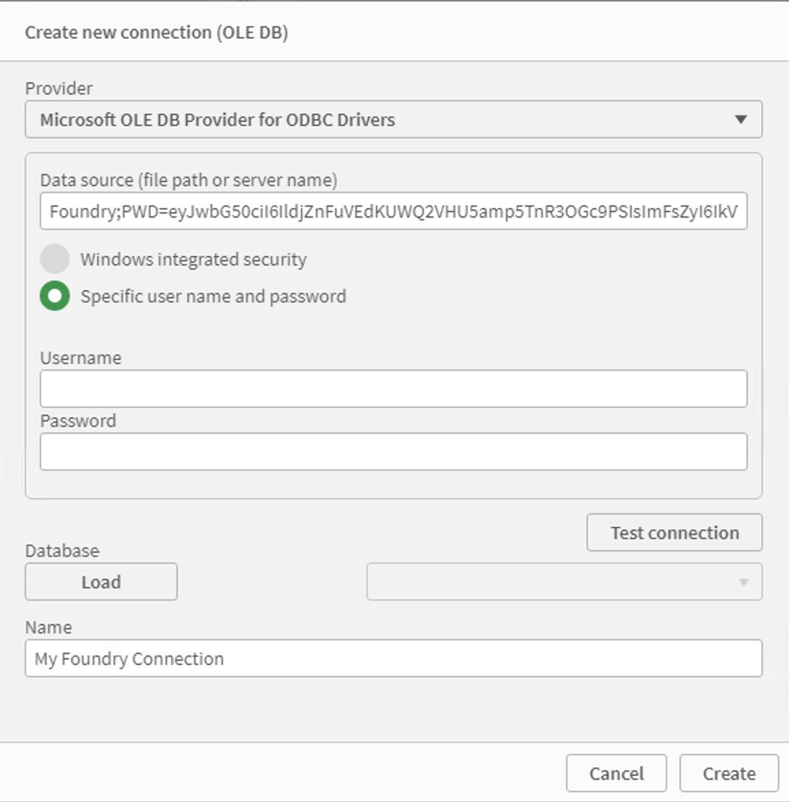
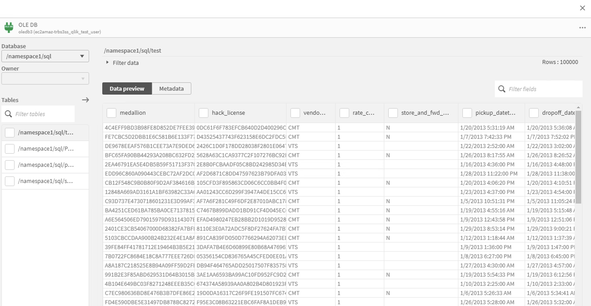
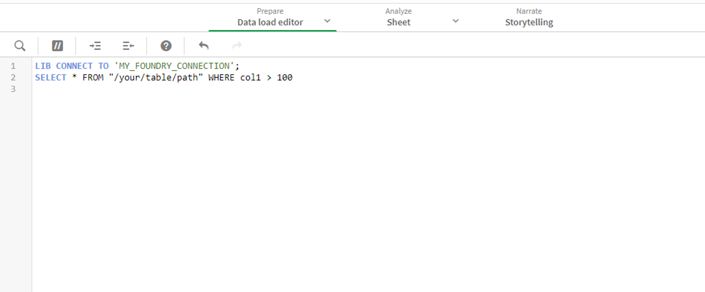

<!-- source: https://palantir.com/docs/foundry/analytics-connectivity/qlik-sense-getting-started/ · mirrored 2026-08-22 from Palantir Foundry docs -->

# Getting started

This guide will teach you how to authenticate to Foundry within Qlik Sense, and get started loading datasets.

### Connect to Foundry

* You will need to have a Foundry access [token](/docs/foundry/platform-security-third-party/user-generated-tokens/) ready to authenticate.
* You will also need the name of the Foundry DSN created by your server admin
* Within Qlik Sense, open the data manager, and click the icon to create a new connection
* Select `OLE DB` as the data source
* Choose `Microsoft OLE DB Provider for ODBC Drivers` as the provider
* For the data source, enter `<Foundry_DSN>;PWD=<Token>`, where `<Foundry_DSN>` is the name of the DSN your server admin created, and `<Token>` is your Foundry token
  For example, you might end up with something like `Foundry;PWD=eyJwbG50ci...`
* Choose `Specific user name and password`, but leave them blank
* Pick an appropriate name for the connection. (Qlik may have set the token in the name by default, remove this!)
* Test the connection to check everything is OK, and then click create to open the table browser.

:::callout{theme="neutral"}
Qlik Sense currently has a limitation on the maximum password length you can enter into the "password" field, which is shorter than a Foundry token. This is why we set the token in the data source string rather than in the password field.
:::



### Loading datasets

After you have created a connection, a table browser will open. You can also open this browser by selecting a previously created connection. From here, you first select the Foundry project containing the dataset(s) you want to load (referred to as a "database" here).

The project tables will then be listed, and you can select the ones you wish to import.



### Writing SQL queries

If you are familiar with SQL, you can write your own SQL queries from within Qlik Sense. This can be helpful for filtering and aggregating large datasets, so that only the smaller transformed data is imported into Qlik.

To do this, after creating a connection, open the data load editor and create a new script. Then write a SQL query like in the below image. Datasets can be referenced by their path or dataset RID, surrounded by double quotes.

For more documentation on the "LIB CONNECT" syntax, refer to the <a target="_blank" href="https://help.qlik.com/en-US/sense/February2021/Subsystems/Hub/Content/Sense_Hub/Scripting/ScriptRegularStatements/CONNECT.htm">Qlik documentation</a>.



To access a specific branch of a dataset, use the following syntax:

```sql
SELECT * FROM "branch"."dataset_path"
```
