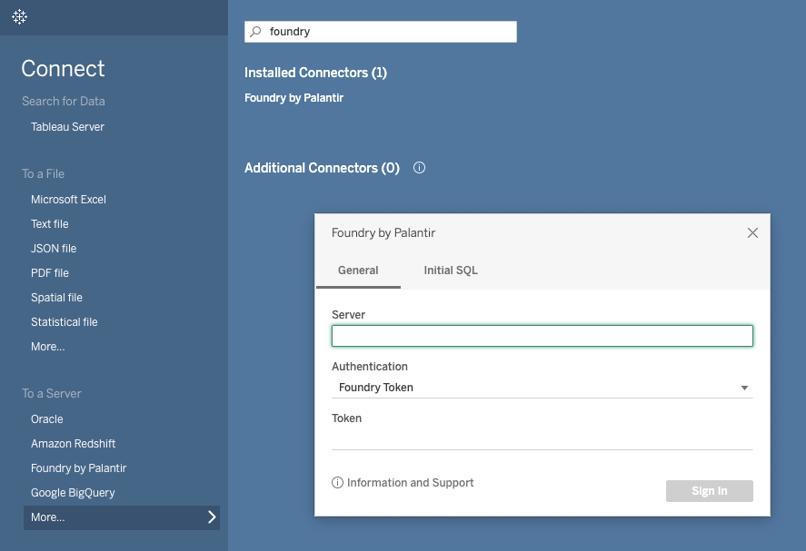

<!-- source: https://palantir.com/docs/foundry/analytics-connectivity/tableau-getting-started/ · mirrored 2026-08-22 from Palantir Foundry docs -->

# Getting started

This guide will teach you how to authenticate with Foundry through Tableau, select a dataset, and get started building your first interactive dashboard.

## Select Foundry as your data source in Tableau

1. Launch Tableau and select **Connect to Data**.
2. Under **To a Server**, click **More**.
3. Search for and select **Foundry by Palantir**.

### Enter your Foundry URL

In the **Foundry by Palantir** dialog box, enter your Foundry URL in the **Server** field. You can find your Foundry URL by logging in, copying the URL, and deleting the `https://` prefix as well as anything after `.com`.

For example, if your Foundry hyperlink is `https://myfoundrylink.palantir.com/workspace/home`, you should input `myfoundrylink.palantir.com` into the Tableau prompt.

## Authenticate with Foundry

There are three options for authenticating with Foundry: **Foundry OAuth**, **Foundry Token** or **Foundry OAuth Client Credentials**. OAuth is the simplest way to start developing in Tableau Desktop.

If the report should rely on the permissions of the user viewing the report when publishing, the OAuth method should be used. This will prompt users to authenticate when they access the report. If instead it is sufficient for the report to use a static set of credentials for all users viewing the report, the client credentials method is recommended for long-term maintainability. Note that a Foundry administrator is required to initially configure the client credentials method.

:::callout{theme="neutral"}
Note that once published, the authentication method cannot be changed from the Tableau Server web interface. Instead, republish the report from Tableau Desktop with the desired authentication method.
:::

### Foundry OAuth authentication

1. Under the **Authentication** dropdown, select **Foundry OAuth**.
2. In the **OAuth URL** field, enter `https://` followed by the same URL you entered in the **Server** field.
3. Select **Sign In**, and you will be redirected to a login window in your browser.
4. Log in, and then select **Allow** to authorize Tableau to connect using your Foundry account.
5. Once you are redirected to a webpage with the message "Tableau created this window to authenticate. It is now safe to close it", close the window and return to Tableau Desktop.

:::callout{theme="neutral"}
If you receive an error when logging in to Foundry, it is likely your organization has not yet enabled the OAuth login option for Tableau. In this case, contact your Foundry administrator for support, referencing the [instructions for enabling the OAuth client](/docs/foundry/analytics-connectivity/tableau-oauth-setup/#part-1-enable-the-oauth-client-for-tableau-desktop).
:::

#### Publish a report with OAuth

If you intend to publish your report to Tableau Server with embedded credentials when using OAuth, you first need to configure credentials on Tableau Server by navigating to **My Account Settings > Saved Credentials for Data Sources** in Tableau Server. Refer to the Tableau documentation on [Manage saved credentials for data connections ↗](https://help.tableau.com/current/online/en-us/manage_stored_credentials.htm) for more information.

### Foundry token authentication

1. Under the **Authentication** dropdown, select **Foundry Token**.
2. In the **Token** field, enter a unique [user-generated token](/docs/foundry/platform-security-third-party/user-generated-tokens/).
3. Click **Sign In**.

### Foundry third-party application client credentials (available since Tableau connector version 2.6.0)

Third-party application client credentials are the recommended method to use when publishing a report that only requires static credentials. This type of credential has no expiration.

A Foundry administrator will need to configure a third-party application. [Follow the instructions](/docs/foundry/platform-security-third-party/register-3pa/) to configure the application. Choose the **confidential client** option and ensure the **client credentials grant** is enabled. Do **not** enable the Ontology SDK.

Grant the appropriate permissions to the service user of the third-party application. Data access within Tableau will reflect the service user's level of access.

Within Tableau, under the **Authentication** dropdown menu, select **Foundry OAuth Client Credentials**. Enter the third-party application client ID in the **OAuth Client ID** field and the client secret in the **Token** field. Then, select **Sign In**.

:::callout{theme="neutral"}
If are working in Tableau Server and attempt to change the authentication method to client credentials for a published report, you may receive an error due to a known Tableau Server issue. Instead, republish the report from Tableau Desktop to use client credentials authentication.
:::

## Select your dataset

After following the instructions listed above, you should see your Foundry environment listed under **Connections** in the left sidebar.

To start working with a specific dataset, use the navigation options in the left sidebar. Under the **Database** section, select a Foundry Project from the dropdown menu. Then under the **Table** section, use the search field to find a dataset by its name or full path.

Once you have loaded your dataset, choose the **Connection** mode (**Live** or **Extract**) and continue creating your Tableau dashboard as usual.

## High data scale and Tableau Data Extracts

Higher data scale can be processed by using [Tableau Data Extracts ↗](https://help.tableau.com/current/pro/desktop/en-us/extracting_data.htm), and ensuring that queries are "direct read eligible" when processed by Foundry SQL Server. See [Architecture](/docs/foundry/analytics-connectivity/architecture/) for details about direct read functionality.
