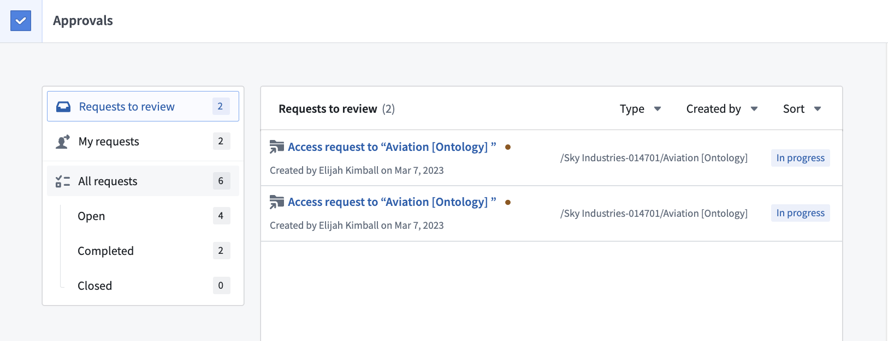
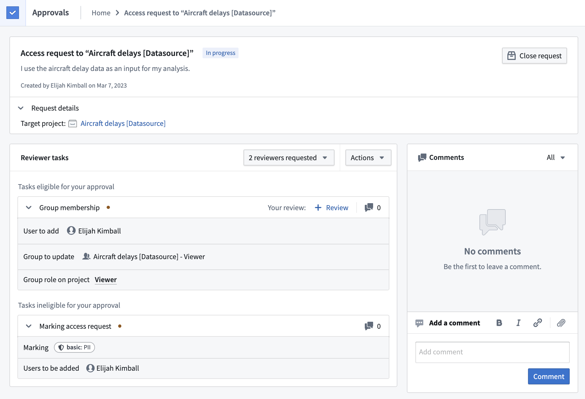
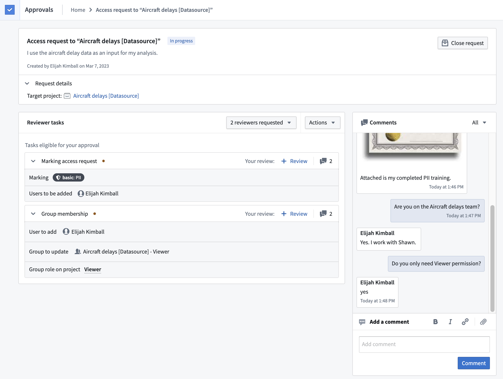
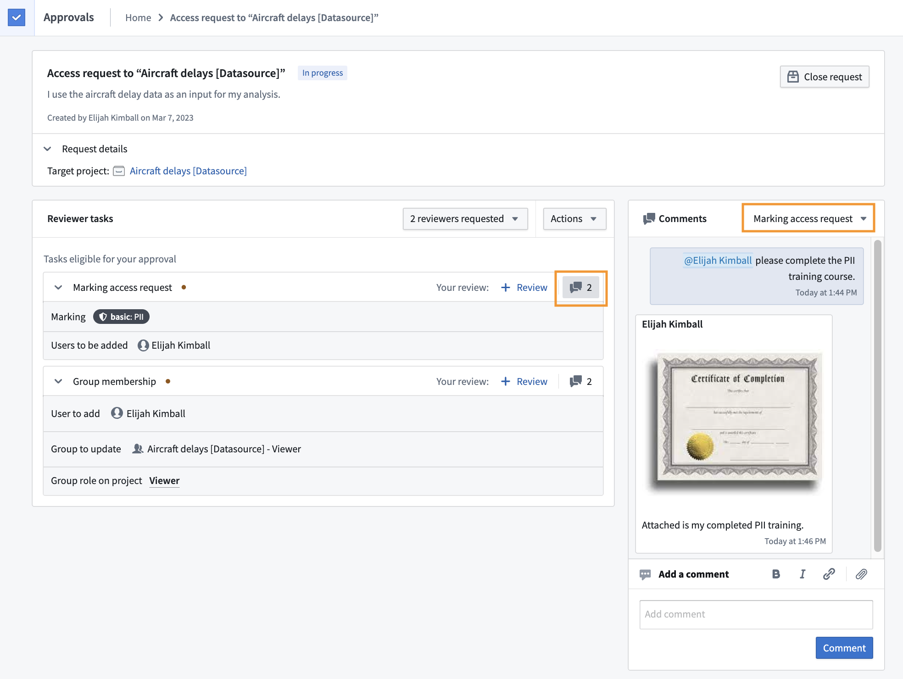
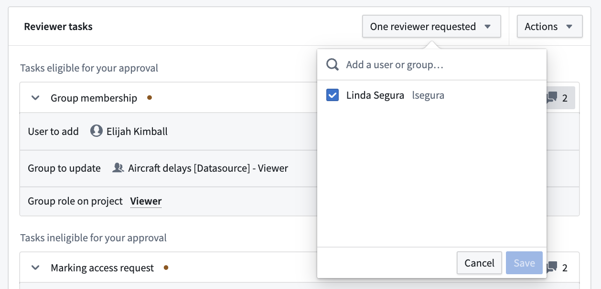
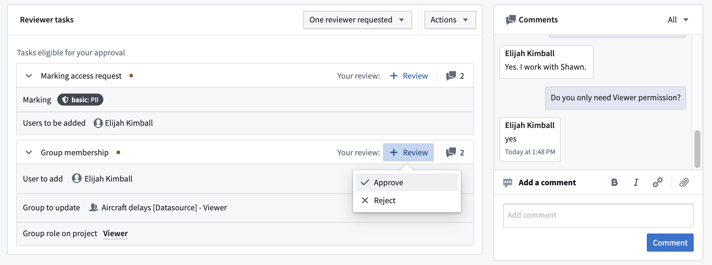
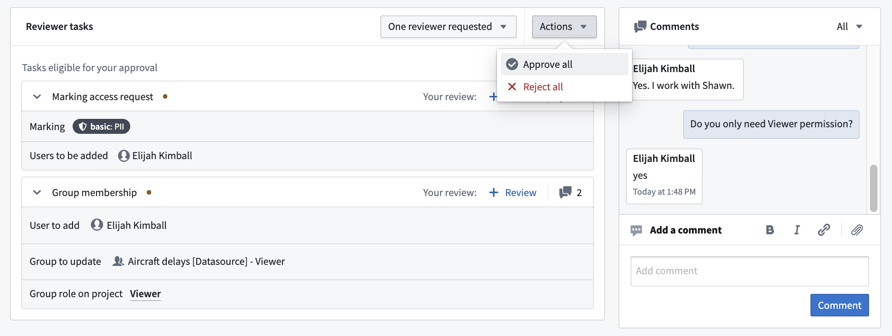

<!-- source: https://palantir.com/docs/foundry/approvals/review-a-request/ · mirrored 2026-08-14 from Palantir Foundry docs -->

# Review a request

As the reviewer on a [request](/docs/foundry/approvals/overview/#requests), you can determine which [tasks](/docs/foundry/approvals/overview/#tasks) in the requests should be approved or rejected. Consider the effect of the entire request when reviewing, even though you can review and approve tasks individually. If you need more information on why someone needs the access they are requesting, use the [comment](#comment) functionality on the request.

To get started reviewing, select the **Requests to review** filter in the Approvals inbox. This will filter down the available requests to a list of requests awaiting your review.

## Eligible reviewers

By default, users who have the permission to perform an action themselves are eligible to review the corresponding task. Users may be eligible to review multiple tasks.

In the example above, the user is an eligible reviewer of the **Group membership** task but is not an eligible reviewer of the **Marking access request** task. This is because the user has `Manage permissions` access on the `Aircraft delays [Datasource] - Viewer` group but not on the `PII` Marking. Therefore, the user can approve the **Group membership** task. However, to approve the request and invoke changes, they need a user with  `Manage permissions` access on the `PII` Marking to approve the **Marking access request** task.

## Comment

You can comment on a request using the comments widget to the right of the request. By default, comments will be shown for the entire request, as indicated by the **All** dropdown.

Comment on individual tasks by filtering the dropdown in the comments widget, or select the comment icon to the right of the task. In the example below, the reviewer filtered comments to only view those made on the **Marking access request** task.

The comment widget also allows you to add links and upload files that may be necessary to support a request. For example, the requester can share links to Foundry or external resources and upload necessary legal documents required for approval.

## Add reviewer

In most cases, users who have permission to approve a task will automatically be assigned as approvers once the request is created. If you would like to explicitly assign a task to a user who was not automatically assigned, invite them by selecting the **Invite reviewers** button. Note, inviting a reviewer does not grant permissions to view a request or approve tasks. Users who are requested to review will receive a notification and see the request in the **Requests to review** section of their Approvals inbox.

## Provide review

An [eligible reviewer](#eligible-reviewers) can either **Approve** or **Reject** the task by selecting the **+ Review** button.

Alternatively, use the **Approve all** or **Reject all** button in the **Actions** dropdown to approve or reject all tasks in the request that you are eligible to review.

