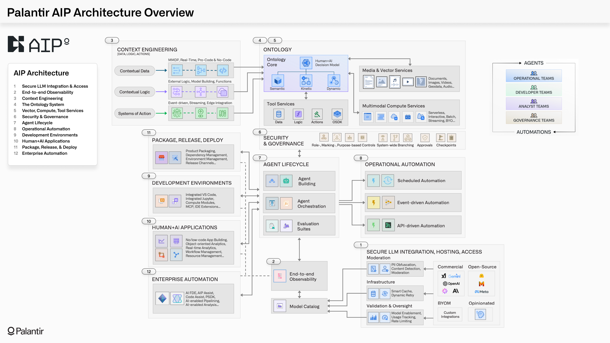

<!-- source: https://palantir.com/docs/foundry/architecture-center/aip-architecture/ · mirrored 2026-08-05 from Palantir Foundry docs -->

# AIP architecture

As described in the [overview of AIP, Foundry, and Apollo](/docs/foundry/architecture-center/platforms/), AIP is Palantir’s platform for connecting generative AI into operational domains. While AIP and Foundry operate together as part of a shared service mesh, powered by Apollo and deployed within [Rubix](/docs/foundry/architecture-center/rubix/), this page provides a view of AIP's end-to-end architecture through an AI-centric lens. This includes capabilities for securely connecting to the full range of LLMs, continuously integrating context into the Ontology, building agents and automations, observing and evaluating the ongoing performance of deployed agents, and a full developer toolchain for managing AI-driven products.

The AIP architecture can be summarized into 12 general categories of capability:

1. **Secure LLM integration & access:** Enabling secure access to the full range of commercial LLMs (e.g., GPT, Gemini, Claude, Grok models) and open-source models (e.g., Llama), through Palantir-managed infrastructure that ensures that no transmitted data is retained by third-party providers, and no transmitted data is used for retraining by model providers. Enterprises can also integrate their existing models, whether existing model subscriptions, fine-tuned models, or domain-specific models.
2. **End-to-end observability:** Providing monitoring tools for every step of AI-driven workflows and agentic processes. This includes fine-grained monitoring for all data flows that feed the Ontology, logging for every action taken by human users or AI agents, and the ability to trace the cascade of chained executions in a workflow. This observability extends to token consumption and other aspects of resource usage.
3. **Context engineering:** Equipping developers with no-, low-, and pro-code tools for integrating the contextual data, logic, action that power the Ontology and all dependent workflows. All modalities of data integration (e.g., batch, streaming, real-time replication via CDC) can be leveraged through any runtime (e.g., Spark, Flink, DataFusion, Polars), while adhering to cohesive security, governance, provenance-tracking, and other essential guarantees.
4. **The Ontology system:** Activating context by integrating disparate data, logic, action, and security into a unified representation of enterprise decision-making. [Read more about the Ontology.](/docs/foundry/architecture-center/ontology-system/)
   * The Ontology’s language models the "nouns" and "verbs" of operational processes into a legible form for both humans and agents.
   * The Ontology’s engine enables querying billions of objects, orchestrating tens-of-thousands of actions, and continuously incorporating feedback-based learning.
   * The Ontology’s toolchain empowers developers to build diverse and complex AI-powered applications, atop a common foundation.
5. **Vector, compute, tool services:** Providing the integrated vectorization services needed to produce and manage embeddings; an extensible compute framework that can leverage multi-node engines (e.g., Spark, Flink), efficient single-node engines (e.g., DuckDB, Polars), and any containerized “BYO” engine; and an integrated set of tool services that work with the Ontology system to function as an ever-evolving tool factory. The platform is designed to be modular and extensible with respect to models, compute engines, and interfaces.
6. **Security & governance:** Ensuring that every operation made by humans and agents abides by rigorous role-, marking-, and purpose-based controls. This requires a combination of infrastructure, platform, and enterprise security controls. These controls can be granularly configured and dynamically interrogated, and are cataloged in expressive audit logging. Governance capabilities extend uniformly across all operational, engineering, and developer activities performed within the platform interfaces as well as programmatically through the APIs/SDKs.
7. **Agent lifecycle:** Powering the interconnected building, orchestration, and evaluation processes for agents in production. Agents can be constructed using no-, low-, and pro-code workbenches. Durable orchestrations can be configured and managed through low-code interfaces like [AIP Logic](/docs/foundry/logic/overview/), or pro-code interfaces like [Code Workspaces](/docs/foundry/code-workspaces/overview/). The integrated evaluation framework ([AIP Evals](/docs/foundry/aip-evals/overview/)) operates seamlessly with the Ontology, enabling you to create test cases, debug and iterate on agent definitions, compare performance across different LLMs, examine the variance across executions, and more.
8. **Operational automation:** Facilitating the different modes of automation required within and across workflows. This includes scalable schedule-based automations, near real-time event-driven automations that process streaming data, and automations which are enmeshed with API-driven operations. Regardless of the modality, every automation can leverage the rich set of data, logic, and action primitives in the Ontology system, and a wide array of execution and notification configurations.
9. **Development environments:** Empowering developers to build agents and automations, how and where they want to. AIP provides integrated development environments (e.g., VS Code, JupyterLab), which provide seamless connectivity with Ontology-driven applications and integrated testing and evaluation frameworks. In equal measure, the [Platform SDK ↗](https://github.com/palantir/foundry-platform-python) and [Ontology SDK](/docs/foundry/ontology-sdk/overview/), in conjunction with [Palantir’s VS Code plug-in](/docs/foundry/palantir-extension-for-visual-studio-code/overview/), bring the same core functionality to existing environments and developer toolchains. Additionally, [Palantir MCP](/docs/foundry/palantir-mcp/overview/) provides a secure interface for agentic development (analogous to what is possible in the platform with AI FDE).
10. **Human + AI applications:** Providing the full spectrum of AI-driven experiences; from object-oriented analytics, to real-time application building, to multimodal governance workflows, to the administration of core platform capabilities. Operational users, compliance teams, engineers, analysts, and other key personas have out-of-the-box applications specifically tailored for their workflows, as well as the ability to rapidly construct new Ontology-powered applications. In each case, the infusion of AI can be carefully controlled and transparently assessed, ensuring a smooth journey from augmentation to automation.
11. **Package, release, deploy:** Allowing developers to move beyond point analytics and applications to build fully featured AI products which leverage an integrated DevOps toolchain. End-to-end collections of data pipelines, Ontology definitions, automations, and prebuilt applications can be packaged, released, and deployed across heterogeneous target environments. Developers can specify allowances for "last-mile" customization, and downstream teams can securely receive updates as product definitions evolve, and as changes are validated and promoted across release channels.
12. **Enterprise automation:** Enabling builders, of all personas and backgrounds, to wield specialized AI agents (e.g., [AI FDE](/docs/foundry/ai-fde/overview/), [AIP Analyst](/docs/foundry/aip-analyst/overview/)) to construct data pipelines, write business logic, train models, build ontologies, produce analytics, and develop end-to-end applications. Critically, these agents operate atop the same foundation as human users, meaning that they abide by the same integrated change management capabilities (e.g., Global Branching), and can seamlessly weave human-in-the-loop workflows with entirely autonomous operations.
