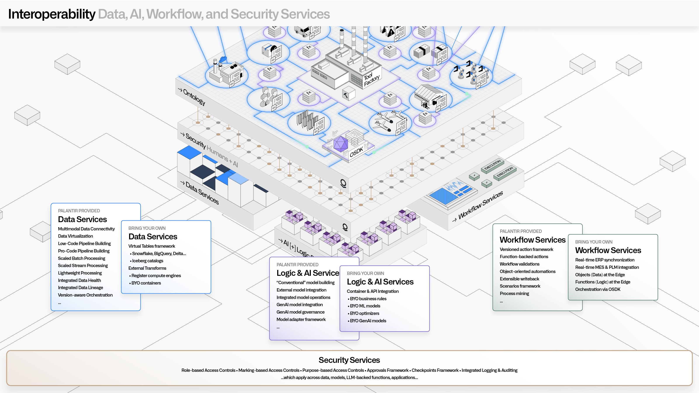

<!-- source: https://palantir.com/docs/foundry/architecture-center/interoperability/ · mirrored 2026-08-05 from Palantir Foundry docs -->

# Interoperability

Palantir AIP and Foundry are designed to interoperate with the full range of data, logic, AI, workflow, and security systems.

This includes tools and technologies that span traditional data, analytics, governance, and operational domains—including edge devices and rugged environments.

Removing traditional tradeoffs often found with integrated platforms, the goal of the Palantir architecture is to provide a coherent and complete experience while enabling the modularity required to deeply connect with existing (or future) enterprise software platforms.

## Data interoperability

The Palantir platforms are built on top of open data standards. All data is stored in its original format (such as CSV, Iceberg, or Parquet), and is accessible through standard interfaces, such as REST, JDBC, and S3-compatible access. Additionally, all transformed data is, by default, accessible in open formats, such as Apache Iceberg and Apache Parquet. This allows for deep connectivity with existing data platforms, systems of record, and other services within enterprise data architectures.

Beyond native capabilities, the Multimodal Data Plane (MMDP) enables unprecedented integration with existing enterprise assets. This includes the Virtual Tables framework for leveraging existing data assets within common data platforms (such as Databricks, Snowflake, or BigQuery) without needless data duplication. MMDP also includes fully orchestrated pushdown compute, so that applications like Pipeline Builder can be seamlessly used with existing compute investments.

Learn more about data interoperability:

* Explore the philosophy behind the [Multimodal Data Plane](/docs/foundry/architecture-center/multimodal-data-plane/).
* Review the expanding list of out-of-the-box Data Connection [Source types](/docs/foundry/data-integration/source-type-overview/).
* Learn about building [custom data connections](/docs/foundry/data-connection/external-transforms/).
* View the options for avoiding data duplication with [Virtual Tables](/docs/foundry/data-integration/virtual-tables/).
* Learn about generating data pipelines out-of-the-box with [Palantir HyperAuto](/docs/foundry/hyperauto/overview/).

## Metadata interoperability

Palantir Foundry and AIP provide rich metadata integration capabilities for the vast range of mandatory metadata (such as security, attribution, or lineage) and discretionary metadata (such as tags or enrichments). Metadata services securely expose all metadata attributes that exist across projects, datasets, ontology elements, agents, models, analyses, applications, pipeline orchestrations, resource health, and much more. This allows for deep connectivity with existing data catalogs, metadata management tools, master data management tools, and other services within existing governance architectures.

Learn more about the various types of metadata:

* Learn about [dataset metadata](/docs/foundry/data-integration/datasets/#schemas) (and all of the metadata accessible via the [Platform SDK ↗](https://github.com/palantir/foundry-platform-python)).
* Explore the [Developer Libraries & API reference](/docs/foundry/api-reference/).
* Learn about [Ontology metadata](/docs/foundry/ontologies/ontologies-overview/) (and the [Ontology SDK](/docs/foundry/ontology-sdk/overview/)).

## Semantic interoperability

The Palantir Ontology pushes beyond traditional semantic definitions, and includes granular definitions for the objects, links, actions, and functions that drive complex operations, agents, and AI-driven automations. All elements in an organization’s Ontology can be accessed through REST APIs and configured through JSON-driven authoring paradigms. This allows for bidirectional synchronization with existing semantic modeling tools, ontologies resident within data catalogs, and domain-specific modeling tools.

Learn more about creating and integrating with the Ontology:

* Review the [Ontology SDK](/docs/foundry/ontology-sdk/overview/) to learn how you can build applications and workflows on top of the Ontology.
* Learn about using [Webhooks](/docs/foundry/action-types/webhooks/) to integrate with existing operational systems.
* Explore [Palantir MCP](/docs/foundry/palantir-mcp/overview/), which enables agent-driven semantic interoperability.

## Code & logic interoperability

Palantir's commitment to open software standards applies across data engineering, data science, and all other code-driven authoring paradigms. All data transformation, by default, uses open languages (like Python, Java, or SparkSQL) that have bindings for the open runtimes (such as Spark, Flink, DataFusion, or Polars) that are bundled with the platform. Also, all data science workflows leverage open languages (like Python or R) that leverage the same open runtimes, and are designed to leverage common open formats (such as ONNX). Code Repositories are stored within a highly available Git service, and can be securely accessed both through UI-driven exports, and API (programmatic) interactions.

Beyond packaged compute runtimes and associated languages, the [Compute Modules](/docs/foundry/compute-modules/overview/) framework enables teams to bring their own containerized runtimes, applications, models, and executables of all kinds. These containers are securely orchestrated and managed by Palantir’s underlying compute infrastructure ([Rubix](/docs/foundry/architecture-center/rubix/)), and can be robustly surfaced throughout the full range of data pipelining, application building, analytical, and AI-driven workflows.

Learn more about interfacing with code and logic:

* View the out-of-the-box [languages supported](/docs/foundry/building-pipelines/supported-languages/) for data transformation.
* View the [languages supported](/docs/foundry/code-workbook/workbooks-languages/) for data science workflows.
* Explore the full range of [model integration](/docs/foundry/model-integration/models/) options.
* Learn about the [Code Repositories](/docs/foundry/code-repositories/overview/) environment.
* Learn how to “Bring Your Own Containers” with [Compute Modules](/docs/foundry/compute-modules/overview/).

## Analytical interoperability

Palantir Foundry and AIP provide a full range of analytical tools to empower users, and can also seamlessly interoperate with existing investments such as BI and data science tools. Out-of-the-box connectors are available for common systems such as Power BI®, Tableau, Jupyter, and RStudio®. These connectors enable a broad range of users to tap into integrated data, while taking advantage of best-in-class data management, model management, and governance.

In addition to data connectors, [Code Workspaces](/docs/foundry/code-workspaces/overview/) provides a seamless experience working natively in Jupyter® and RStudio® inside the platform.

Learn about analytics connectors:

* Learn about how [SQL & BI Connectors](/docs/foundry/analytics-connectivity/overview/) enable integration with existing BI investments.
* [Get started](/docs/foundry/code-workspaces/getting-started/) working directly in Jupyter® or RStudio® with Code Workspaces
* Refer to the [Platform SDK ↗](https://github.com/palantir/foundry-platform-python) and [R SDK ↗](https://github.com/palantir/palantir-r-sdk) on GitHub for integration with data science tools.

## Security interoperability

The platform provides robust, transparent controls across all resources in the platform. Security services are designed to leverage existing authentication systems (for example, via SAML) for identity, and existing authorization systems (like Active Directory) for permissions that can span role-based, classification-based, and purpose-based regimes. Through the Ontology SDK, permissions can be extended and managed flexibly for third-party and custom application development. Dynamic and retrospective access to all security information is possible through the platform’s REST APIs.

Learn more about interfacing with Palantir security services:

* Learn about setting up [SAML integration](/docs/foundry/authentication/overview/) for authentication.
* Learn how Palantir can enable [cross-organization collaboration](/docs/foundry/security/cross-organization-collaboration/).
* Learn about permissions in the [Ontology SDK](/docs/foundry/developer-console/permissions/).
