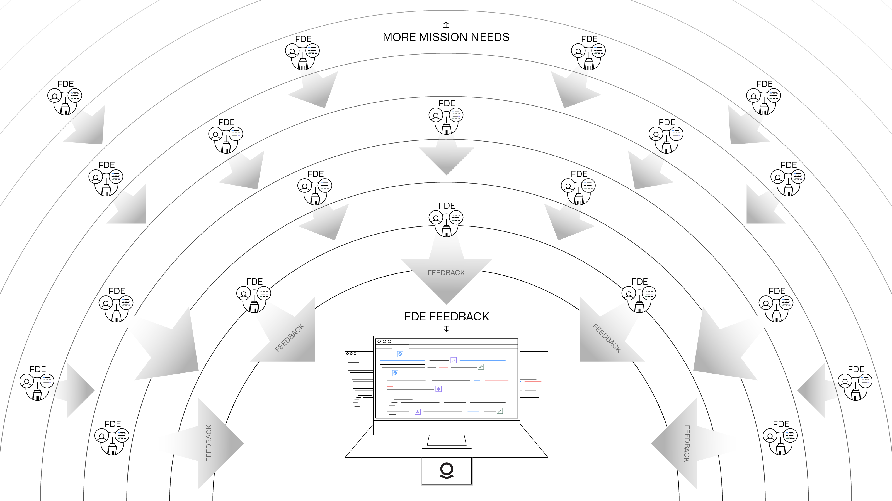
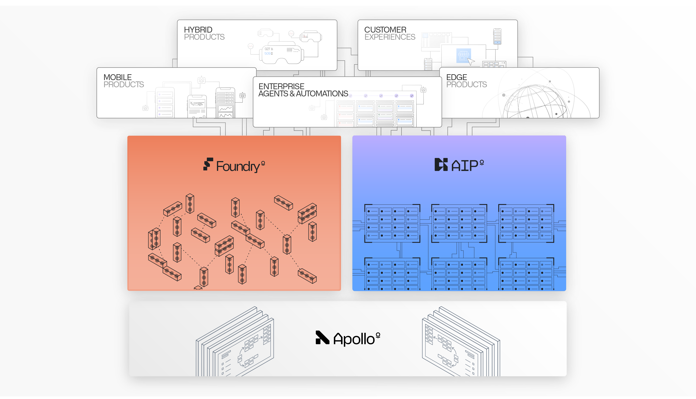
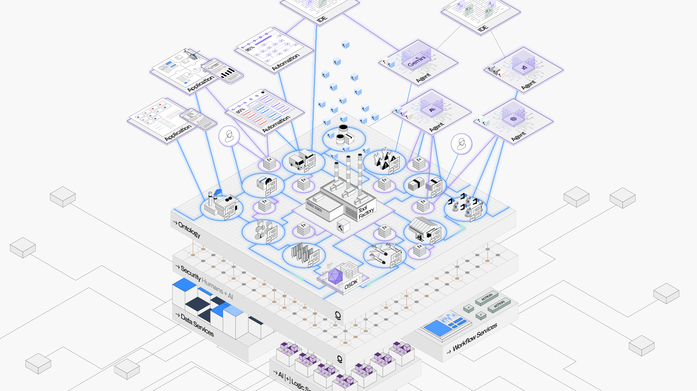

<!-- source: https://palantir.com/docs/foundry/architecture-center/overview/ · mirrored 2026-08-05 from Palantir Foundry docs -->

# Overview

Since its inception, Palantir's software has been shaped by our customers' most demanding missions. From an initial focus on counterterrorism, Palantir's scope now encompasses 50+ verticals spanning everything from healthcare to shipbuilding to energy production to insurance; that is, nearly every core operational environment in the Western-aligned world.

Palantir’s platforms and offerings are continuously developed through the methodology of Forward Deployed Engineering. This is the human equivalent of backpropagation, in which teams of engineers get as close as possible to a problem while working in concert with core engineering teams to relentlessly synthesize feedback and ship new features.

## Palantir's platforms

Across every sector, Palantir operates with a common architecture consisting of [three platforms: AIP, Foundry, and Apollo](/docs/foundry/architecture-center/platforms/). These platforms are collectively designed to function as an enterprise operating system. Foundry serves as the core Data Operations platform; AIP serves as the Generative AI platform; and Apollo is the continuous delivery platform that underpins them.

AIP and Foundry collectively consist of 300+ microservices and assets, all running in a highly available and autoscaling compute mesh, atop zero-trust security infrastructure that enforces a rigorous security posture across every component (for instance, aggressive node cycling to guard against advanced persistent threats).

Domain-specific offerings, such as those in Defense and Intelligence or the increasingly rich set of applications focused on Hospital Operations, extend the underlying capabilities of AIP and Foundry. This complex orchestration of foundational services and comprehensive operational offerings is only possible through Apollo’s autonomous approach to software delivery.

## The Ontology system

The heart of Palantir’s architecture is [the Ontology system](/docs/foundry/architecture-center/ontology-system/). The Ontology integrates an enterprise’s data, logic, action, and security policies into an intuitive representation that both humans and AI agents can wield.

In a supply chain context, the Ontology might be used to integrate dozens of fragmented ERP, MES, CRM, customer, edge, and myriad other data sources into a common set of objects, or "nouns" - the manufacturing plants, production lines, customer orders, and other core concepts that constitute the operational world.

These "nouns" are paired with "verbs", which are actions that must be orchestrated across workflows, such as updating purchase orders, changing distribution strategies, or running multi-step simulations to assess how to address a supply disruption.

Each of these nouns and verbs can be powered by the full range of logic, from business rules, machine learning models, and optimizers to computations that chain together multiple engines across computing environments.

Multimodal, military-grade security controls encompass the objects, links, actions, functions, and other semantic and kinetic primitives all modeled inside the Ontology. This ensures that both humans and AI agents can orchestrate across the Ontology, but with the precision and guardrails required to sustain trust.

[Read more about the Ontology and why it is critical for unlocking the value of AI.](/docs/foundry/architecture-center/ontology-system/)

## Data Services, Logic Services, and Workflow Services

There are hundreds of services that work in concert with the Ontology system, including Data Services, Logic Services, and Workflow Services.

* *Data Services* encompass data connectivity, data transformation, data virtualization, data storage, data health monitoring, and data management.
* *Logic Services* encompass authoring business rules, training machine learning models, orchestrating external models, integrating LLMs and other forms of Generative AI, end-to-end Model Ops and Agent Ops, and more.
* *Workflow Services* enable interactive compute for analytical and operational use-cases, event-driven automations, scheduled automations, pro-code and low-code workflow authoring tools, and more.

All of these capabilities are natively connected with the Language, Engine, and Toolchain that constitute the Ontology system. Together, this enables a wide variety of analytics, applications, AI-driven agents and automations, and custom products to be built atop Palantir's architecture, all of which leverage platform-wide approaches to change management and release management, and which adhere to the security and governance controls configured by administrators.

## Guide to the Architecture Center

This Architecture Center highlights topics that are most relevant for those working in enterprise architecture and digital strategy. These topics include:

* The [Ontology system](/docs/foundry/architecture-center/ontology-system/);
* Palantir’s open data and compute architecture, known as the [Multimodal Data Plane](/docs/foundry/architecture-center/multimodal-data-plane/);
* The [reference architecture](/docs/foundry/architecture-center/aip-architecture/) for building AI-driven agentic workflows;
* Details on the [infrastructure](/docs/foundry/architecture-center/interoperability/) and [security](/docs/foundry/architecture-center/rubix/) paradigms.

Thanks to the Apollo platform, which orchestrates tens of thousands of releases per week, every deployment is a living environment. Even so, Palantir's commitment to powering our customers’ most important missions means that we want to ensure that stewards and stakeholders of Palantir deployments are always equipped to build, maintain, and scale maximally robust solutions, which can each be counted on to meet their moment.

