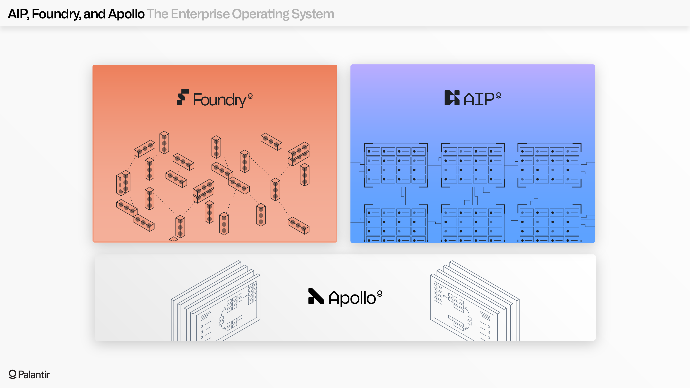
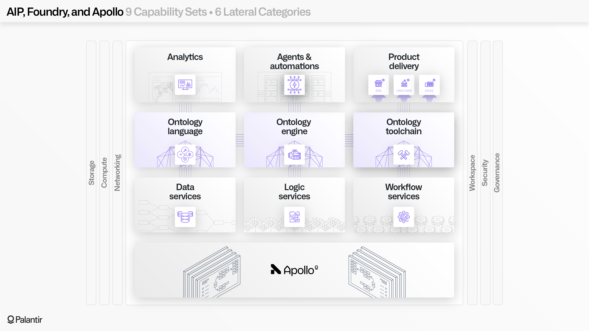
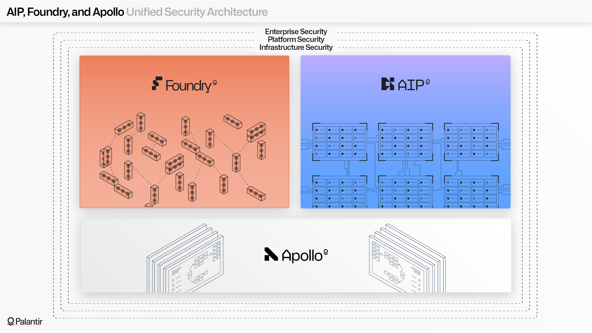
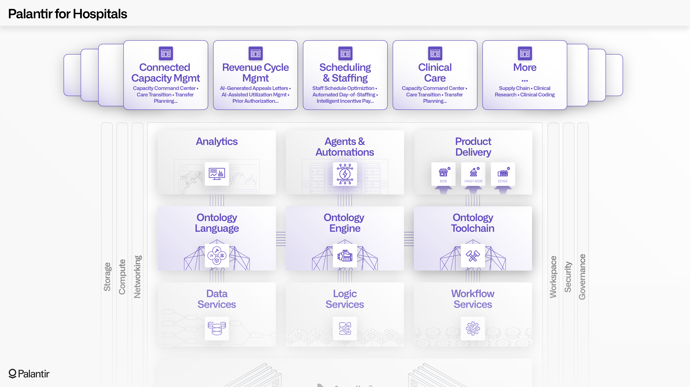
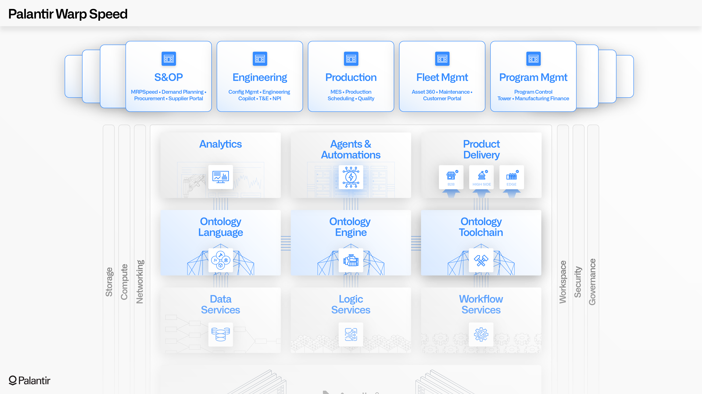
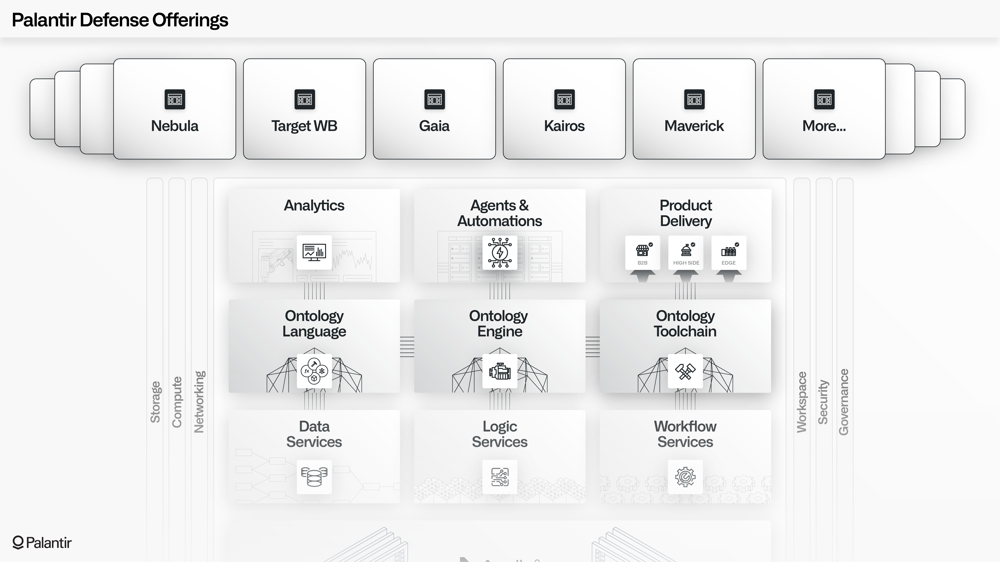
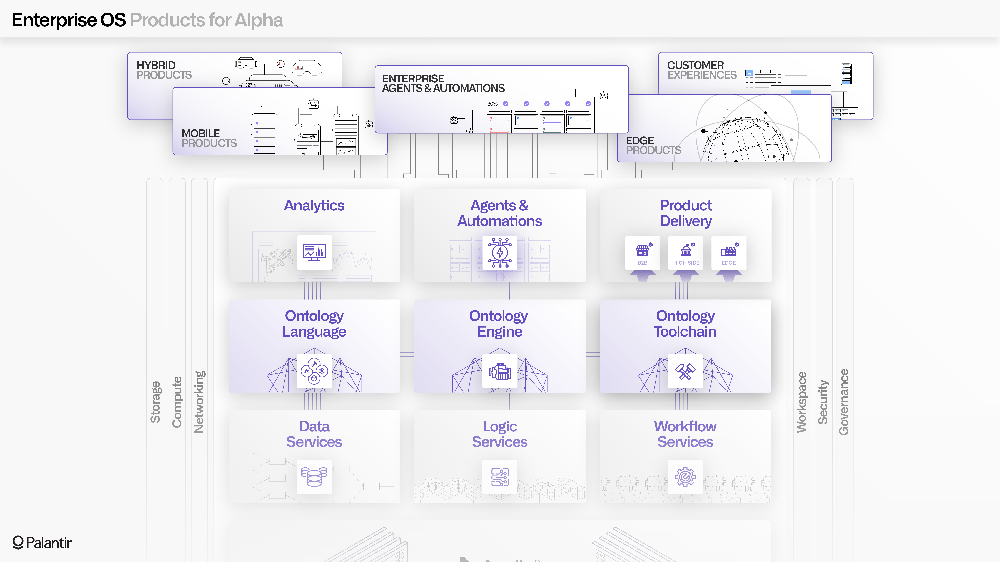

<!-- source: https://palantir.com/docs/foundry/architecture-center/platforms/ · mirrored 2026-08-05 from Palantir Foundry docs -->

# Integrated platforms: AIP, Foundry, and Apollo

The standard Palantir architecture consists of three integrated platforms: AIP, Foundry, and Apollo.

*Apollo* is the continuous delivery platform that manages the underlying infrastructure that hosts both Foundry and AIP services. Apollo enables the orchestration of thousands of zero-downtime upgrades across hundreds of services and assets every day.

*Foundry* is the foundational data operations platform, which provides the core capabilities for data management, logic authoring, Ontology development, analytics, and workflow development.

*AIP* is the generative AI platform, which provides secure connectivity to large language models through the “*k*-LLM” paradigm, a development toolchain for building agents and automations, an array of AI-enabled end user applications, a comprehensive Evals framework for governing AI workflows in production, and more.

## AIP, Foundry, and Apollo: An Enterprise Operating System

The integrated AIP + Foundry + Apollo architecture is designed to function as an Enterprise Operating System.

When taken together, AIP + Foundry can be conceptually mapped into nine capability sets, as shown in the diagram below:

* The **Ontology Language**, **Ontology Engine**, and **Ontology Toolchain**, which collectively constitute the [Ontology system](/docs/foundry/architecture-center/ontology-system/);
* The **Data Services**, **Logic Services**, and **Workflow Services** that power the Ontology system;
* The **Analytics & Applications**, **Automations**, and a **Product Delivery** toolchain which users can wield to achieve their goals.

Each of these nine capability sets holistically leverage six mesh-wide components: **Storage**, **Compute**, **Networking**, **Security**, **Governance**, and the **Workspace**. All of these components are powered by Apollo.

This comprehensive architecture powers AI-enabled care operations at major hospital systems, integrated network planning for major airlines, electric operations and wildfire response for America’s largest utilities, full spectrum military operations across the United States and allied nations, and thousands of other use cases. To solve the world's hardest problems, Palantir's customers use the Enterprise Operating System to connect data, analytics, and AI with mission-critical operations.

## Unified security architecture

A unified security architecture spans all three platforms (AIP, Foundry, and Apollo) in three main spheres: infrastructure security, platform security, and enterprise security.

At an *infrastructure* level, every component in the Palantir service mesh operates with zero trust (meaning that all elements are access-gated based on identity, device health, and verification) and with an expectation of hostile attacks and the need for autonomous enforcement (for example, through Apollo-mandated encryption, firewalls, and runtime configurations).

At a *platform* level, both Foundry and AIP provide the full range of controls required to enable trustworthy collaboration. These controls include strict enforcement of access scopes for both humans and agents, granular role-based, marking-based, and purpose-based access controls which connect with automated lineage and auditing, and a range of in-platform applications for interdisciplinary teams.

These foundational controls are extended by *enterprise security* controls, which enable encryption, audit logging, authorization, and authentication configurations to be deeply integrated with an organization’s existing identity providers, information security tools, and architectural patterns.

## Extensibility and interoperability

The standard AIP + Foundry + Apollo architecture is designed to be extended and deeply integrated with other services and applications.

On the "tactical" level, Palantir's [Compute Modules](/docs/foundry/compute-modules/overview/) framework allows developers to securely bring their own containers (such as containerized LLMs, optimizers, data processing runtimes, or end-to-end applications) into the Apollo-managed mesh.

A broader example is Palantir’s own defense offerings; their first components were developed before the standard AIP + Foundry + Apollo architecture, but all of the offerings are now completely integrated with the standard architecture. This includes Palantir Gotham's core set of multimodal applications and tools that are powered by the Foundry-managed Ontology.

Other examples can be seen in the Commercial sector, such as Airbus powering an entire Aviation ecosystem (Skywise) through custom offerings that extend the standard architecture, Fujitsu building and delivering a set of specialized agentic applications that use Foundry and AIP’s developer toolchains; or Andretti Racing’s development of a "RaceOS" which connects real-time car performance into a range of rich, AI-powered applications.

The diagram below shows how this works for hospitals building applications on top of the Palantir architecture.

Below is an illustration of Palantir's "Warp Speed", an operating system for manufacturing.

The defense applications below are built on top of the same core architecture as Palantir's commercial offerings, but specialized for some of the world's most demanding and high-stakes use cases.

## Pursuing alpha

The goal of the standard architecture is deliver non-standard results: extreme differentiation through maintainable customization.

In the best case, a customer organization should be wielding the constellation of Apollo-managed AIP and Foundry services to build the applications, integrations, and fleets of agents that allow them to address their most important problems.

A successful Palantir deployment is one where the enterprise is pursuing "alpha", in investing parlance; in other words, generating outsized returns by building around their differentiation, infusing their particularities into their ontology, and adapting in real-time to complex operational conditions to pursue their strategic objectives.

To continue the analogy, the investing concept of "beta" would be the pursuit of low-hanging fruit, like the basic solutions in a one-size-fits-all SaaS deployment. The wide range of capabilities in Palantir’s architecture can support these use cases, but ideally only as byproducts of pursuing alpha.

## Forward Deployed Engineering

The dynamism of AIP, Foundry, and Apollo collectively reflect a product development paradigm known as Forward Deployed Engineering, which can be thought of as the human equivalent of backpropagation. Palantir engineers are deeply embedded in critical environments around the world, from war zones to factory floors, walking many miles alongside customers, and tirelessly working to build and ship new features. Palantir is driven by the missions of our customers, and at the limit, we see the ambition of every deployment of the standard architecture as becoming the enterprise’s unique, one-of-one, ever-evolving operating system.
