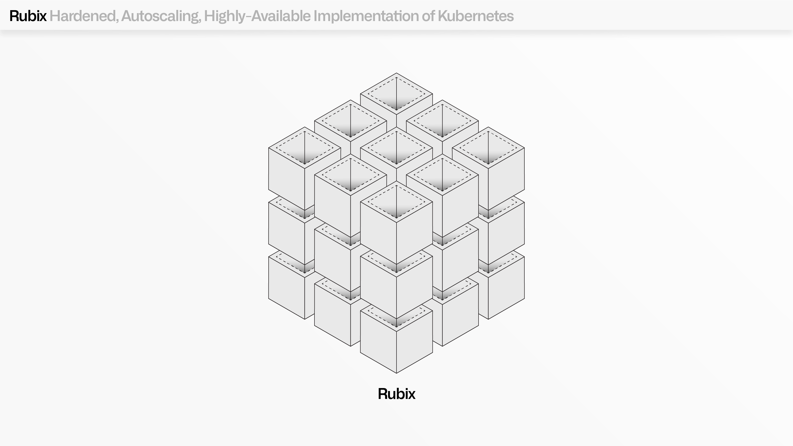
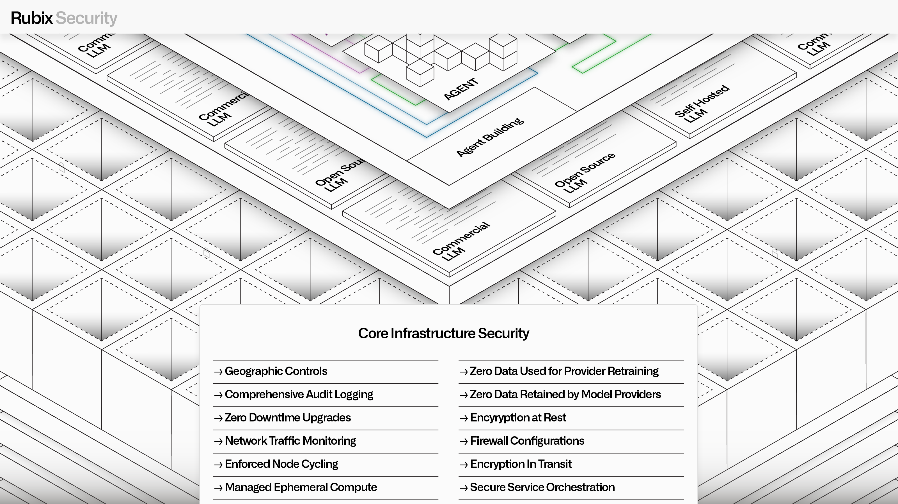

<!-- source: https://palantir.com/docs/foundry/architecture-center/rubix/ · mirrored 2026-08-05 from Palantir Foundry docs -->

# The Rubix substrate

AIP, Foundry, and Apollo all operate within a hardened, autoscaling, highly available implementation of Kubernetes known as [Palantir Rubix ↗](https://www.palantir.com/rubix/).

Building on Palantir's decades of experience [building secure software](/docs/foundry/security/overview/), Rubix was developed with the goal of extending the core benefits of open-source containerization with the features needed to operate in the world’s most demanding environments. This includes ephemeral compute nodes with enforced cycle times, secure-by-default networking, dynamic and intelligent autoscaling, and a wide range of features that meet the most stringent accreditation standards, including FedRAMP High, DOD DISA IL-5/IL-6, and CMMC.

The Rubix architecture was initially developed to host Palantir’s own software, but is now used by software companies of all sizes to deploy their products into any environment of their choosing, including the most restrictive and complex environments in the world.

At the heart of Rubix’s design is a set of uncompromising and interlocking assumptions: mission-critical software must be secure by design, highly available, and capable of rapid evolution.

## Security

Rubix is designed to mitigate against both tactical and advanced persistent threat vectors.

Every workload is securely isolated based on necessary requirements, enabling the safe execution of operational tasks that require elevated privileges, which are distinguished from application-driven executions that operate with precisely governed permissions. Encryption is rigorously enforced across every element in the environment, and every interaction between workloads must be authenticated, authorized, and logged in accordance with immutable configurations.

Palantir built the first versions of Rubix to pioneer this secure, autoscaling paradigm with the Spark compute runtime. Today, this now extends across every runtime and service structure within AIP, Foundry, and Apollo, from managing system connections, to data integration, to model management, to application development, to agent building, through to the developer toolchain.

## High availability

High availability is interwoven with Rubix’s approach to ephemerality; nodes in Rubix environments cannot live longer than 48 hours. This ensures that every service, whether the user-facing Ontology Manager or a backend service for transforming streams, is designed for disruption and resilient failover. Rubix also reduces the need for manual interventions from infrastructure teams, since outdated instances are automatically replaced, and the logic that drives this replacement contains encoded learnings from global performance.

From a security perspective, aggressive node cycling ensures that compromising a single node is insufficient for an attacker to gain persistent access to an environment. Operationally, this ephemerality works in tandem with a multidimensional node draining and termination pipeline that utilizes policy-driven node selection, to gracefully avoid destabilization.

## Rubix as a substrate for Palantir services

Rubix drives efficiency for infrastructure, platform, and customer teams alike. By providing a secure and consistent substrate for Palantir’s core services, it enables infrastructure teams to deploy AIP, Foundry, Apollo, and dependent offerings across AWS, Azure, Google Cloud, Oracle Cloud, or on-premises environments — with identical operational characteristics.

For Palantir teams shipping new features and services into the managed infrastructure, Rubix provides a reliable and uniform substrate that abstracts away the peculiarities of different environments and providers.

For customer developers looking to securely host custom applications, containerized models, and other Kubernetes-compliant workloads (e.g., through Compute Modules), all of Rubix’s core benefits can be transparently leveraged. This includes intelligent workload distribution, a range of sophisticated demand-sensing algorithms, and other features that drive continuous cost optimization.

## Apollo and "Day 2" operations

Rubix works in concert with [Apollo](../../apollo/core/introduction.md) to provide a powerful mission control for “Day 2" infrastructure operations.

Among Apollo’s responsibilities is the computation and transmission of [plans](../../apollo/core/plans-and-constraints.md#plans) for installations, upgrades, and rollbacks for each of the hundreds of services in a given Palantir environment.

To ensure zero-downtime upgrades, Apollo requires that every software service is deployed in a multi-node configuration that is designed for "blue/green" rollout strategies. In contrast to all-at-once rollout strategies, the blue/green paradigm first builds a parallel green environment and monitors its performance alongside the existing blue environment. If the green environment operates successfully for a specified period of time, traffic is gradually redirected away from blue nodes to green nodes (and the blue nodes are simply destroyed, per enforced cycling).

This zero-downtime architecture would not be possible without Rubix’s opinionated API layer, which Apollo leverages to translate complex deployment intentions into resource-level instructions for service creation, status monitoring, product revision management, configuration management, and more.

## Build once, run anywhere

Rubix provides the foundation for Palantir’s “write once, ship anywhere” development philosophy.  Rubix takes the core benefits of Kubernetes and supercharges them with the security, high availability, and deployability features needed to rapidly release software into the most critical environments in the world.

In addition to enabling Palantir’s developer teams, Rubix now empowers software teams looking to deploy their own end-to-end solutions into regulated environments (enabling them to achieving FedRAMP compliance through Palantir FedStart).

Rubix also enables entire government agencies to securely expedite vendor onboarding and management through the Mission Manager offering. As Palantir’s customers and partners continue to pursue their most critical missions and challenge the outdated orthodoxies that have long governed software infrastructure, Rubix will continue to evolve to support their most pressing needs.
