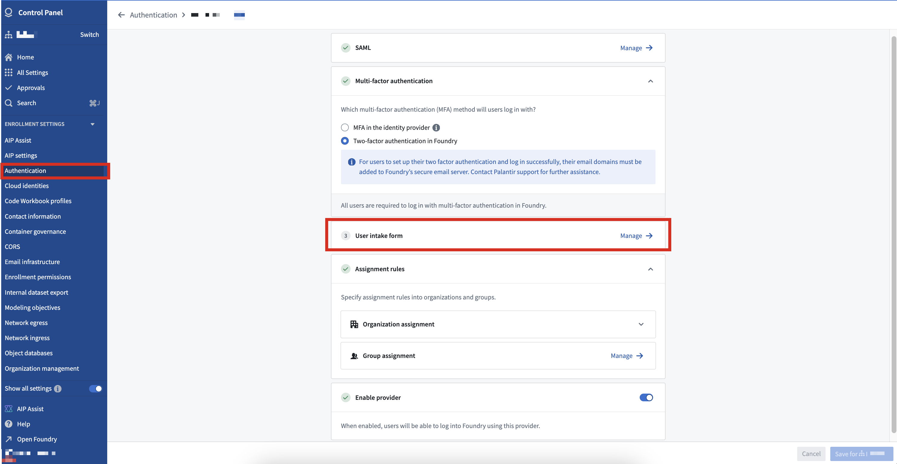
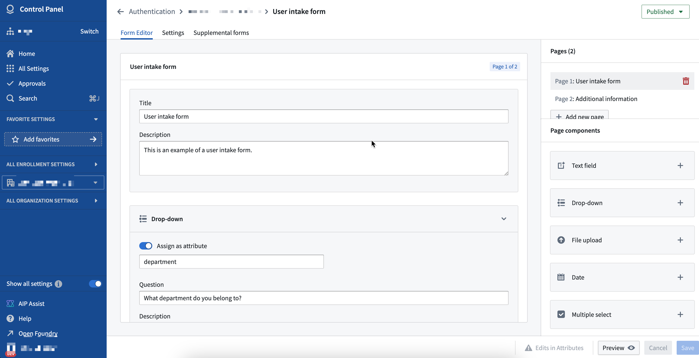
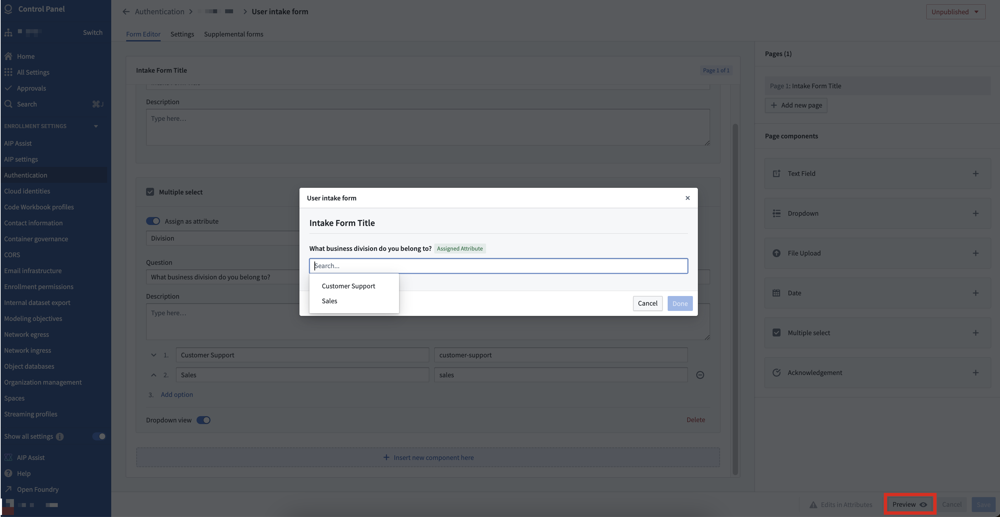
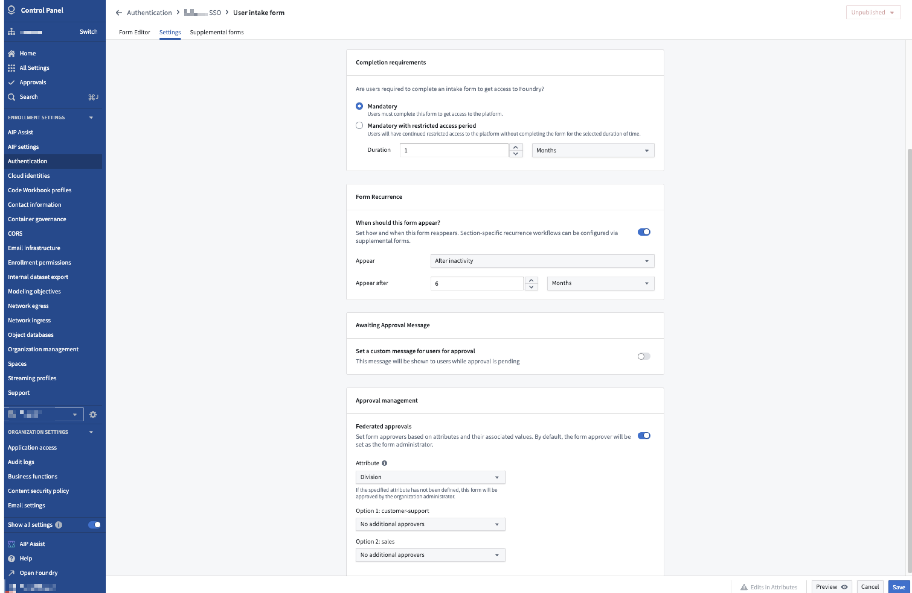
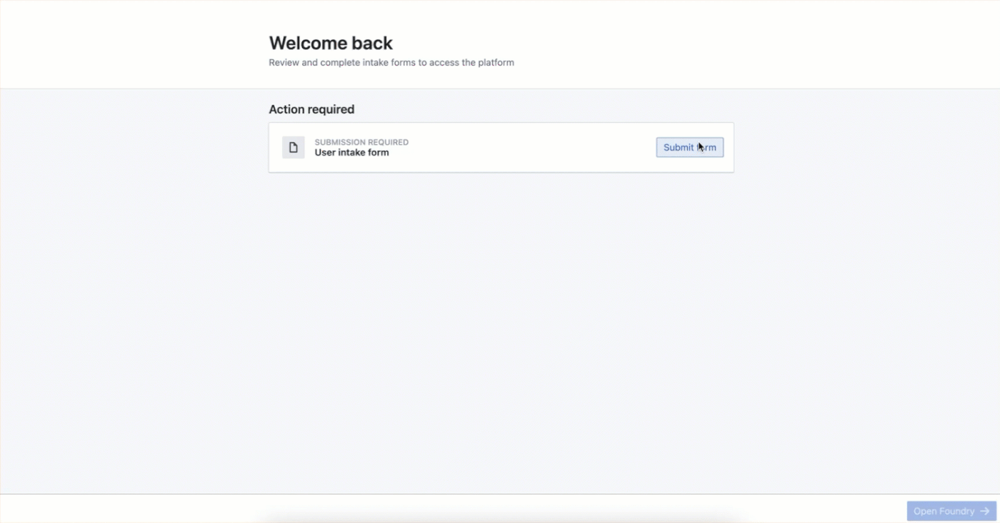
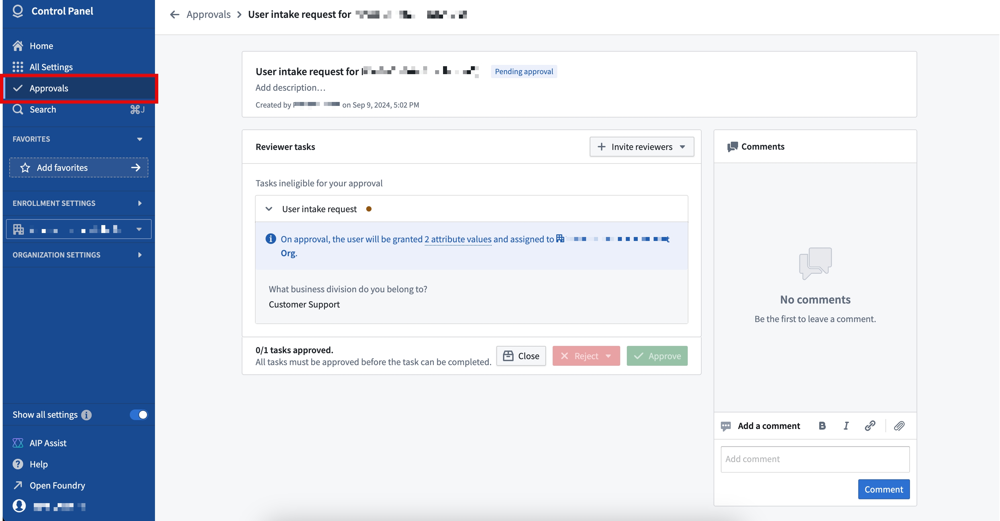

<!-- source: https://palantir.com/docs/foundry/authentication/intake-forms/ · mirrored 2026-08-14 from Palantir Foundry docs -->

# Intake forms

Platform access is most commonly managed through SAML or OpenID Connect (OIDC) integrations with appropriate identity providers. Information and attributes about users and groups is inherited to the platform through these integrations. In cases where the available identity provider does not provide sufficient information about users that may be required for the effective management of platform access, administrators can set up authentication intake forms to capture, review, and supplement that information.

## Intake form management

Users with permissions to manage an authentication provider integration (`Organization administrators`, by default) can create, edit, and delete an intake form in [Control Panel](/docs/foundry/authentication/overview/). Navigate to the **Authentication** tab under **Enrollment settings** and select the authentication integration to associate with the intake form.

### Form editor

Intake forms are created by adding components to capture necessary user attributes and provide context to the reviewer.

The following components can be captured as a user attribute if configured appropriately:

* Text field
* Dropdown menu
* Multiple select
* Date

The `File upload` and `Acknowledgment` components cannot be captured as user attributes in an intake form, but they may be useful in providing the reviewer with useful context. For example, an Organization may require users to upload a completed training certificate if they are requesting certain attributes.

Field configuration in intake forms allows for advanced behavior, such as defining conditional fields. For example, conditional fields for dropdown menus can be configured to only appear for users based on their previous selections.

You can preview the form once configuration is complete to validate the user experience for the form user.

### Supplemental forms

A primary form can be configured to capture required information to review a user’s eligibility for accessing the platform when they first log in.

Additionally, supplemental forms can be configured if more user information must be captured and reviewed. Users are not required to complete a configured supplemental form at the time of their first log in, but they may be required to do so periodically or following a period of inactivity. For example, platform access may be contingent on the submission of a yearly training certificate or other evidence captured during the completion of the primary intake form.

### Settings

Form settings, such as completion requirements and approval management, can also be configured. By default, `Organization administrators` can approve all completed entries; an advanced setting can allow for federated approvals to define who is eligible to approve what attributes in addition to `Organization administrators`.

If the attributes collected from a user intake form are used by [Organization assignment rules](/docs/foundry/authentication/org-assignment/), the administrator of the Organization to which the user is assigned can approve the relevant intake form entry.

In the example below, separate "Sales" and "Customer Support" administration groups may be set as reviewers for each attribute.

### Publishing

A configured intake form can be previewed to validate it meets requirements. Once the configuration is finalized, the `Organization administrator` can then publish the form.

## Intake form completion

When an intake form is first published, all users authenticating through this provider will be required to complete the form at the time of their first login. Once completed, users will not be allowed to access the platform until an eligible user approves their submission. While waiting for review, users may resubmit the form.

Once a user’s intake form is approved, users will not need to complete the form at their next login. They may be required to eventually complete the form again depending on the form’s recurrence [settings](#settings) configuration.

If changes are made to an intake form after it has been published, only new users will be required to complete the updated intake form by default. Authorization will not be removed for users that have already completed the outdated intake form and have been approved prior to the update of the intake form. If the changes to the intake form are considered to be significant enough to require re-authorization of all users, the default behavior can be overwritten at time of re-publication which would lock all existing users out and require the completion and approval of the updated intake form.

## Intake form review

Eligible users can review submitted intake forms by navigating to the [**Approvals** inbox in Control Panel](/docs/foundry/administration/control-panel-approvals/) and filtering on **User intake requests**.

Any intake form entries that result in platform access to an [Organization](/docs/foundry/security/orgs-and-spaces/) are automatically approved if submitted by `Organization administrators`.
