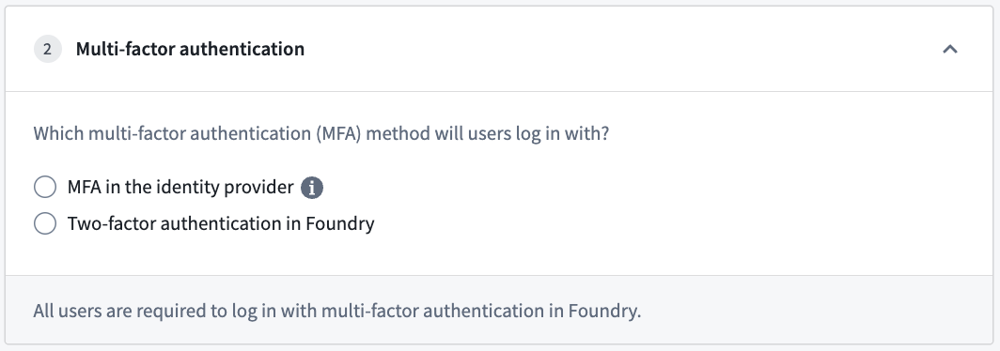
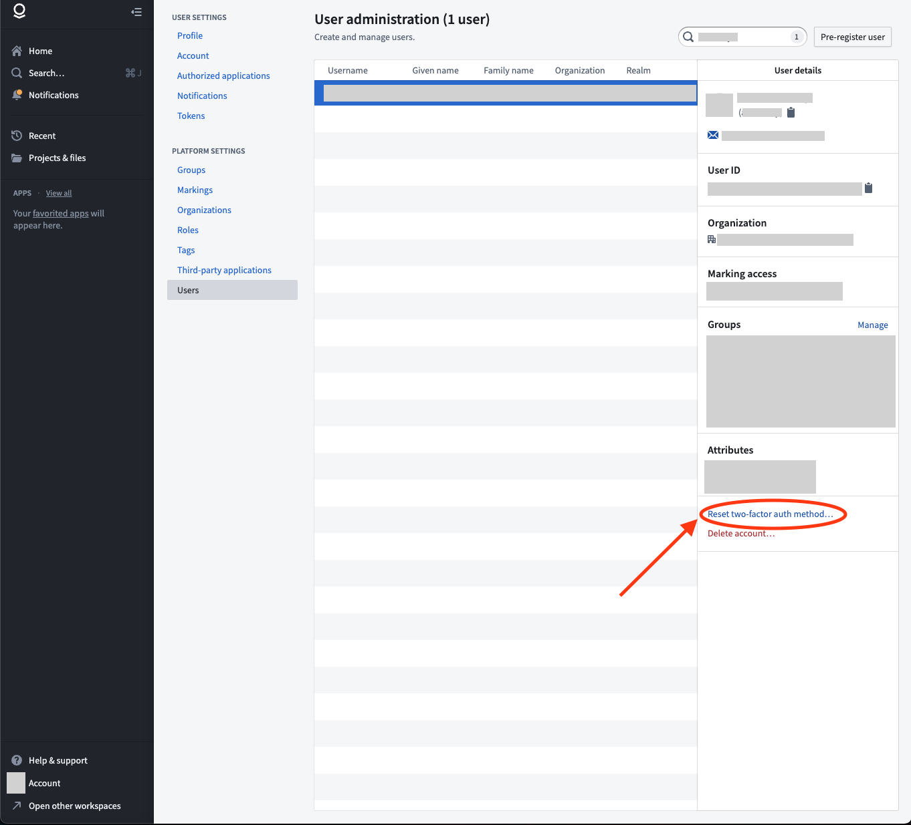

<!-- source: https://palantir.com/docs/foundry/authentication/multi-factor-auth/ · mirrored 2026-08-14 from Palantir Foundry docs -->

# Multi-factor authentication

Access to Foundry requires *multi-factor authentication*, which may either be performed in Foundry with app-based two-factor authentication or directly in your identity provider. [Learn more about Palantir's recommendations for identity security.](/docs/foundry/security/protect-foundry-installation/#identity-security)

After configuring a SAML 2.0 integration, click the back arrow at the top of the page and expand the **Multi-factor authentication** section to select a multi-factor authentication method for your users.

Once you have set up multi-factor authentication, [move on to Organization assignment](/docs/foundry/authentication/org-assignment/).

If you are unable to generate codes for multi-factor authentication, or if a user in your organization requires a multi-factor authentication reset, first check with your organization’s IT team to find out how your multi-factor authentication is managed.

**If your multi-factor authentication is managed by your organization's IT through your identity provider**
Your IT team will need to manage any reset requests.

**If your multi-factor authentication is managed in Foundry**
A Foundry Platform Administrator in your organization can reset two-factor authentication/multi-factor authentication with the following steps:

1. In Foundry, go to **Account > Settings** from the bottom left corner of the browser.
2. Under **Platform Settings**, select **Users**.
3. Search for the user in question, and select their name from the list.
4. A sidebar should appear with an option to **Reset two-factor auth method...**. Select this option.
5. In the confirmation screen, confirm you would like to complete the reset.
6. Upon confirmation, you will receive a success message and the user should receive communications regarding next steps to reset their multi-factor authentication method.

