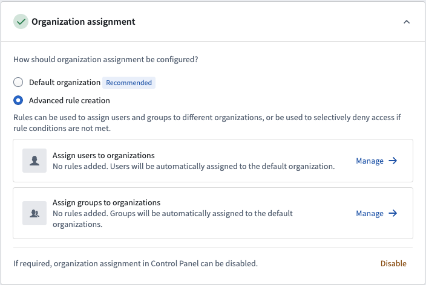
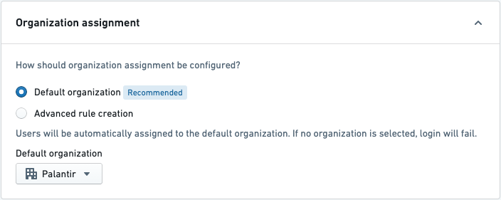
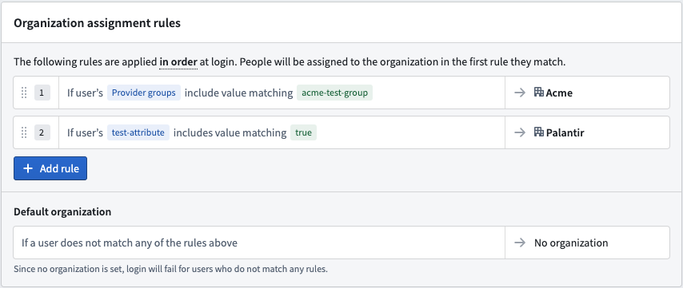
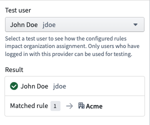
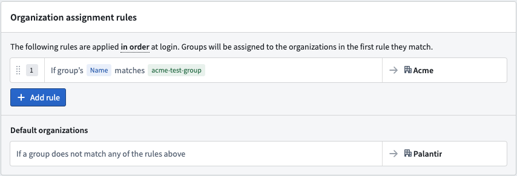

<!-- source: https://palantir.com/docs/foundry/authentication/org-assignment/ · mirrored 2026-08-14 from Palantir Foundry docs -->

# Organization assignment

Users are assigned their primary Organization upon login. A user's primary Organization is determined in the Organization assignment section of the identity provider integration used to log in. If you have configured provider groups in the identity provider integration, these groups will be marked with one or more Organizations based on that section as well.

## Default Organization or advanced rules

In most cases, all users logging in via a given identity provider integration should be assigned to a single Organization. This is achieved by selecting the **Default Organization** option. Provider groups, if configured, will also be marked with the same Organization as users.

Advanced rule creation can be used for more complex situations. It allows you to define a series of rules to assign the right Organization with an optional fallback. You can manage the rules for users and for provider groups separately.

Open the advanced rules editor by clicking **Manage** for either user or group rules.

### Define Organization assignment rules

On the provider management page, expand the **Organization assignment** section. This allows you to determine which Organizations your users will be a member of when they log in.

For a simple SAML 2.0 integration, choose **Default Organization** and select your Organization in the dropdown, then save.

### User rules

Organization assignment rules for users are configured by writing conditions that match a user’s attributes, internal groups, or provider groups. We strongly recommend using user attributes and/or provider group conditions rather than internal group conditions.

Before saving, you can validate these rules against an existing user. The test panel shows which rule the user matches and the organization to which they would be assigned. Note that only users who have logged in with this provider can be used for testing.

### Group rules

Organization assignment rules for groups are configured by writing conditions that match on a group’s name. The group can be assigned to one or more organizations.

As the matching criteria uses regex, ensure special characters are escaped in the condition.

## No organization

If a user is assigned `No organization` (either via the default Organization functionality or by applying advanced rules), then they will be blocked from logging in.

If a provider group is assigned `No organization` (either via the **Default organization** or **Advanced rule creation** options), then the group will be assigned to the organization of the most recent member to log in.

:::callout{theme="neutral" title="Multipass group AUM rules"}
Certain historical identity provider integrations may be using a legacy implementation called Multipass Group AUM rules for assigning users & provider groups to organizations. If organization assignment is not configured in Control Panel, then these rules continue to apply. However, **Multipass Group AUM rules will be ignored if organization assignment is configured in Control Panel**. Contact your Palantir representative if you are unsure whether this applies to your configuration.
:::

To complete setup, [enable and test your identity provider integration](/docs/foundry/authentication/test-provider-integration/).
