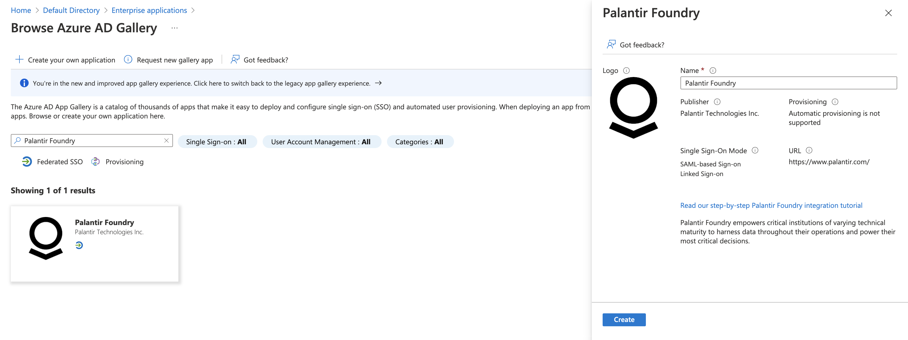
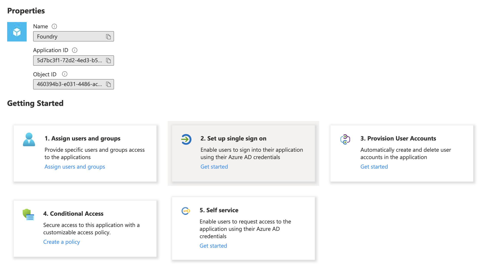
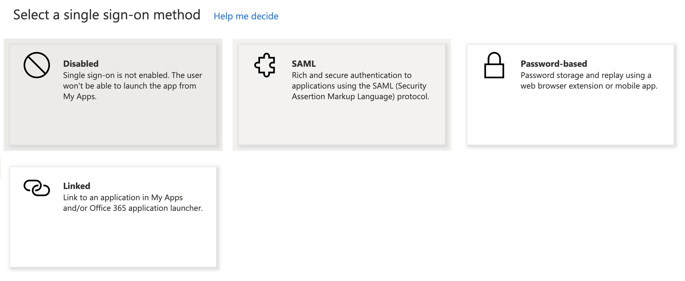
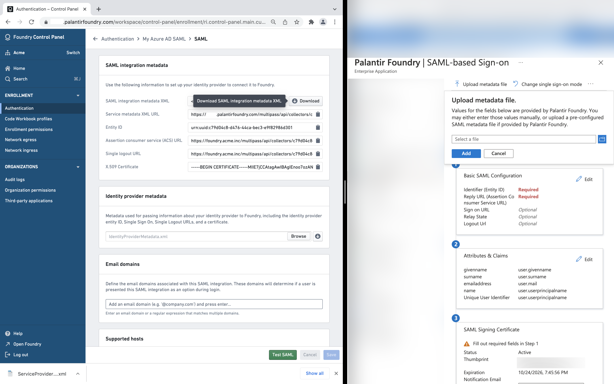
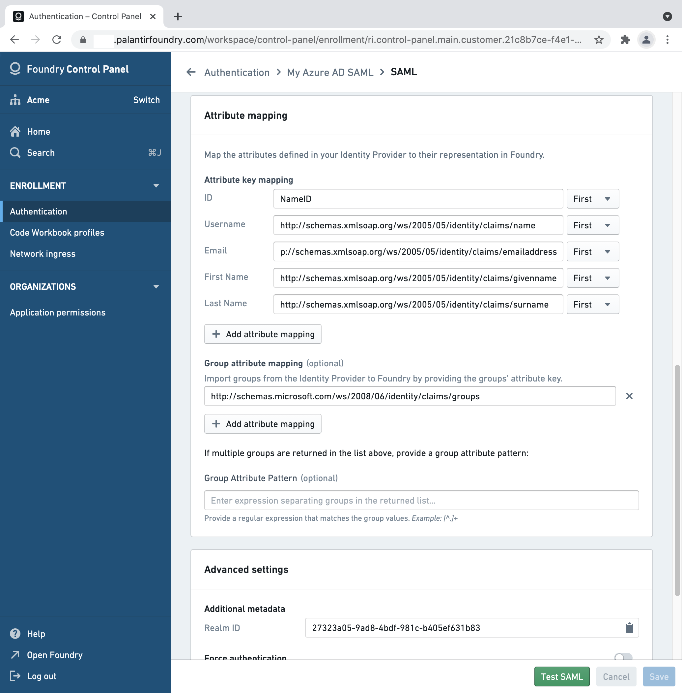
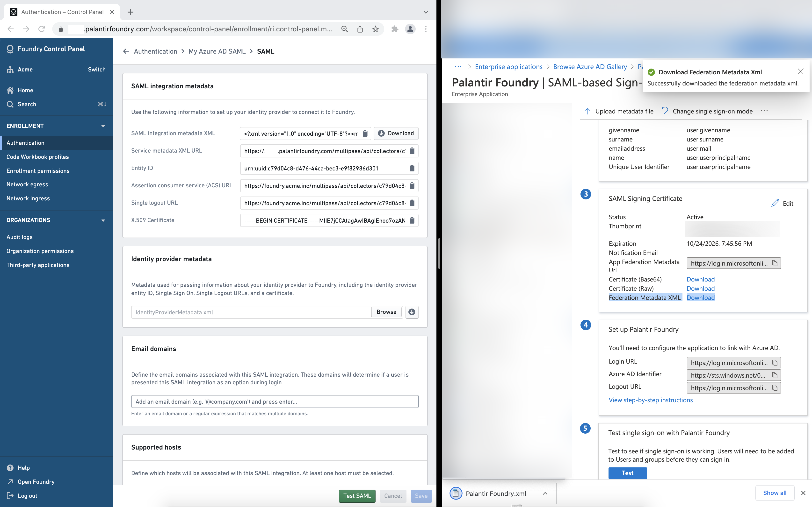

<!-- source: https://palantir.com/docs/foundry/authentication/saml-azure-ad/ · mirrored 2026-08-14 from Palantir Foundry docs -->

# Configure SAML 2.0 integration for Entra ID (Azure AD)

This section contains steps specific to Entra ID (formerly known as Azure AD) for configuring the SAML 2.0 integration as part of the broader [end-to-end authentication via SAML 2.0 tutorial](/docs/foundry/authentication/saml-getting-started/).

You can also find a [quickstart guide ↗](https://docs.microsoft.com/en-us/azure/active-directory/saas-apps/palantir-foundry-tutorial) in the Microsoft documentation.

If you received a Foundry setup link to configure your initial SAML integration, skip to the next step. Otherwise, you can add a new SAML provider by going to the **Authentication** tab in Control Panel and selecting **Manage** in the **SAML** section.

In the [Azure Portal ↗](https://portal.azure.com), select **Microsoft Entra ID**, then **Enterprise Applications**, and **New application**. Search for **Palantir Foundry** and then select **Create**.

Once created, select the **Getting Started** box for **2. Set up single sign on**.

You will then be prompted to select a single sign-on method. Choose **SAML**.

## SAML integration metadata

In Foundry, download the **SAML integration metadata XML**, upload the XML to Azure using **Upload metadata file**, and then **Save**.

## Attribute mapping

You can define the following mappings for user attributes in **Attribute mapping**. If using a Foundry setup link, Azure attribute mappings will be pre-filled.

* **ID:** `NameID`
* **Username:** `http://schemas.xmlsoap.org/ws/2005/05/identity/claims/name`
* **Email:** `http://schemas.xmlsoap.org/ws/2005/05/identity/claims/emailaddress`
* **First name:** `http://schemas.xmlsoap.org/ws/2005/05/identity/claims/givenname`
* **Last name:** `http://schemas.xmlsoap.org/ws/2005/05/identity/claims/surname`

If you'd like to configure provider groups, select **Add a group claim** under **User Attributes & Claims** in the Azure Portal. In Foundry, add `http://schemas.microsoft.com/ws/2008/06/identity/claims/groups` as a **Group attribute mapping**, with no **Group attribute pattern**.

## Identity provider metadata

In Azure AD, download your identity's provider metadata XML file by using the link next to **Federation Metadata XML** under **SAML Signing Certificate**, and upload it to Foundry in the **Identity provider metadata** block.

## Finishing and saving

In Foundry, add email domains associated with this SAML 2.0 integration under **Email domains**.

Finish by saving your SAML 2.0 integration and proceed to [multi-factor authentication](/docs/foundry/authentication/multi-factor-auth/).
