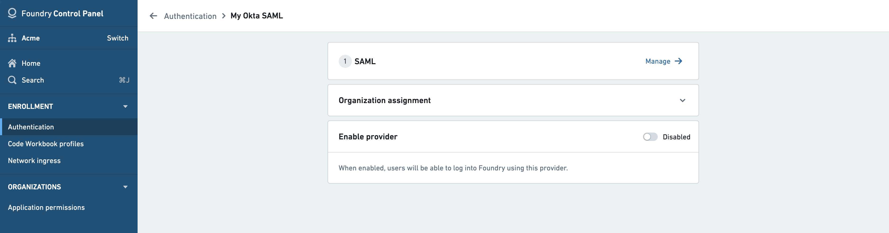
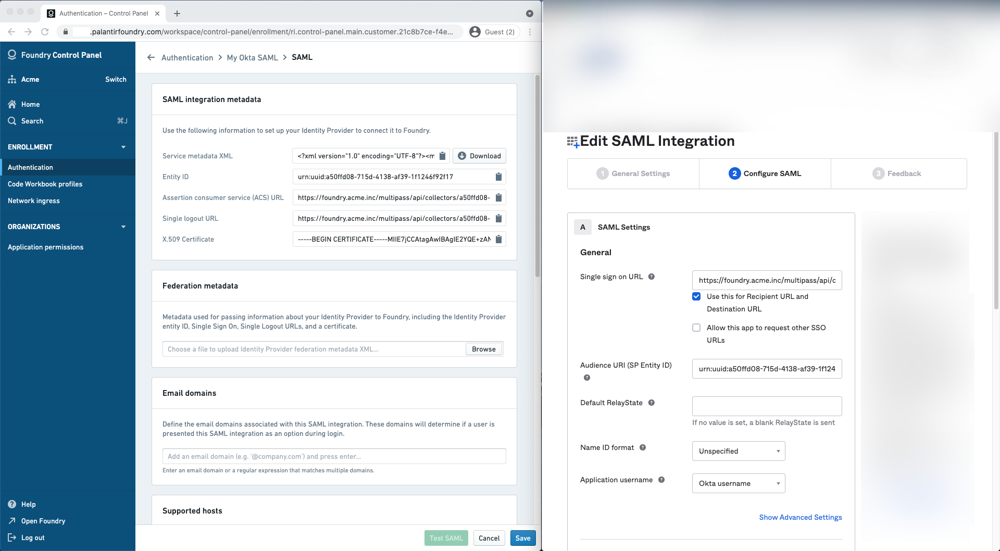
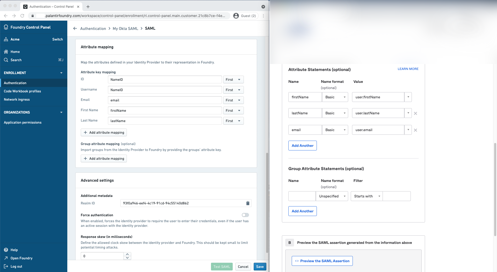
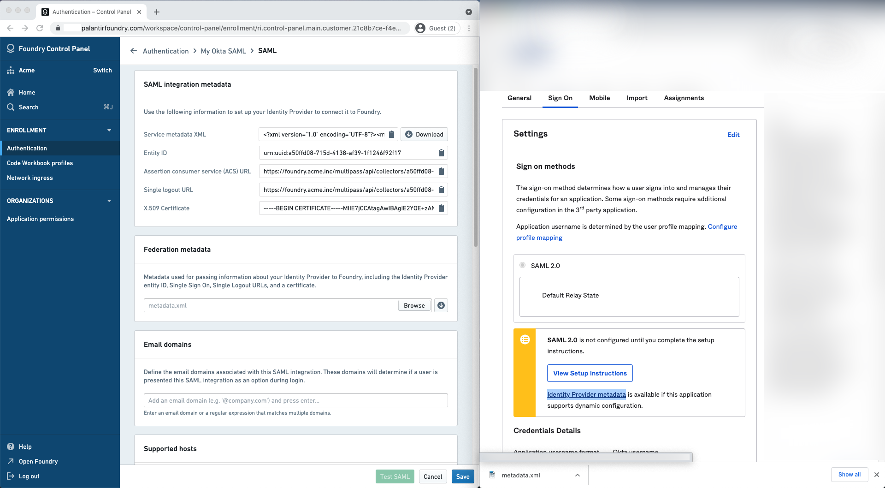

<!-- source: https://palantir.com/docs/foundry/authentication/saml-okta/ · mirrored 2026-08-14 from Palantir Foundry docs -->

# Configure SAML 2.0 integration for Okta

This section contains Okta-specific steps for configuring the SAML 2.0 integration as part of the broader [end-to-end authentication via SAML 2.0 tutorial](/docs/foundry/authentication/saml-getting-started/).

If you received a Foundry setup link to configure your initial SAML integration, skip to the next step. Otherwise, you can add a new SAML provider by going to the **Authentication** tab in Control Panel and selecting **Manage** in the **SAML** section.

In Okta, create a SAML app integration by following [these instructions ↗](https://help.okta.com/en/prod/Content/Topics/Apps/Apps_App_Integration_Wizard_SAML.htm).

## SAML integration metadata

Copy the following from the Foundry Control Panel (as shown on the left) to use in the **Edit SAML Integration** page for Okta (as shown on the right):

| Foundry      | Okta |
| ----------- | ----------- |
| Assertion consumer service (ACS) URL | Single sign on URL |
| Entity ID | Audience URI (SP Entity ID) |

## Attribute mapping

Okta does not define standard SAML attributes that can be used without further configuration beyond `NameID`. Attributes need to be defined in Okta first before they can be mapped in Foundry.

In Okta, declare the following attribute statements:

| Name      | Name format |  Value         |
|-----------|-------------|----------------|
| firstName | Basic       | user.firstName |
| lastName  | Basic       | user.lastName  |
| email     | Basic       | user.email     |

You can define the following mappings for user attributes in **Attribute mapping**. If using a Foundry setup link, Okta attribute mappings will be pre-filled.

* **ID:** `NameID`
* **Username:** `NameID` (alternatively, `email`)
* **Email:** `email`
* **First name:** `firstName`
* **Last name:** `lastName`

You can also define attribute mappings to mirror your existing Okta groups in Foundry. Define one or more group attribute statements in Okta and map them in **Group attribute mapping**.

## Identity provider metadata

In Okta, finish the creation of the SAML app integration then navigate to the **Sign on** tab to retrieve your identity provider’s metadata in an XML file under **Identity provider metadata**. Upload this to Foundry in the **Identity provider metadata** section.

## Finish and save

In Foundry, add email domains associated with this SAML 2.0 integration under **Email domains**.

Finish by saving your SAML 2.0 integration and [move on to multi-factor authentication](/docs/foundry/authentication/multi-factor-auth/).
