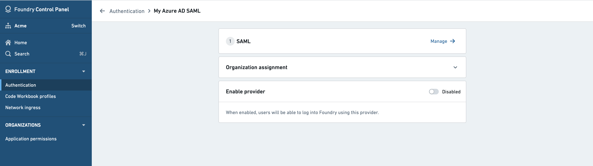
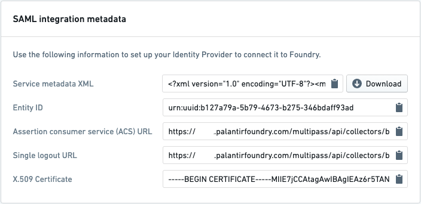
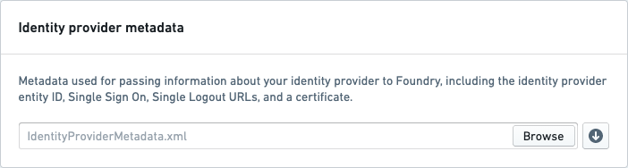

<!-- source: https://palantir.com/docs/foundry/authentication/saml-other-idp/ · mirrored 2026-08-14 from Palantir Foundry docs -->

# Configure SAML 2.0 integration for other identity providers

This section contains general steps for configuring the SAML 2.0 integration as part of the broader [end-to-end authentication via SAML 2.0 tutorial](/docs/foundry/authentication/saml-getting-started/).

If you received a Foundry setup link to configure your initial SAML integration, skip to the next step. Otherwise, you can add a new SAML provider by going to the **Authentication** tab in Control Panel and selecting **Manage** in the **SAML** section.

The first block in this page contains Foundry’s metadata in different forms: an XML metadata file, individual entity ID, ACS URL, and so on. Go to your identity provider and use this metadata to create a SAML integration. The specific steps to achieve this will differ depending on your identity provider.

Retrieve your identity provider’s metadata in an XML file, then upload the XML file to Foundry in the **Identity provider metadata** block.

Add email domains associated with this SAML 2.0 integration under **Email domains**.

Then, fill in the **Attribute mapping** block. This block determines which attributes from your identity provider will be used for the user attributes in Foundry: **Username**, **Email**, **First Name**, and so on. You can also configure Foundry to create groups based on identity provider attributes. You may need to additionally configure your provider to include group attributes in the SAML response. You can find this information from your identity provider.

If you’re unsure, insert `dummy` as a temporary value to later correct when you reach the testing stage.

Finish by saving your SAML 2.0 integration and [move on to multi-factor authentication](/docs/foundry/authentication/multi-factor-auth/).
