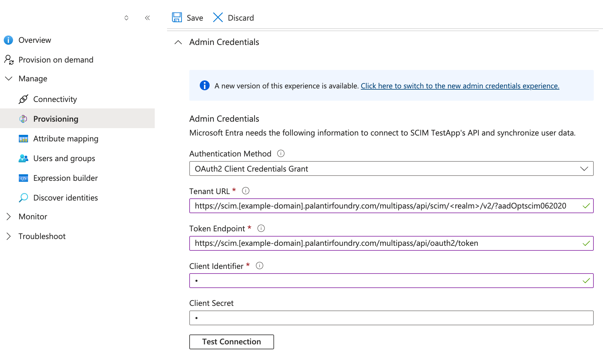
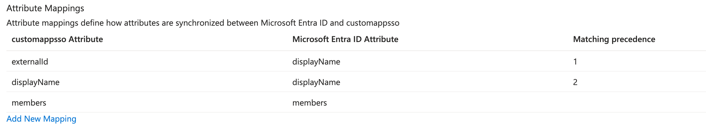

<!-- source: https://palantir.com/docs/foundry/authentication/scim-entra-id/ · mirrored 2026-08-14 from Palantir Foundry docs -->

# Provisioning with Microsoft Entra ID

This section contains steps specific to Entra ID (formerly known as Azure AD) for configuring SCIM.

This step requires coordination with your Entra admin. Additionally, if your SSO uses [SAML](#saml), the steps differ slightly from those for [OIDC](#oidc).

:::callout{theme="neutral"}
The [Palantir Foundry gallery app ↗](https://learn.microsoft.com/en-us/entra/identity/saas-apps/palantir-foundry-tutorial) does not support SCIM provisioning yet. If you are using the gallery app to perform single sign-on with Entra ID, you will need to create and use a new enterprise app to enable SCIM.
:::

## Configuration steps

### SAML

#### 1. Turn on SCIM provisioning

Navigate to your **\[Enterprise App]** > **Provisioning** > **Admin Credentials**.

1. Use the **OAuth2 Client Credentials Grant** authentication method.

2. Tenant URL: Use the SCIM URL generated in Step 4, and add the feature flag `?aadOptscim062020` to the end (for example, `https://<DOMAIN>/multipass/api/scim/<REALM>/v2/?aadOptscim062020`).

   :::callout{theme="neutral"}
   You must add the feature flag parameter to the end of the SCIM URL that is returned when you generate SCIM credentials. This is an Entra feature flag that must be used for the identity provider to use the SCIM 2.0 protocol.
   :::

3. Client ID and secret: generated in [Step 4: Generate SCIM credentials](/docs/foundry/authentication/scim-enable/#4-generate-scim-credentials).

#### 2. Configure attribute mapping

Navigate to **\[Enterprise App]** > **Provisioning** > **Attribute mapping**.

**Users**

Make sure that the mappings contain the correct attribute values for each attribute. In the `externalId` field in Entra provisioning settings, send the same value as what is being sent in the SSO claim that you are mapping to the **Provider ID** field in Control Panel. By default, this is `NameID`, but Palantir recommends changing this value to a stable, unique identifier.

:::callout{theme="warning"}
If `externalId` does not match what is mapped to `Provider ID` in Control Panel, SCIM provisioning and logins may fail.
:::

* Foundry syncs only `userName`, `externalId`, `active`, `displayName`, `emails`, and `name` (given and family). You can map other attributes, but Foundry does not sync them until the user next logs in.
* Set the unique identifier for users to `externalId`, followed by `userName`. Entra ID calls this the "matching precedence":
  * Set the matching precedence for `externalId` to 1.
  * Set the fallback identifier (or secondary matching precedence) to `userName`.

**Groups**

The group `displayName` and `externalId` attributes must both be mapped to the value that is currently used to persist the groups in Foundry (either the group's `displayName` or its `id`). If these attributes do not match and a group's name changes, members of that group may be blocked from logging in.

To confirm which field is sent to Foundry, navigate to **\[Enterprise App]** > **Single Sign On** > **2. Attributes and Claims** > **Edit** > `http://schemas.microsoft.com/ws/2008/06/identity/claims/groups` > **Source Attribute**. The value sent here must match what is sent in both `externalId` and `displayName`.

#### 3. Toggle provisioning status to `On`

1. This will start the initial sync, which will ensure that every user and group assigned to this application exists in Foundry and all group memberships are updated. Foundry will also perform [organization assignment](/docs/foundry/authentication/org-assignment/), [user intake evaluation](/docs/foundry/authentication/intake-forms/), and [rule based group evaluation](/docs/foundry/authentication/group-assignment/) for all rules configured in Control Panel. It will not run asynchronous user managers. All of this information will also refresh on the user's next login.

   :::callout{theme="neutral"}
   If you have organization assignment rules that use *externally managed groups* to triage users into an organization, these rules will not be run when SCIM originally provisions a user (either from the initial sync or for a subsequent create request). Users will need to manually log into Foundry, or SCIM will need to send an `updateUser` request, for these rules to run and users to be triaged appropriately. This is because when SCIM creates a user, it does not update group membership immediately, so Foundry is unable to conduct organization assignment based on identity provider groups.  

   Similarly, when SCIM updates group membership for externally managed groups, organization assignment rules will not execute for those users whose membership was updated. In other words, for organization assignment rules that rely on externally managed group membership to run, users will need to manually log into Foundry or have some other update to the user (for example, username changes) that triggers a SCIM `updateUser` request.
   :::

2. Once the initial sync completes, updates will be sent in batches at a fixed interval — generally every 20 to 40 minutes.

### OIDC

If you are using the OIDC authentication method with Entra ID and would like to enable SCIM, contact Palantir Support.
