<!-- source: https://palantir.com/docs/foundry/authentication/user-directory/ · mirrored 2026-08-14 from Palantir Foundry docs -->

# Manage users within your enrollment

:::callout{theme="warning"}
Palantir’s self-service passwordless identity provider is currently only available for new commercial and developer tier enrollments and AIP bootcamps.   
In most cases, your enrollment administrator will integrate your organization's existing identity provider with the Palantir platform so you can log in with the same credentials you use across other internal systems.
:::

This page provides detailed guidance on how to access and manage user accounts within your enrollment when using Palantir's self-service user directory. The following instructions describe how to add new users, manage passkeys, enable or disable existing accounts, and delete user accounts.

## Access user management

To begin managing users within your enrollment, you must be an `enrollment administrator` or an `authentication administrator`. If you do not have one of these permissions, an existing enrollment administrator can grant you the relevant role. Review the documentation on [granting user permission to manage users of the enrollment](/docs/foundry/authentication/user-directory/#grant-user-permission-to-manage-users-of-the-enrollment) for more information.

To access the **Manage users** page, navigate to **Control Panel > Manage user directory > Manage users**.

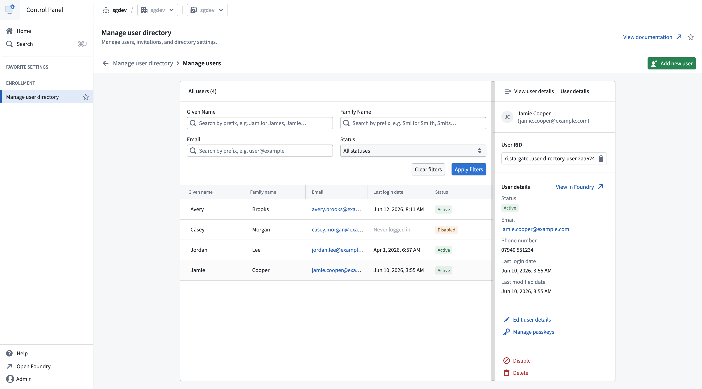

## Add a new user

1. Navigate to the **Manage users** page. Review the [access user management documentation](/docs/foundry/authentication/user-directory/#access-user-management).

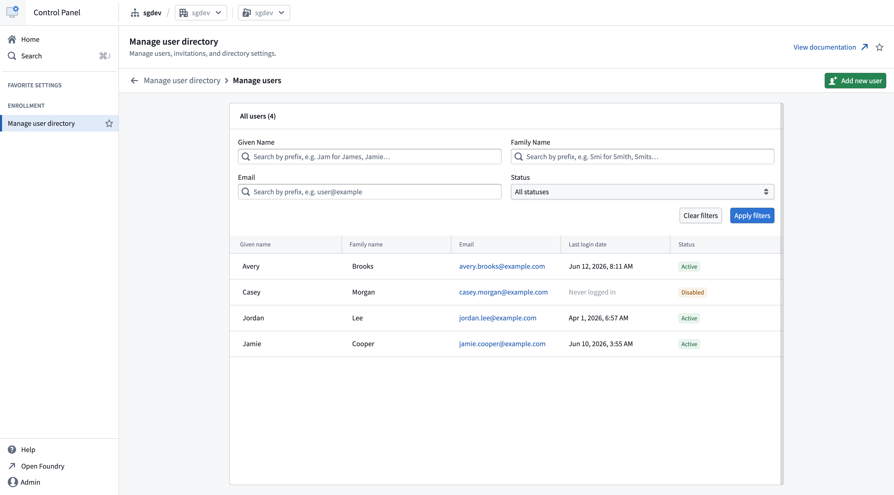

2. Select **Add new user**. From here, you can fill out the prospective user’s name and email address and send them an invitation to join the enrollment.

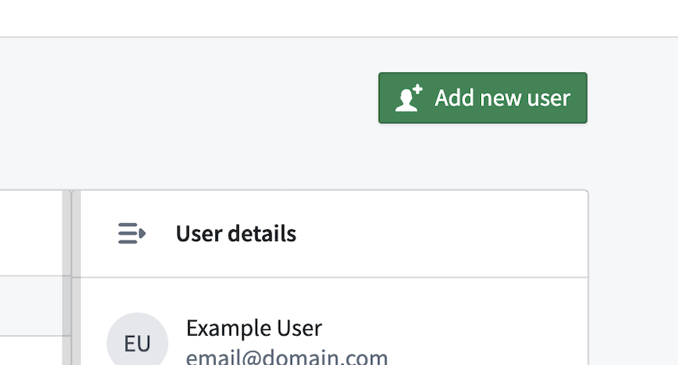

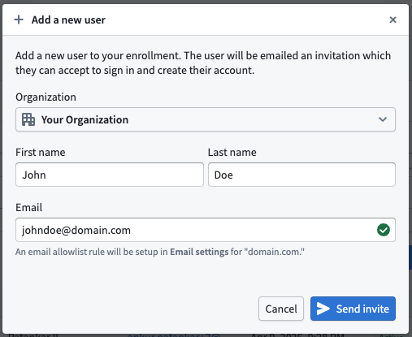

3. The new user will receive an email to complete their user account registration and configure a passkey. Review the [authentication documentation](/docs/foundry/getting-started/login/#set-up-and-configure-a-passkey) for more information.

## Manage passkeys

If a user is locked out of their account or needs a passkey added or removed, an administrator can manage their passkeys. This includes deleting specific passkeys, deleting all passkeys to reset an account, and sending an invite for users to register additional passkeys.

To manage passkeys for a user, follow the steps below:

1. Navigate to the **Manage users** page. Review the [access user management documentation](/docs/foundry/authentication/user-directory/#access-user-management).
2. Select the user whose passkeys you want to manage.
3. Select the **Manage passkeys** option located in the **User details** pane.

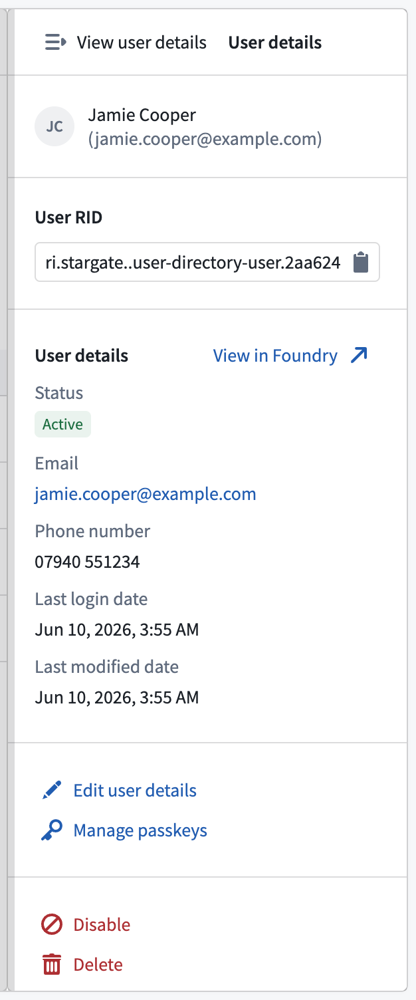

4. The **Manage passkeys** dialog displays the user’s name, email, and user RID alongside two collapsible panels: **Delete passkeys** and **Add passkey**.

### Delete passkeys

The **Delete passkeys** panel displays a checklist of all registered passkeys for the user. You can selectively delete one or more passkeys without affecting the remaining credentials.

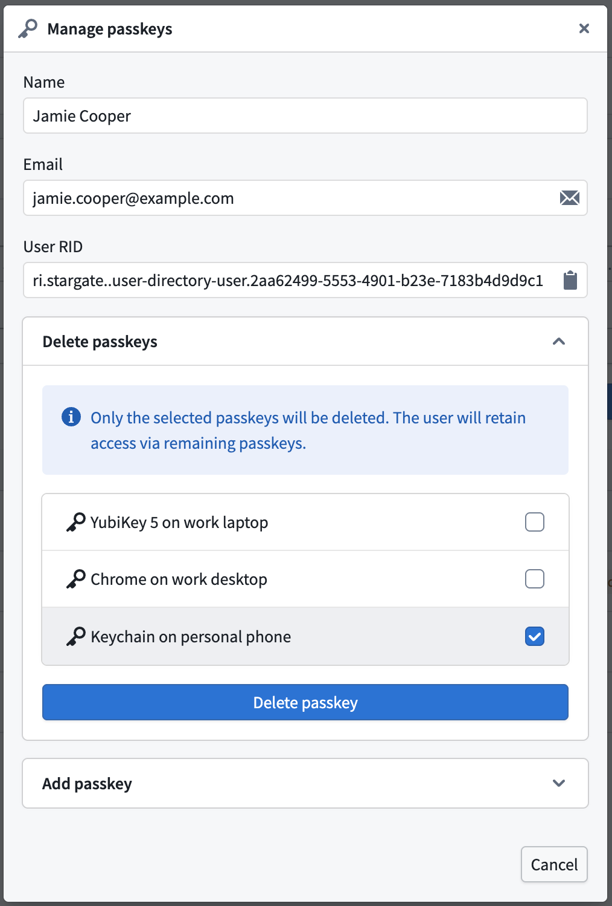

Select the passkeys you want to remove and then select the **Delete passkey(s)** button. The behavior of the dialog changes depending on the number of passkeys selected:

* If some passkeys are selected, only the selected passkeys are deleted. The user retains access through their remaining passkeys.
* If all passkeys are selected, the action resets the user’s account. The user receives a recovery email and must register a new passkey.

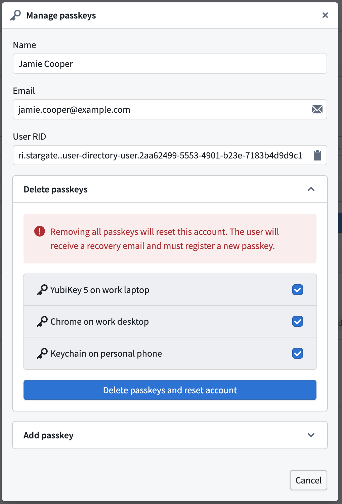

### Add a passkey

The **Add passkey** panel allows you to send an invite for a user to register an additional passkey without affecting their existing credentials. This is useful when a user is locked out on one device but has valid passkeys registered on other devices.

Each user can register a maximum of four passkeys. The panel displays the number of remaining passkey slots.

To add a passkey, select the **Add passkey** button.

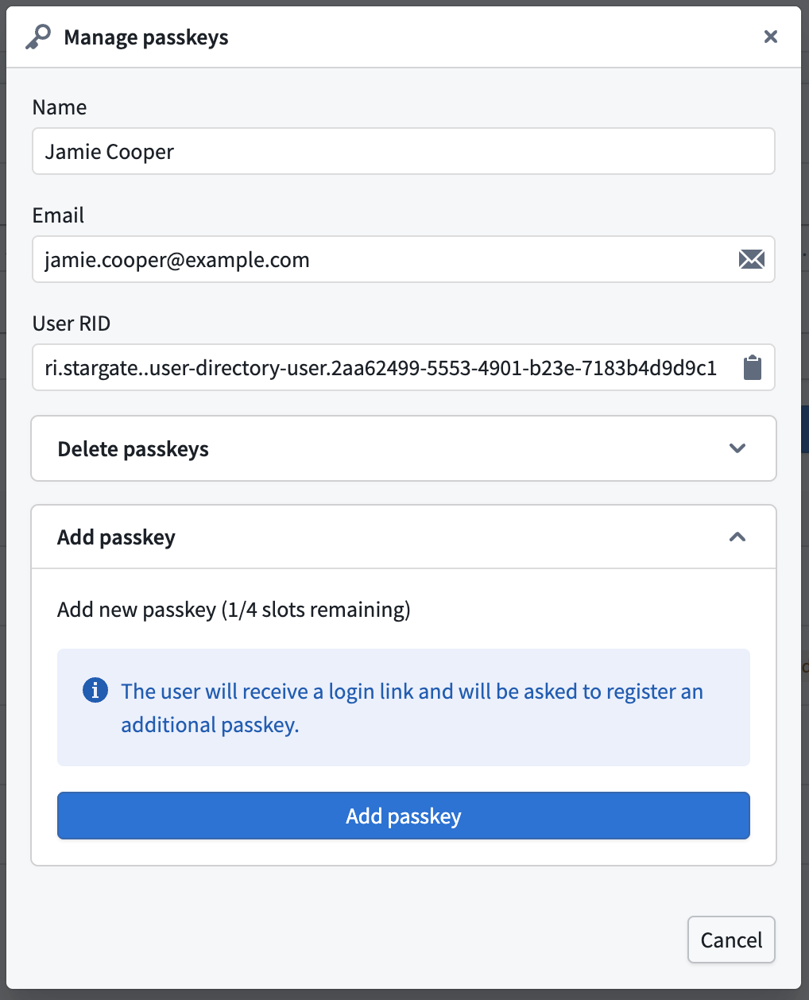

The user will receive an email with a one-time password and a link to register an additional passkey. If the user has already reached the maximum of four passkeys, the **Add passkey** button is disabled. You must delete an existing passkey before adding a new one.

### Passkey name visibility

Passkey names are visible to administrators when managing passkeys for a user. This visibility helps identify which passkeys to keep or remove during the recovery process. Users are informed during passkey creation and editing that their passkey names are visible to administrators and are advised not to include personal or sensitive information.

## Disable user access

To revoke access from a user, an administrator can disable the account. The user will no longer be able to register, login, or have their account reset until the user is re-enabled.

To disable the user account, follow the steps below:

1. Navigate to the **Manage users** page. Review the [access user management documentation](/docs/foundry/authentication/user-directory/#access-user-management).
2. Select the user to be disabled.
3. Use the **Disable** option located in the **User details** pane.

4. Review the information in the pop-up window and confirm by selecting **Disable**.

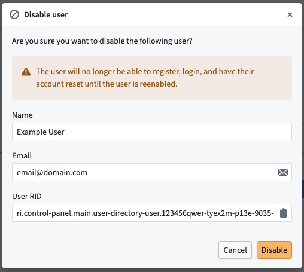

## Re-enable user access

For a disabled user to regain access to the platform, an administrator will need to enable their account. Once enabled, the user’s account is reset and they will be able to register and login.

To enable a user, follow the steps below:

1. Navigate to the **Manage users** page. Review the [access user management documentation](/docs/foundry/authentication/user-directory/#access-user-management).
2. Select the user to be enabled.
3. Select the **Enable** option in the **User details** pane.

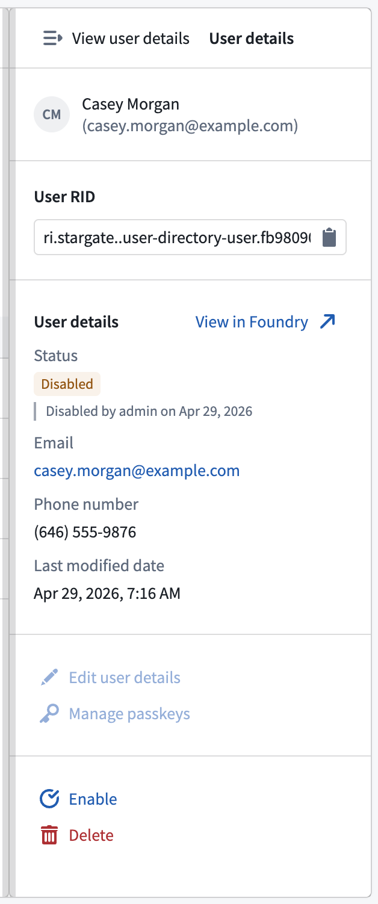

4. Review the information in the pop-up window and confirm by selecting **Enable**.

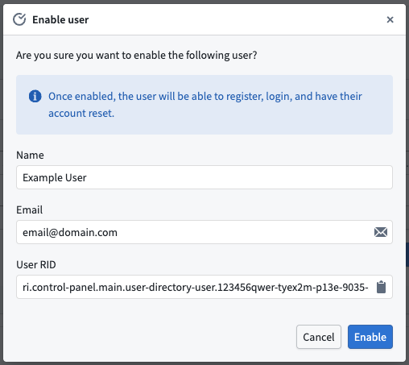

## Delete a user

To permanently revoke access from a user, you should delete the user.

:::callout{theme="danger"}
This action cannot be undone, and the user will no longer have any access to the platform. Any resources the user owns should be shared or ownership transferred before deleting the user.
:::

To delete the user account, follow the steps below:

1. Navigate to the **Manage users** page. Review the [access user management documentation](/docs/foundry/authentication/user-directory/#access-user-management).
2. Select the user to be deleted.
3. Select the **Delete** option in the **User details** pane.

4. Review the information in the pop-up window and confirm by selecting **Delete**.

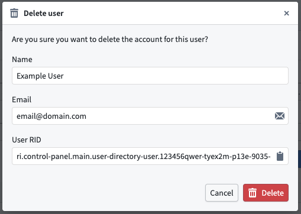

## Grant user permission to manage users of the enrollment

To give other users the ability to manage users within your enrollment, you must grant these users either the `enrollment administrator` and/or `authentication administrator` role. For more information on enrollment permissions [review Levels of permissions](/docs/foundry/administration/enrollments-and-organizations-permissions/).

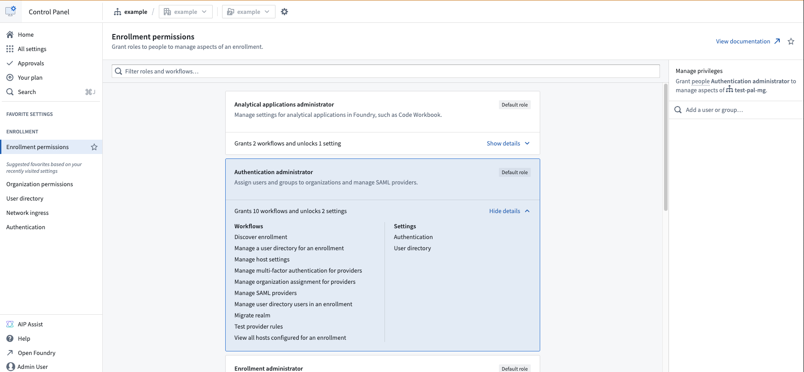
