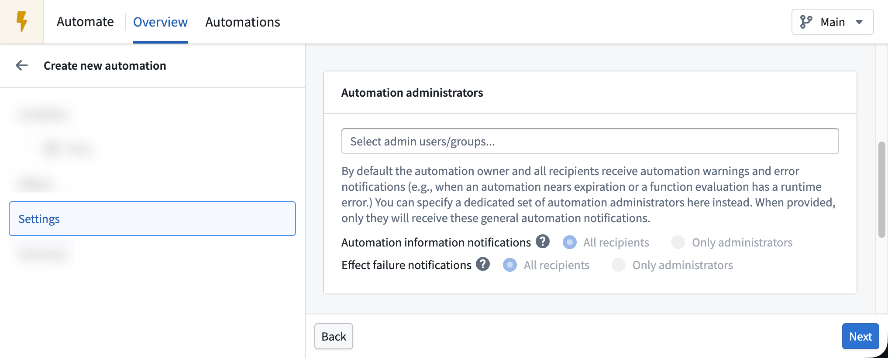

<!-- source: https://palantir.com/docs/foundry/automate/automation-administrators/ · mirrored 2026-08-14 from Palantir Foundry docs -->

# Automation administrators

By default, the automation owner and all recipients of notification effects receive automation warnings and error notifications (for example, when an automation nears expiration or when a function evaluation has a runtime error). To prevent all recipients of notification effects from receiving these automation warnings and error notifications, you can specify a dedicated set of automation administrators. These administrators can be users or groups. When configured, only administrators will receive automation notifications according to the notification type settings below.

There are two different notification classes that can be selected:

* **Automation information notifications**, including notifications about:
  * Automation expiration date approaching or being reached
  * Auto-pausing an automation because of cycles or [limits](/docs/foundry/automate/limits/)
  * Evaluation errors
* **Effect failure notifications**, including notifications about:
  * An Action failing to execute
  * A notification failing to send or an attachment failing to render

:::callout{theme="warning"}
Effects are always executed per user and a user can only receive effect failure notifications for themselves. Because of this, changing **Effect failure notifications** to `Only administrators` will prevent failure notifications from being sent to anyone except administrators.
:::

