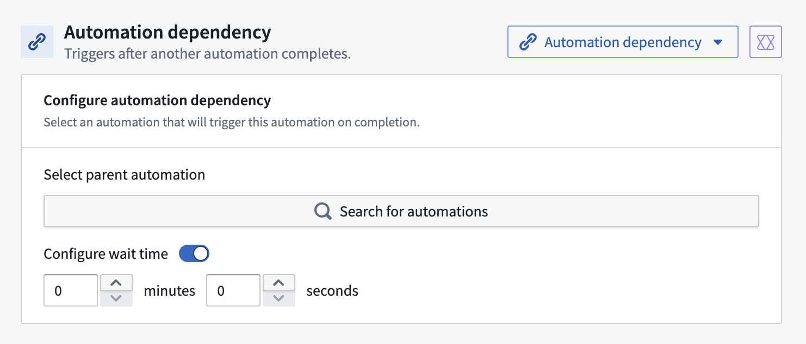

<!-- source: https://palantir.com/docs/foundry/automate/automation-dependencies/ · mirrored 2026-08-18 from Palantir Foundry docs -->

# Automation dependencies

The automation dependencies feature in Foundry Automate allows you to schedule an automation to run after a parent automation completes. This feature is designed to streamline workflows by automatically triggering subsequent processes, regardless of the success or failure of the parent automation.

There are two kinds of automation dependency, distinguished by whether an object set condition is configured:

* **No dynamic object set condition:** The dependent automation executes each time the parent automation completes, without the need for manual intervention. No object set is passed to its effects.
* **With an object set condition:** Pair an object set condition ([**Objects added to set**](/docs/foundry/automate/condition-objects/#objects-added-to-set), [**Objects removed from set**](/docs/foundry/automate/condition-objects/#objects-removed-from-set), or [**Run on all objects**](/docs/foundry/automate/condition-objects/#run-on-all-objects)) with the parent dependency. The condition is evaluated each time the parent automation completes. This behaves like [scheduled monitoring](/docs/foundry/automate/evaluation-frequency/#scheduled-monitoring), except that each [automation-dependent](/docs/foundry/automate/evaluation-frequency/#automation-dependent) evaluation happens when the parent automation completes rather than on a fixed schedule.

As an example, consider a scenario where you have an automation that processes incoming data files. Once this automation completes, regardless of whether it successfully processes all files or encounters errors, a dependent automation can be triggered to notify the data team and log the results for further analysis. Additionally, you can specify object set conditions to ensure that the notification is only sent if certain criteria are met, such as the presence of critical errors.

## Set up an automation dependency

Follow the steps below to set up automation dependencies.

1. **Define parent automation:** Start by defining the parent automation that will trigger the dependent automation upon completion.
2. **Configure dependent automation:** Set up the dependent automation and specify any additional object set conditions that should be met for the automation to proceed.
3. **Link automations:** Link the dependent automation to the parent automation to ensure it triggers upon the parent’s completion.
4. **Configure wait time (optional):** Enable the **Configure wait time** toggle to add a delay, specified in minutes and seconds, after the parent automation completes and before the dependent automation is evaluated.

## Always trigger effects when automation completes

When an object set condition is configured, you can enable the **Always trigger effects when automation completes** setting, described in the Automate interface as **Execute effects when linked automation completes regardless of whether the objects condition was triggered**. This setting applies only when an object set condition is configured; it has no effect on a dependency that has no object set condition.

The setting determines what happens when the parent automation completes but no objects match the object set condition since the last parent completion:

* **Toggled off:** Nothing happens. Effects execute only when objects match the condition.
* **Toggled on:** Effects execute regardless of whether the object condition was triggered. The outcome depends on the input shape of the effect:
  * An effect with no dynamic object input, such as a static notification, runs once.
  * An effect that runs per object runs nothing, because no objects match.
  * An effect that runs a single execution over all objects runs once, with an empty object set passed in.

## Considerations

The following are some considerations you should have when setting up automation dependencies:

* **Triggers on success or failure:** The dependent automation triggers when the parent automation completes, regardless of the parent automation's success or failure. You cannot restrict the trigger to only successful or only failed parent runs, so plan your automation logic accordingly. Whether the effects then execute depends on the object set condition and the [**Always trigger effects when automation completes**](#always-trigger-effects-when-automation-completes) setting.
* **Object set conditions:** Ensure that any object set conditions specified for the dependent automation are correctly defined to avoid unexpected behavior.

By leveraging automation dependencies, you can create more efficient and responsive workflows that adapt to the outcomes of preceding processes.

## Known limitations

Automation dependencies have the following limitations:

* **Single dependency only:** Automation dependencies only support a single dependency (parent → child). Multi-level chains (parent → child → grandchild) are not supported.
* **Requires Project-scoped supported object types:** The monitored object type must support Project scoping.
* **Not supported on branches:** The automation dependency condition cannot be used when building automations on a branch. For more information on branching support for automations, see [Branching automations](/docs/foundry/automate/branching-automations/).
