<!-- source: https://palantir.com/docs/foundry/automate/branching-automations/ · mirrored 2026-08-14 from Palantir Foundry docs -->

# Branching automations

[Automate](/docs/foundry/automate/overview/) integrates with Global Branching to enable safe, isolated development of automations. This documentation covers
how to work with automations on branches, including adding and modifying resources, cross-application compatibility,
merge requirements, rebasing, and known limitations.

For general information on Global Branching concepts and workflows, refer to the [Global Branching documentation](/docs/foundry/global-branching/overview/).

## Adding, removing, and modifying resources

### Add an automation to a branch

To add an automation to a branch:

1. Navigate to the automation file on a branch or select the designated branch using the branch selector in the top right of the page. From there, select **Add to branch**.
2. Make an edit and save the automation file. The automation is now a saved resource on the branch.

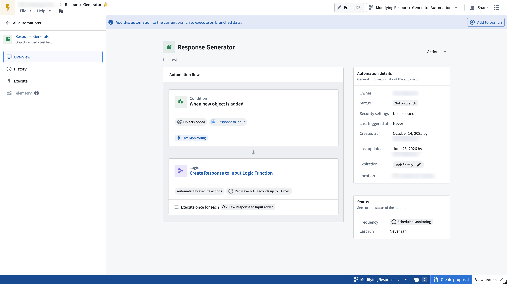

### Remove an automation from a branch

To remove an automation from a branch, use the bottom right sidebar and select **Remove from branch**. Removing the automation from the branch discards all modifications to the branch and stops all effects from executing.

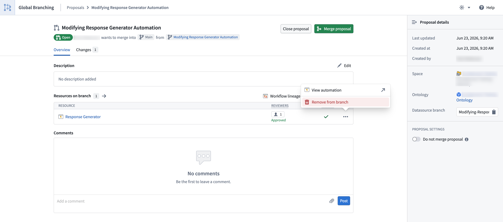

### Modify an automation

To modify an automation on a branch, make any change and save, just as you would on the main branch.

:::callout{theme="warning"}
Modifying the `name` and `description` of an automation on a branch also modifies those values on `main`.
:::

## Supported conditions and effects

Not all Automate [conditions](/docs/foundry/automate/condition-objects/) are currently supported on a branch. When you build an automation on a branch, unsupported conditions are disabled in the condition selector.

The following conditions are **supported** on a branch:

* [**Time**](/docs/foundry/automate/condition-time/): Triggers when a specific time is reached; for example, "Every Monday at 9 AM."
* **[Objects added to set](/docs/foundry/automate/condition-objects/#objects-added-to-set):** Triggers when a new object appears in a predefined object set.
* **[Objects removed from set](/docs/foundry/automate/condition-objects/#objects-removed-from-set):** Triggers when an object leaves a predefined object set.
* **[Objects modified in a set](/docs/foundry/automate/condition-objects/#objects-modified-in-set):** Triggers when an object is modified in a predefined object set.
* **[Run on all objects](/docs/foundry/automate/condition-objects/#run-on-all-objects):** Periodically runs effects on all objects in a given set.

The following conditions are **not currently supported** on a branch:

* **Threshold crossed:** Triggers and remains in the triggering state when a metric threshold is crossed.
* **Automation dependency:** Triggers after another automation completes. See [Known limitations](#known-limitations).
* **Time series:** Triggers when a time series threshold is crossed.
* **Stream** \[Beta]: Triggers on any new records in a [stream](/docs/foundry/automate/streaming/).
* **Metric changed** \[Sunset]: Triggers when an aggregated object set metric increases or decreases.

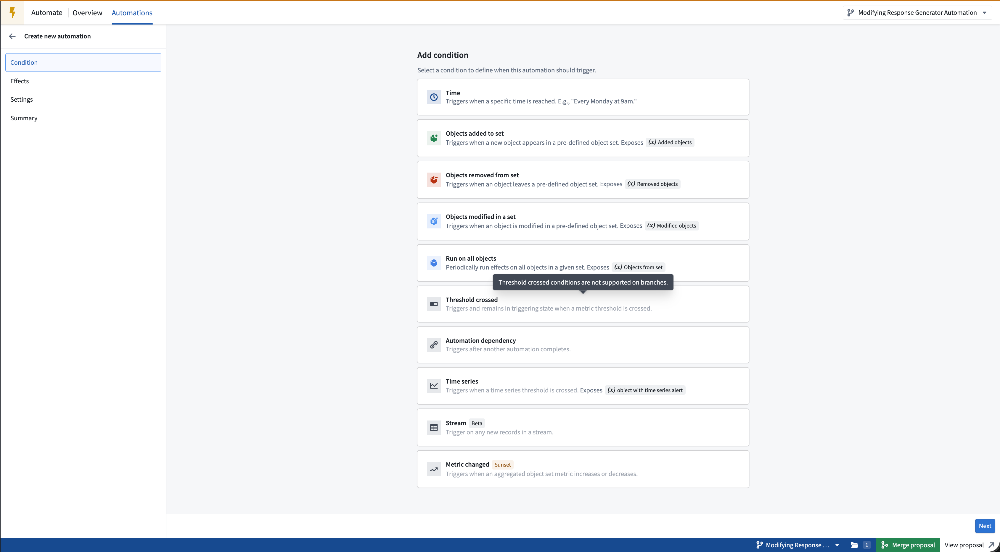

All Automate [effects](/docs/foundry/automate/effects/) are supported on a branch:

* [**Action:**](/docs/foundry/automate/effect-actions/) Executes an action when the condition is met.
* [**Logic:**](/docs/foundry/automate/effect-logic/) Executes an AIP Logic function when the condition is met, then either stages or applies the generated actions.
* **[Function](/docs/foundry/automate/effect-function/) \[Beta]:** Executes a function when the condition is met. These functions cannot perform Ontology edits.
* [**Notification:**](/docs/foundry/automate/effect-notification/) Sends a notification to selected recipients, with optional Notepad attachments.

## Cross-application compatibility

Automations reference resources from across the platform including object types, [actions](/docs/foundry/automate/effect-actions/), [AIP Logic functions](/docs/foundry/automate/effect-logic/), and [Foundry functions](/docs/foundry/automate/effect-function/). On a branch, an automation references the branched state of these resources:

* **Branched object types and action types:** Automations can reference object types and action types that were created or modified on the same branch.
* **Branched function versions:** Automations can reference branched function versions, such as the `Branched pre-release` version of an AIP Logic or Foundry function.
* **Branch-scoped execution:** A branched automation evaluates its conditions and executes its effects on the branch. For the implications of effects running on a branch, see [Managing side effects on branches](/docs/foundry/action-types/branching-action-types/#managing-side-effects-on-branches).

## Merge requirements

Before an automation can be deployed to `main` from a branch, the following checks must succeed:

* **Approvals are satisfied:** All required [approvals](/docs/foundry/approvals/overview/) for the automation must be satisfied before the branch can be merged. See [Reviewer experience](#reviewer-experience) below.
* **Automation is rebased with `main`:** Before merging, if changes have been made on the `main` branch of the automation, rebase those changes on your branch.
* **Automation is in a valid state:** Automations are continuously evaluated for validity on save, so this check usually passes. However, an automation can become invalid if a resource it depends on, such as an object type, action type, or function, is deleted.

### Protected automations

To guarantee that all edits to an automation go through the branching and review process, you can protect
the `main` branch of that automation.

To protect the automation `main` branch, navigate to the resource in the file system and select **Branch protection > Protect with project policy**. You can also do this from the main automation view in the top right using the **View details** option.

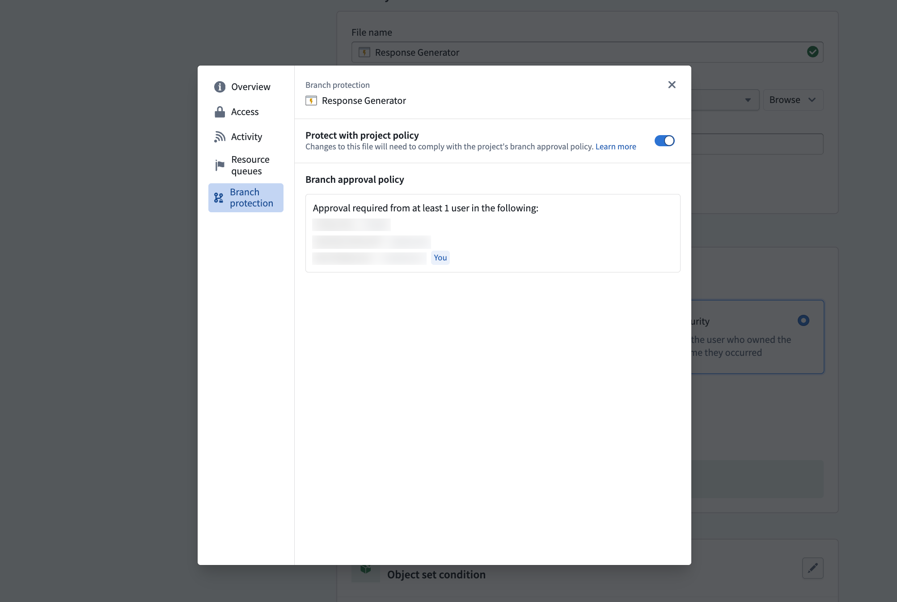

When the `main` branch of an automation is protected, edits to `main` require users to go through a global branch on save.

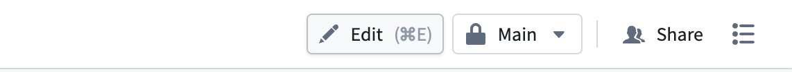

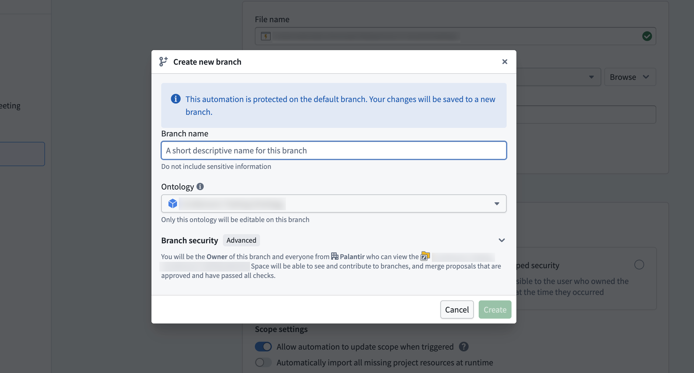

### Reviewer experience

Once a proposal is created, reviewers can be added to the automation in the Global Branching application or via the Approvals banner in Automate. Users added
as reviewers receive an email requesting their review with a link to the proposal.

Select **Manage** to add reviewers and view the approval policies that must be satisfied before the proposal can be merged.

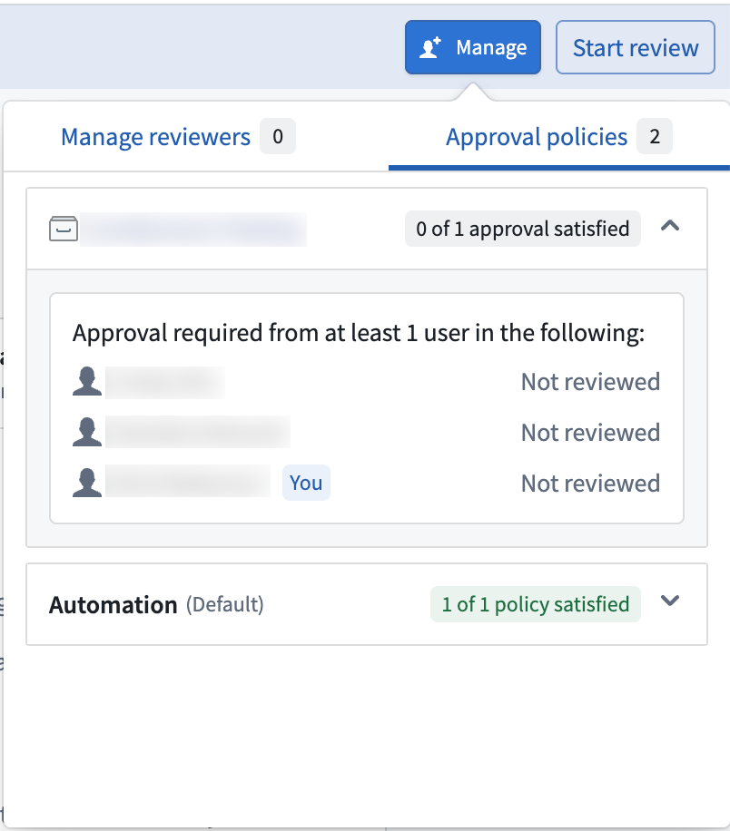

When an automation has changes awaiting review, a banner at the top of the page displays the number of approvals satisfied.

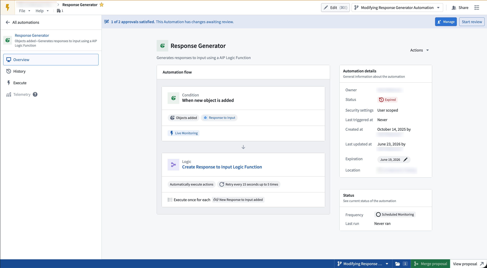

From there, reviewers can open the review dialog by selecting **Start review** to view a side-by-side comparison of `main` vs. the branch changes. They can then **approve** or **reject** the changes by selecting the **Your review** option.

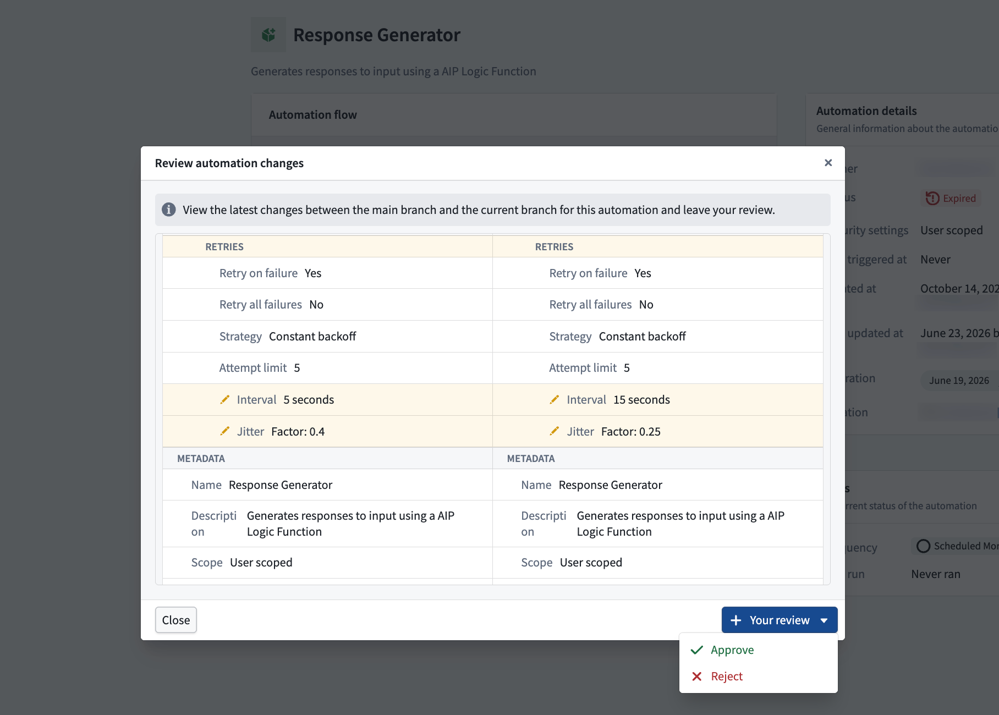

Once all required approvals are satisfied, the changes are approved and the proposal can be merged for this resource.

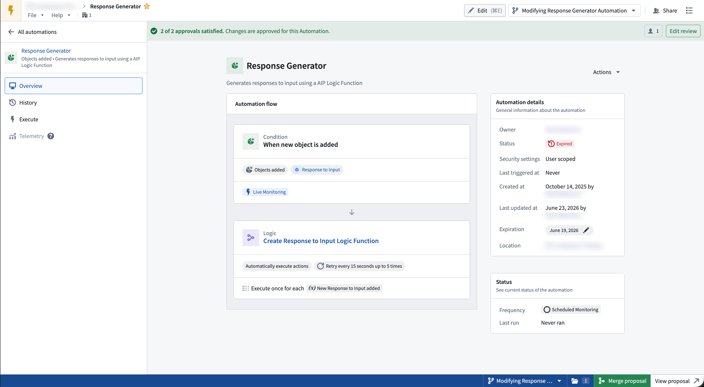

## Rebasing and conflict resolution

Rebasing is required when `main` has been modified since your branch was created or last rebased.

A banner appears at the top of the automation prompting you to rebase your branch with the latest changes.

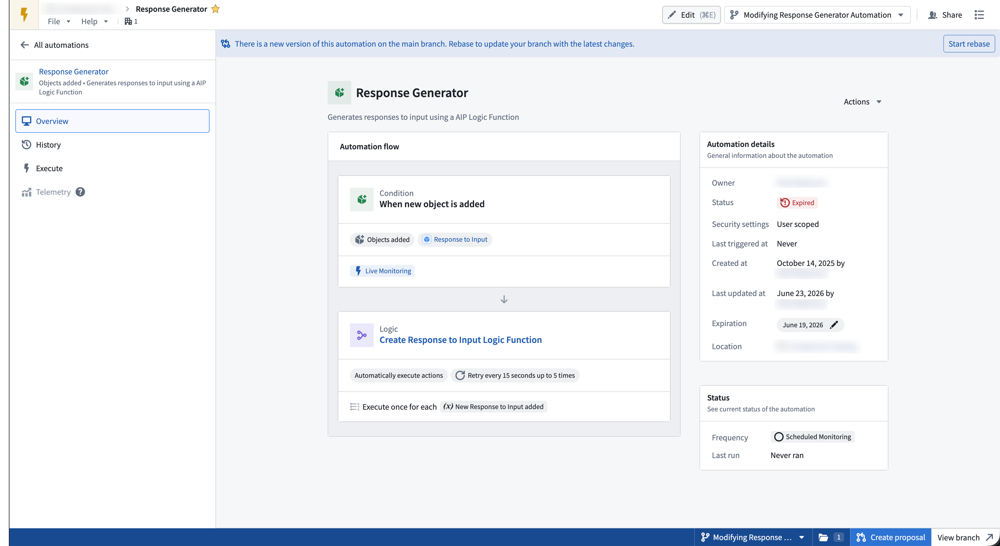

To rebase your branch, select **Start rebase** in the banner. The **Rebase automation** dialog opens, showing a side-by-side comparison of the main branch and current branch versions.
Choose whether to keep the **Main branch** or **Current branch** version, then select **Finish rebase** to apply your selections.

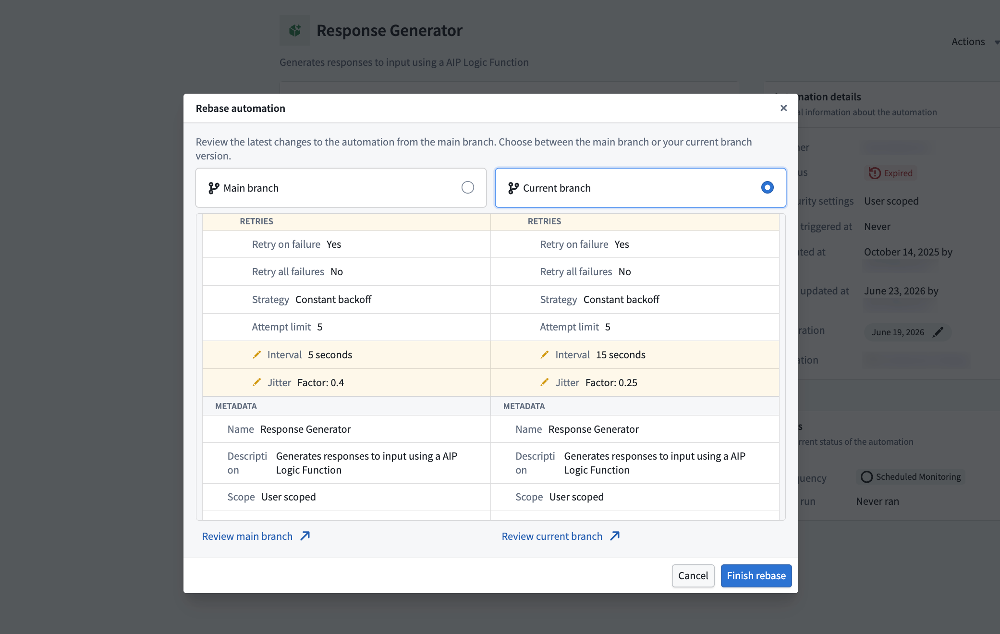

:::callout{theme="neutral"}
If both rebasing and approval are required, the rebase dialog is shown first and must be resolved before reviewers can review the changes.
:::

## Known limitations

* Not all conditions are supported on a branch. See [Supported conditions and effects](#supported-conditions-and-effects) for the full list.
* Rebasing requires you to choose either the changes from `main` or the changes on your branch. There is currently no way to resolve diffs at a finer granularity.
