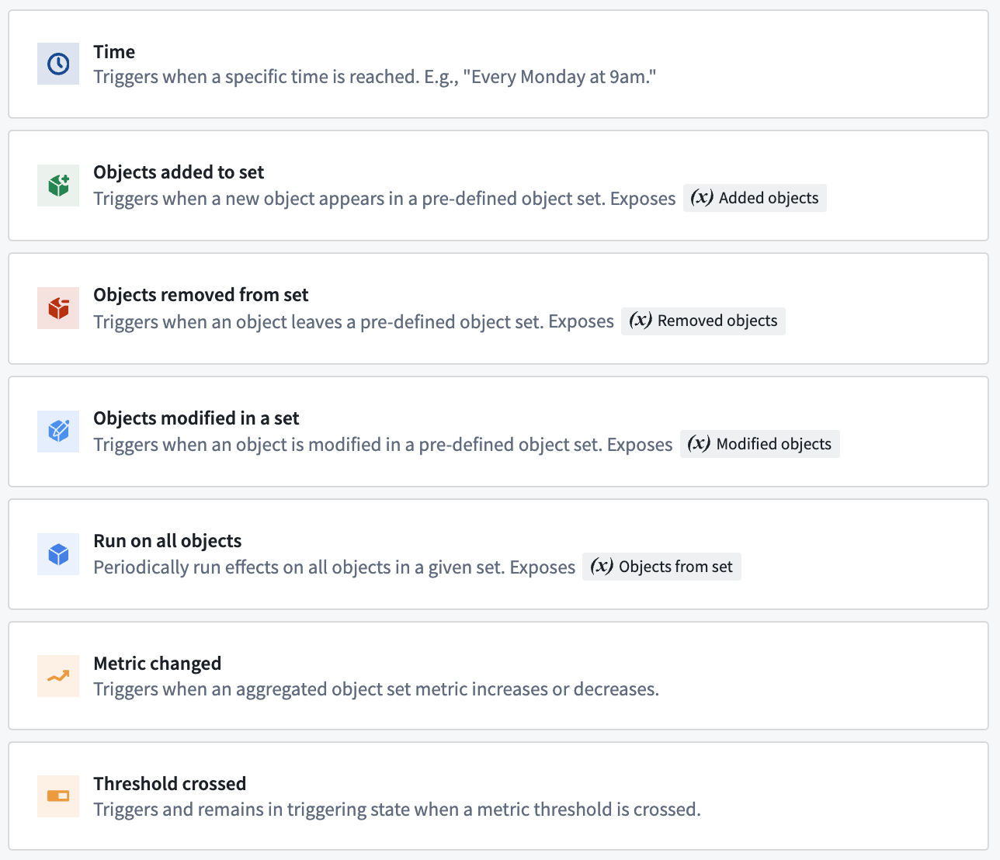
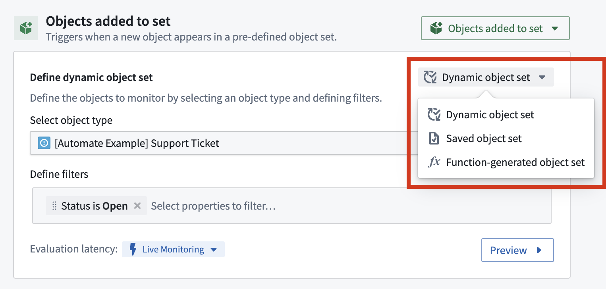
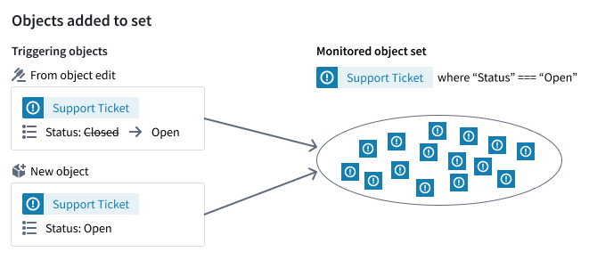
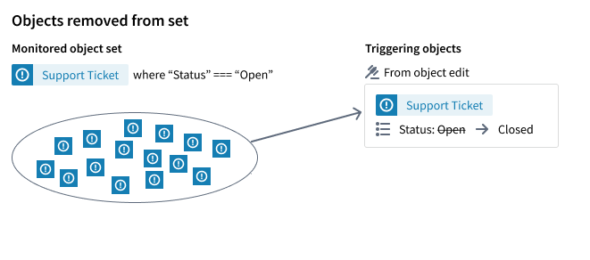
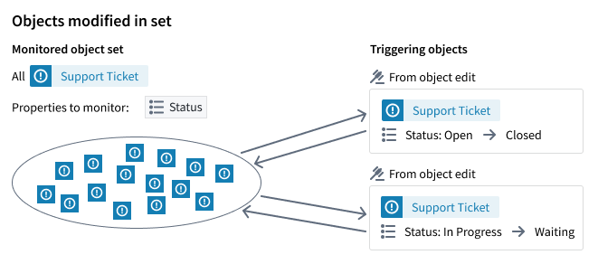
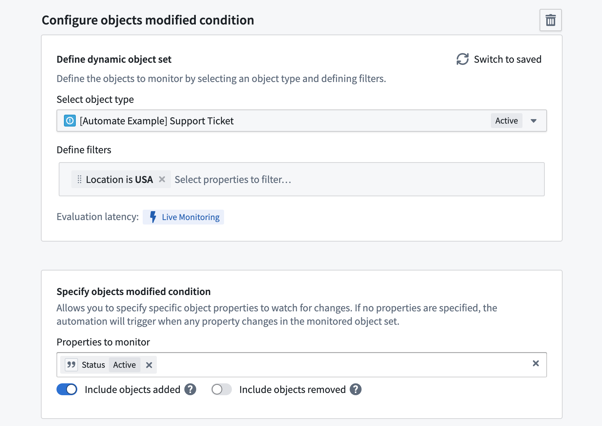
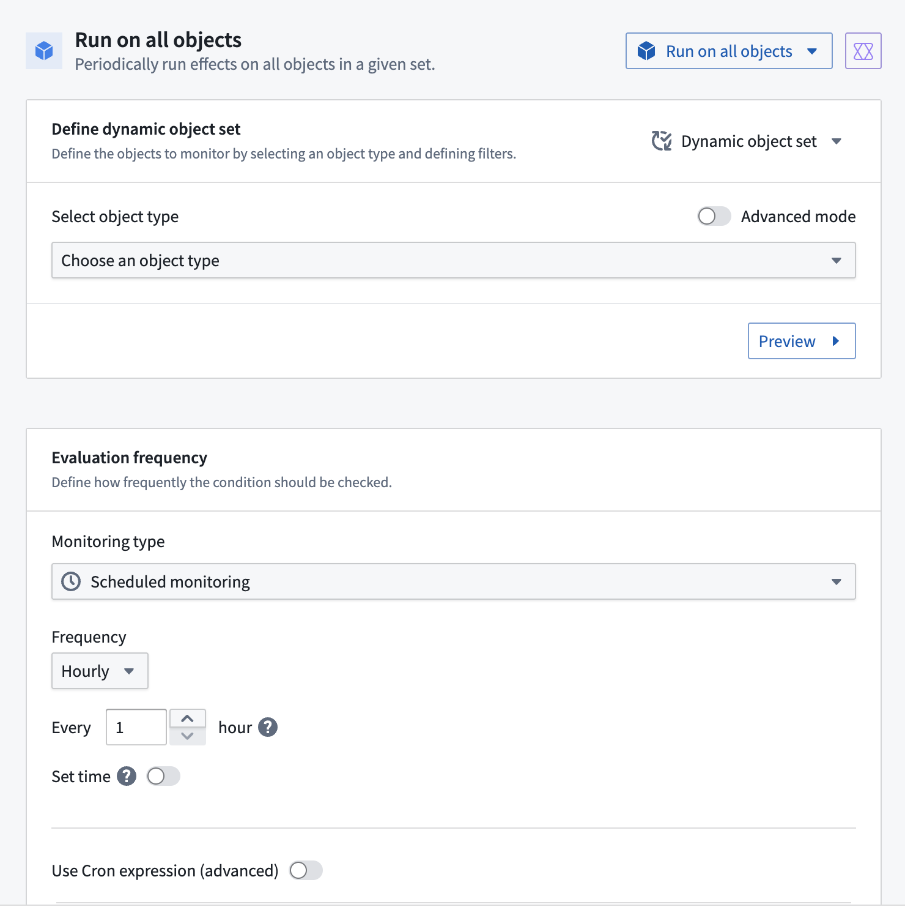
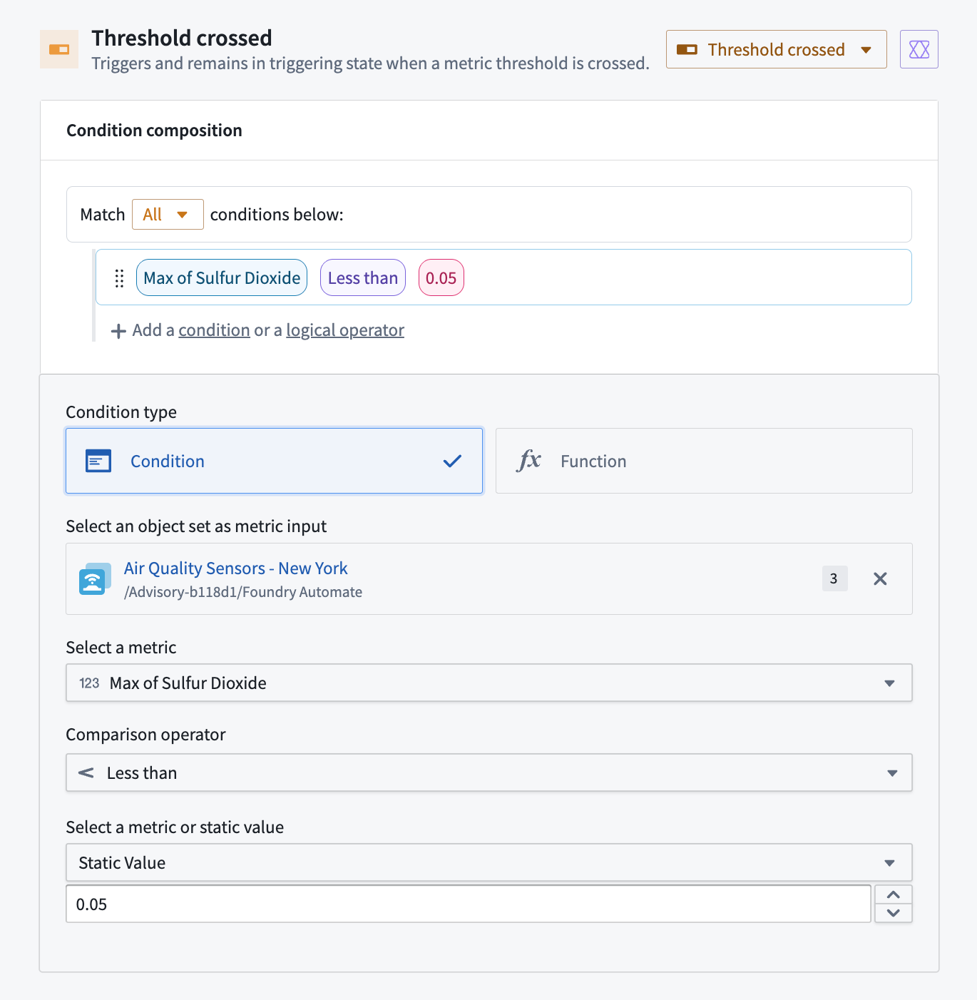
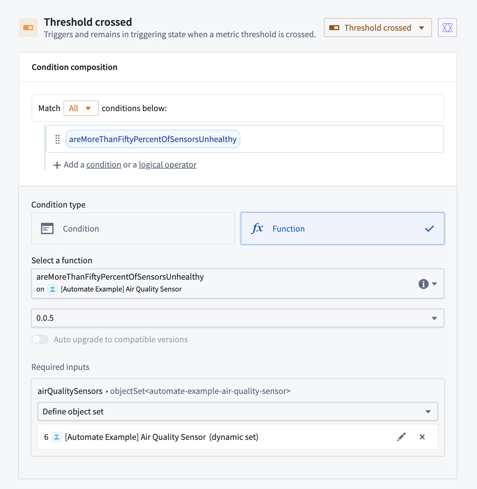
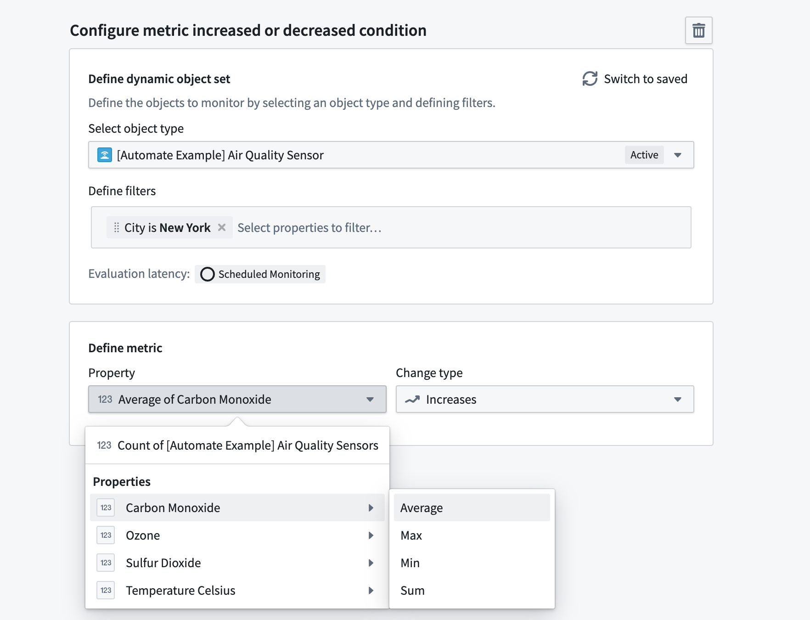

<!-- source: https://palantir.com/docs/foundry/automate/condition-objects/ · mirrored 2026-08-18 from Palantir Foundry docs -->

# Object set conditions

Automation effects can be triggered automatically when object data changes in a predefined object set.

**Data sources:** Changes can come from [backing datasets](/docs/foundry/object-link-types/create-object-type/#add-a-backing-datasource-to-a-new-object-type), [action types](/docs/foundry/action-types/overview/), or [external applications](/docs/foundry/object-link-types/allow-editing/#editing-data-from-external-applications).

**Evaluation frequency:** Data changes are typically picked up within minutes. [Learn more](/docs/foundry/automate/evaluation-frequency/)

**Effect input parameters:** Certain object set conditions expose effect input parameters. These variables can be used inside of effects to access the objects that triggered the automation.

## Available conditions

* **[Objects added to set](/docs/foundry/automate/condition-objects/#objects-added-to-set):** Triggers when a new object appears in the set.
* **[Objects removed from set](/docs/foundry/automate/condition-objects/#objects-removed-from-set):** Triggers when an object leaves the set.
* **[Objects modified in set](/docs/foundry/automate/condition-objects/#objects-modified-in-set):** Triggers when an object is modified in the set.
* **[Run on all objects](/docs/foundry/automate/condition-objects/#run-on-all-objects):** Periodically runs effects on all objects in a given object set.
* **[Threshold crossed](/docs/foundry/automate/condition-objects/#threshold-crossed):** Triggers when a metric threshold is crossed or when a function returns true.
* **[Metric changed](/docs/foundry/automate/condition-objects/#metric-changed-sunset) \[Sunset]:** Triggers when an aggregated metric increases or decreases.



## Object set definition

Most object set condition types require specifying an object set to monitor. You can:

* dynamically define an object set;
* select a saved object set; or
* select a function that returns an object set.
  * Functions are a powerful building block for more advanced usage of Automate.

After defining the object set you want to monitor, select **Preview** to validate that the object set includes the expected objects.

When dynamically defining an object set, select your desired object type, then optionally add filters to narrow the set. For example, you could monitor a `Support Ticket` object type (shown below) filtered to "Status = `Open`". When no filters are selected, you are monitoring all objects of that type. The object type and filter selections determine whether the object set can be monitored live or on a schedule. [Learn more about evaluation frequency](/docs/foundry/automate/evaluation-frequency/).



### Function-generated object sets

The example below uses a function to return support tickets linked to users. Used in an **Objects added** condition, the effects will run whenever a new ticket enters this set. The function must return an `ObjectSet<T>` to be used here.

Note that during evaluation this function is executed once for the system plus once for each subscriber.

```typescript
/**
 * This function returns support tickets that are linked to users
 */
@Function()
public getSupportTicketsLinkedToUsers(): ObjectSet<DemoTicket> {
    return Objects.search()
        .users()
        .searchAroundSupportTickets()
}
```

Learn more about [authoring a function](/docs/foundry/functions/use-functions/) to use with Automate and view the example function in this section.

## Condition types

### Objects added to set

The **Objects added to set** condition triggers every time an object gets added to your predefined object set. Start by specifying your object set according to the [object set definition section](/docs/foundry/automate/condition-objects/#object-set-conditions) above.

If you specified an object set filter, new objects or object edits from other users may trigger your objects added to set condition. In the example shown below, we monitor an object set of `Support Tickets` with status property value `Open`. The condition could be triggered in two ways: a new `Support Ticket` object with status `Open` is created, or an existing `Support Ticket` changes its status to `Open`.

If you do not specify any filters on the object set, you are effectively monitoring all objects of the type. That means the automation will only trigger when completely new objects are added to the Ontology.



The **Objects added to set** condition exposes objects that triggered the condition as an effect input. This can be a single `Added object`, an object set of `Added objects`, or a property of `Added objects`. [Learn more about how to use effect inputs.](/docs/foundry/automate/effect-actions/#use-condition-effect-inputs)

Supported [evaluation frequencies](/docs/foundry/automate/evaluation-frequency/):

* Live evaluation
* Scheduled evaluation

### Objects removed from set

The **Objects removed from set** condition triggers every time an object gets removed from your predefined object set. Start by specifying your object set according to the [object set definition section](/docs/foundry/automate/condition-objects/#object-set-conditions) above.

If you specify an object set filter, object edits from users may trigger your objects to be removed from the set condition. For example, if we monitor an object set of `Support Tickets` with status property value `Open`, then the condition will trigger when the status of an `Open` ticket changes to any other status.

Note that objects which are deleted from the ontology will not trigger.



The **Objects removed from set** condition exposes objects that triggered the condition as an effect input. This can be either a single `Removed object` or an object set of `Removed objects`. [Learn more about how to use effect inputs.](/docs/foundry/automate/effect-actions/#use-condition-effect-inputs)

Supported [evaluation frequencies](/docs/foundry/automate/evaluation-frequency/):

* Live evaluation
* Scheduled evaluation

### Objects modified in set

The **Objects modified in set** condition triggers every time an object gets modified in your predefined object set. Use this condition type to monitor any property value change in an object set. If you only want to monitor changes to a **specific** value, use the [object added to set](/docs/foundry/automate/condition-objects/#objects-added-to-set) condition instead.



Start by specifying your object set according to the [object set definition section](/docs/foundry/automate/condition-objects/#object-set-conditions) above. Then, you can optionally select specific properties to watch. If no properties are selected, any property change in the monitored object set will trigger the automation.

Additionally, you can specify **Include objects added** and **Include objects removed**. These options control whether modifications on objects that are added to (or removed from) the monitored object set will trigger the automation. When both options are disabled, only objects that already were in the object set and remain in the object set after modification will trigger the automation.

The **Objects modified in set** condition exposes as an effect input either a single `Modified object` or a set of `Modified objects` that triggered the condition. [Learn more about effect inputs.](/docs/foundry/automate/effect-actions/#use-condition-effect-inputs)

Supported [evaluation frequency](/docs/foundry/automate/evaluation-frequency/):

* Live evaluation

In the example below, we are monitoring for objects modified in the set of `Support Tickets` with a location of `USA`.

* **Include objects added:** *Enabled.* Objects that are added to the object set are considered modified. Thus, a `Support Ticket` that changed its location from `UK` to `USA` would trigger the automation, as would any newly created tickets with a location of `USA`.
* **Include objects removed: disabled**. Tickets whose status property changes from `Open` to `Closed` while the location changes (for example, from `USA` to `UK`) would not trigger an automation because the objects have left the set.
* Deleted `Support Tickets` will not trigger the automation because they are no longer in the monitored object set.



### Run on all objects

The **Run on all objects** condition can periodically run effects on all objects in a given object set. This condition is configured in combination with a schedule.



When using this condition, affected object parameters can be set up to inject objects into any effects. Batch size and parallelization settings are respected when using this condition. This condition allows you to run an effect over a large set of objects while avoiding function or action timeouts, since batching will be handled.

Supported [evaluation frequency](/docs/foundry/automate/evaluation-frequency/):

* Scheduled evaluation
* Automation-dependent evaluation

### Threshold crossed

The **Threshold crossed** condition triggers when all defined checks return `true`. Effects are triggered and activity is recorded whenever the threshold is crossed in either direction.

You can compose conditions that consist of [Automate-defined logic](#automate-defined-logic), [function-backed logic](#function-backed-logic), or both.

Supported [evaluation frequency](/docs/foundry/automate/evaluation-frequency/):

* Scheduled evaluation

#### Automate-defined logic

To define a threshold condition in the Automation interface, follow the steps below:

1. In the **Condition composition** section, select **Add condition**.
2. Choose **Condition** as the **Condition type**.
3. Specify a [saved object set](/docs/foundry/object-explorer/save-explorations/) to use as the metric input.
4. In the **Select a metric** dropdown menu, choose a property that you want to compare.
5. Select a comparison operator.
6. Choose a metric or static value to compare the property against.

An example threshold crossed condition with logic defined in the Automate interface is shown below. The condition checks when the maximum value across all air quality sensors in New York is less than `0.05`.



#### Function-backed logic

Use **function-backed** logic conditions for complex scenarios not supported by the interface-defined conditions. Function-backed conditions work by defining and publishing a [function](/docs/foundry/functions/overview/) that returns a Boolean value (`true` or `false`). The function is called during evaluation, and events are recorded when the status changes.

Learn more about [authoring a function](/docs/foundry/functions/use-functions/) for Automate.

The example function below computes whether more than 50% of air quality sensors are unhealthy. If the condition is met, the function will return `true`; if the condition is not met, the function will return `false`.



```typescript
/**
 * This function calculates whether more than 50% of the passed air quality sensors are considered unhealthy.
 * A sensor is considered unhealthy when the carbon monoxide value passes `0.05`.
 */
@Function()
public async areMoreThanFiftyPercentOfSensorsUnhealthy (airQualitySensors: ObjectSet<automateExampleAirQualitySensor>): Promise<boolean> {
    const totalSensorCount = await airQualitySensors.count();
    const unhealthySensorCount = await airQualitySensors.filter(sensor => sensor.carbonMonoxide.range().gt(0.05)).count();
    if (totalSensorCount === null) {
        return false;
    }

    return ((unhealthySensorCount ?? 0) / totalSensorCount) > 0.5;
}
```

### Metric changed \[Sunset]

:::callout{theme="warning" title="Sunset"}
The **Metric changed** condition is in the [sunset](/docs/foundry/platform-overview/development-life-cycle/) phase of development and will be deprecated at a future date. Full support remains available, and you are able to edit existing automations with this condition. We recommend using the [Objects modified in set](/docs/foundry/automate/condition-objects/#objects-modified-in-set) condition instead.
:::

The **Metric changed** condition triggers every time an object set metric changes in a predefined object set. Example metrics are the total count of objects in the set, or aggregations like the average of numeric object property values. Start by specifying your object set according to the [object set definition section](/docs/foundry/automate/condition-objects/#object-set-conditions) above.

Select a metric **property** to monitor:

* **Total count** of objects in object set; or
* **Aggregated value** (average, max, min, or sum) of a numeric property across the monitored object set.

From the **Change type** dropdown menu, choose whether the metric **Increases** or **Decreases**. For example (shown below), an automation could trigger whenever the average carbon monoxide value across all air quality sensors in New York increases.



Supported [evaluation frequency](/docs/foundry/automate/evaluation-frequency/):

* Scheduled evaluation
