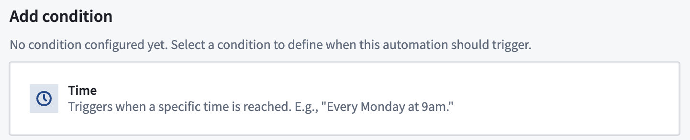
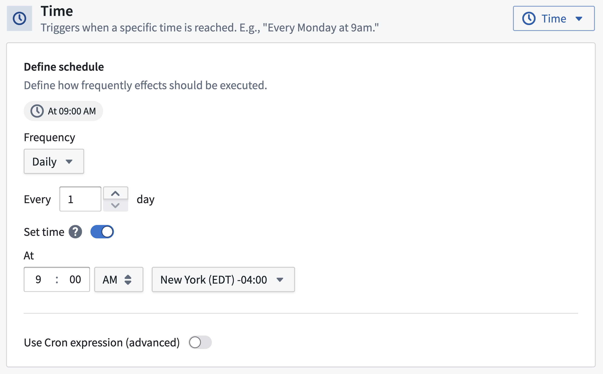
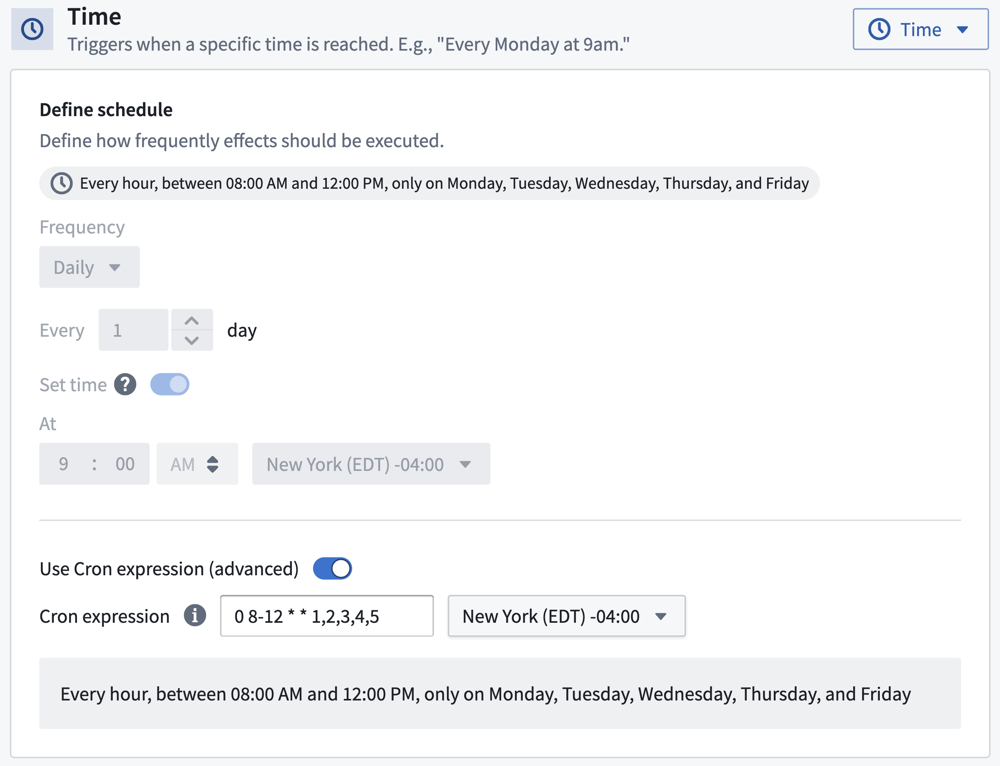

<!-- source: https://palantir.com/docs/foundry/automate/condition-time/ · mirrored 2026-08-14 from Palantir Foundry docs -->

# Time condition

To trigger your automation effects at a specific time or on a schedule, you can use a time condition. Select it by choosing the time condition card.

By default, a daily frequency will be selected.

## Configuration

There are two ways to configure the time condition: in the [user interface](#user-interface) or as a [cron expression](#cron-expression).

### User interface

This is the default option and will be sufficient for most use cases. The interface provides options to set up hourly, daily, weekly, and monthly schedules.

### Cron expression

If the default time condition configuration options are not flexible enough for your use case, you can define a custom cron expression.

Requirements for cron expressions:

* Exactly five fields (space separated): minutes, hours, day of month, month, day of week
  * Note that seconds and years fields are not supported
* A minimum frequency of once per hour
* The minutes field must be a number between 0 and 59, with no special characters
* Supported special characters are `*`, `-`, `/`, `,`, `L`, and `#`
  * Note that `W` is not supported

A natural language preview of your schedule will appear after entering the expression.

For reference, a list of example cron expressions is shown below:

| Cron string | Meaning |
|-----|-----|
| `0 * * * *` | Every hour on the hour |
| `0 0 1 1 *` | At midnight on the first day of every year |
| `15 8,20 * * *` | At 08:15 AM and 08:15 PM |
| `15 8,14 * * 1-5` | At 08:15 AM and 02:15 PM, Monday through Friday |
| `0 9 L * *` | At 09:00 AM, on the last day of each month |
| `0 9 1 3,7,10,12 *` | At 09:00 AM, on the first day of the month, in March, July, October, and December |
| `0 9 * * 1#1` | At 09:00 AM, on the first Monday of the month |
| `0 9 * * 5L` | At 09:00 AM, on the last Friday of the month |
