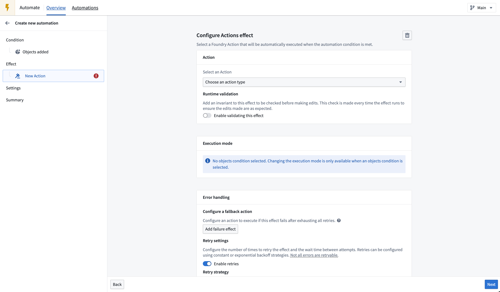
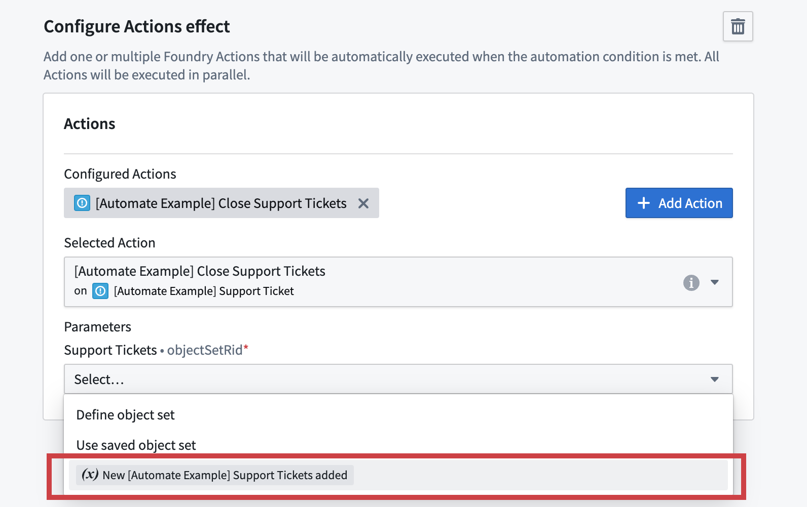
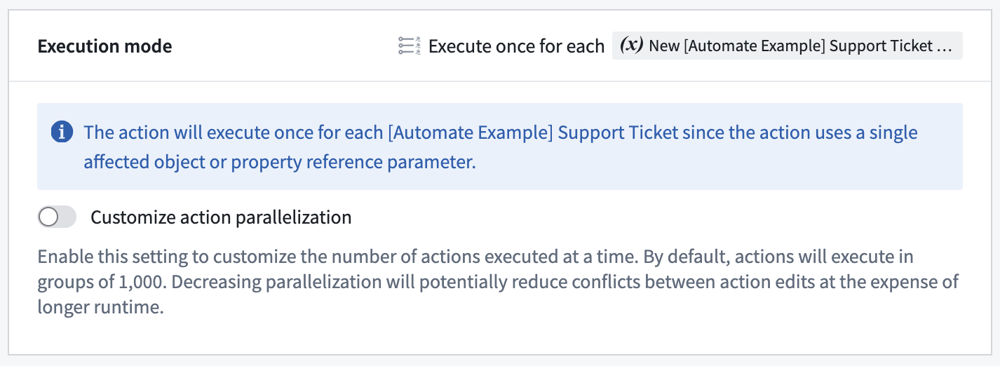
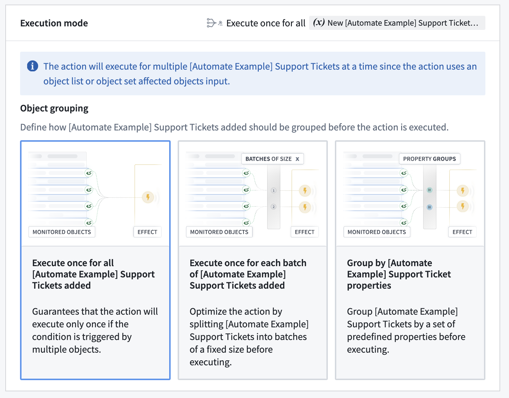
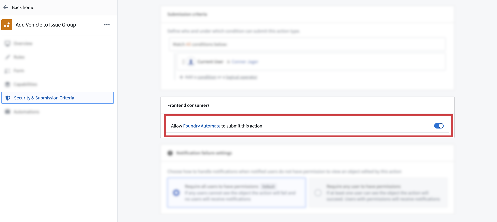

<!-- source: https://palantir.com/docs/foundry/automate/effect-actions/ · mirrored 2026-08-14 from Palantir Foundry docs -->

# Action effects

The action effect allows you to automatically run [actions](/docs/foundry/action-types/overview/) when an automation triggers or recovers.

## Configuration

To set up an action effect, begin by opening the automation configuration wizard. On the **Effects** page, add an action effect; this will take you to the action effect configuration page. One action will already be added by default under **Configured Actions** and will be displayed as `Unconfigured`.

Starting with this unconfigured action, you can begin configuring your action. First, search and select the action that you want to execute. The interface will display the parameters required by the selected action, as shown in the image below. If the parameter type is supported, you can directly provide a value in the interface.

To add more actions, select **Add Action**. This will add another tab allowing you to configure a new action. Note that the execution sequence is not guaranteed when multiple actions are configured; actions may be executed in any order.

### Use condition effect inputs

#### Available inputs

Some object set conditions expose effect inputs. These can be used in the action effect. To use condition effect inputs, the type of the action parameter needs to align with the type of the exposed condition effect input. For example, if the condition monitors the `Alert` object type, the action needs to take an object reference parameter of object type `Alert`.

The following conditions expose effect inputs:

* [Objects added to set](/docs/foundry/automate/condition-objects/#objects-added-to-set)
* [Objects removed from set](/docs/foundry/automate/condition-objects/#objects-removed-from-set)
* [Objects modified in set](/docs/foundry/automate/condition-objects/#objects-modified-in-set)

The following effect inputs can be exposed:

* Object set
* Object list
* Single object
* Property reference

In the example shown below, an objects added to set condition exposes an effect input for an object set of type `Support Ticket` containing the `Support Tickets` added. Given that the selected `Close Support Tickets` action expects an object set parameter of type `Support Ticket`, the condition effect input `New Support Tickets added` is a selectable option.

Note that object set and object list inputs cannot be combined with single object and property reference inputs, since the former includes multiple objects at a time and the latter includes one object at a time.

#### Configure execution mode

When effect inputs are used, an execution mode can be configured to determine how objects and actions should be grouped. The options available depend on whether the effect input is for a one affected object (for example, single object and property reference inputs) or multiple affected objects (such as object set and object list inputs).

The use of single object and property reference inputs means that each action is executed once for each object from the condition. The execution of the actions can be optimized by customizing the parallelization setting which changes the number of actions that are executed at a time.

The use of object set and object list inputs will mean that the action is executed for multiple objects at a time. Changing the execution mode will modify how objects are grouped across action executions. The following options are available for grouping objects:

* **Execute once for all objects:** Ensure that the action is executed once if the condition is triggered by multiple objects at the same time.
* **Execute once for each batch of objects:** Split objects into batches up to the configured batch size, and execute the action once for each batch. The batch size is a maximum, not a minimum: the automation does not wait for additional objects before executing, so a batch may contain fewer objects than the configured size. Use this option to optimize the automation to run with higher scale.
* **Execute once for each group of objects:** Group the objects by a set of object properties from the condition's object type. Use this option if your action accepts an object set, but assumes that all objects in that set are the same for a set of properties. For example, if your action takes a set of `Support Tickets` but expects them to belong to the same `Category`, grouping by the `Category` property will ensure that the action is only executed for one `Category` at a time. Note that the grouping is based on exact matches of property values. For array type properties, the values must be exact, in-order matches to be grouped together.

### Error handling

You can configure multiple ways to handle a failed action, including a retry policy. Available retry policies include:

* **Constant backoff:** Automatically retry with a fixed wait time between events.
* **Exponential backoff:** Wait time increases exponentially between retries.

You can also configure the amount of *jitter*, which is a variation in delay time between retries to prevent simultaneous retries. Jitter can be specified as:

* A factor by which retry delays should be randomly varied. For each retry delay, a randomly selected fraction of the delay is multiplied by the factor and added or subtracted to the delay. For example, given a delay of `100 ms` and a factor of `0.25`, the retry delay would be between `75 ms` and `125 ms`.
* A duration by which retry delays should be randomly varied. For each retry delay, a randomly selected fraction of the duration is added or subtracted to the delay. For example, given a delay of `100 ms` with duration `20 ms`, the retry delay would be between `80ms` and `120ms`.

### Error handling with retries

For information about action effect execution guarantees and how to handle potential duplicate executions, see [execution guarantees](/docs/foundry/automate/effect-settings/#execution-guarantees) in the execution settings documentation.

## Action visibility settings

Not all actions are appropriate to use with Automate. You can disable an action from being usable in Automate once you configure the action type in Ontology Manager. After creating an action type, view its details by selecting the action type from the **Action type** list, then navigate to the **Security & Submission Criteria** tab in the left side panel. Then, find the **Frontend consumers** section and toggle off the switch that allows Automate to submit the action.

## Permissions

Actions are associated with the owner of an automation. This means that the action will be run on behalf of the owner of the automation. That requires that the owner configuring an action must pass the [submission criteria](/docs/foundry/action-types/submission-criteria/) for that action.

:::callout{theme="warning"}
Actions run on behalf of a specific user (the owner of an automation), so an action will no longer run if the associated user account is disabled or deleted.
:::
