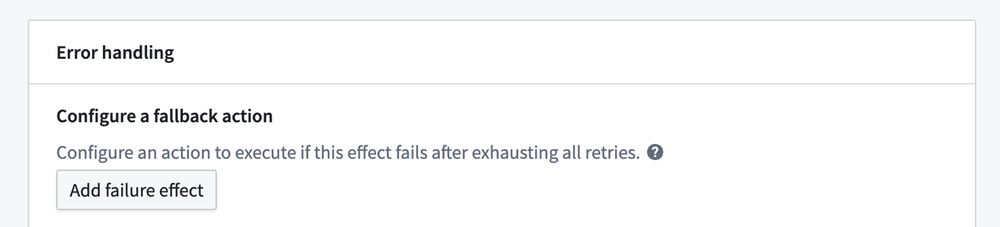
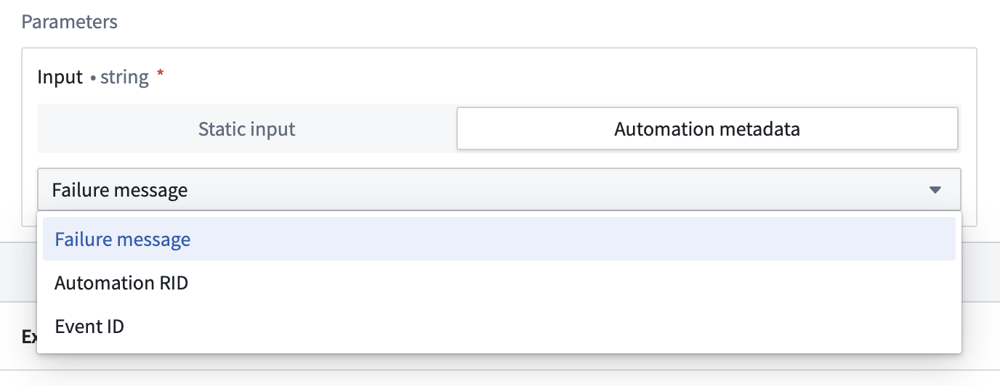

<!-- source: https://palantir.com/docs/foundry/automate/effect-fallback/ · mirrored 2026-08-14 from Palantir Foundry docs -->

# Fallback effect

Fallback effects allow you to execute an alternative action when a primary effect (such as an action, logic, or function effect) fails, providing robust error handling for your automations. With fallback effects, you can implement contingency plans, capture error information, and ensure your workflows remain resilient even when primary actions encounter problems.

## Configuration

To set up a fallback effect, begin by opening the automation configuration wizard. On the **Effects** page, add an action, logic, or function effect; this will take you to the effect configuration page with an **Add failure effect** option.

Selecting **Add failure effect** will create a new Action effect, which you can now configure with parameterized automation metadata as desired.

### Access error information

When a primary effect fails, the fallback effect provides access to valuable error information that you can use in your fallback actions:

* **Error message:** The detailed error message from the failed effect.
* **Automation RID:** The resource identifier of the automation that triggered the fallback.
* **Automation event ID:** The unique identifier for the specific event that caused the failure.

This error information can be used in several ways within your fallback actions:

* Send detailed error notifications to administrators.
* Log errors to a database for later analysis.
* Trigger alternative workflows based on specific error types.
* Create support tickets with rich context about the failure.

### Fallback action

Execute an alternative action when the primary effect fails. This allows you to implement recovery logic or alternative processing paths. Actions have access to:

* The original effect input that was passed to the failed effect
* Complete error information from the failure
* The automation event ID

### Use condition effect inputs

Just like other effects, fallback effects can access the condition effect inputs that triggered the original automation. This means your fallback can work with the same objects and data as the primary effect.

For example, if an **Objects added to set** condition triggered an Action effect that subsequently failed, the fallback effect can access the same set of objects to perform alternative processing.

Note that fallback effects are triggered on a per-object basis, so if a subset of objects to the parent action fail, only that subset will be included in the fallback effect's execution. The rest of the objects will continue on to any [sequential effects](/docs/foundry/automate/effect-settings/#concurrency).

:::callout{theme="note"}
A successful fallback execution does not resume the sequential execution chain. If an effect fails and triggers a fallback, subsequent effects in the sequence will not execute, even if the fallback succeeds. Fallback effects can only be configured for sequential execution and are not available for parallel execution.
:::

## Error handling

The fallback effect itself can be configured with retry policies to ensure successful execution even in challenging conditions. Available retry policies include:

* **Constant backoff:** Automatically retry with a fixed wait time between attempts
* **Exponential backoff:** Wait time increases exponentially between retries

You can also configure jitter settings to prevent simultaneous retries, as with other effects.

## Use cases

### Error reporting and logging

Configure a fallback effect to send detailed error notifications or log errors to a new object type when critical actions fail. This creates an audit trail of failures and ensures administrators are promptly notified. You can also set up an automation to monitor the new failure object type.

### Graceful degradation

When a sophisticated processing action fails (such as an AIP-powered classification), fall back to a simpler alternative action that ensures basic processing continues even if the advanced features are unavailable.

### Multi-stage retry with different parameters

If an action fails with one set of parameters, a fallback effect can try an alternative approach with different parameters or configuration options.

## Permissions

Fallback effects operate with the permissions of the automation owner, just like the primary effects they monitor. This ensures that fallback actions have consistent security context when executing.

:::callout{theme="warning"}
As with all effects, ensure that the automation owner has the necessary permissions to perform the actions configured in the fallback effect. If permissions change after the automation is configured, the fallback may not execute as expected.
:::
