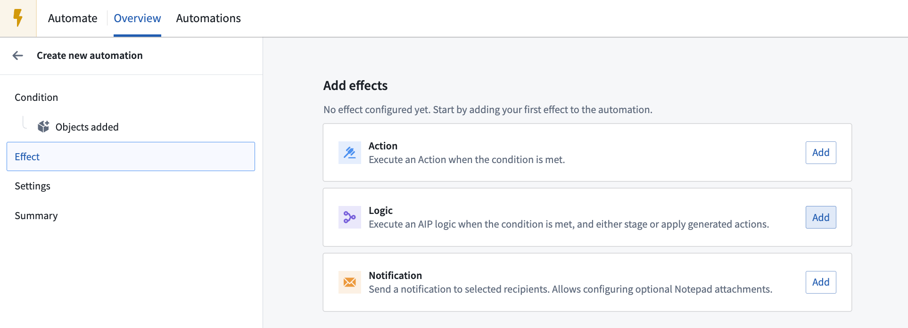
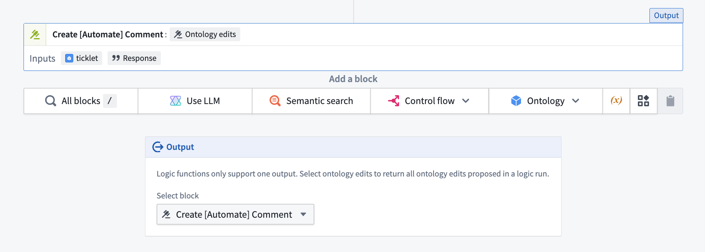

<!-- source: https://palantir.com/docs/foundry/automate/effect-logic/ · mirrored 2026-08-18 from Palantir Foundry docs -->

# Logic effects

Logic effects allow you to automatically run [AIP Logic functions](/docs/foundry/logic/overview/) when an automation triggers or recovers. Logic functions enable AI-powered workflows that can analyze data, make decisions, and propose or automatically execute Ontology edits.

:::callout{theme="warning"}
The Logic effect can only call AIP Logic functions that return a list of Ontology edits as their output. Logic functions with [staged writes](/docs/foundry/logic/staged-writes/) enabled do not return Ontology edits, and must instead be wrapped with an action type and called through an [action effect](/docs/foundry/automate/effect-actions/). AIP Logic provides a **Create action** button to generate the action type from a staged-write Logic function.
:::

## Configuration

To set up a Logic effect, open the automation configuration wizard. On the **Effects** page, add a **Logic** effect; this will take you to the Logic effect configuration page.

Alternatively, you can create an automation directly from your AIP Logic in the **Usage** tab. Learn more about [creating automations from Logic files](/docs/foundry/logic/aip-logic-integration-automate/).

### Logic function

Select a Logic function and specify the version. You can toggle **Auto upgrade to compatible versions**, which will automatically upgrade non-prerelease versions up until the next major version. This allows the automation to use newer compatible Logic function versions as they become available. Note that auto upgrade is not supported with Project scope mode.

The interface will display the parameters required by the selected Logic function. Then, configure the required function inputs.

The Logic function output must return a list of Ontology edits for the automation to execute properly. Logic functions with [staged writes](/docs/foundry/logic/staged-writes/) enabled do not return Ontology edits. These functions appear as disabled in the function selector and cannot be used in a Logic effect. To use such a function in Automate, navigate to the **Usage** tab in AIP Logic and use the **Create action** button to generate an action type, or create an action type backed by the function directly in [Ontology Manager](/docs/foundry/ontology-manager/overview/). Then, configure an [action effect](/docs/foundry/automate/effect-actions/) instead. Alternatively, you can disable staged writes on the function to revert to the legacy behavior.

:::callout{theme="neutral"}
Enabling [staged writes](/docs/foundry/logic/staged-writes/) on a Logic function that returns a list of Ontology edits will publish a new major version, because the output type will change to a different type based on the Logic configuration. Because auto upgrade never crosses a major version boundary, an existing automation will not automatically upgrade to the staged-write version and will continue to run against the legacy version. To migrate an automation to the staged-write version of a Logic function, see [migrate existing automations](/docs/foundry/logic/staged-writes/#migrate-existing-automations).
:::

### Execution mode

Depending on your Logic function configuration, the function will either execute once for *all* objects added or once per *each* object added.

#### Execute once per object

When your Logic function uses a single affected object parameter, the function will execute once for each object that triggered the automation. For example, if the automation is triggered by three `Support Ticket` objects, the Logic function will execute three separate times—once for each `Support Ticket`.

For executions that are once per object, you can choose to customize function parallelization.

#### Customize function parallelization

Enable this setting to customize the number of Logic functions executed at a time. By default, Logic functions will execute in groups of 20. Decreasing parallelization will potentially reduce conflicts between function edits at the expense of longer runtime. Note that this parallelization setting applies only within each individual automation trigger.

### Error handling

You can configure multiple ways to handle a failed Logic function, including a retry strategy. Available retry strategies include:

* **Constant backoff:** Automatically retry with a fixed wait time between attempts.
* **Exponential backoff:** Wait time increases exponentially between retries.

You can also configure the amount of **jitter**, which is a variation in delay time between retries to prevent simultaneous retries.

For information about Logic effect execution guarantees and how to handle potential duplicate executions, review the [execution guarantees](/docs/foundry/automate/effect-settings/#execution-guarantees) section in the execution settings documentation.

You can also configure a [fallback effect](/docs/foundry/automate/effect-fallback/) to handle failures gracefully by executing alternative actions when the primary Logic function fails. For more information about Logic errors, review the [error reference](/docs/foundry/automate/errors/) documentation.

## Permissions

Logic functions are associated with the owner of an automation. This means that the Logic function will be run on behalf of the owner of the automation. The owner of the Logic function configuration must have the necessary permissions to execute that function and perform any resulting Ontology edits.

:::callout{theme="warning"}
Since Logic functions run on behalf of a specific user (the owner of an automation), a Logic function will no longer run if the associated user account is disabled or deleted.
:::
