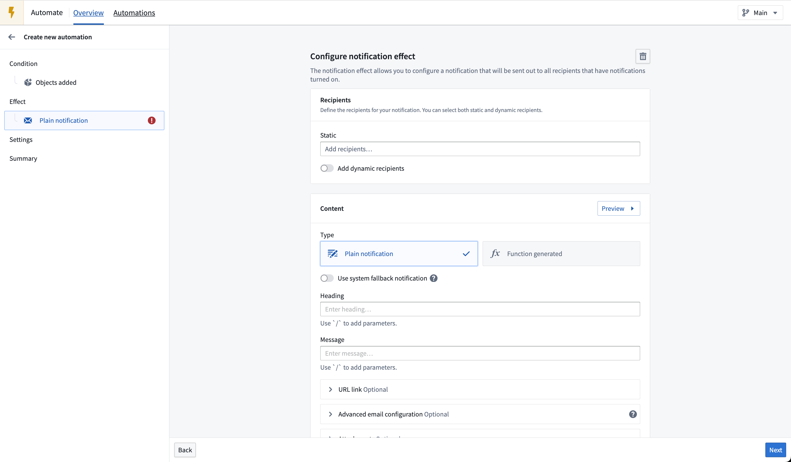
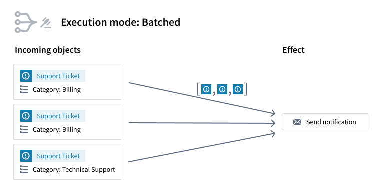
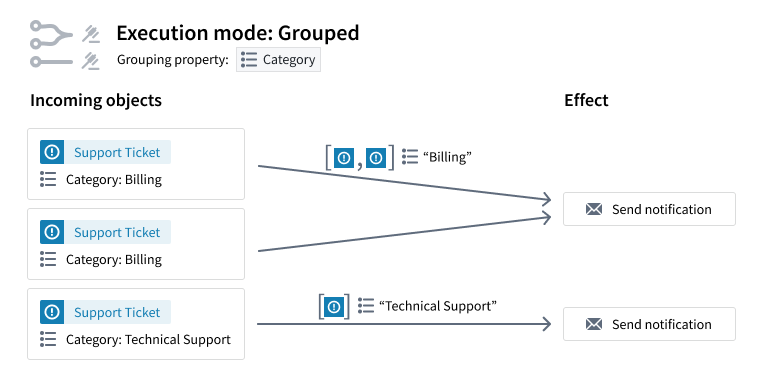
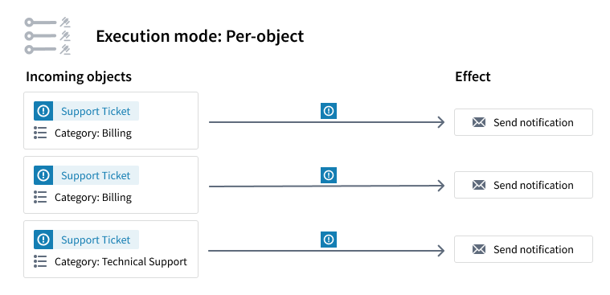
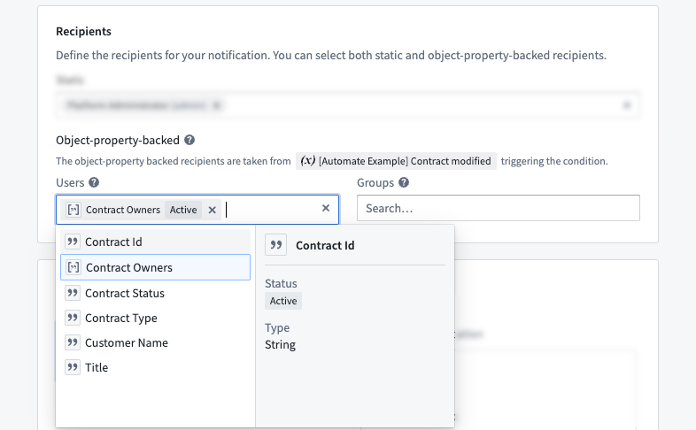
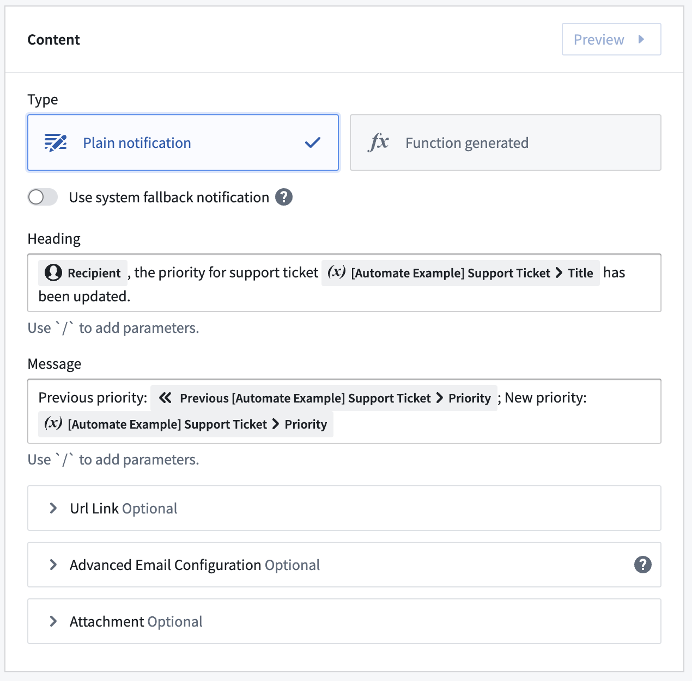
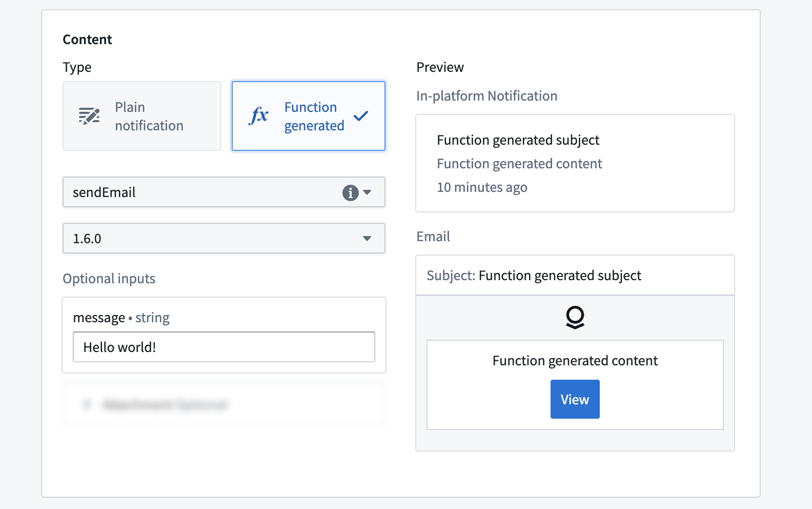
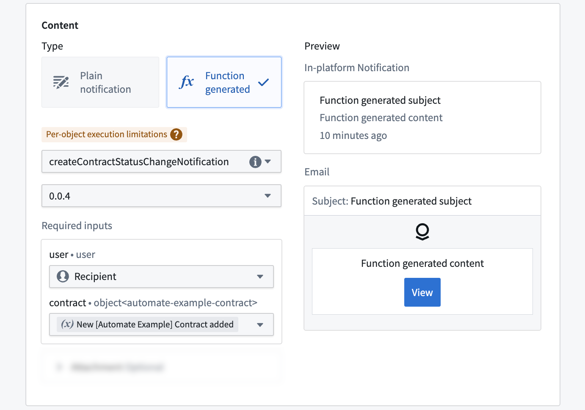
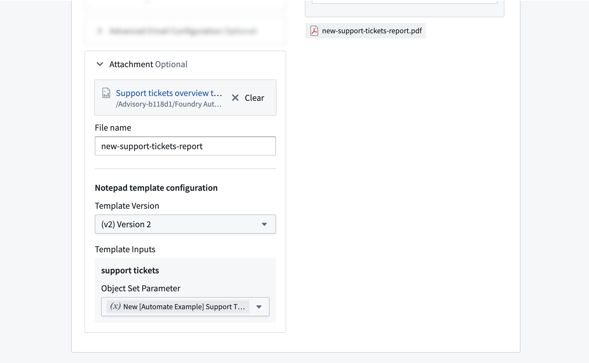

<!-- source: https://palantir.com/docs/foundry/automate/effect-notification/ · mirrored 2026-08-14 from Palantir Foundry docs -->

# Notification effect

The Automate application allows you to automatically send out notifications to other platform users when a condition is met.

Notifications can be sent in two ways: directly in the platform and as email. The content can be statically defined or dynamically determined via a function. Notifications can also include PDF or inline attachments. This page contains information about options for notification [recipients](#recipients), [content](#content), and [attachments](#attachments).

## Object grouping

When a condition that exposes affected objects is used, an object grouping can be selected to define how these objects should be grouped before notifications are sent.

Conditions that expose affected objects are:

* [Objects added to set](/docs/foundry/automate/condition-objects/#objects-added-to-set)
* [Objects removed from set](/docs/foundry/automate/condition-objects/#objects-removed-from-set)
* [Objects modified in set](/docs/foundry/automate/condition-objects/#objects-modified-in-set)

### Execute once for all objects

When multiple objects trigger the condition at the same time, only one notification will be sent to each recipient.

In the example shown in the screenshot below, three different `Support Ticket` objects trigger the automation and one notification is sent. Function-backed notifications have access to an object set with all three objects.

### Execute once for each group of objects

When multiple objects trigger the condition at the same time, objects will be grouped by a set of selected properties. One notification will be sent for each group to each recipient.

Note that the grouping is based on exact matches of property values. For array type properties, the values must be exact, in-order matches to be grouped together.

In the example shown below, three different `Support Ticket` objects simultaneously trigger the automation. Two objects belong to the category *Billing* and one belongs to *Technical Support*.

* Since *Category* was selected as the grouping property, there will be two notifications: one for the *Billing* group and one for the *Technical Support* group.
* For the first notification, function-backed notifications will have access to an object set containing both *Billing* Support Ticket objects.
* For the second notification, function-backed notifications will have access to an object set containing the *Technical Support* object.

### Execute once for each object

When multiple objects trigger the condition at the same time, one notification will be sent for each object.

For example, if three `Support ticket` objects trigger the automation, a separate notification will be sent for each `Support ticket`. Function-backed notifications will have access to the individual object as well as its property values.

## Recipients

When configuring a notification, you must first define who should receive the notification. Recipients can be Foundry users or groups, defined either in a [static recipient list](#static-recipient-list) or [dynamically via object properties](#dynamic-recipient-definition-via-object-properties).

To be eligible to receive notifications from an automation, recipients must have the following permissions:

* At least **Viewer** permission on the automation. This is required for both static and dynamic recipients.
* **Viewer** permission on the object instances that trigger the automation.
* **Viewer** permission on all the properties of the object instances if the triggering object type is a [multi-datasource object type](/docs/foundry/object-permissioning/multi-datasource-objects/).
* **Viewer** permission on all the object instances accessed by the function execution in a function-backed notification.

The above requirements apply for both active and pre-registered users.

:::callout{theme="warning"}
Manual executions of the automation bypass the trigger conditions. As a result, permissions on the trigger objects are not checked during manual runs.
:::

### Static recipient list

The first option for defining the recipients of a notification is to provide these recipients as a static list under **Static**. To define the list, click into the associated text field and select the desired users or groups to be recipients.

### Dynamic recipient definition via object properties

The second option is to define notification recipients dynamically through object properties from affected objects. This configuration option requires an object set condition that exposes effect inputs.

The dynamic recipient definition allows you to specify object properties that contain [user IDs](/docs/foundry/platform-security-management/manage-users/) or [group IDs](/docs/foundry/platform-security-management/manage-groups/) to determine the notification recipients at runtime. Therefore, object property types must be either `String` or `Array of String`.

In the example shown below, we define an object modified condition on the `Contract` object type. Then, we can use the `Contract Owners` property, which contains an array of user IDs, to define the set of notification recipients.

## Content

There are two ways to define the content of a notification: as a [plain notification](#plain-notification) or as a [function-generated notification](#function-generated-notification).

:::callout{theme="neutral"}
Notifications will be rendered for each individual recipient. Thus, the resulting content may differ for each user.
:::

### Plain notification

Plain notifications offer interface components to directly specify the notification content. You must provide a **Heading** and **Message**. Optionally, you can also modify the **URL Link**. By default, the URL link is a link to the in-platform notification that is only shown in the email.

You can also use the **Advanced email configuration** to configure different values for the email. By default, the **Heading**, **Message**, and **URL link** values that you provided above for the in-platform notification are used. HTML can also be used in the advanced email configuration if desired.

When adding content, you can use the `/` key to open a menu that allows you to treat the notification as a template, with values such as the name of the recipient substituted in when the notification is sent. If an object set is being monitored and **Per-object execution** is selected, the current and previous values of an associated object property are also an option as template values. Note that previous property values are only available if live monitoring is used.

All changes you make will be live-previewed to the right of the configuration components.

Finally, you can define an [attachment](/docs/foundry/automate/effect-notification/#attachments) for the notification.

### Function-generated notification

As an alternative to using plain notifications, you can back your notification with a function that dynamically generates the notification content. This should only be used for notification needs that cannot be met by plain notifications.

To create your custom notification function, follow the instructions in the [functions documentation](/docs/foundry/functions/configure-notifications/). The function must return either `Notification` or `Notification | undefined`. When `undefined` is returned, Automate will skip the notification. This can be used in the function logic to conditionally decide whether to send a notification.

After you have written and published your notification function, you can use it in the notification effect. Start by selecting your function and version. Afterward, the interface will update to expose the required inputs depending on the function definition.

#### Use condition effect inputs and recipient

Depending on the type of the input parameter, you may be able to use special effect inputs instead of just providing static values. Supported effect inputs include:

* **Recipient:** Can be used for `User` type function inputs and passes the recipient that the notification is rendered for into the function.
* **Condition effect input:** When the condition exposes effect inputs, you can use those effect inputs here. The type of the function parameter must align with the type of the exposed effect input. The type exposed by the condition depends on the condition type and execution mode.

The example below shows how the `Recipient` input and the `Contract modified` condition effect input are used to create a custom notification tailored to the recipient and the respective object that triggered the automation.

## Attachments

You can configure your notification effect to include attachments generated from [Notepad documents](/docs/foundry/notepad/getting-started/#create-a-notepad-document), [Notepad template documents](/docs/foundry/notepad/templates-create/), or [Contour dashboards](/docs/foundry/contour/dashboards-overview/) in the notification email. The attachment will be generated automatically during runtime for each recipient.

Choose **+ Select** in the attachment section and pick a Notepad document, Notepad template, or Contour dashboard. Then, specify the **File name** for your attachment. Depending on the selected resource type, you may have to provide more values as described in the following section.

You can also configure the following options for each attachment:

* **Render Inline:** Enable this toggle to embed the rendered document directly in the email body as an image rather than sending it as a separate PDF attachment.
* **Attachment rendering locale:** Select the locale used to render the attachment. This may change how dates, numbers, and text appear when rendering Contour and Notepad files.

### Notepad template

Notepad templates can be used to dynamically generate and export a Notepad document as PDF when the notification effect is executed. This is done via Notepad template inputs. Notepad template inputs can be used to pass values into the Notepad document during the generation step. Learn more about the capabilities of Notepad templates in the [templates documentation](/docs/foundry/notepad/templates-overview/).

After selecting a Notepad template and a **Template version**, the required **Template Inputs** will be shown. The Automate application supports passing static values and **condition effect inputs** to a Notepad template input. If the template exposes an object or object set template input and the condition exposes a condition effect input of the same type, you can pass the condition effect input into the template.

:::callout{theme="neutral"}
Notepad templates do not expose object type information for object or object set template inputs. You must personally ensure that the types of the provided object values match.
:::

The image below shows an example where a Notepad template `Support tickets overview` is attached to a notification effect. The template input `support tickets` is connected to the `New Support Tickets` condition input that is exposed by an `Object added to set` condition. Therefore, whenever the condition triggers, the objects that triggered the condition will be used to generate a PDF of the document from the template.

