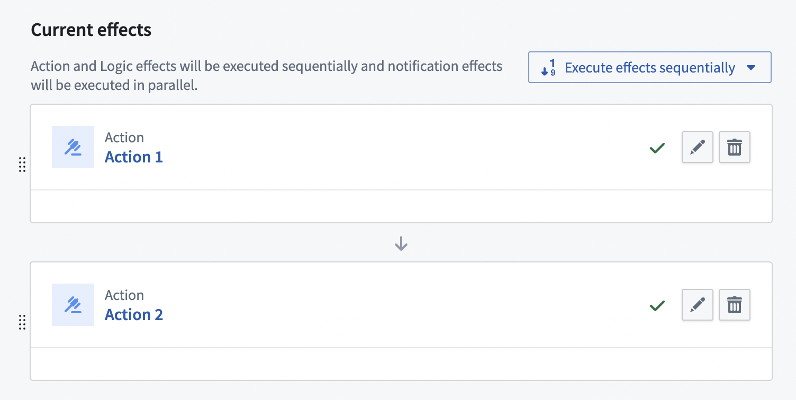
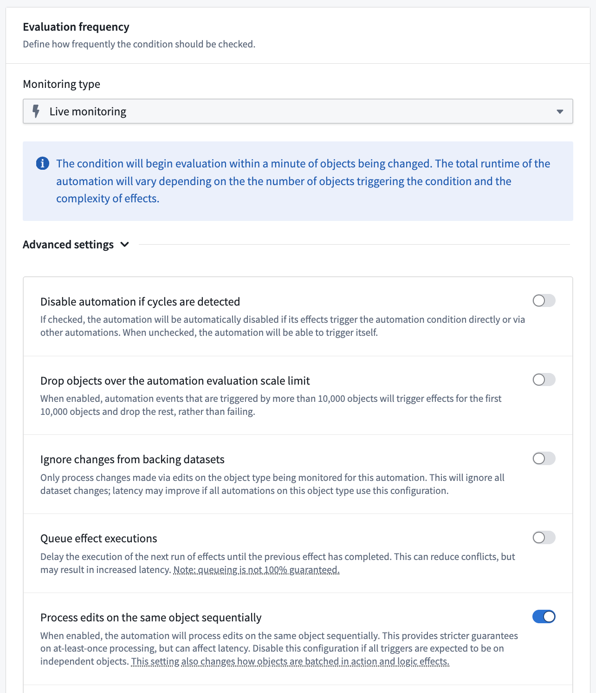

<!-- source: https://palantir.com/docs/foundry/automate/effect-settings/ · mirrored 2026-08-18 from Palantir Foundry docs -->

# Effect settings

This page contains information about effect settings, which can be accessed from the **Effect** page when configuring an automation.

## Concurrency

Automations run independently. If multiple automations trigger at the same time, the automations will execute in parallel in a nondeterministic order. Effects for a single automation, however, can be configured to execute sequentially or in parallel.

:::callout{theme="warning"}
Action, logic, and function effects can be ordered sequentially. You must have at least two of these types of effects to enable sequential execution. Otherwise, effects execute in parallel.
:::

In the example above, the effects are set to execute sequentially, so "Action 1" will be executed before "Action 2". Sequential execution settings apply regardless of partitioning configuration. For example, if 40 objects trigger the automation and the partition size is 20, there will be four sequential executions:

1. First set of 20 objects trigger Action 1.
2. Second set of 20 objects trigger Action 1.
3. First set of 20 objects trigger Action 2.
4. Second set of 20 objects trigger Action 2.

However, if parallel execution was configured, the automation would result in four executions (two sets of two in parallel):

1. First set of 20 objects trigger Action 1 and Action 2 in parallel.
2. Second set of 20 objects trigger Action 1 and Action 2 in parallel.

### Failure behavior

In sequential execution, if an effect fails, subsequent effects in the sequence will not execute. This applies even if a [fallback effect](/docs/foundry/automate/effect-fallback/) is configured and executes successfully. A successful fallback action handles the failure of that specific effect but does not allow the sequence to continue.

This failure behavior applies on a per-object basis. If one object fails and another succeeds, the successful object will continue through subsequent effects while the failed object stops at the fallback.

In parallel execution, effects execute independently and one effect's failure does not impact other effects.

## Object edits

When an automation is triggered by object edits rather than datasource updates, you can configure how the automation handles multiple edits to the same object within a short time period.

The automation processes rapid successive edits differently based on evaluation frequency:

* **[Live monitoring](/docs/foundry/automate/evaluation-frequency/#live-monitoring):** Each batch of concurrent edits triggers the automation separately. The automation's concurrency settings are respected within each batch.
  * To disable this behavior and instead use scheduled execution behavior, toggle off **Process edits on the same object sequentially** under the **Advanced settings** section of the **Evaluation frequency** configuration in the automation **Condition** tab.
* **[Scheduled monitoring](/docs/foundry/automate/evaluation-frequency/#scheduled-monitoring):** All edits since the last evaluation are combined into a single trigger.

## Execution guarantees

Effects follow *at-least-once* execution semantics rather than *exactly-once* guarantees. In rare cases, the same effect may execute multiple times for the same trigger event. When designing actions and functions that will be used with Automate, ensure that your actions and functions can handle potential reruns gracefully.

Strategies for handling duplicate executions:

* **Implement *idempotent* operations,** meaning operations that produce the same result regardless of how many times they execute. For example, creating a resource with a consistent ID will only create the resource once, even if the creation code runs multiple times.
* **Use conditional checks** to verify if an operation has already been performed before proceeding.
* **Design for duplicates.** Structure data models to handle duplicate submissions appropriately.

Automate attempts to minimize duplicate executions but cannot completely remove them due to the distributed nature of the system and the retry mechanisms for handling transient failures. Consider this behavior when designing automation workflows, particularly for critical operations.
