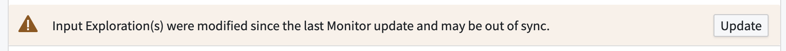
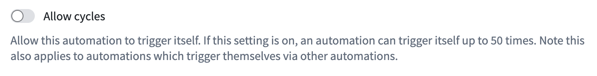

<!-- source: https://palantir.com/docs/foundry/automate/errors/ · mirrored 2026-08-14 from Palantir Foundry docs -->

# Evaluation and effect errors

This page describes some common error categories that may be encountered when using Automate.

## Evaluation errors

An automation may fail to evaluate due to problems with the underlying data. Automations are automatically [retried](/docs/foundry/automate/retries/), but some errors may require manual intervention. For example, if the object type being monitored is deleted, automations using that type will fail to evaluate.

### Automation out of sync

Automations may use a reference to a [saved exploration](/docs/foundry/object-explorer/save-explorations/) to define the input. This reference is not dynamic, but instead is stored according to the exploration as it exists when the automation is saved. If the exploration changes, the automation will continue to evaluate using the exploration's old state unless the automation is updated. In this case, a warning banner is displayed on the automation:

### Permissions

Automation evaluation uses the permissions of the owner or recipients. This ensures that condition evaluation and any subsequent effects always reflect data that the user has access to at the time the automation is evaluated. If a user lacks permission to view object types, saved explorations, or the automation, they may see a permission-related error message instead of successful evaluation.

We strongly recommend storing automations and their related resources in shared [Projects](/docs/foundry/security/projects-and-roles/). Learn more about automation [scope and log visibility](/docs/foundry/automate/history-visibility-and-scope/).

## Effect failures and fallback effects

To handle effect failures gracefully, you can configure a [fallback effect](/docs/foundry/automate/effect-fallback/) for action and Logic effects. Fallback effects execute when the primary effect fails, allowing you to send notifications, log failures, or trigger alternative workflows.

### Action effect errors

After a successful condition evaluation, action effects may fail to execute. This failure could happen for a variety of reasons, including the following:

* Changes to the action logic make it incompatible with the saved input configuration on the automation.
* The [submission criteria](/docs/foundry/action-types/submission-criteria/) for the action are not met.
* The function backing the action has a runtime execution failure.

If an action effect fails, the history timeline will indicate that one or more actions failed to execute for that event, along with relevant error details.

Note that when per-object execution is enabled, the object identifier surfaced in the error details as the cause of the error represents the object associated with the first request that caused the failure; there may be more hidden failures that are not propagated.

### Cycle detection

Consider a set of automations defined as follows:

* **Automation A:** Monitors an object set of all red cars. When a new red car is added to the ontology, an action triggers to change the car color to blue.
* **Automation B:** Monitors an object set of all blue cars. When a new blue car is added to the ontology, an action triggers to change the car color to red.

Such a sequence of automations would cause an infinite loop, or **cycle**. A framework has been implemented to automatically detect and disable live automations that cause cycles.

For certain automations, cycle detection may be undesirable. Cycles can be allowed by overriding the configuration in the **Settings** tab of an automation.

### Notification effect errors

After a successful condition evaluation, notifications may fail to send. If this occurs, the history event will show a tag indicating that notifications were not sent to subscribers. Additional details will include an error identifier, the error message, and the object or objects that triggered the failure.
