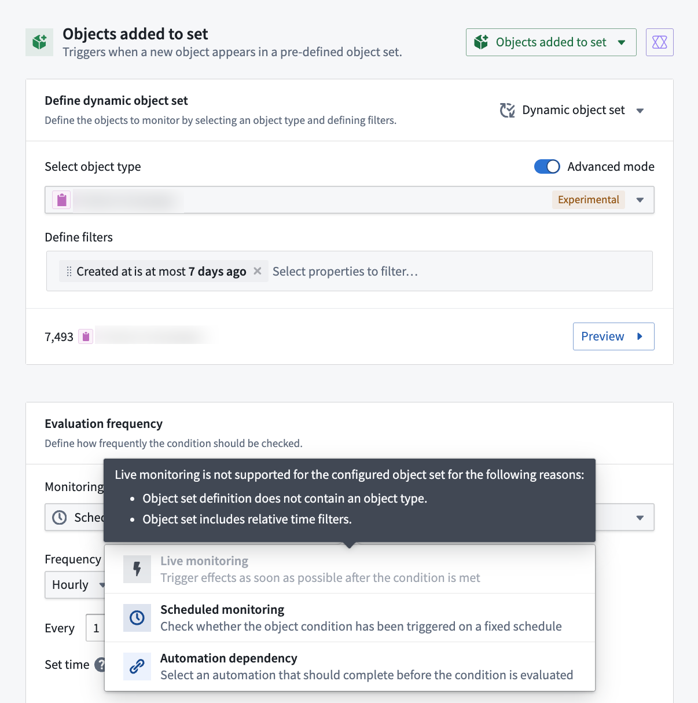
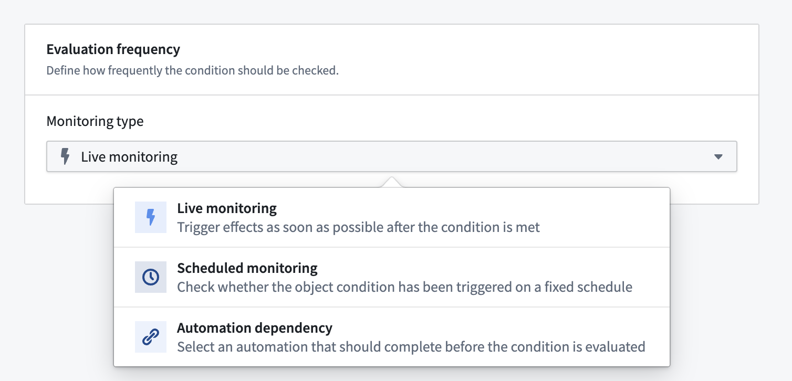
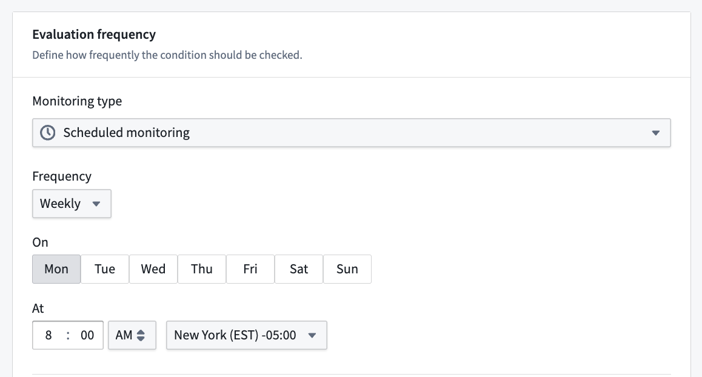

<!-- source: https://palantir.com/docs/foundry/automate/evaluation-frequency/ · mirrored 2026-08-18 from Palantir Foundry docs -->

# Evaluation frequency

Automate offers three evaluation frequency modes for [object set conditions](/docs/foundry/automate/condition-objects/): [live monitoring](#live-monitoring), [scheduled monitoring](#scheduled-monitoring), and [automation-dependent](#automation-dependent).

## Evaluation frequency support

The following table summarizes the condition types that support each evaluation frequency mode:

| Condition type | Live monitoring | Scheduled monitoring | Automation-dependent |
|----------------|-----------------|----------------------|----------------------|
| [Time condition](/docs/foundry/automate/condition-time/) | - | ✓ | - |
| [Objects added to set](/docs/foundry/automate/condition-objects/#objects-added-to-set) | ✓ [1](#streaming-live-monitoring) | ✓ | ✓ |
| [Objects removed from set](/docs/foundry/automate/condition-objects/#objects-removed-from-set) | ✓ [1](#streaming-live-monitoring) | ✓ | ✓ |
| [Objects modified in set](/docs/foundry/automate/condition-objects/#objects-modified-in-set) | ✓ | – | – |
| [Run on all objects](/docs/foundry/automate/condition-objects/#run-on-all-objects) | – | ✓ | ✓ |
| [Metric changed](/docs/foundry/automate/condition-objects/#metric-changed-sunset) | – | ✓ | – |
| [Threshold crossed](/docs/foundry/automate/condition-objects/#threshold-crossed) | – | ✓ | – |

 **1** Only supported for batch pipelines. Streaming pipelines are not supported.

## Live monitoring

Live monitoring runs evaluations within minutes of an object change appearing in the Ontology. [Ontology indexing](/docs/foundry/object-indexing/overview/) must complete before Automate detects the change. Latency expectations differ by type of change: patches (user edits) are smaller and process faster, while base versions (backing dataset changes) are larger and take longer to process.

[Review the table above](#evaluation-frequency-support) to understand the object set conditions that support live monitoring.

Automate live monitoring supports [funnel batch pipelines](/docs/foundry/object-indexing/funnel-batch-pipelines/), and has partial support for [funnel streaming pipelines](/docs/foundry/object-indexing/funnel-streaming-pipelines/). For example, stream-backed object types cannot be used for `Objects added to set` or `Objects removed from set` condition types.

**Requirements:**

* Object type must use [Object Storage v2](/docs/foundry/object-backend/overview/#object-databases).

:::callout{theme="neutral"}
After migrating an object type from Object Storage v1 to v2, re-save automations to enable live monitoring.
:::

**Unsupported object set features:**

* Relative time conditions
* More than one object type
* Joined object sets
* Certain filter types like prefixes, terms, and phrases
* Function-generated object sets
* Interfaces

## Scheduled monitoring

:::callout{theme="warning"}
Scheduled monitoring can result in high compute usage, especially for complex queries that run on a frequent schedule.
:::

Scheduled monitoring evaluates the condition on a user-defined schedule. Conditions default to scheduled monitoring when live monitoring is unsupported. In the Automate UI, the scheduled monitoring label will explain which functionality is preventing live monitoring.

Most conditions that support live monitoring can switch to scheduled monitoring, either by choosing **Scheduled Monitoring** from the **Evaluation frequency** dropdown menu in the Automation interface or by adding a schedule. A schedule allows you to check an object set condition at a specific point in time or on a regular cadence.

### Example use case: Digest emails

Send a weekly list of new `Support Ticket` objects created in the previous week, but only if tickets exist:

1. Add a schedule for 8:00 AM Monday to an **Objects added** condition containing all `Support Ticket` objects.
2. Add a notification effect to render the list.

Review the [weekly report example use case](/docs/foundry/automate/example-weekly-report/) for a detailed walkthrough of how to configure an automation that sends digest emails.

## Automation-dependent

Automation-dependent monitoring evaluates the condition dependent on another automation triggering. You can optionally add a wait-time parameter.

Refer to the [evaluation frequency support table](#evaluation-frequency-support) to see which conditions support automation-dependent monitoring. Notably, **Run on all objects** supports automation-dependent monitoring even though it does not support live monitoring.

[Learn more about automation dependencies](/docs/foundry/automate/automation-dependencies/).
