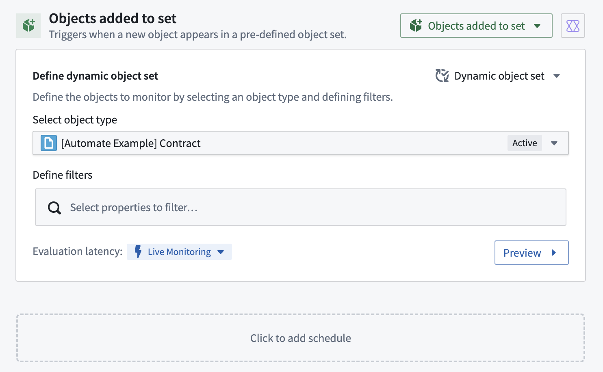
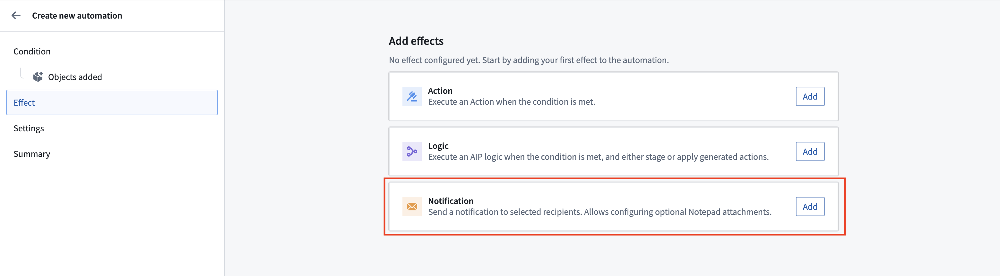
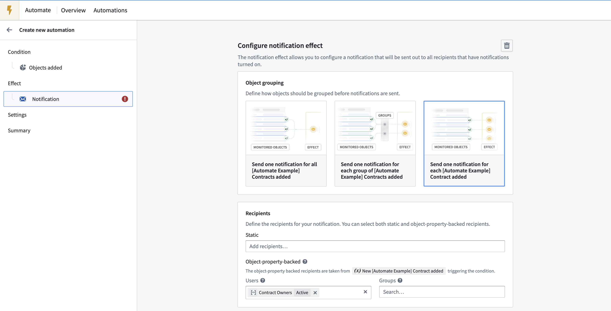
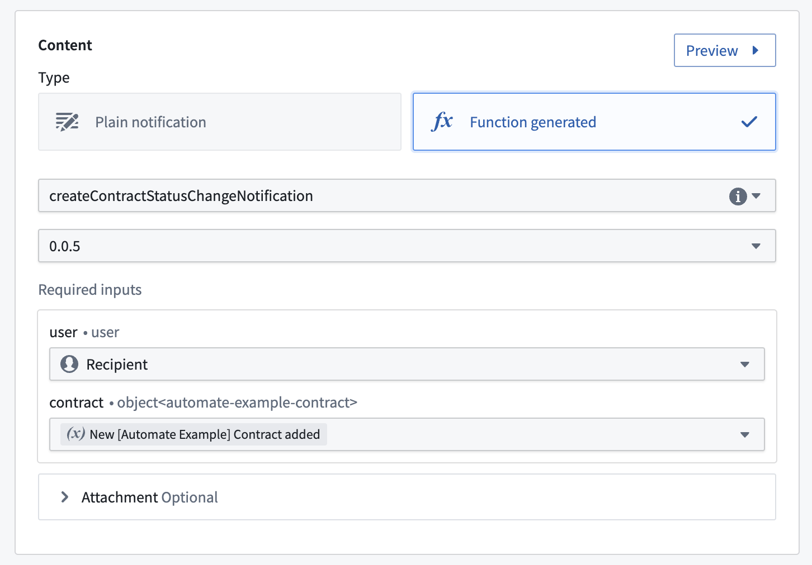
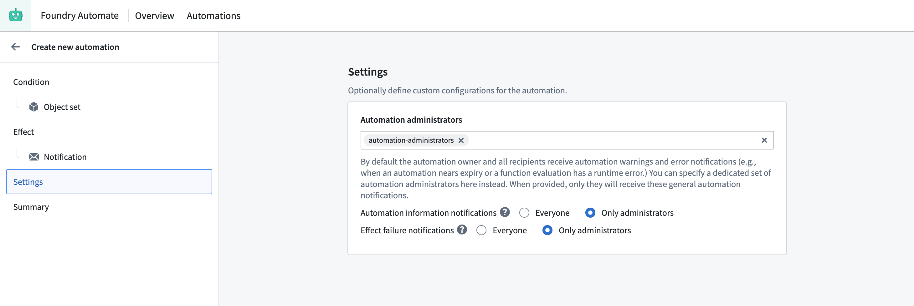
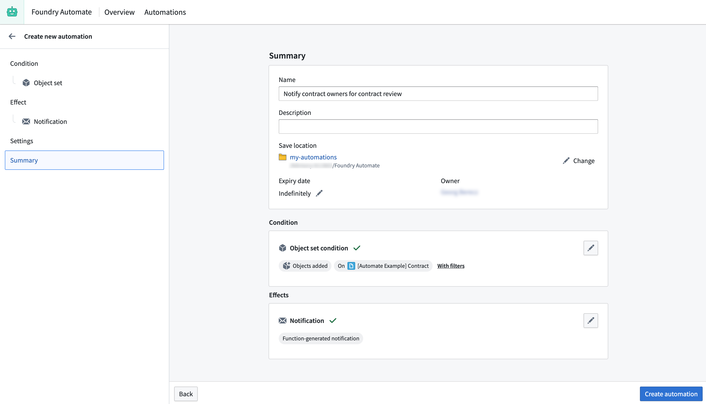

<!-- source: https://palantir.com/docs/foundry/automate/example-dynamic-contract-owner/ · mirrored 2026-08-18 from Palantir Foundry docs -->

# Example: Notify contract owners of contract review

In this example, we want to notify contract owners when the status of a contract changes to `Requires review`. We will use the `Contract` object type, which is a custom object type that we have created for this example.

## Condition

We begin in the automation creation wizard by selecting the `Object added to set` condition. Since we want to be notified whenever a contract changes its status to `Requires review`, we can add a filter on the selected object set on the `contract status` as shown below. This automation will always trigger when an object enters the filtered object set, whether because a new object was created with the status `Requires review` or because an existing object changed its status to `Requires review`.



## Effect

Next, we select **Notification** as the effect.



To ensure contract owners receive a separate email for each contract that requires review, select the **Send one notification for each Contract added** option. To dynamically send an email to the respective contract owners, use the **Object-property-backed** recipients feature and select the `Contract Owners` property as the user property. `Contract owners` is a property on the `Contract` object that contains an array of Foundry user IDs (similar to `1234a567-8bc9-12ab-3456-7ca89b1c234a`) of the associated owners. Note that all recipients require at least **Viewer** permission on the automation or they will not receive the notification.



Next, we need to define our notification content. To configure a more complex notification for our recipients, we will use the [function-generated notification content](/docs/foundry/automate/effect-notification/#function-generated-notification) feature. Function-generated notifications provide more flexibility in how to structure our notification content and support the use of HTML content (`<html>`).

To support our function-generated notification, we create a [function](/docs/foundry/functions/overview/) in a code repository that takes the recipient and a contract object as input and returns a notification.

```typescript
import { Function, Notification, User, ShortNotification, EmailNotificationContent } from "@foundry/functions-api";
import { _automateExampleContract  } from "@foundry/ontology-api";

@Function()
public createContractStatusChangeNotification(user: User, contract: _automateExampleContract): Notification | undefined {

    const shortNotification = ShortNotification.builder()
        .heading("Contract change")
        .content(`The contract "${contract.title}" changed its status to ${contract.contractStatus}`)
        .addObjectLink("View contract", contract)
        .build();

    // Define the email body. The email body may contain headless HTML, such as tables of data
    // Note that we can access properties of both the user and the contract in the content
    const emailBody = `Hello, ${user.firstName}!
    The contract "${contract.title}" that you are owning changed its status to "${contract.contractStatus}".

    Check the contract details. View more customer information <a href="${contract.customerUrl}">here</a>.
    `;

    const emailNotificationContent = EmailNotificationContent.builder()
        .subject(`Contract change - ${contract.customerName}`)
        .body(emailBody)
        .addObjectLink("View contract", contract)
        .build();

    return Notification.builder()
        .shortNotification(shortNotification)
        .emailNotificationContent(emailNotificationContent)
        .build();
}
```

After publishing the function, we can select the function in the automation creation wizard and connect the function to our effect inputs. For the `user` property, we select the `Recipient` of the notification. For `contract`, we select `New Contract added`, which is exposed as a condition effect input by our object set condition.



## Settings

To prevent contract owners from receiving status notifications about the automation, we can add our automation administrator group to the **Automation administrators** setting on the **Settings** tab of the automation creation wizard.



## Summary

To complete the process, we provide a name for the automation, select a save location, adjust the expiration date to "never expire", and save the automation.


