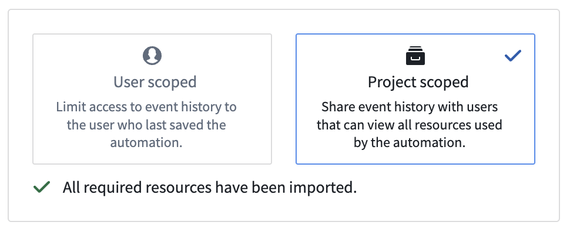

<!-- source: https://palantir.com/docs/foundry/automate/history-visibility-and-scope/ · mirrored 2026-08-18 from Palantir Foundry docs -->

# Automation history visibility and scope

Automations can be configured with different scoping options that determine who can access run history for action and Logic executions.

:::callout{theme="warning"}
Regardless of scoping mode, automations execute as the owner. This means:

* **Action criteria**: The owner must satisfy submission requirements (group membership and permissions).
* **Compute tokens**: Functions receive the owner's authentication token.
* **Edit attribution**: Object edit history and audit logs show changes as performed by the owner.
* **Permissions**: All ontology reads/writes use the owner's access level.
:::

## Project-scoped automations (recommended)

:::callout{theme="warning"}
Project-scoped automations require all transitive resources used in the automation to be imported into the project. When dependencies change (for example, an action references a new version of a function), update the automation to reimport references and regenerate the scope.
:::

Project scope mode is the recommended set-up for automations, if possible. Project scope enables team collaboration by making run history (including effect executions) visible to all users who satisfy the markings on a run. Project scoped automations still run as the owner of the automation.

### Limitations

Project-scoped mode currently does not support:

* Stateful functions, including:
  * [Deployed Python functions](/docs/foundry/functions/functions-deployed/)
  * [AIP Chatbot functions](/docs/foundry/chatbot-studio/chatbots-as-functions/)
* Python and Typescript v2 functions that use a platform SDK
* [Notification effects](/docs/foundry/automate/effect-notification/)
* Cross-organizational workflows

Additionally, project-scoped mode has limited support for:

* Object types with [restricted views](/docs/foundry/object-permissioning/configuring-rv-access-controls/): The owner of the automation and any viewers of event history must have access to all rows.
* Object types with [object security policies](/docs/foundry/object-permissioning/object-security-policies/): You must re-import security policies to the project after you update them.

Additionally, dependency computation for Typescript v1 is best-effort and may miss entities, meaning dependencies may be incorrectly computed. Consider using Typescript v2.

## User-scoped automations

In user-scoped mode, only the owner of the automation has access to the run history. For better team collaboration and debugging, project-scoped mode is the recommended setup for automations.

With **Shared trigger history** enabled, users with permissions on marked data in the condition can see that runs were executed, but effect executions remain visible only to the automation's owner. For more information about configuring and viewing shared history, review the [shared history events](/docs/foundry/automate/history/#history-visibility) documentation.
