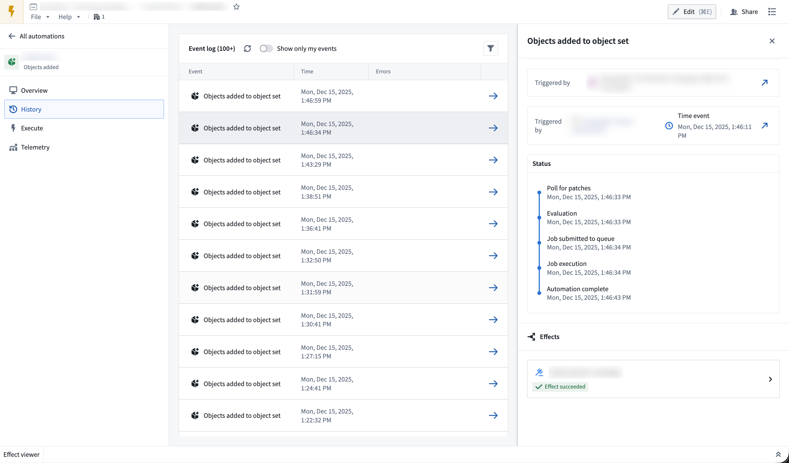
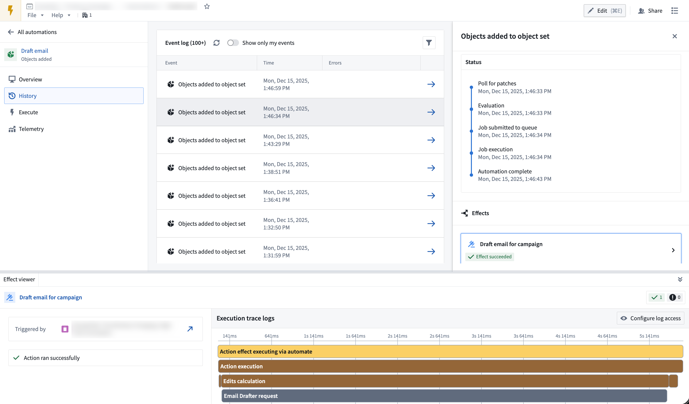

<!-- source: https://palantir.com/docs/foundry/automate/history/ · mirrored 2026-08-18 from Palantir Foundry docs -->

# Automation history

Automation history tracks events related to condition evaluation and automation metadata changes for individual automations.

History based on the automation condition (such as `Automation triggered` and `Automation recovered`) is saved at the user level. You can only see whether an automation triggered for you, not for other users (even if you created the automation). You can learn more about [history visibility](#history-visibility) below.

The history for a single automation is displayed under the **History** tab in the individual automation view.

## View event details

Select an event to view the full execution timeline, including condition evaluation details, effect execution status, timestamps, and any errors.

Within the event details view, select an individual effect to open a bottom panel with detailed trace logs. You can also choose the object that triggered the effect to view it in Object Explorer.

## History visibility

History visibility depends on the automation's [scope mode](/docs/foundry/automate/history-visibility-and-scope/):

* [**Project-scoped automations:**](/docs/foundry/automate/history-visibility-and-scope/#project-scoped-automations-recommended) History is viewable to all users who satisfy the markings on a run, enabling team collaboration.
* [**User-scoped automations:**](/docs/foundry/automate/history-visibility-and-scope/#user-scoped-automations) By default, history is visible only to the owner. Enable shared history to make trigger events visible to other users, while keeping effect execution details private.
  * **Shared history for user-scoped automations:** You can enable shared history on the Automate edit page. Select **Summary > Security settings**, choose **User scoped**, and then turn on **Generate shared history events**. With shared events enabled, you can view only your events by toggling **Show only my events** at the top of the **Event Log** table on Automate's **History** page.

:::callout{theme="warning"}
Shared events show that executions occurred, but effect execution details (including effect status, success/failure, failure messages, and effect logs) remain visible only to the owner.
:::

## Event types

| Event | Description |
|-------|-------------|
| `Automation triggered` | Recorded when an automation condition is met or when a threshold condition changes from `false` to `true`. |
| `Automation recovered` | Recorded when a threshold condition changes from `true` to `false`. Only threshold conditions on object sets generate this event. |
| `Condition edited` | Recorded when any user updates the automation condition. |
| `Subscribed` | Recorded when you subscribe to an automation. History from unsubscribed periods is not recorded or displayed. |
| `Unsubscribed` | Recorded when you unsubscribe from an automation. History from unsubscribed periods is not recorded or displayed. |
| `Evaluation failed` | Recorded when an automation fails to evaluate for any reason. View failure details in the automation's **History** tab. May also appear when condition evaluation succeeds but notification or action effects fail. |
| `Paused` | Recorded when any user pauses an automation or when an automation is automatically paused due to excessive failures. Paused automations are not evaluated. |
| `Resumed` | Recorded when an automation is unpaused. |
| `Muted` | Recorded when any user mutes an automation. Muting applies to all subscribers. Muted automations still evaluate but do not trigger notification or action effects. |
| `Unmuted` | Recorded when an automation is unmuted. Automations automatically unmute when the mute period expires. |

## Retention

Automation history is retained for six months, then permanently deleted. To store history beyond six months, use an action to save data in a long-lived object that is managed and controlled like any other object type in the [Ontology](/docs/foundry/ontology/overview/).

When data is deleted, it is removed from the automation's **History** tab.

You can use [fallback effects](/docs/foundry/automate/effect-fallback/) to persist failure messages and error information to Ontology objects. This allows you to retain data for both successful executions (through standard action effects) and unsuccessful executions (through fallback effects), with no retention limits.
