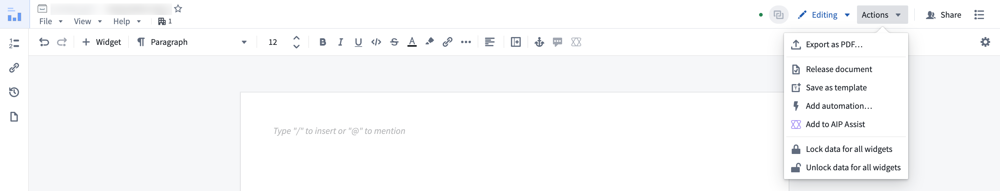
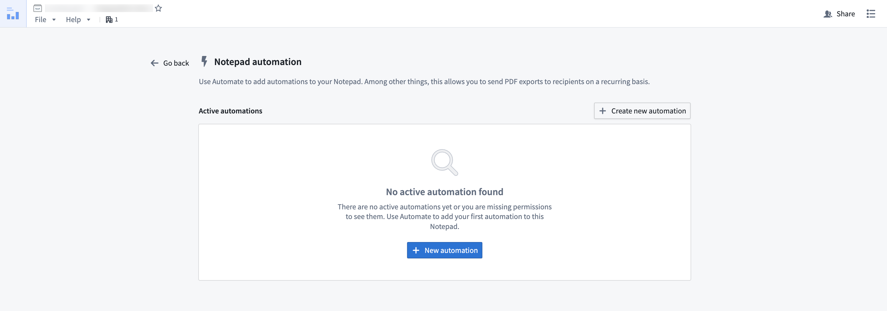
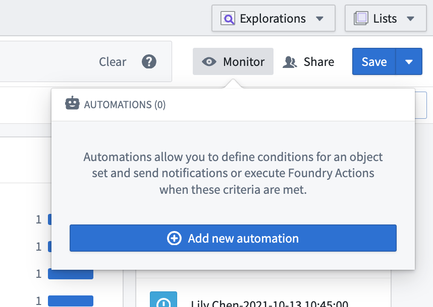
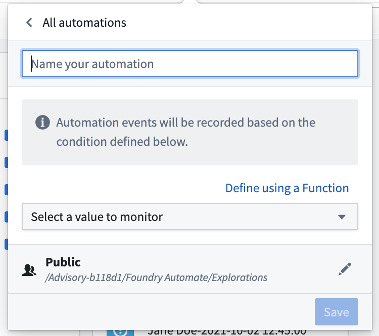
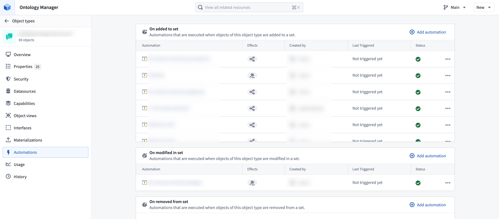
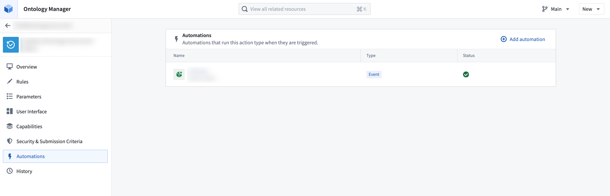

<!-- source: https://palantir.com/docs/foundry/automate/integrations/ · mirrored 2026-08-14 from Palantir Foundry docs -->

# Integrations

Automate integrates natively with the following Foundry applications:

* [AIP Logic](#aip-logic)
* [Notepad](#notepad)
* [Object Explorer](#object-explorer)
* [Ontology Manager](#ontology-manager)
* [Time series (Quiver)](#time-series-quiver)

## AIP Logic

Automate your AIP Logic to automatically apply or stage Ontology edits for human review. Automations can trigger on existing objects or when new objects are created.

[Learn how to automate your Logic function](/docs/foundry/logic/aip-logic-integration-automate/).

## Notepad

[Notepad](/docs/foundry/notepad/overview/) documents and [Notepad templates](/docs/foundry/notepad/templates-overview/) can be attached to an automation [notification effect](/docs/foundry/automate/effect-notification/), enabling automated distribution of reports and digests with the latest data from Notepad.

To create an automation directly from Notepad, select the **Actions** dropdown menu in the top right and choose **Add automation**.

You will be directed to the automation overview page for the Notepad document. Select **New automation** to launch the automation creation wizard, which will open with the Notepad document pre-filled as an attachment.

After configuring and saving your automation, you will return to the automation overview page within your document, which now displays your newly created automation.

## Object Explorer

Create automations in [Object Explorer](/docs/foundry/object-explorer/overview/) by following the steps below:

1. Choose **Save** in the exploration view.
2. Select a Project or folder destination.   
   

  
3\. After saving, select **Monitor** in the top right of the page to view all automations using this exploration as input. Newly created explorations will show an empty list.       
4\. Select **Add new automation** to open a simplified setup view for creating a new automation.

## Ontology Manager

[Ontology Manager](/docs/foundry/ontology-manager/overview/) enables users to define their Foundry Ontology, including object types and action types. Automate integrates with Ontology Manager in two ways:

1. The **Automations** tab in the [object type view](/docs/foundry/ontology-manager/overview/#object-type-view) displays all automations associated with the selected object type, including which automations trigger when objects of that type are created or updated. Select **Add automation** to launch the automation creation wizard with the object type pre-filled as a condition.   
      
2. Similarly, the **Automations** tab in the [action type view](/docs/foundry/ontology-manager/overview/#action-type-view) displays all automations that use the selected action type in their [actions effect](/docs/foundry/automate/effect-actions/). Select **Add automation** to launch the creation wizard with the action type pre-filled as an effect.

## Time series (Quiver)

You can automate your time series search logic in Quiver so that periods of interest in your time series data can be saved as events in the Ontology.

[Learn how to automate your time series search](/docs/foundry/time-series/alerting-overview/).
