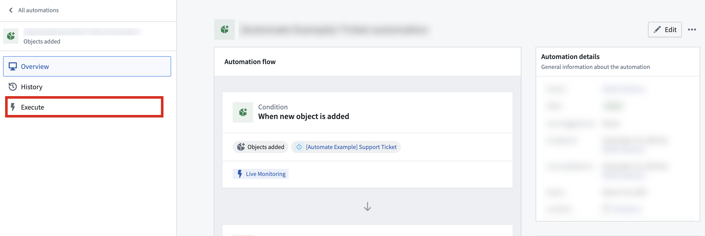
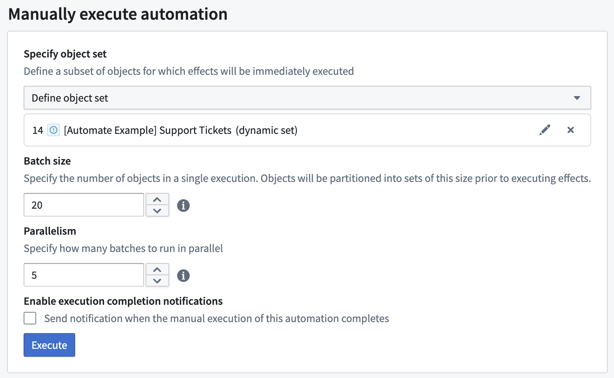
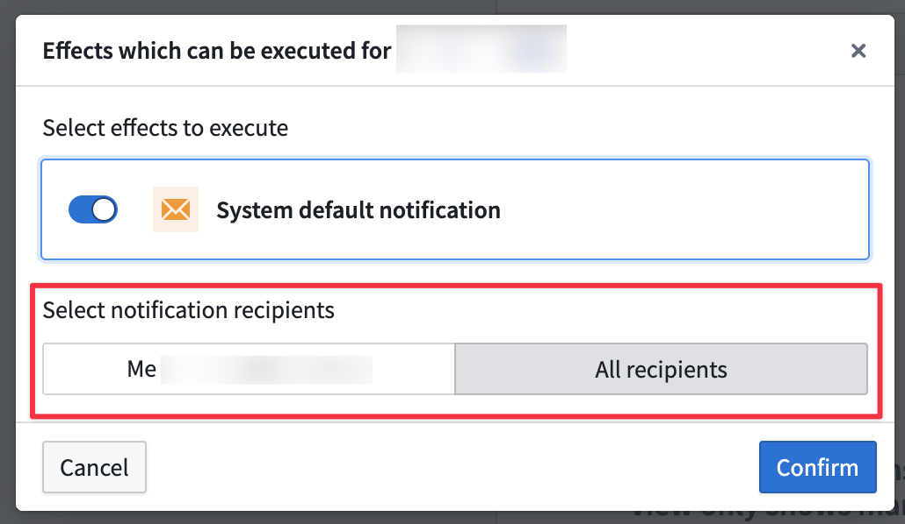

<!-- source: https://palantir.com/docs/foundry/automate/manual-execution/ · mirrored 2026-08-18 from Palantir Foundry docs -->

# Manual execution

You can manually run automations on existing object sets. This is useful for backfilling data or testing automations before a wider release.

:::callout{theme="neutral"}
You can manually execute paused automations. When you use **Run Now**, a warning confirms that scheduled and live triggers remain disabled. Expired, trashed, and otherwise disabled automations continue to block all execution.
:::

Manual executions are considered run by the user who selects **Execute** in the Automate interface. Users must have Compass edit permissions on the Automate resource to manually execute an automation.

To manually execute an automation, first [create a new automation](/docs/foundry/automate/getting-started/) with the desired effects. Then, open the automation and navigate to the **Execute** tab.

When an automation is manually executed, configured effects for that automation will be triggered immediately (optionally for a user-defined object set, depending on the condition).

## Example: Remediate with manual execution

Large backlogs may cause snapshot expiration errors during manual execution. To work around this, use a function-backed object set to process the backlog in manageable batches:

1. Create a function that returns the oldest `N` objects that require processing. For example, `oldestNObjectsWithBlankField(int count)` returns objects ordered by last edited timestamp with a limit.
2. Configure your automation to use a function-generated object set that calls this function.
3. Manually execute the automation repeatedly with a reasonable batch size, waiting for each execution to complete.
4. Continue manual executions until the backlog contains fewer than 100,000 objects.
5. Once the backlog is manageable, your regular condition-based automation can process new objects as they arrive.

## Execution settings

Execution settings expose a number of configurable parameters:

* **Specify object set:** For [object set conditions](/docs/foundry/automate/condition-objects/), you can specify an input object set. See documentation on [limits](/docs/foundry/automate/limits/) for object set size restrictions. This object set must contain objects of the same type as configured in the automation condition. All objects in this set will trigger the automation and be passed into any effect using `New object` parameters. Three object set types are currently supported:
  * **Defined object set:**  Static (manually selected objects), or dynamic (defined by filters on a chosen object set).
  * **Saved object set:** An object set saved as a Palantir resource.
  * **Function-generated object set:** Choose a function and define its parameters with static values. This function must return an object set of the same object type as the condition object set.

* **Batch size:** Batch size determines the number of objects in each execution. For example, if the batch size is 100 objects, and there are 1,000 objects in the defined object set, then the automation will have 10 individual executions (each with 100 objects), scheduled 1 minute apart. Objects are partitioned in a nondeterministic, random ordering.
  * Batch size is not visible to configure if the automation's condition does not involve an object set.

* **Parallelism:** Parallelism specifies how many batches should run in parallel. A higher number leads to faster execution.

* **Recipients:** Manual execution supports sending notifications to all users.    

  When a manual execution is triggered, the object set is evaluated using the token of the user who initiated the execution. This ensures that the evaluation respects permissions and access rights of the executing user.

## Monitoring execution results

After running a manual execution, you can inspect the execution results in the event history. The following observability features are available when viewing an effect execution:

* **Flame chart:** View execution flow across functions, actions, and language models. Use timing and batch relationship information to monitor parallelism and identify failures.
* **Service logs:** Review token usage, log messages, errors, and traces.
