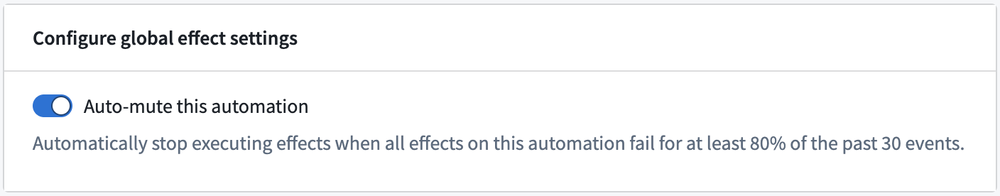
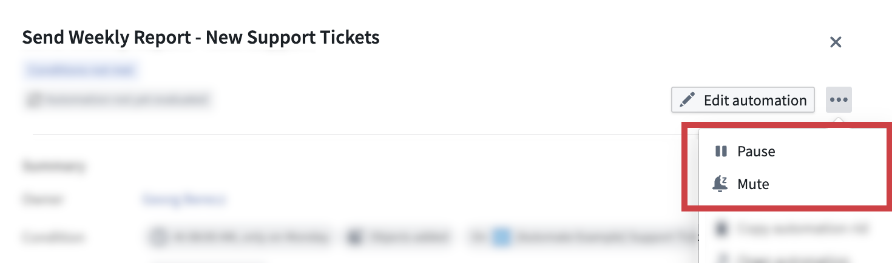
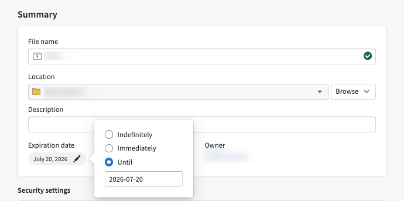

<!-- source: https://palantir.com/docs/foundry/automate/muting-pausing-expiration/ · mirrored 2026-08-14 from Palantir Foundry docs -->

# Muting, pausing, and expiration

Automations can be [muted](#muting-an-automation), [paused](#pausing-an-automation), or [configured to expire](#automation-expiration).

## Muting an automation

Automations can be muted by users or automatically by the system. When an automation is muted, the condition continues to be evaluated and [activity](/docs/foundry/automate/history/) is still recorded. However, no effects will be triggered. The automation can be unmuted at any time by a user with an `Editor` role on the automation.

### Auto-mute

When the **Auto-mute this automation** setting is enabled, the automation will automatically mute when all effects fail for at least 80% of the past 30 events.

## Pausing an automation

Automations can be paused by users. While an automation is paused, the condition will not be evaluated and no further executions will be triggered. Additionally, Automate interrupts any currently active executions when an automation is paused by a user. The automation can be resumed at any time by a user with an `Editor` role on the automation.

## Automation expiration

Automations can be configured to have an expiration date or to run indefinitely. The longest permitted expiration date is six months from the present time. The expiration date can be updated at any time by a user with an `Editor` role on the automation.

The expiration date can be viewed and modified in the **Summary** tab of the automation edit wizard. Click on an automation to view the automation overview panel and then select **Edit automation**. Then, open the **Summary** tab to access the expiration date configuration.

