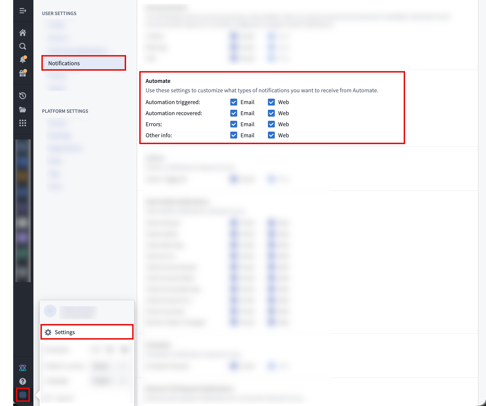

<!-- source: https://palantir.com/docs/foundry/automate/notification-settings/ · mirrored 2026-08-14 from Palantir Foundry docs -->

# Notification settings

Each user can configure how they wish to receive notifications from Automate in their respective user settings. These preferences apply globally for any automation.

| Category      | [Event types](/docs/foundry/automate/history/#event-types) |
| ------------- | ------------------------------------------- |
| `Triggered`   | Automation triggered |
| `Recovered`   | Automation recovered |
| `Errors`      | Evaluation failed |
| `Other info`  | Condition edited  Subscribed  Unsubscribed  Muted  Unmuted  Paused  Resumed |
