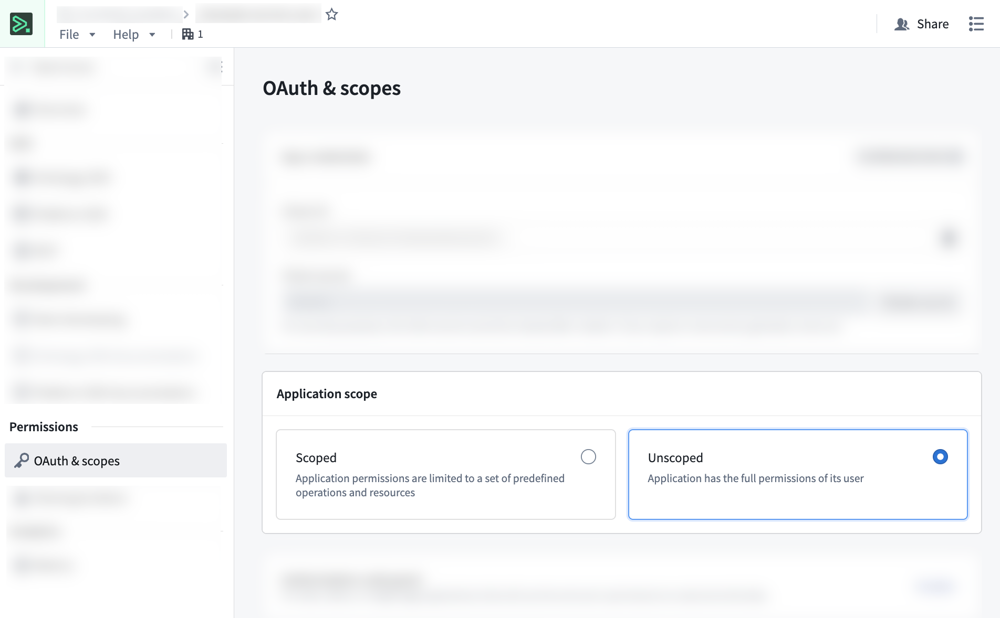
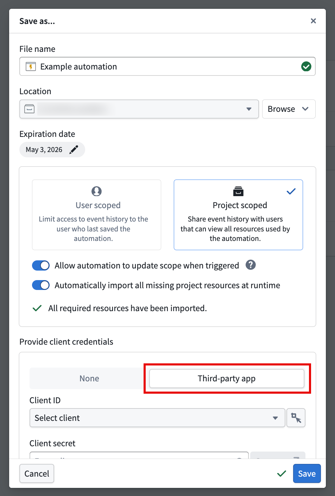
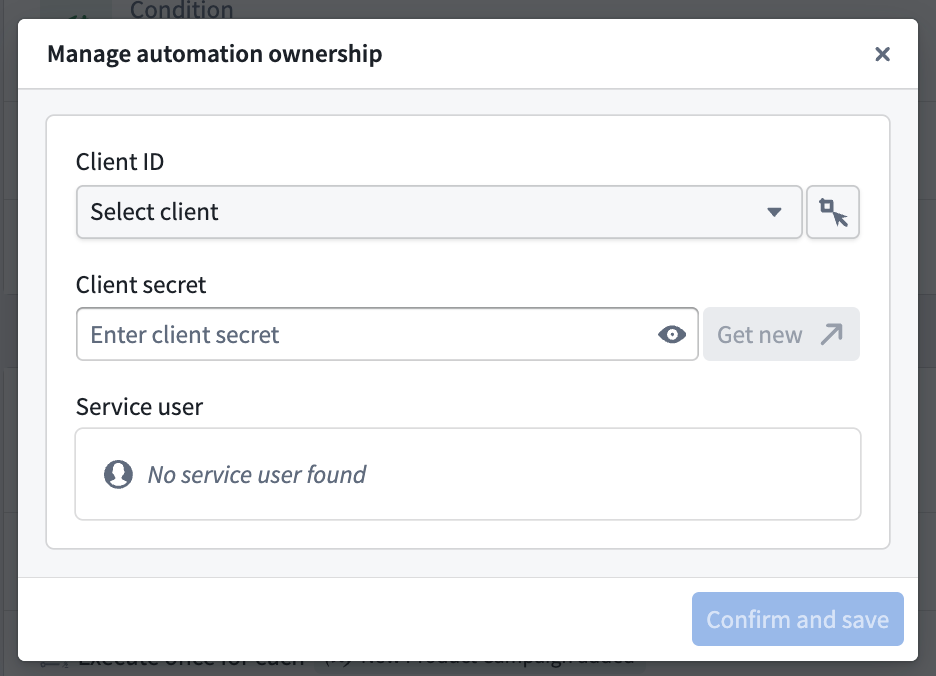
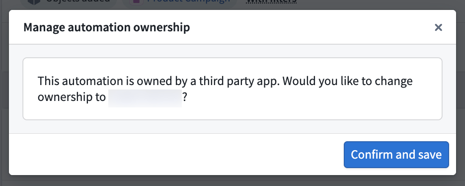

<!-- source: https://palantir.com/docs/foundry/automate/third-party-app-ownership/ · mirrored 2026-08-14 from Palantir Foundry docs -->

# Third-party application ownership

Automations can be owned by third-party applications instead of individual users. This ties execution history and permissions to an organizational service account, enabling centralized management and ensuring continuity regardless of team changes.

You can assign ownership to third-party applications when you create an automation, or you can [transfer ownership for an existing automation](#transfer-ownership-to-a-service-user).

## Understanding third-party application ownership

Third-party applications in Foundry are OAuth2-based integrations that enable external applications or services to securely interact with Foundry resources. Refer to the [third-party application overview](/docs/foundry/platform-security-third-party/third-party-apps-overview/) for more information. For automation ownership, third-party apps provide a service user that can own automations independently from individual users, with several benefits:

* **Team continuity**: Automations continue running when team members leave or are out of office.
* **Centralized permissions**: Manage automation permissions independently from individual team members.
* **Persistent history**: Execution history remains accessible for debugging and auditing for [project-scoped automations](/docs/foundry/automate/history-visibility-and-scope/).
* **Simplified access control**: Share execution history across teams using [project-scoped automations](/docs/foundry/automate/history-visibility-and-scope/), and centralize permission management by using the same third-party application client for multiple automations.

## Permissions for automations owned by third-party applications

The following apply when an automation is owned by a third-party application:

* **Condition evaluation** uses the service user's permissions.
* **Action and Logic effects** execute as the service user.
* **Notification effects** continue to use each recipient's individual permissions.
* **Execution history** is visible to team members based on their permissions. [See history visibility settings](/docs/foundry/automate/history-visibility-and-scope/) for more information.

This ensures that automation behavior remains consistent and predictable, with clearly defined permissions tied to the service account rather than individual users.

## Set up a third-party application

Before transferring automation ownership, create and configure an OAuth2 client by registering an application in Control Panel or Developer Console. See [Registering third-party applications](/docs/foundry/platform-security-third-party/register-3pa/) for complete guidance.

### Prerequisites

To create a third-party application for automation ownership, you must have the following:

* The third-party application administrator role in your organization
* The `Manage OAuth 2.0 clients` permission

### Create a new third-party application and obtain credentials

To register a new third-party application, select the following settings when registering an application:

* Client type: **Confidential client**
* Client credentials grant: **Enabled**
* Application restrictions: **Unrestricted**
  * You can adjust this after creating the application one the **OAuth & restrictions** page.

This creates a service user that can own automations. During registration, save the client ID and client secret immediately. The secret is shown only once.

:::callout{theme="warning"}
Store the client secret securely. If lost, you will need to [rotate it](/docs/foundry/platform-security-third-party/danger-zone-actions/#rotate-a-client-secret). Note that rotating a secret will **not** break existing automations owned by that third-party application.
:::

For complete step-by-step instructions on registering applications and obtaining credentials, see [Registering third-party applications](/docs/foundry/platform-security-third-party/register-3pa/) and the [Developer Console overview](/docs/foundry/developer-console/overview/).

## Manage ownership

Once you have registered a third-party application and configured its permissions, you can set up new automations with third-party application ownership, or transfer ownership of existing automations to the application's service user.

Before attempting to assign third-party application ownership, ensure that you have the following:

* The third-party application's client ID.
* The client secret for the application.
* Verification that the service user has been granted the editor role on the existing automation, or the folder where a new automation will be created.
* Verification that the service user has appropriate permissions for the automation's actions and is unrestricted. You can adjust the restrictions after creating the application on the **OAuth & restrictions** page.

If you do not have a client ID and client secret, see [Creating a new application and obtaining credentials](/docs/foundry/developer-console/create-application/).

:::callout{theme="neutral"}
Subsequent edits to an automation owned by a third-party application will require the credentials (client ID and client secret) before saving.
:::

### Add third-party application ownership when creating a new automation

Take the following steps to assign ownership to a service account when creating a new automation:

1. Configure your automation and select **Create automation**.
2. In the **Save as...** dialog, scroll to the bottom to the **Provide client credentials** section.
3. Select **Third-party app**.
4. Enter your client ID and client secret.
5. Select **Save**.

You can confirm automation ownership in the **Automation details** section on the **Automation overview** page.

### Transfer ownership to a service user

Take the following steps to transfer ownership to an existing automation:

1. In Automate, select the automation to open the **Automation overview** page.
2. In the **Actions** dropdown, select **Manage ownership**.

3. Enter your client ID and client secret, then select **Confirm and save**.

After transferring ownership, the third-party application will appear as the automation owner in the **Automation details** section. The automation will continue running without interruption using the service user's permissions. Previous execution history will remain intact and accessible to authorized users.

### Transfer ownership from a service user

Follow the steps below to transfer ownership from a third-party application back to an individual user:

1. In Automate, select the automation to open the **Automation overview** page.
2. In the **Actions** dropdown, select **Manage ownership**.
3. In the **Manage automation ownership** dialog, select  **Confirm and save** to transfer ownership back to yourself.

:::callout{theme="neutral"}
Ensure that your user account has all the permissions previously granted to the service user. Otherwise, the automation may fail to execute certain actions.
:::

## Additional resources

* [Foundry third-party application & API guidance](/docs/foundry/platform-security-third-party/3pa-api-guidance/)
* [Client credentials applications](/docs/foundry/consumer-mode/client-credentials-setup/)
* [Unrestricted applications](/docs/foundry/developer-console/application-restrictions/#unrestricted-applications)
* [Create a new Developer Console application](/docs/foundry/developer-console/create-application/)
