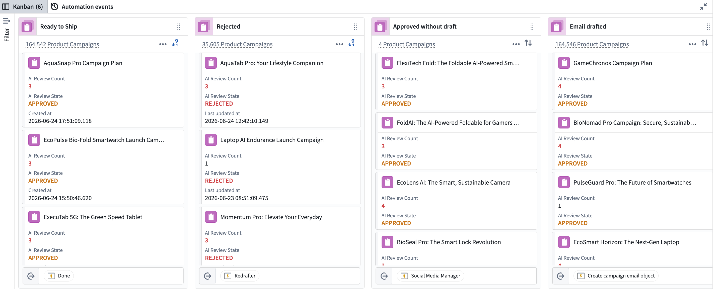
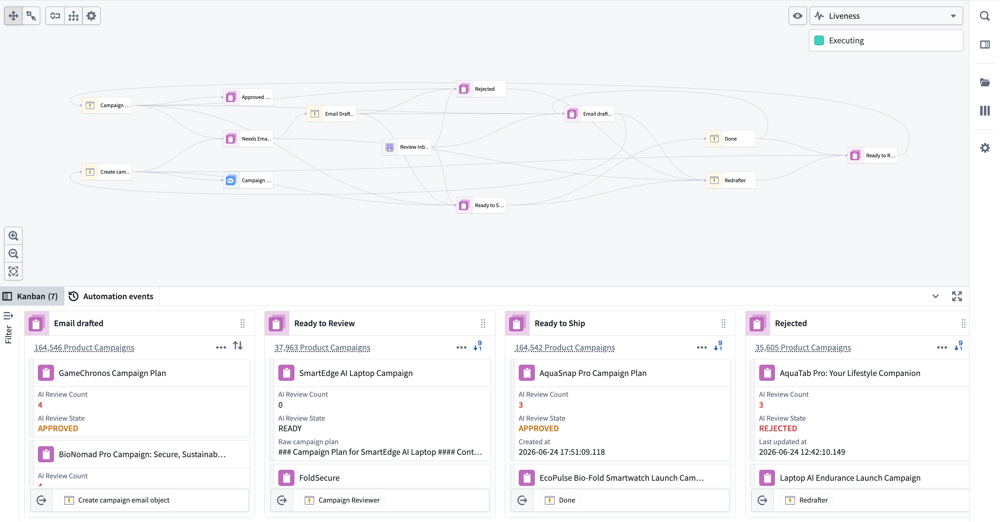
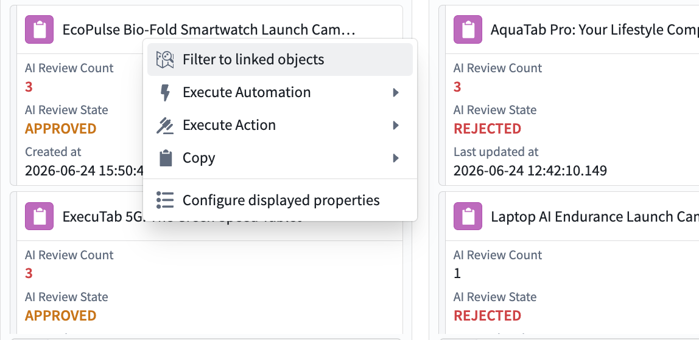

<!-- source: https://palantir.com/docs/foundry/autopilot/overview/ · mirrored 2026-08-09 from Palantir Foundry docs -->

# Autopilot \[Beta]

:::callout{theme="warning" title="Beta"}
Autopilot is in the [beta](/docs/foundry/platform-overview/development-life-cycle/) phase of development. Functionality may change during active development. Contact your administrator to request access to Autopilot if you do not see the application enabled.
:::

**Autopilot** is your control center for managing Ontology automation workflows at scale. It enables teams to visualize, monitor, and optimize complex systems while troubleshooting issues in real time.

## Capabilities

Autopilot has two main tabs for managing your automation workflows:

* **[Workbench](/docs/foundry/autopilot/workbench/):** Visualize your workflow using Kanban boards and dependency graphs, monitor object states, and interact with your automation system.
* **[Automation events](/docs/foundry/autopilot/automation-events/):** View detailed execution logs, trace automation runs, and troubleshoot issues across your entire workflow.

:::callout{theme="warning"}
Workflows with a high number of automations may increase memory usage and cause browser performance issues.
:::

### Visualize complex agentic workflows

The [Workbench](/docs/foundry/autopilot/workbench/) provides coordinated views for understanding your automation workflows:

* **[Kanban boards](/docs/foundry/autopilot/workbench-kanban/)** display your state machine, where each card represents a single object in a given state.
* **[Dependency graphs](/docs/foundry/autopilot/workbench-graph/)** display all system components, including automations, actions, functions, logic functions, and their relationships.

### Monitor system performance and debug issues in real time

* Track automation event failures at the object level to quickly triage problematic event executions.
* Explore object details, view an object's edit history with resource attribution (automation, workshop, actions), and filter your workbench to all linked objects for a given object.
* Use workbench search (`Cmd+F` for macOS and `Ctrl+F` for Windows) to find any object by title or resource identifier (RID).

* View the liveness of your system; see which automations are currently executing and on which objects.
* Follow the entire lifecycle of an automation with detailed telemetry.
* Manually retry automations on any object.
* Modify automation conditions directly within Autopilot.
