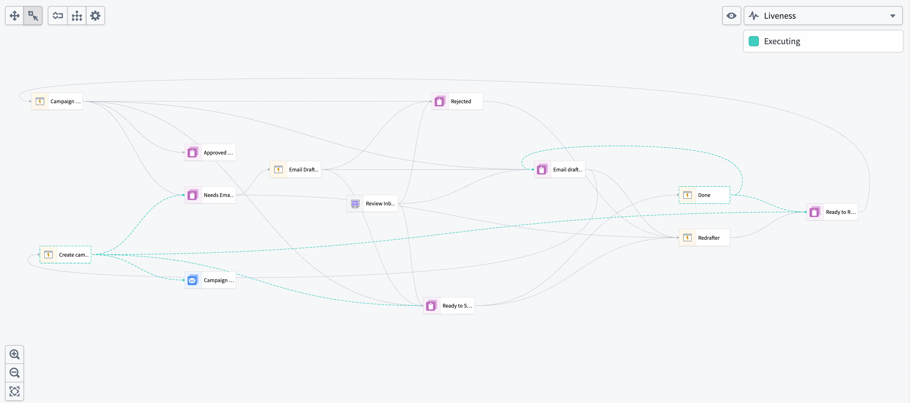
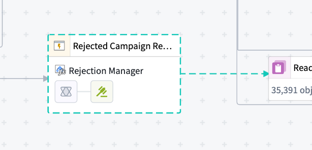
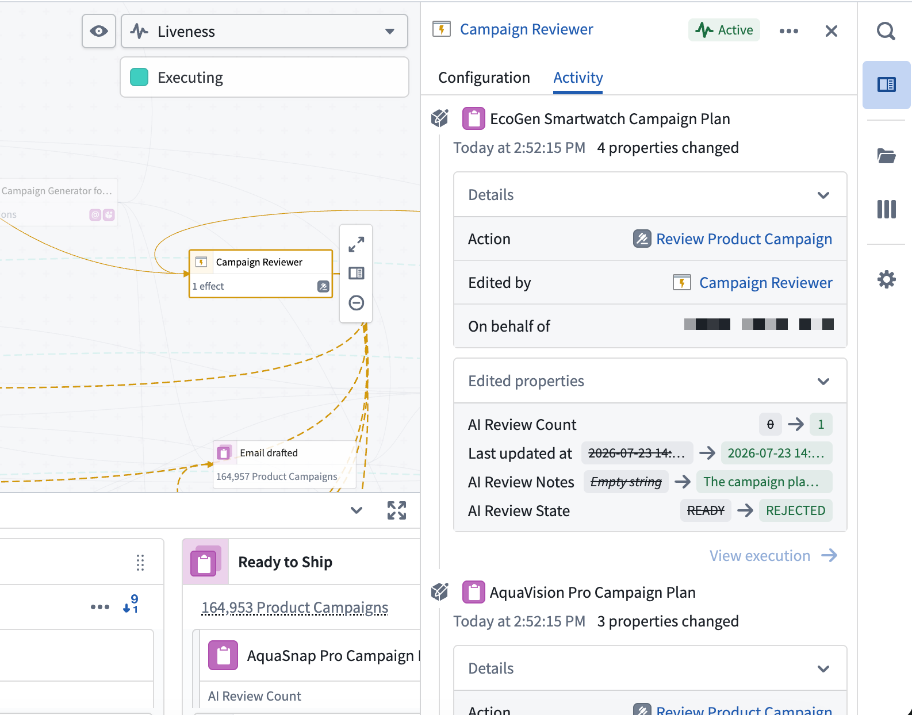
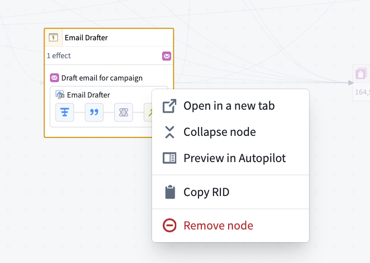

<!-- source: https://palantir.com/docs/foundry/autopilot/workbench-graph/ · mirrored 2026-08-09 from Palantir Foundry docs -->

# Dependency graph view

Autopilot's graph view displays the complete dependency graph of your automation system, showing all automations, actions, functions, logic functions, and their relationships. This view helps you understand the architecture of your workflow, identify dependencies, and troubleshoot issues across your automation system.

The dependency graph is composed of nodes and edges:

* **Nodes:** Represent automations (composed of actions and logic) and Workshop applications (also composed of actions). Together, these show both automated and human-driven components of your workflow.
* **Edges:** Show dependencies and execution flow between nodes.

## Human vs. automation components

The graph distinguishes between human-driven and automated components of your workflow:

* **Workshop nodes:** Human actions and Workshop applications appear as distinct nodes on the graph.
* **Transition breakdown:** View which state transitions are driven by human actions rather than automation.
* **Collaboration patterns:** Understand where humans and automation interact in your workflow.

## Historical object paths

View the historical path of an object as it moves through your workflow over time. When you select an object, you can display its path on the graph to view the following:

* The states the object has passed through
* The automations that processed the object at each stage
* The sequence and timing of state transitions

## Liveness indicators

When automations are actively executing, the graph displays real-time indicators:

* **Animated dotted lines:** Active processing appears as animated dotted lines on the edges connecting to the states where objects are currently being processed.
* **Node highlights:** Automations that are currently running are highlighted on the graph.

These indicators provide immediate visibility into system activity and help you monitor automation execution in real time.

## Resource activity panel

View the Ontology writes made by any resource in your workbench. Select a resource on the graph — such as an Automate, a Workshop application, or an AIP chatbot — to open the Resource activity panel and view the creations, deletions, and modifications it performed against object types. The panel requires edit history to be enabled on the relevant object types. If edit history is not enabled, activity for that object type will not appear in the panel.

As with the Object History side panel, you can drill into each write to view the specific properties that were changed, the attributed user, and the associated trace.

## Graph controls and navigation

Use the graph controls toolbar and navigation features to explore your workflow:

* **Auto-layout:** Automatically organize nodes to minimize edge crossings and improve readability.
* **Edge styling:** Choose between orthogonal (right-angled) or curved edges.
* **Expand all nodes:** Expand all collapsed sections of the graph to view the full workflow structure. When you expand nodes, you can see fallback effects configured in your automations.   
     
* **Select nodes:** Select any node to view details in the right side panel.
* **Remove nodes:** Choose a node, then select **Remove from workbench** to remove it from your graph view.
