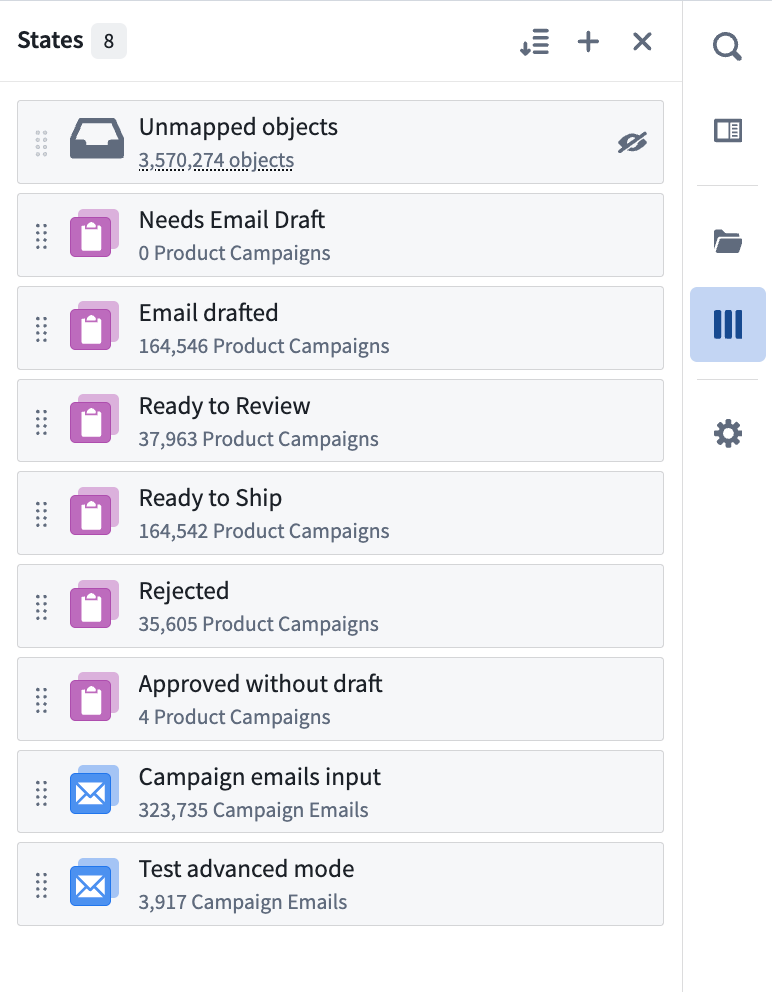
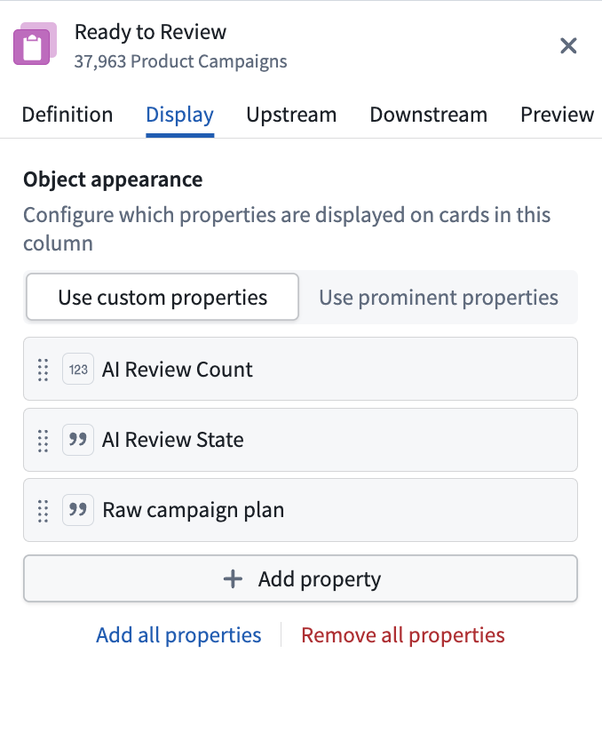

<!-- source: https://palantir.com/docs/foundry/autopilot/workbench/ · mirrored 2026-08-09 from Palantir Foundry docs -->

# Workbench

The Autopilot workbench provides two coordinated views for visualizing and managing your automation workflows: [Kanban boards](/docs/foundry/autopilot/workbench-kanban/) and [dependency graphs](/docs/foundry/autopilot/workbench-graph/). You can switch between these views or display them side by side.

You can search for any object using `Cmd+F` (macOS) or `Ctrl+F` (Windows), filter to objects linked to a selected object, and view live indicators showing which automations are currently executing.

## Kanban and graph views

Use the view selector in the top toolbar to switch between the different options:

* **[Kanban view](/docs/foundry/autopilot/workbench-kanban/)**: View your state-based workflow where each column represents a state and each card is an object.
* **[Graph view](/docs/foundry/autopilot/workbench-graph/)**: Explore the dependency graph of your automation system, understand automation relationships, and visualize historical paths for each object.
* **Split view:** View both the Kanban board and graph simultaneously.

## States

States represent distinct stages in your automation workflow. Each state corresponds to a column in the Kanban board and a node on the graph, and defines where objects are in their lifecycle.

States are automatically inferred from your automations or can be manually defined. Autopilot analyzes your automation conditions and effects to generate initial states, which you can then customize to match your workflow needs.

### Manage all states in the sidebar

Use the **States** sidebar on the left to manage your workflow states:

* **Add states:** Create custom states to represent additional steps in your workflow.
* **Reorder states:** Drag and drop states to reorganize the column ordering in your Kanban board.
* **Focus a state:** Zoom to a specific state on both the graph and Kanban views.
* **Configure a state:** Select a state to open the [configuration panel](#configure-each-state).
* **Delete a state:** Remove states that are no longer relevant to your workflow.

### Configure each state

To configure your state, choose a state in the **States** sidebar or select the cog button in the top right corner of a column header. The right side panel opens to display the following:

* **Definition:** Configure which object types belong in this state and conditions for objects to enter or exit. You can also rename the state.
* **Display:** Customize the column name, color, icon, and properties displayed on the card.
* **Upstream and Downstream:** View historical transitions (last 100 edits) for objects entering this state (**Upstream**) and leaving this state (**Downstream**) with a breakdown of manual and automated transitions to monitor workflow automation levels.
* **Preview:** View how the Kanban column appears in your workbench, including the list of objects currently in that column.

