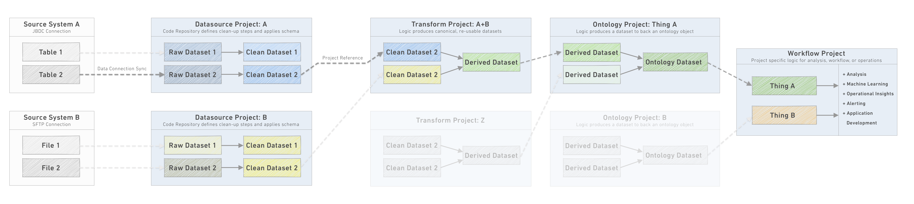
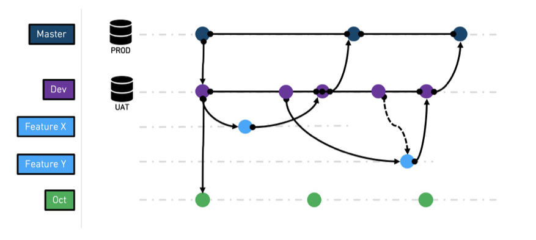
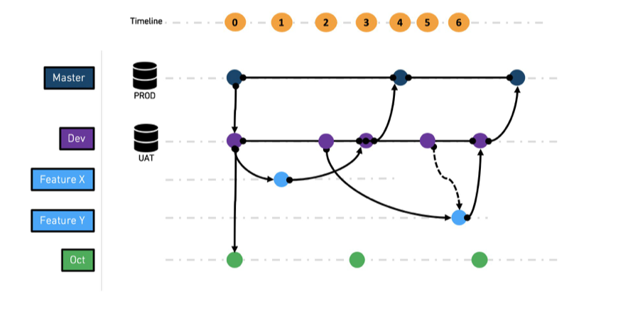
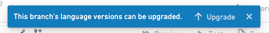
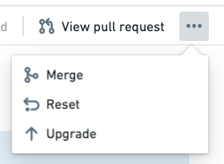
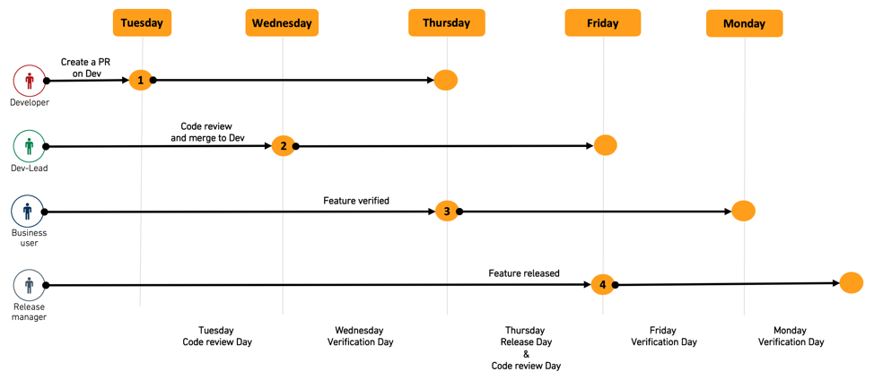
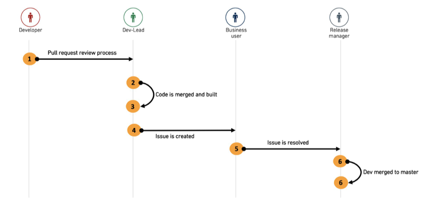
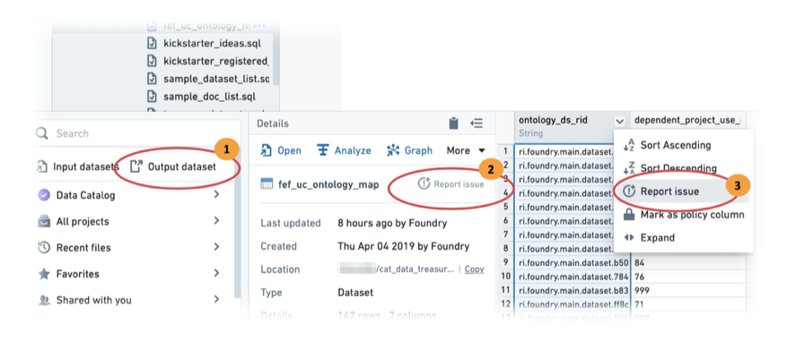
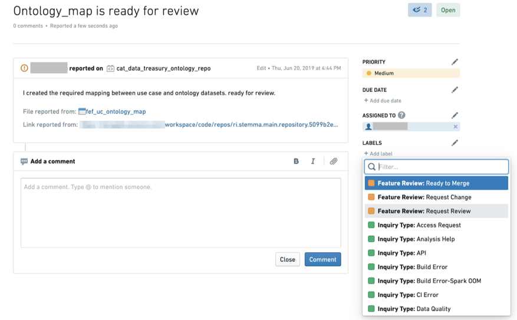
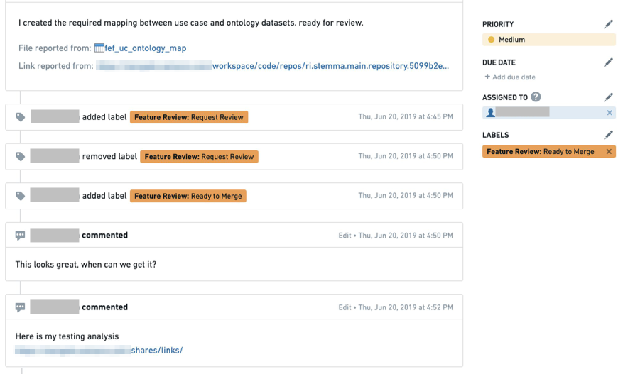

<!-- source: https://palantir.com/docs/foundry/building-pipelines/branching-release-process/ · mirrored 2026-08-22 from Palantir Foundry docs -->

# Branching and release process

The purpose of this document is to outline both the recommended best practices for branch management and the release process of data pipelines managed through Projects within Code Repositories.

The high level goal is to design a process to strike a balance between quick iteration on new data features / data quality fixes and having a stable and process-compliant change management process.

## Scope of release

Before we jump into the internals of the release management process, we need to better define exactly "what is the product" that we are releasing? For our purposes, we will define the `product` to be *the set of assets released as a conceptual unit*.

Taking [Recommended Project structure](/docs/foundry/building-pipelines/recommended-project-structure/) as a reference for how we build pipelines in Foundry, we see that the pipeline is defined by
multiple projects of different types - datasource, transforms, Ontology and workflow. In most cases, however, we will not manage each project on its own as a product, but instead, each project will define a subset of its resources as one of the following product types:

* The Ontology product: this product is the collection of output datasets created out of the datasource, pipeline and Ontology projects.
* A Use-case product: every use case project represents a given use case that stands on its own. Each of the use cases is defined as a product.

:::callout{theme="neutral"}
The definition we give to a product here can cover code which is managed in multiple repositories and other Foundry resources.
:::

## Product branch management

The following section refers to the branching strategy we want to deploy to manage the release of every product. [Learn more about branching in general and how branches work between Code Repositories and datasets.](/docs/foundry/data-integration/branching/)

:::callout{theme="warning" title="Branch naming"}
It is highly recommended to have the same branch name across all repositories within the product. This will ensure downstream branches read from the correct upstream branch.
:::

The general branching strategy we recommend following is based on a common practice named [GitFlow ↗](https://www.atlassian.com/git/tutorials/comparing-workflows/gitflow-workflow) with some modification. The main change is a recommendation to skip the `release` branch. Due to the way artifacts are deployed in Foundry, we can merge changes from `dev` into `master` directly after testing.

### Common branches

`master` - this is the production branch. As such, it is a protected branch
and only the release manager role can approve merging a PR to this
branch. It is assumed that the `master` branch is sourced with production
data.

`dev` - the `dev` (aka development) branch is a staging branch, derived
from the `master` branch. It is mostly relevant when you want to test a
complete feature using testing data. The `dev` branch can be sourced from
`master` (this happens automatically through [fallback branches](/docs/foundry/code-repositories/branch-settings/#fallback-branches)) or from a UAT data
source.

`feature-[X]` - feature branch is where a given feature is being developed
and tested. This branch is derived from `dev` branch. This is a
short-lived branch, meaning it can be deleted once the branch is being
merged into master. Since the branch is derived from `dev` it will be
sourced with the same data `dev` branch has. Note that this remains true as long as the fallback branches do not get reconfigured, and as long as the input datasets do not exist on the feature branch.

### Other special branches

`major-release-[X]` - special branch which
integrates all required changes due to changes in the source system's schema (occurring at a specific cadence).

`hot-fix-[X]` - special branch used to fix an issue discovered in production
while the code base has moved to a new version. Since we assume
dev and master are in sync (unless there is a feature which is
being actively tested) it is unlikely we need such a branch.

### Branch management workflow

As described above, some branches are permanent while
others are short-lived. The following section describes the
recommended workflow between branches.

* At *t0*, `master` and `dev` branches are created.

* At *t1*, `feature x` branch is created from `dev`

* At *t2*, `feature y` branch is created from `dev`

* At *t3*, `feature x` is merged into `dev`

* At *t4*, `dev` is merged into `master`, and `feature x` branch is deleted

* At *t5*, `dev` is merged into `feature y` to pick up the latest state of
  `dev`

* At *t6*, feature y is merged into `dev` and later from `dev` to `master` as
  before

In addition to features developed and released to `dev` and `master` , a long lived branch for a major release like `major-release-[X]` is being developed.

It is recommended to keep merging `dev` onto `major-release-[X]` , so the latest features are in sync. We recommend keeping the Ontology schema as stable as possible and to hide the backend schema changes through the transformation in the datasource and transform projects.

### Repository upgrades

*Repository upgrades* are periodic prompts to update the configuration files in a Code Repository. These updates apply fixes or bump versions of language-bundle dependencies and best practice is to stay on top of applying these recommended upgrades.

Note that if you miss clicking the "Upgrade" button on the prompt, the button is also available for any branch under the "..." options menu in the upper right corner:

The upgrade process should be treated the same way as a feature development cycle. This means:

1. `master` should be upgraded through `dev`.

2. When prompted to upgrade `dev`, an automated feature branch will be
   created. You can test the configuration changes by running a build on this branch once CI checks are complete. After confirming the transforms still execute after the upgrade, merge the configuration changes into `dev`. Once `dev` is upgraded, a PR should be used to push these changes to master.

3. To upgrade all open feature branches, merge `dev` back into each branch to include these configuration upgrades.

### Maintenance windows

A fast iteration loop from idea to production is common in development practices and critical to the success of projects that depend on end-user feedback to determine the next iteration loop. In order to support such a process, we recommend establishing a pre-defined maintenance window.

For example, once all feature PRs are merged, all datasets get built on the `dev` branch so that the results can be verified on Wednesday and Friday. During these days, only fixes to problems discovered during verification get merged into `dev`, until `dev` finally gets merged into `master` on Thursday and Monday, the "release days"

It is recommended to agree on such cadence with all parties involved to
make sure they devote enough time during these days to push new features
forward.

## Feature testing and end user verification

Once feature development is complete it is critical to test and validate
both the correctness of the feature outcome and the impact on any
dependent resource. In Code Repositories we consider the output datasets as
the feature outcome which should be tested.

Based on the branch structure we defined above, when we build the output
dataset it will use either data from the input datasets on the same
branch of the feature, or through the fallback logic will read from the
source branch, master in the simplified version and dev in the other.

The developer-level testing can be done using dataset [Health Checks](/docs/foundry/health-checks/overview/), dependent test datasets, or manually using tools such as [Contour](/docs/foundry/contour/overview/).

:::callout{title="Testing methodology"}
It is highly discouraged to do this testing via the preview or SQL helper. The preview helper uses only a sample of the data when executing code, which might not reveal all cases - especially in code that involves one or more join operations. The SQL helper tests the correctness of the code but not the output of the build which in some cases could be different.
:::

Upon completion of feature development, the new feature code needs to be reviewed before being merged into the `dev` branch and the feature outcomes need to be verified by the end user for correctness and completeness.

We recommend using a combination of Pull Request reviews for the first and Foundry Issues for the second as explained in the diagram below.

1. The developer creates a pull request from his feature branch to the `dev` branch and adds implementation comments.

2. The dev-lead reviews the PR, collaborates with the developer on required changes and finally merges the PR into `dev`.

:::callout{theme="neutral"}
During the pull request review, make sure that you check the changes to the schemas of any affected datasets. Schemas should be treated as your data API, so any changes to column names or columns types is considered a "breaking" change for any consumers. Limit breaks where possible by creating new columns rather than deleting or modifying old ones while announcing a deprecation of the old column and instructions for data consumers (identified through Data Connection) to update to the new column. At the next major release, columns deprecated in the previous major release can be removed.

To review schema changes in a pull request, use schema diff view in the [Affected Datasets](/docs/foundry/code-repositories/analyze-impact/) tab.
:::

3. The dev-lead runs the build on the `dev` branch to create the feature output datasets.
4. The dev creates a Foundry Issue on the output dataset, documents any testing and verification requests and assigns the issue to the relevant end user for verification.
5. The end user receives the issue, with full context and view of the relevant dataset and branch to be tested. They collaborate with the developer on the required changes until the issue is resolved and marked as ready to merge. The issue is then assigned to the release manager.
6. The release manager closes the issue and merges `dev` into `master`.
7. The release manager deletes the feature branch.

The above workflow allows for a relatively fast collaboration cycle between the parties, without losing context. Closed issues are kept on the platform and can act as audit trail for the change-management process.

### Foundry Issues feature review workflow

Below is an example of how a team can use Foundry Issues to track requests for review from other stakeholders, carry out conversations around new features, and control and document the process of merging code to `master`, so all interested parties remain informed and up-to-date. Consider this directional, rather than proscriptive, and adapt it to existing operational and technical processes as needed.

**Example workflow**

The first time a developer creates a feature review request issue, the issue is assigned with status `Feature Review: Request Review`. The issue can be attached to the dataset or to a specific column if the feature is specific.

Collaboration with the end user is done through the comment section and by changing the status between `Request Change` or `Ready to Merge` and changing the assignee of the issue.

Issues is a great place to store the feature review workflow as end users can also document their verification process (for audit purposes) and attach links to other assets.

The diagram below shows how an issue is created on the build output dataset.

1. In Foundry Explorer, select Output dataset.

2. Report the issue on the whole dataset by clicking **Report Issue**.

3. If the feature has to do with a specific column, you can use the column level report issue to provide the reviewer better context of the change you made.

4. Complete the issue fields as prompted by the form.

5. Once the issue is created, make sure to change the label to `Feature Review: Request Review`. (If you do not have these labels available, contact your Palantir representative for assistance.)

As the review process continues, the collaboration thread including all status changes and verification evidence are stored in the issue.

