<!-- source: https://palantir.com/docs/foundry/building-pipelines/create-batch-pipeline-cr/ · mirrored 2026-08-22 from Palantir Foundry docs -->

# Create a dataset batch pipeline with Code Repositories

This guide will step you through a simple data transformation example using the **Code Repositories** application. You will learn how to write and edit SQL code as well as build your datasets. You will also learn how to work on branches to allow you to collaborate with colleagues.

## 1. Create a repository

Get started by creating a new repository. To do so, navigate to a [Project](/docs/foundry/getting-started/projects-and-resources/) in Foundry, select **+ New** in the top-right, then select **Code repository**.

For this guide, we will write a SQL transform. Give your repository a name, then select **SQL** in the dropdown under **Language template**. Then, select **Initialize repository**.

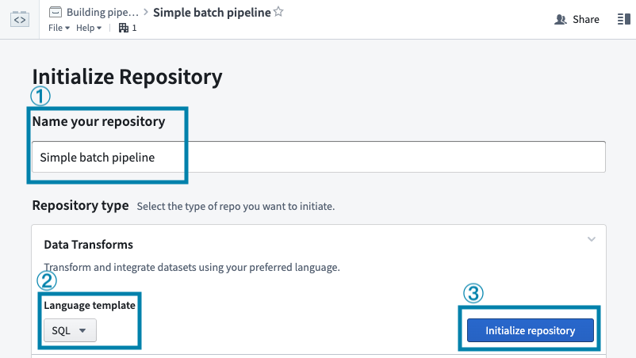

## 2. Import your data

If you have already imported a raw dataset that you will be working with, you can move on to the next step. Otherwise, you can download this sample dataset:

[`Download titanic.csv`](/docs/resources/foundry/building-pipelines/titanic.csv)

Refer to the guide on [manual data uploads](/docs/foundry/compass/manually-upload-data/) to learn how to upload this dataset into your Project alongside your repository.

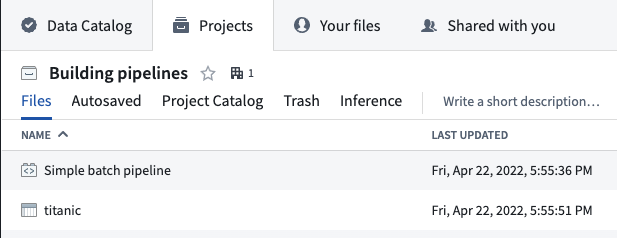

## 3. Create a branch

By creating personal **branches** to make changes, instead of directly editing the master version of the code, you can safely collaborate on the same Code Repository with your colleagues. You can track and undo changes as well as merge changes into the master code. Code can be reviewed on a line-by-line basis meaning that changes to production pipelines can easily be discussed amongst teammates. To learn more about branching in Foundry, see [this page](/docs/foundry/data-integration/branching/).

When you navigate to a Code Repository, you will be on the `master` branch by default. It is best practice for the `master` branch to be protected, meaning that it is not possible to directly edit code on that branch. Note that you can read files on protected branches, but you cannot edit or create files.

Before you can add changes to your Code Repository, you must first create your own branch which contains a copy of the code on the `master` branch. To create your branch, click the  icon next to the current branch name.

This opens a dialog for selecting an existing branch and choosing a custom name for the new branch:

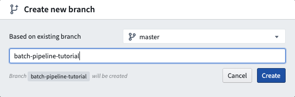

After you create a new branch, you will see an identical file tree on the left-hand side. You have simply created a copy of the code on the `master` branch you started on. You can now edit files in your branch.

## 4. Edit code

### Creating a new file

Now that you are working in your own branch, create a new SQL file by clicking the ellipses icon when you hover over a folder and then selecting **New file**. Once you select **New file**, you will be prompted to select the type of file and give it a name. For this example, select **SQL Transformation** and pick a filename (without spaces or special characters):

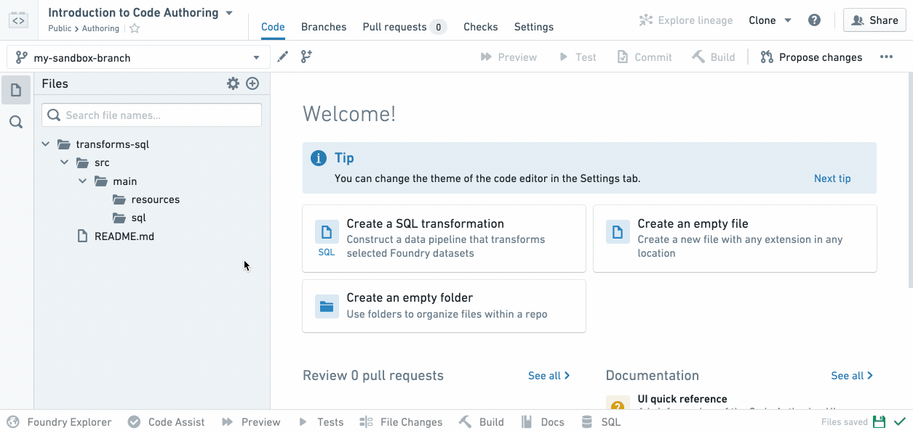

Notice that your new SQL file is highlighted in the file tree at the position where the resulting dataset will exist when you build it.

:::callout{theme="neutral"}
If a filename is green in the file tree, it means it is a newly created file in your branch that does not exist on the master branch where you started. If a filename is orange, it means it is a file that exists on the `master` but has been modified in your branch.
:::

Your newly created `.sql` file will declare an output dataset based on the filename you provide. For instance, if your repository is inside `/Public/Authoring` and you create `titanicAnalysis.sql`, your new file will automatically declare an output dataset `/Public/Authoring/titanicAnalysis`.

### Edit your file

Next, replace the placeholder text with your actual data transformation code. First, replace `` `SOURCE_DATASET_PATH` `` with the path to an actual input dataset. In this example, you will use the `titanic` dataset you imported in step (2) of this tutorial.

Notice that when you start typing a backtick, auto-complete will show you an interactive menu listing datasets you can use. When you select a dataset from the list, the dataset reference will be replaced by the unique ID of the dataset. This makes it so that your transformation code will continue to work even if the dataset is moved later.

Type the name of your project in the backticks, find the `titanic` dataset, and select it from the menu.

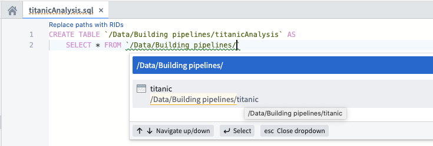

Continue writing SQL code to perform transformations on your data. You will see various help dialogs appear as you type SQL functions. For instance, say you want to create a new column with a one-letter abbreviated gender of passengers in your “titanic” dataset. You can view information about how to use the `SUBSTRING` function:

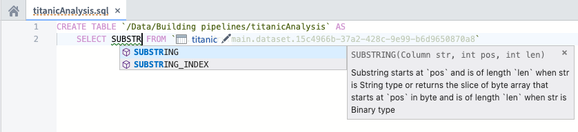

Before moving on, finish writing your data transformation code to select the “Name”, “Age”, “Survived”, and “Ticket” columns as well as a derived column called “Gender”. The “Gender” column represents the abbreviated gender of passengers; to create this column, call the `SUBSTRING` function on the “Sex” column.

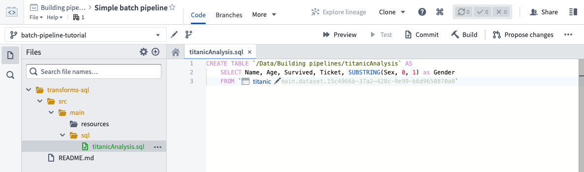

Note that you must define an alias for any derived columns you create in SQL. For more information about writing SQL data transformations, refer to the [Spark SQL language reference](/docs/foundry/transforms-sql/spark-reference/).

## 5. Test your changes

:::callout{theme="neutral"}
In Foundry, datasets can be branched (similar to code). This is useful for testing the design of multi-step data pipelines. For instance, you can test changes to pieces of data pipelines in isolation without breaking downstream dependencies for anyone who does not rely on your branch.
:::

Now that you have written your data transformation code, you should test the changes you have made in your branch. It is important to test your changes to be sure your code is working as expected before merging your changes into the `master` branch.

### Use preview to iterate on your changes

As you write your code, you can use the **Preview** feature to accelerate the development cycle and iterate on changes quickly. Preview runs your code on sampled inputs and provides a sample output without the need to commit your changes, run checks, or materialize a dataset in Foundry. Sample outputs may not be representative of the result of a build, but they can provide a way to confirm your code is working and producing the expected results.

To use, click **Preview** from the header, or open the **Preview** helper in the bottom bar of Code Editor. It is possible to preview file-based datasets or ones with schema.

For datasets with a schema, you can customize the inputs used when previewing your changes by clicking the **settings icon** for the input you wish to edit. The options are:

* **Original input:** Use a sample of the original input.
* **Previous preview:** For datasets produced in the same repository, you can chain previewed changes and use a preview of the dataset as an input to your preview.
* **Apply custom filters:** Apply filters on supported columns to test your changes on a specific subset of the input. For example: "all rows with a timestamp within a given window", or "all rows with a given string value".
* **Select a different dataset:** Select another dataset with all the columns that your code requires, to test specific cases or to provide any other custom sample as your input.

When running Preview for the first time on a dataset containing files, you must configure the files that will be used within the sample. Once the sample files have been selected, they can be reconfigured by selecting the relevant input. After saving the configuration, Preview will execute the code on the chosen sample of files.

When running Preview again, there will be no need to reconfigure input files. Once Preview has executed, you can view the sample output as rows or files. If you have the required permissions, you can also choose to download the output files.

### Commit your changes

After writing new code, you can commit your changes. In Code Repositories, you commit changes when you want to label the work you have performed. Even before you make a commit, your work is auto-saved by default. A commit specifically labels your set of changes when you reach a stopping point.

:::callout{theme="success" title="Tip"}
Clicking the **Commit** button commits your changes and runs automatic checks on your code. Clicking the **Build** button also commits your changes. Specifically, clicking **Build** runs automatic code checks and starts building your output dataset. If you want to quickly test your changes without building your dataset to ensure your code passes the code checks, click **Commit**. Otherwise, you can skip ahead to [build your dataset](#build-your-dataset-on-your-branch).
:::

To commit the changes you have made, click the  button at the top right corner and enter a summary of the changes you have made. Committing changes triggers automatic checks to run on your code. An icon in the top-right corner indicates the status of these checks; hover over it to see more details.

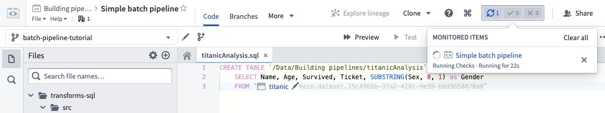

### Build your dataset on your branch

To test your changes, click the  button at the top of the screen.

Once you click the build button, two things happen: automatic checks run on your code and your output dataset starts to build. During this time, either a new output dataset will be created from the code in your branch or an existing output dataset will get updated to reflect your changes. You can view the progress of the running tasks in the **Build** helper. Once the tasks complete, the  icon indicates that each task has successfully completed. If you see the  icon instead, click the **details** button in the **Build** helper to learn more about what went wrong. This will take you to the **Checks** tab where you can look for error messages and also re-trigger your build.

Here is some important information about testing your changes and building your datasets:

* Clicking the **Build** button at the top right corner is equivalent to clicking the **Build** button in the **Build** helper at the bottom of the Code Repositories interface.
* You must select the file containing your data transformation logic before you can actually click the build button to run checks and start building your output dataset.
* Each time you trigger a build on your branch, it will queue up behind existing builds that are already running.

### Preview your dataset

Once your tasks successfully complete and your dataset gets built, you can preview your built dataset in the **Build** helper:

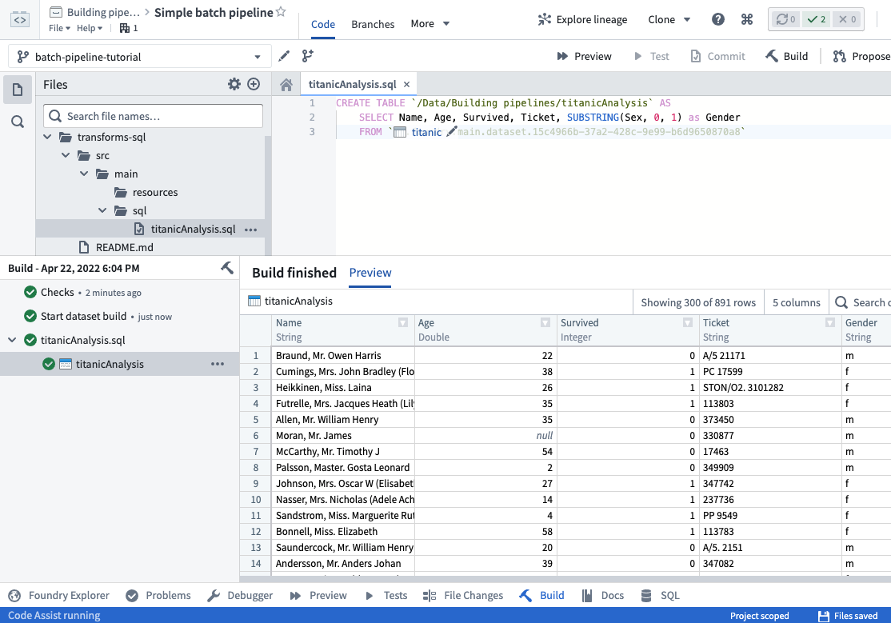

Click on the link to your dataset in the **Build** helper to open your full dataset.

Now, you have built the dataset on your own branch. Continue reading through the rest of this guide to learn how to merge your data transformation code into the master branch.

## 6. Propose your changes for review

By this point, you have:

* Created your own branch to make your changes on,
* Created a new SQL file with your data transformation code,
* Tested your changes and built your dataset in your branch, and
* Previewed your built output dataset.

Now, you will propose your changes for review by your teammates. After you have tested your changes and are happy with your resulting output dataset, you can propose your changes for review by your teammates.

:::callout{theme="success" title="Tip"}
Users with **Owner** permissions will be able to enable the option to “Automatically merge changes” when creating a *pull request*. This option is only available if at least one required check is configured and passing for your repository’s branch. If you enable the option to “Automatically merge changes”, your *pull request* will automatically get merged into the main code after you create it. Once the changes from your branch are merged into the main code, your branch will also get automatically deleted.
:::

To create a new **Pull Request**, click the  button at the top right corner. This will open the "New pull request" page where you can write a description of your changes and click the **Create pull request** button.

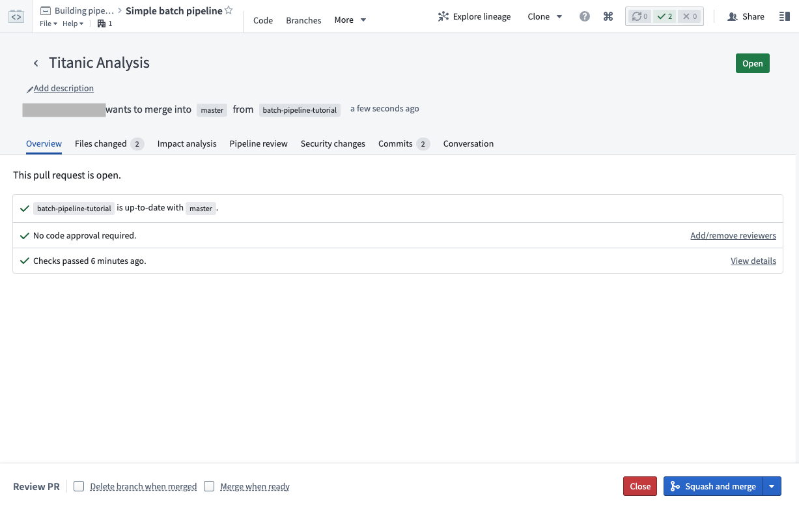

This creates a new pull request with your proposed changes. The pull request page provides a wide range of tools you can use to review how the proposed changes will affect your data pipeline:

* The **Files changed** tab allows teammates to review your code on a line-by-line basis
* The **Impact analysis** tab shows how affected datasets have changed on your branch, including changes to dataset schemas and health checks
* The **Pipeline review** tab shows a graph of your data pipeline and highlights how changes in this pull request affect the pipeline visually.

[Learn more about understanding the impact of changes in a Pull Request.](/docs/foundry/code-repositories/analyze-impact/)

In general, it is important to invite others to review your changes before they are merged into the master branch. Users can approve or reject on a file-by-file basis to keep track of which files still need to be adjusted before the pull request can be merged. To see which users have already approved or rejected a particular file, hover over the corresponding indicator icon.

Using the individual file review buttons is optional, but when you reject one file, this automatically rejects the pull request. Similarly, when you approve the pull request, all individual files get approved.

## 7. Merge your changes into the `master` branch

### Finalizing your changes

Once your changes have been reviewed, a user with the appropriate permissions (by default, Owners and Editors) can *merge* the changes on your pull request to combine them into `master`.

For the purposes of this tutorial, proceed by selecting the **Squash and merge** button at the bottom-right of your screen, then select **Squash and merge** again in the confirmation dialog.

:::callout{theme="neutral"}
Your repository may have different policies that must be met before changes are merged. Policies are defined by the repository owner in the [branch settings page](/docs/foundry/code-repositories/branch-settings/) and presented to code authors in the Pull Request page.
:::

### Validating that your changes are on master

Once your proposed changes have been accepted, you should validate that your the changes you made in your branch are reflected on the `master` branch. To do so, click the **Code** tab, select the `master` branch, and browse the files. Make sure you see the changes that you made in your branch.

### Deleting your branch

:::callout{theme="warning" title="Warning"}
Do not delete any branches that you did not create. For others working in the same Code Repository, this could result in lost work!
:::

Now you can delete the branch you created at the start of this tutorial to reduce clutter. Since your changes have been merged into the `master` branch, there is no need to keep your branch. Navigate to the **Branches** tab, and look under “Personal branches”. Delete the branch you created by clicking the   icon:

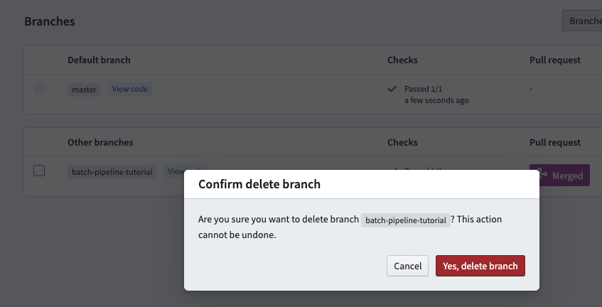

:::callout{theme="neutral"}
The pull request page offers a "Delete branch after merge" option to allow for quick clean-up of branches. This option is unavailable for protected branches.
:::

To delete a protected branch, you first need to [unprotect](/docs/foundry/code-repositories/branch-settings/#unprotect-branches) it and then follow the steps above.

## 8. Build your dataset on the `master` branch

The final step is to build your new dataset on the `master` branch. Similar to [build the dataset in your branch](#build-your-dataset-on-your-branch), click the  button at the top of the screen when your SQL code file is selected.

Once your tasks successfully complete and your dataset gets built, you can click on the link to your dataset in the **Build** helper to open your full dataset.

Congratulations! You have successfully created a new data transformation and published your changes using Code Repositories. Here are some possible next steps to continue learning:

* Learn [how to create an incremental pipeline](/docs/foundry/building-pipelines/incremental-overview/).
* Learn how to create more complex pipelines using [Python Transforms](/docs/foundry/transforms-python/getting-started/).
* Explore details about core concepts like [datasets](/docs/foundry/data-integration/datasets/), [branching](/docs/foundry/data-integration/branching/), and [builds](/docs/foundry/data-integration/builds/).

## 9. Revert changes

If you notice problems with a code change you have already merged into the master branch, there is an easy way to undo those changes. You can revert a specific commit by locating it in the commit history of the master branch. On the **Branches** tab of your repository, click on `master` to see the chronological list of all commits.

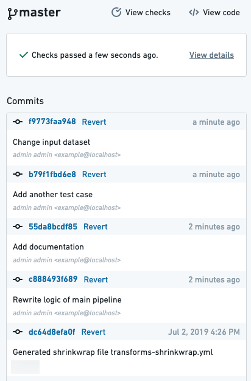

You can view a certain commit's code changes by clicking on the commit hash. Once you have located the commit you want to revert, click **Revert**. This will open a pull request into the master branch which you can review and merge.
