<!-- source: https://palantir.com/docs/foundry/building-pipelines/create-batch-pipeline-pb-media-set/ · mirrored 2026-08-18 from Palantir Foundry docs -->

# Create a media set batch pipeline with Pipeline Builder

In this tutorial, you will use Pipeline Builder to create a standard batch pipeline with media sets to extract text from PDF.

This example uses PDFs of publicly available documents published by Palantir.

At the end of this tutorial, you will have a pipeline that looks like the following:

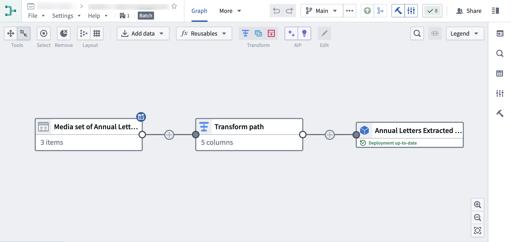

The pipeline will produce a new Object output of the extracted PDF text, which can be used for further exploration.

## Part 1: Initial setup

First, create a new pipeline.

1. When logged into Foundry, access **Pipeline Builder** from the left navigation bar. If Pipeline Builder is not in the list of applications, select **View all** and find **Pipeline Builder** under the **Build & Monitor Pipelines** section.

   

2. Next, on the top right of the Pipeline Builder landing page, create a new pipeline by selecting **New pipeline**, then choose **Batch pipeline**. Under **Select batch compute**, choose **Standard** or **Faster**. For this example, choose **Standard**.

   

   :::callout{theme="neutral"}
   The ability to create a streaming pipeline is not available on all Foundry environments. Contact Palantir Support for more information if your use case requires it.
   :::

3. Select a location to save your pipeline. Note that pipelines cannot be saved in personal folders.

   

4. Choose **Create pipeline**.

## Part 2: Add media sets

Now, you can add datasets to your pipeline workflow. For this tutorial, you will use PDFs of publicly available documents from Palantir.

1. From the Pipeline Builder page, select **Add Foundry data** on the home page.   
   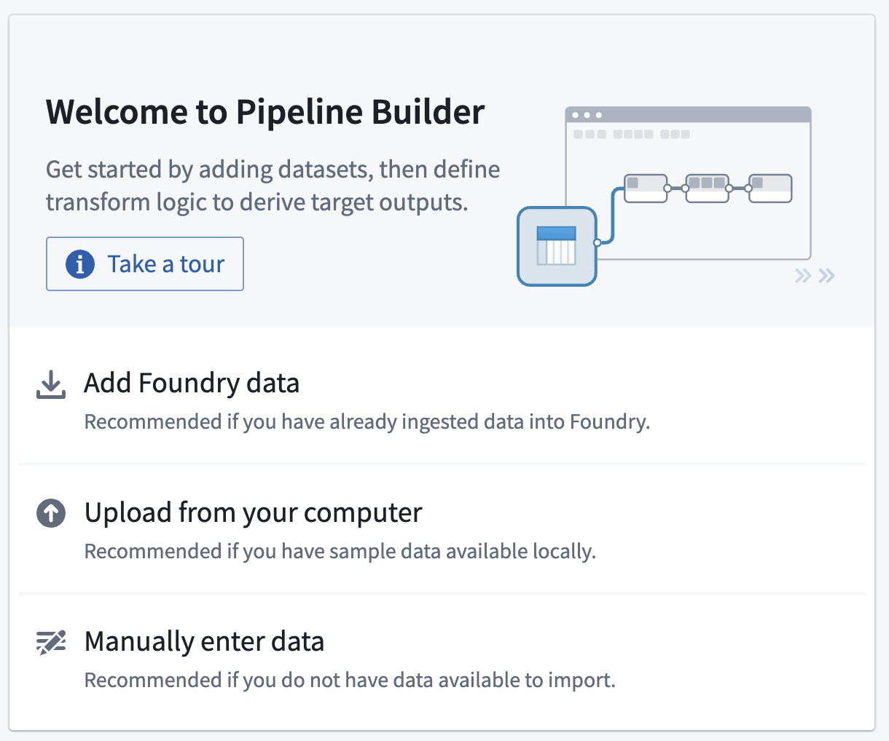   

   You can also select the **Add data** action on the top panel.   
      

   Alternatively, you can drag and drop a file from your computer to use as your media set.

2. If you selected **Add data** or **Add Foundry data**, you will have the option to select your desired media sets.   
   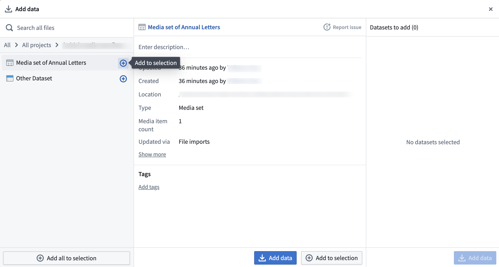   

3. When all media sets are selected, choose **Add data**.

4. When you have imported your media set you will be able to see the media set with thumbnail preview.   
   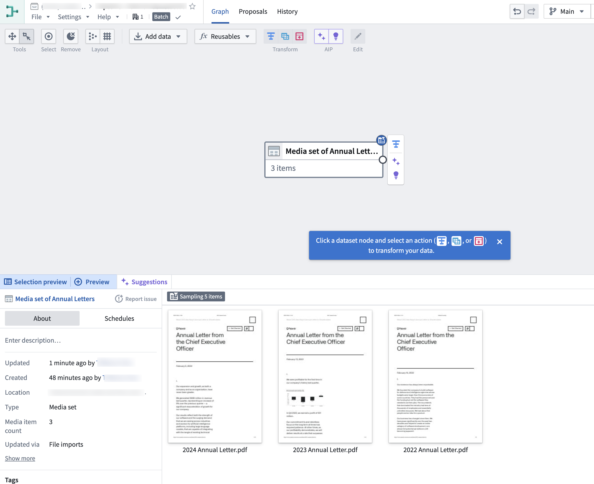   

## Part 3: Media set transformations

After adding raw media sets, you can perform some basic transformations. For this workflow, you will extract the text from these PDF files.

### Extract text from PDF

You can directly transform media or extract information from media using [media references](/docs/foundry/data-integration/media-sets/). In this example, you will extract text from the `Media set of Annual Letters` media set.

1. Choose the `Media set of Annual Letters` node in your graph.

2. Select **Transform**.   
      

3. Search for and select the **Extract text from PDF** transform from the dropdown to open the board.   
   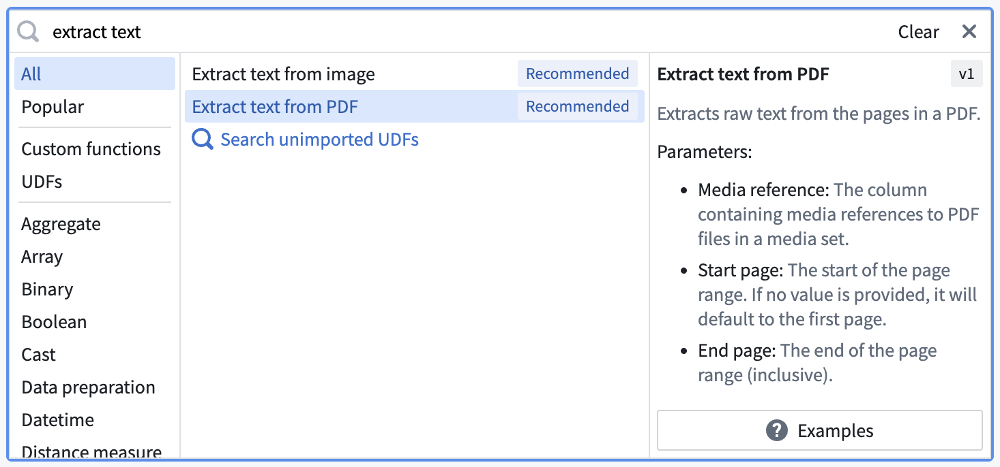   

4. Select the extract method according to your needs and fill out the rest of the parameters.

* `Raw text`: Computer-generated PDFs
* `OCR`: Photocopies
* `Layout aware`: Text and bounding boxes   
  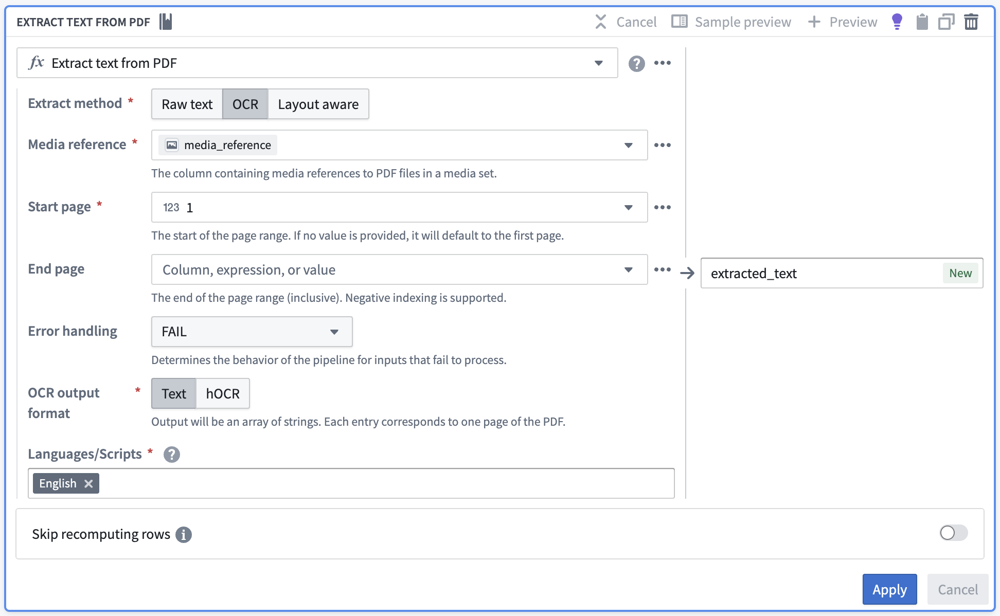   

5. Choose **Apply** to add the transform to your pipeline.
6. Your output should look like this when you hover over the extracted text:   
   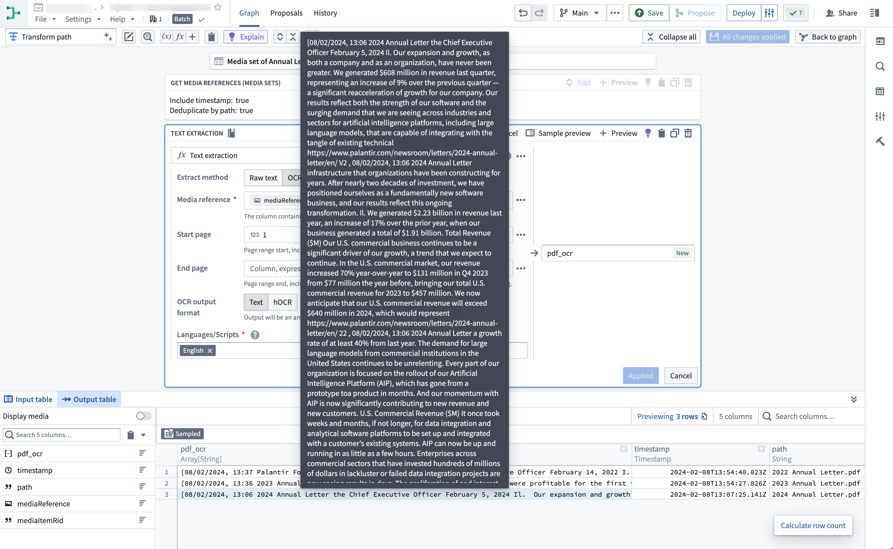   

   You can now run available string transformations on the extracted text column.
7. Select **Close** at the top right to return to your pipeline graph.   
   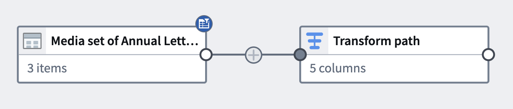   

#### (Optional) Semantic search workflow

If desired, you can continue with a [semantic search workflow](/docs/foundry/ontology/overview-semantic-search/) with your extracted text.

## Part 4: Add an output

Now that you have finished extracting text from your PDFs and potentially running extra string transformations, you can add an output. For this tutorial, you will add an object output.

1. In the `Transforms` node where you have completed your transformations, select **Add output**.   
   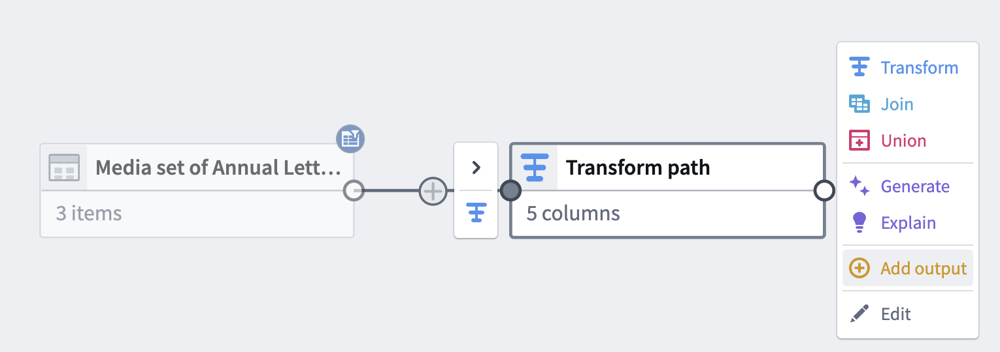   

2. Select **New object type**.   
   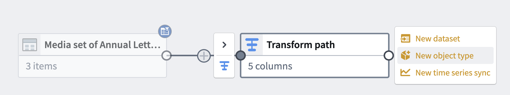   

3. Name your object type and set the Ontology by choosing **Please select an ontology**.   
   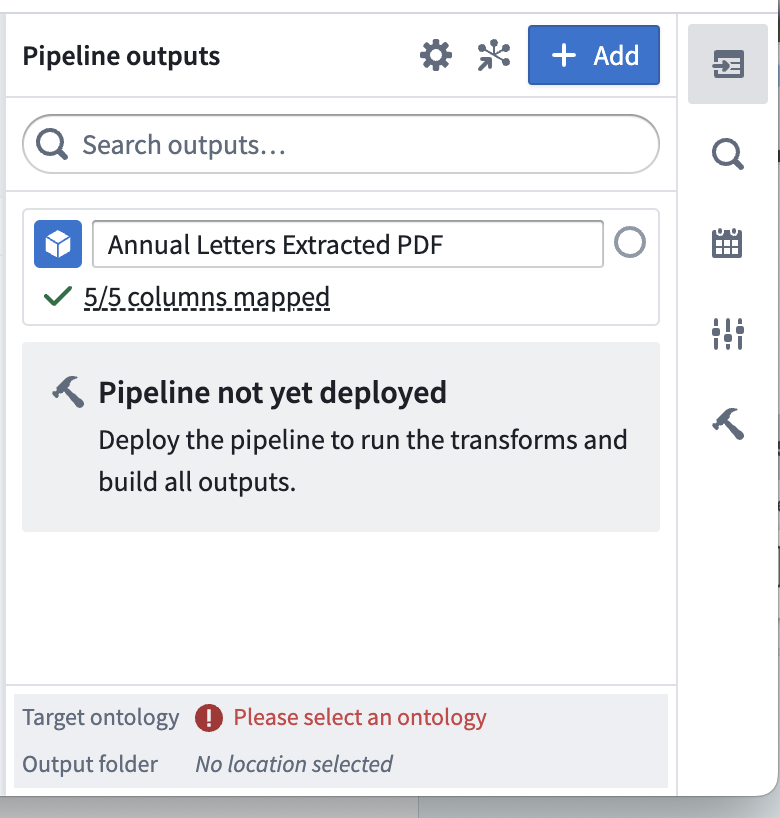   

4. Select **Edit** and edit any column mapping. Ensure that you choose a valid column for the primary key.   
   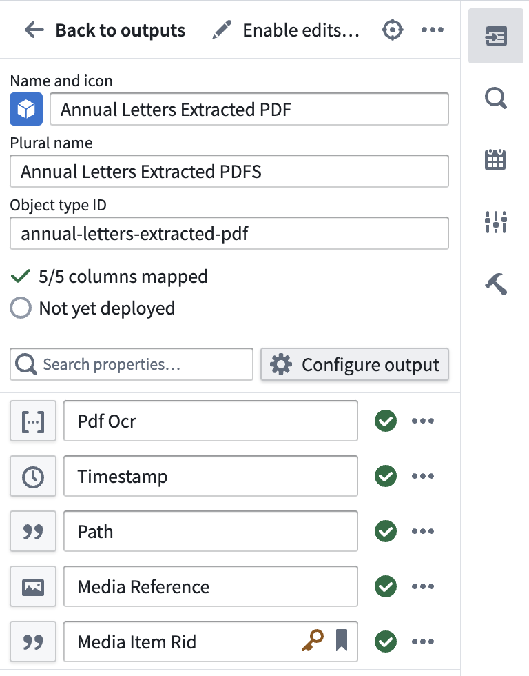   

## Part 5: Build the pipeline

1. To build your pipeline, make sure to select **Save**, then **Deploy > Deploy pipeline**.   
   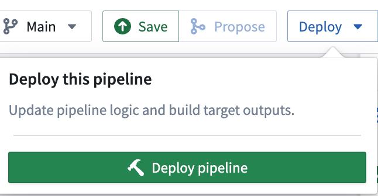   

2. You should see `Initializing deployment` under the `Deploy Pipeline` sidebar option.   
   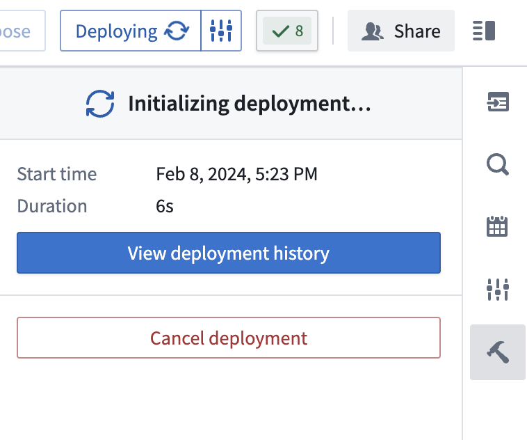   

3. Select **View deployment history** to track the progress of your deployment. You should be led to the `History` tab in your pipeline where you can view the statuses and history of your deployments:   
   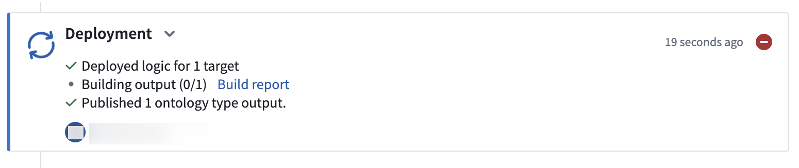   
   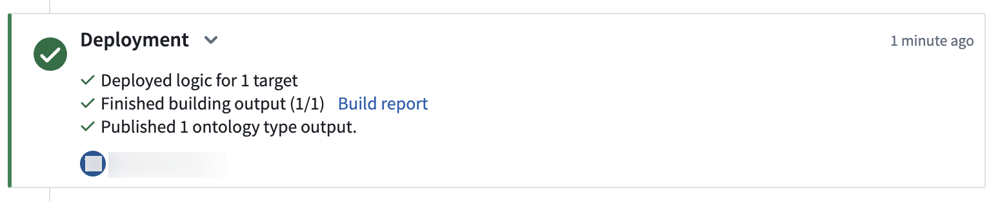   

## (Optional) Part 6: North of the Ontology

Once deployment has completed and your object is initialized, you should be able to directly action on your object output. Select **Create Workshop module** to generate a Workshop module with your pipeline output.

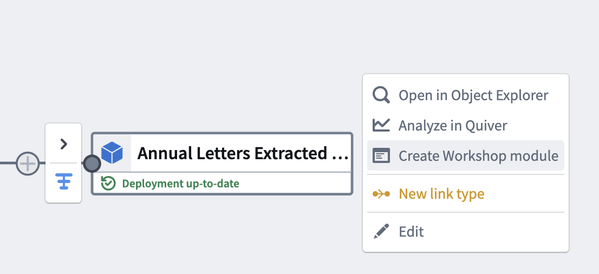

With this last step, you have generated your pipeline output and a Workshop module.

## FAQ

### Can I transform media before extracting data from it?

Yes, you can transform media before extracting data from it, and this works with many extraction operations including extracting text and using large language models (LLMs). As an example, consider a media set containing landscape-oriented images that need to be rotated clockwise 90 degrees before performing OCR-based text extraction. You can add an expression to rotate images and subsequently add an expression to extract text with OCR.

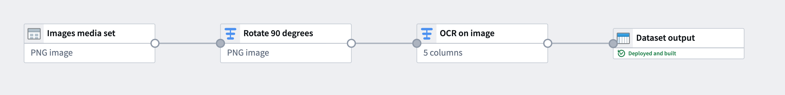

:::callout{theme="warning"}
To safely write the pipeline results to a dataset output, you must remove the media reference column from the output schema as transformed media references are not valid column outputs.

To do this, remove the column using the output dialog.
:::
