<!-- source: https://palantir.com/docs/foundry/building-pipelines/create-batch-pipeline-pb/ · mirrored 2026-08-18 from Palantir Foundry docs -->

# Create a dataset batch pipeline with Pipeline Builder

In this tutorial, you will use Pipeline Builder to create a simple pipeline with an output of a single dataset with information on flight alerts. You can then analyze this output dataset with tools like Contour or Code Workbook to answer questions such as which flight paths have the greatest risk of disruption.

The datasets used below are searchable by name in the dataset import step; you can find them in your Foundry filesystem.

At the end of this tutorial, you will have a pipeline that looks like the following:

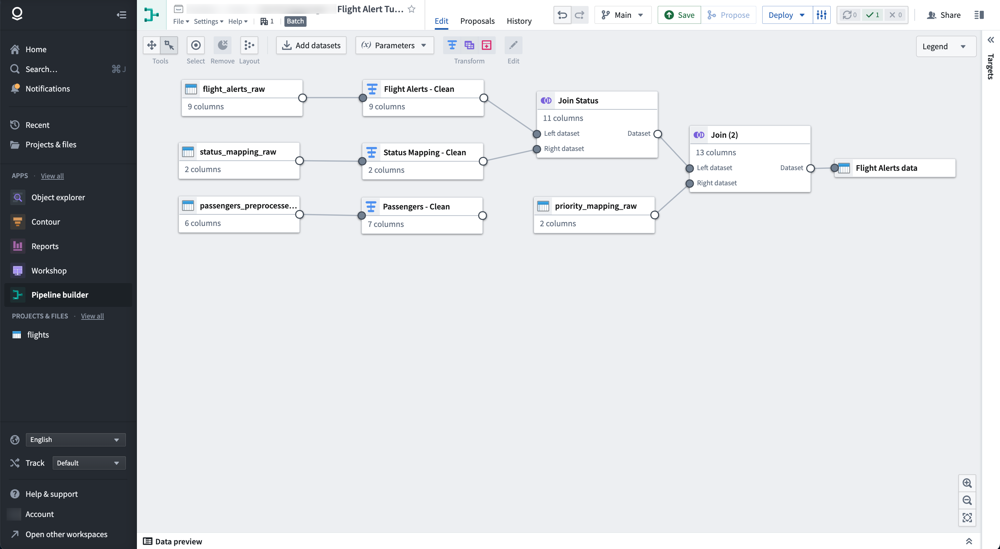

The pipeline will produce a new dataset output of `Flight Alerts Data` that you can use for further exploration in the platform.

:::callout{theme="success" title="Palantir Learning portal"}
You can find a deep dive course on building your first pipeline at [learn.palantir.com ↗](https://learn.palantir.com/deep-dive-building-your-first-pipeline).
:::

## Part 1: Initial setup

First, create a new pipeline.

1. When logged into Foundry, select **Applications** from the left navigation sidebar to search for and open **Pipeline Builder**   
   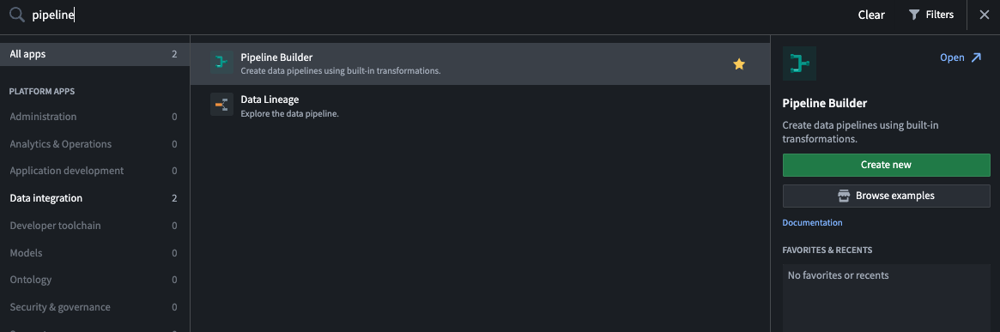   

2. Next, on the Pipeline Builder landing page, create a new pipeline by selecting **New pipeline**, then choose **Batch pipeline**. Under **Select batch compute**, choose **Standard**.   
   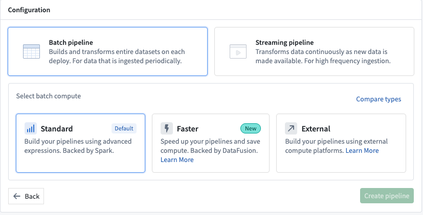   

:::callout{theme="neutral"}
The ability to create a streaming pipeline is not available on all Foundry environments. Contact Palantir Support for more information if your use case requires it.
:::

3. Select a location to save your pipeline. Note that pipelines cannot be saved in personal folders.   
   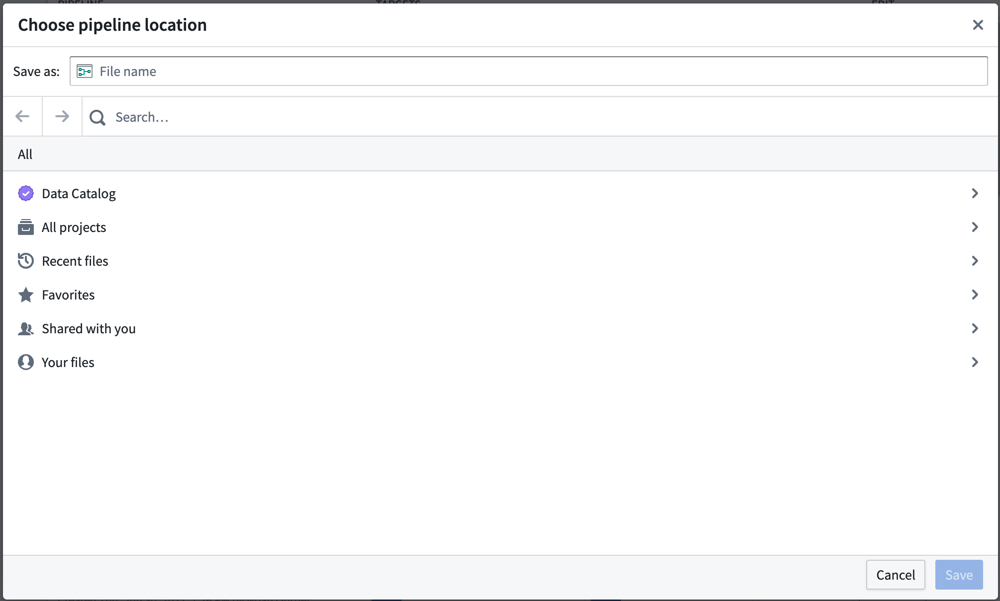   

4. Select **Create pipeline**.

## Part 2: Add datasets

Now, you can add datasets to your pipeline workflow. Use sample datasets of notional or open-source data.

From the Pipeline Builder page, select **Add datasets** from Foundry.

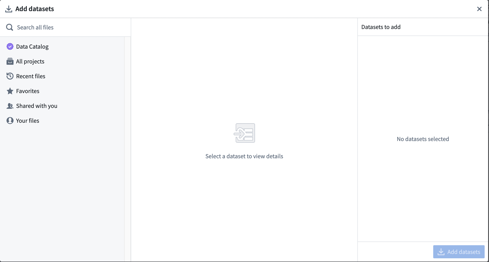

Alternatively, you can drag and drop a file from your computer to use as your dataset.

In this walkthrough example, you can add the `passengers_preprocessed`, `flight_alerts_raw`, and `status_mapping_raw` datasets. To add a selection of datasets, select the dataset. Then, choose the inline **+** icon, or select **Add to Selection**.

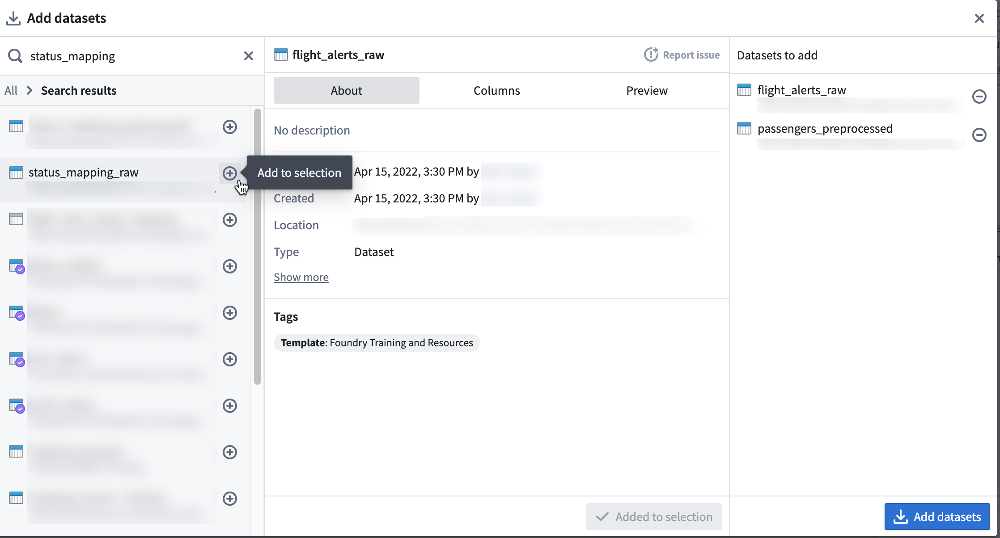

After selecting all required datasets, choose **Add datasets**.

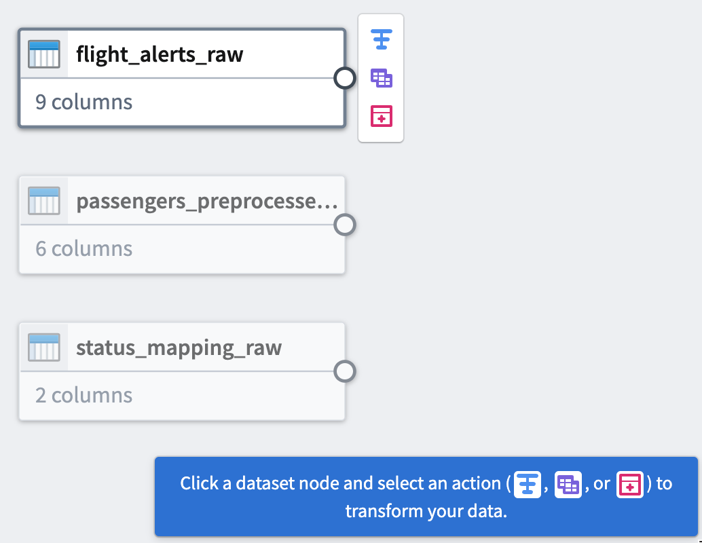

## Part 3: Clean data

After adding raw datasets, you can perform some basic cleaning transforms to continue defining your pipeline. You will transform three of your raw datasets.

### Dataset 1

The first step is to clean the `passengers_preprocessed` dataset. Start by setting up a cast transform to change the `dob` column name into `dob_date` while converting the values to the `MM/dd/yy` format.

#### Cast transform

1. Select the `passengers_preprocessed` node in your graph.

2. Select **Transform**.   
      

3. Search for and select the **cast** transform from the dropdown menu to open the cast configuration board.   
   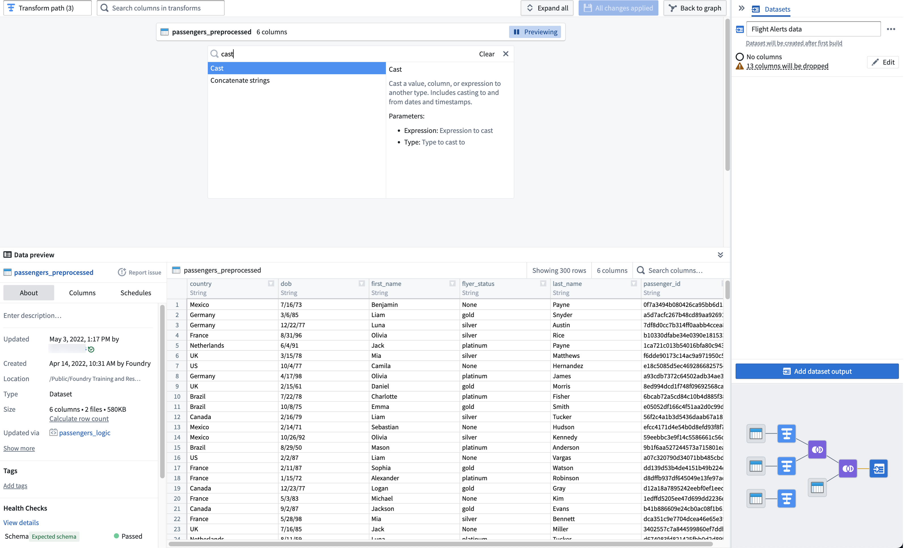   

4. From the **Expression** field, select `dob`; for **Type**, select `Date`.

5. Enter `MM/dd/yy` for the **Format** type. Be sure to use uppercase `MM` to ensure a successful cast transform. Change the output column name to `dob_date`.

   Your cast board should look like this:   
   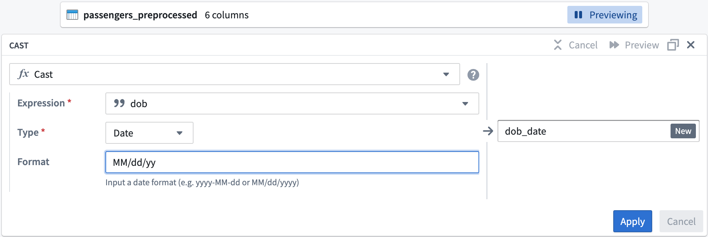   

6. Select **Apply** to add the transform to your pipeline.

#### Title case transform

Now, you can format the `flyer_status` column values to start with an uppercase letter.

1. In the transform search field, search for and select the **Title case** transform to open the title case configuration board.

2. In the **Expression** field, select the `flyer_status` column from the dropdown.

   Your title case board should look like this:   
   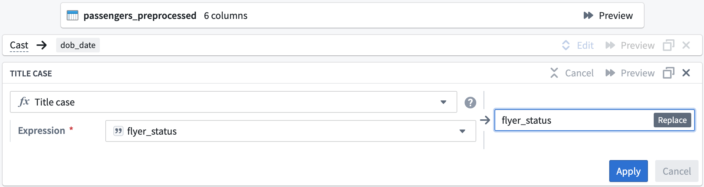   

3. Select **Apply** to add the transform to your pipeline.

4. In the top left corner of the transform configuration window, rename the transform `Passengers_Clean`.   
   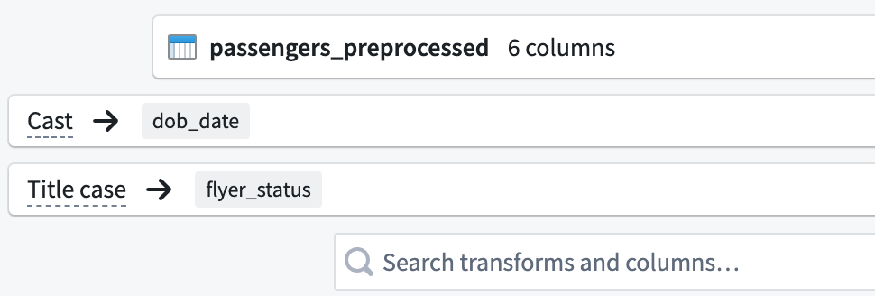   

5. Select **Back to graph** at the top right of the screen to return to your pipeline graph.   
   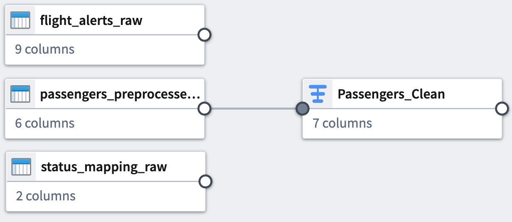   

### Dataset 2

Now, clean the `flight_alerts_raw` dataset. The first step is to set up another cast transform to convert the `flight-date` column values into a `MM/dd/yy` format.

#### Cast transform

1. Select the `flight_alerts_raw` dataset node in your graph.

2. Select **Transform**.   
   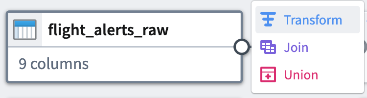   

3. Search for and select the **cast** transform from the dropdown menu to open the cast configuration board. You can read the function definition listed on the right side of the selection box to learn more about the function.   
   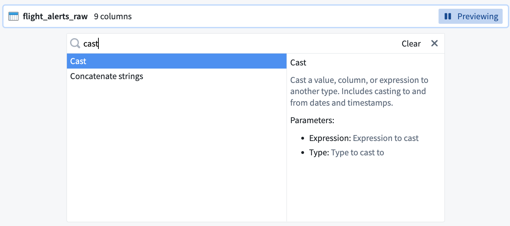   

4. In the **Expression** field, select the `flight_date` column from the dropdown.

5. Choose `Date` from the **Type** field dropdown menu.

6. Enter `MM/dd/yy` for the **Format** type. Be sure to use uppercase `MM` to ensure a successful cast transform.

   Your cast board should look like this:   
   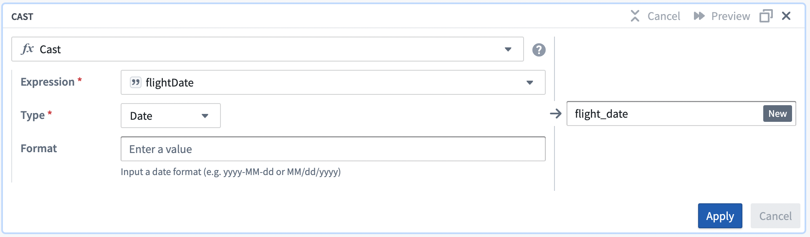   

7. Select **Apply** to add the transform to your pipeline.

#### Clean string transform

Now, add a **Clean string** transform that will remove whitespace from `category` column values. For example, the transform will convert `delay···` string values to `delay`.

1. Search for and select the clean string transform from the dropdown to open the clean string configuration board.

2. In the **Expression** field, select the `category` column from the dropdown menu.

3. Check the boxes for all three of the **Clean actions** options:

   * Converts empty strings to null
   * Reduce sequences of multiple whitespace characters to a single whitespace
   * Trims whitespace at beginning and end of string

   Your clean string board should look like this:   
   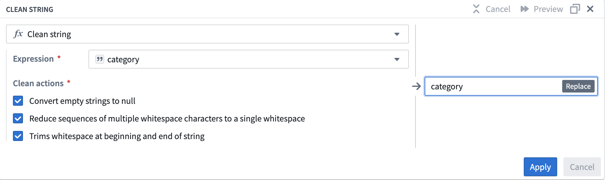   

4. Select **Apply** to add the transform to your pipeline.

5. In the top left corner of the transform configuration window, rename the transform `Flight Alerts - Clean`.

6. Select **Back to graph** at the top right to return to your pipeline graph.   
   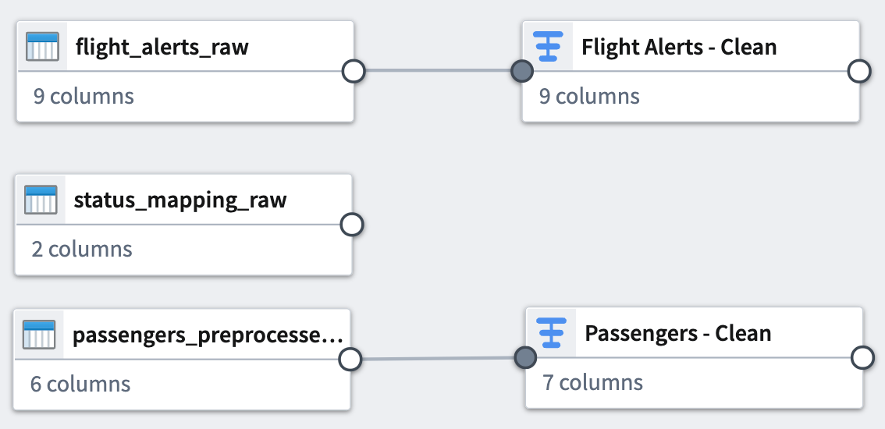   

### Dataset 3

Finally, clean the `status_mapping_raw` dataset.

#### Clean string transform

You will only apply a **Clean string** transform to this dataset.

1. Select the `status_mapping_raw` dataset node in your graph.

2. Select **Transform**.   
   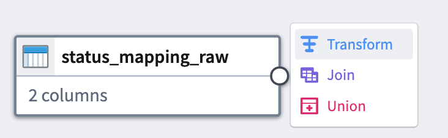   

3. In the **Search transforms and columns...** field, select the `mapped_value` column from the dropdown menu.   
   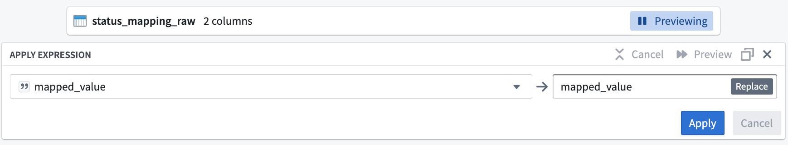   

4. In the same field, search and select the clean string transform from the dropdown.

5. Check the boxes for all three of the **Clean actions** options:

* Converts empty strings to null
* Reduce sequences of multiple whitespace characters to a single whitespace
* Trims whitespace at beginning and end of string

  Your clean string board should look like this:   
  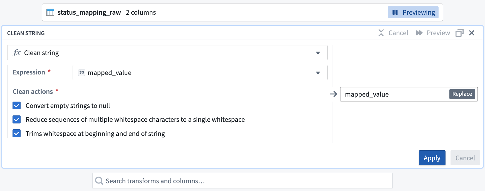   

6. Select **Apply** to add the transform to your pipeline.
7. In the top left corner of the transform configuration window, rename the transform `Status Mapping - Clean`.
8. Select **Back to graph** at the top right to return to your pipeline graph.

   You can see the connection between the transforms you just added and the datasets to which you applied them.   
   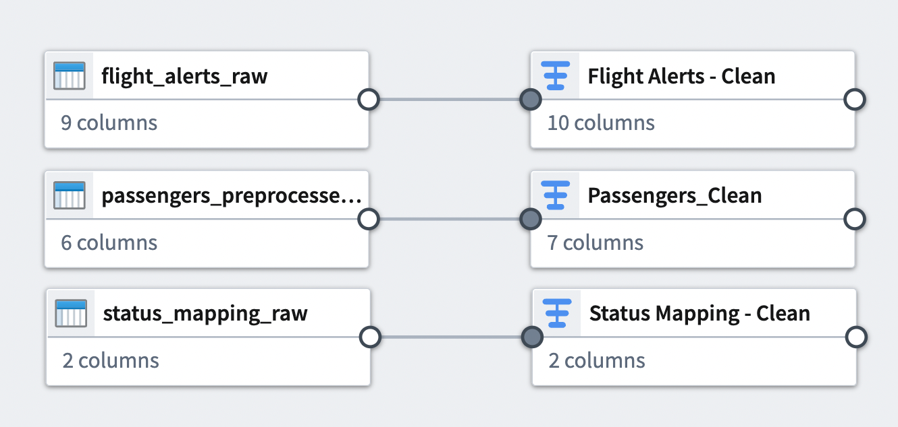   

## Part 4: Join datasets

Now, you can combine some of the cleaned datasets with **joins**. A join allows you to combine datasets with at least one matching column. You will add two joins to your pipeline workflow.

### Join 1

Your first join will combine two of the cleaned datasets.

1. Select the `Flight Alerts - Clean` transform node. This will be the left side of the join.

2. Select **Join**.   
   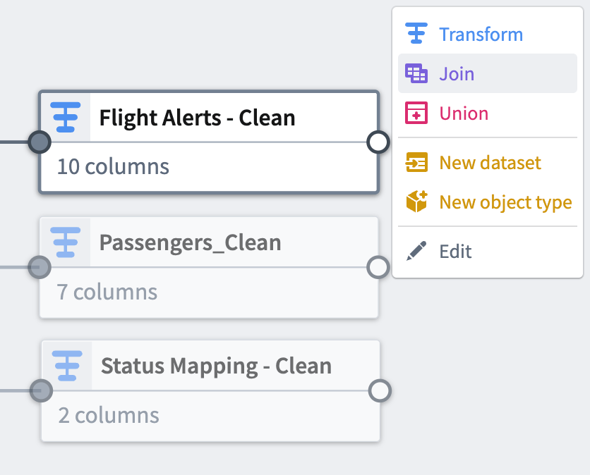   

3. Choose the `Status Mapping - Clean` node to add it as the right side of the join.

4. Select **Start** to open the join configuration board.   
      

5. Verify that the **Join type** is set to `Left join`.

6. Set the **Match condition** columns to `status` is equal to `value`.

7. Select **Show advanced** to view additional configuration options.

8. Set the **Prefix** of the right `Status Mapping - Clean` dataset to `status`.

   Your join configuration board should look like this:   
   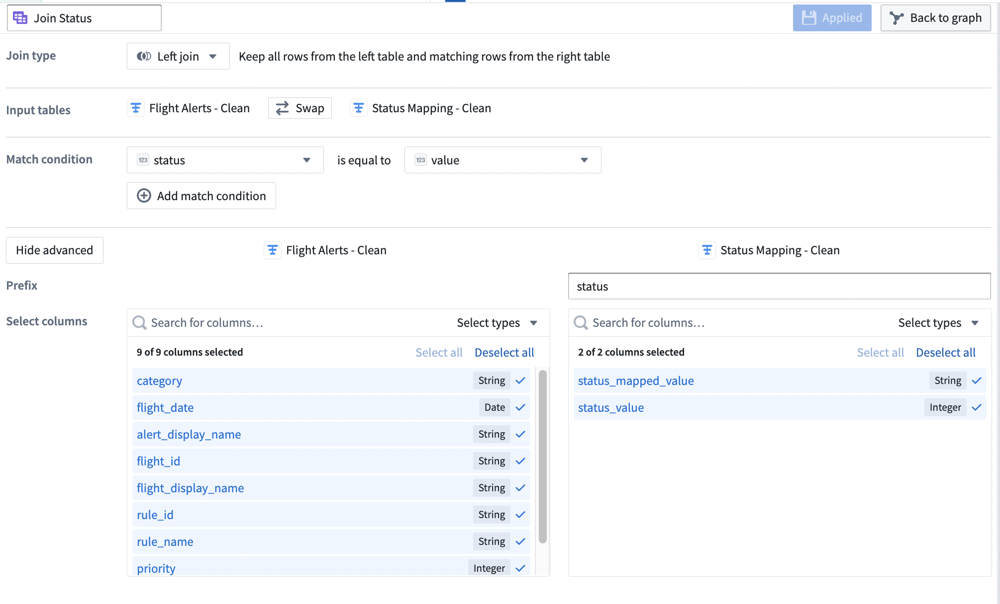   

9. Select **Apply** to add the join to your pipeline.

10. View a preview of the join output table in the **Preview** pane at the bottom of the configuration window.   
    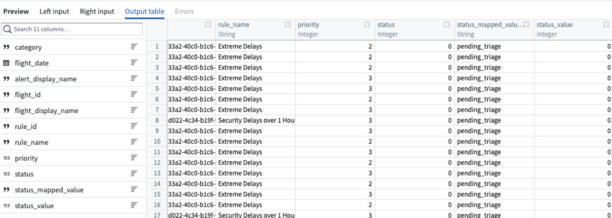   

11. In the top left corner of the join configuration window, rename the join `Join Status`.

12. Select **Back to graph** at the top right to return to your pipeline graph.   
    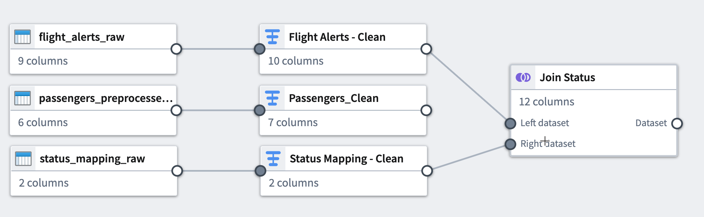   

13. To make the graph easier to read, select the **Layout** icon to automatically arrange the datasets, or manually drag the two connected datasets next to each other.   
    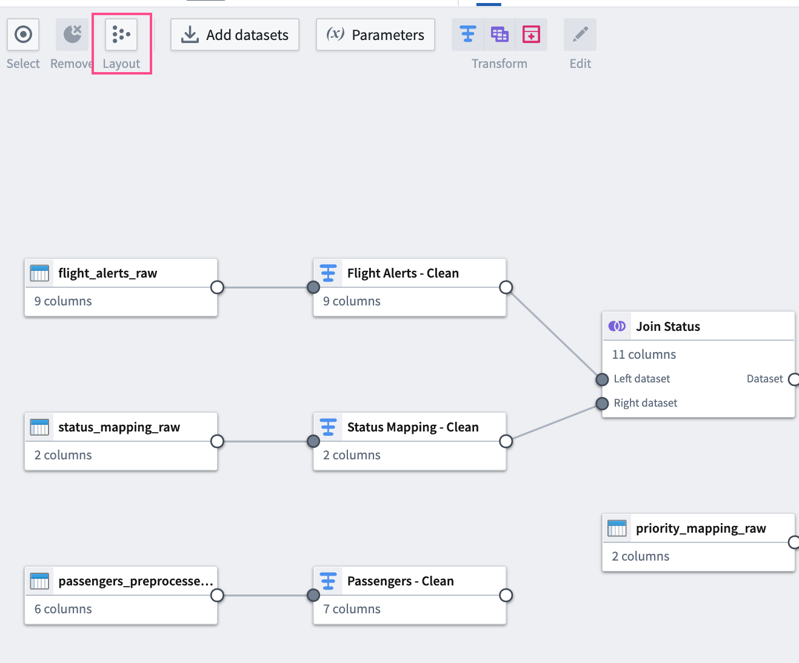   

### Join 2

For your second join, combine your first join output table with another raw dataset.

1. Add the `priority_mapping_raw` dataset to the graph by selecting **Add datasets**.

2. Select the `Join Status` node you just added to the graph. This will be the left side of the join.

3. Select **Join**.

4. Select the `priority_mapping_raw` dataset node to add it as the right side of your join.

5. Select **Start** to open the configuration board.   
      

6. Verify that the **Join type** is set to `Left join`.

7. Set the **Match condition** columns to `priority` is equal to `value`.

8. Select **Show advanced** to view additional configuration options.

9. Set the **Prefix** of the right `priority_mapping_raw` dataset to `priority`.

   Your join configuration board should look like this:   
   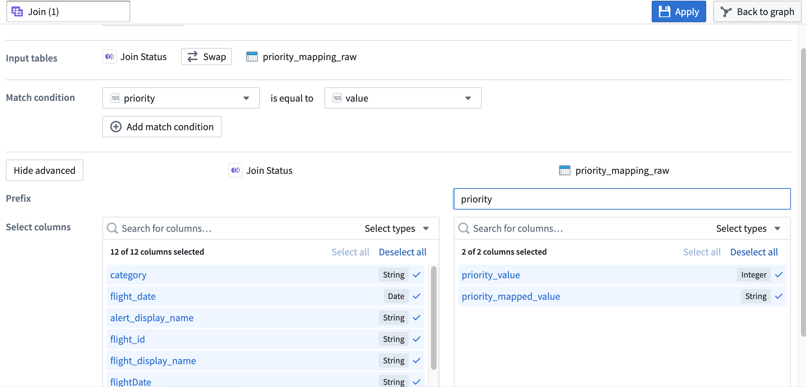   

10. Select **Apply** to add the join to your pipeline.

11. View a preview of the join output table in the **Preview** pane at the bottom of the configuration window.   
    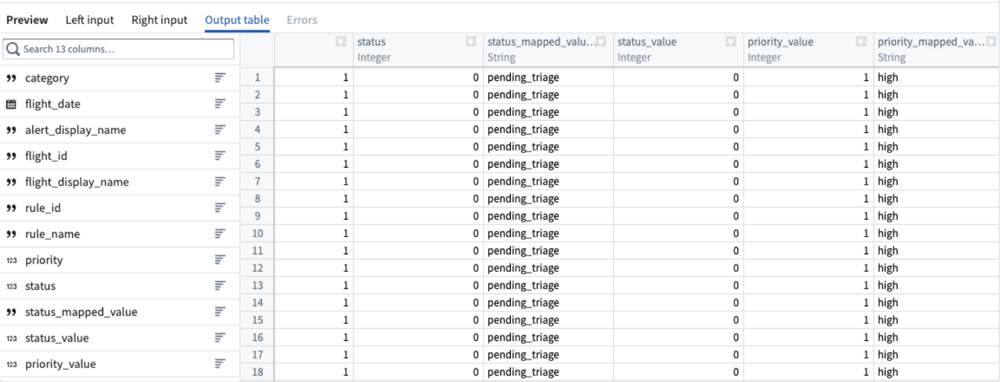   

12. In the upper left corner of the join configuration window, rename the join `Join (2)`.

13. Select **Back to graph** at the top right to return to your pipeline graph.

You can now see the connection between the joins you just added and the datasets to which you applied them.

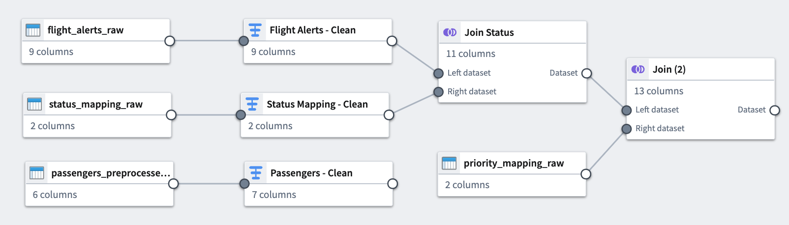

## Part 5: Add an output

Now that you have finished transforming and structuring your data, you can add an output. For this tutorial, you will add a dataset output.

1. In the **Pipeline outputs** sidebar to the right of the Pipeline Builder graph, name the output `Flight Alerts data`. Then select **Add dataset output**.
2. Link `Join (2)` to the output by selecting the white circle to the right of the join node and connecting it to the `Flight Alerts data`dataset.
3. Select **Use input schema** to use existing schema.
4. From here, select the columns of data to keep. In this case, keep all the data together.   
   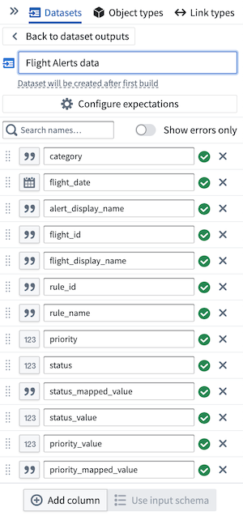   

## Part 6: Build the pipeline

To build your pipeline, select **Deploy** in the top right of your graph. Then, choose **Save and deploy**.

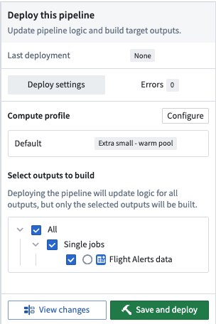

You should see a small alert indicating the deploy was successful. Select **View** in the alert box to open the **Build progress** page.

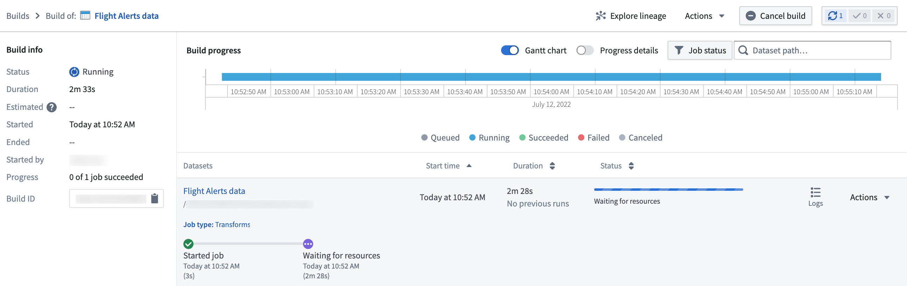

From this page, you can monitor the progress of your build until the dataset output is ready.

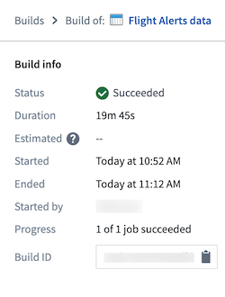

You can now access your dataset by selecting **Actions > Open**.

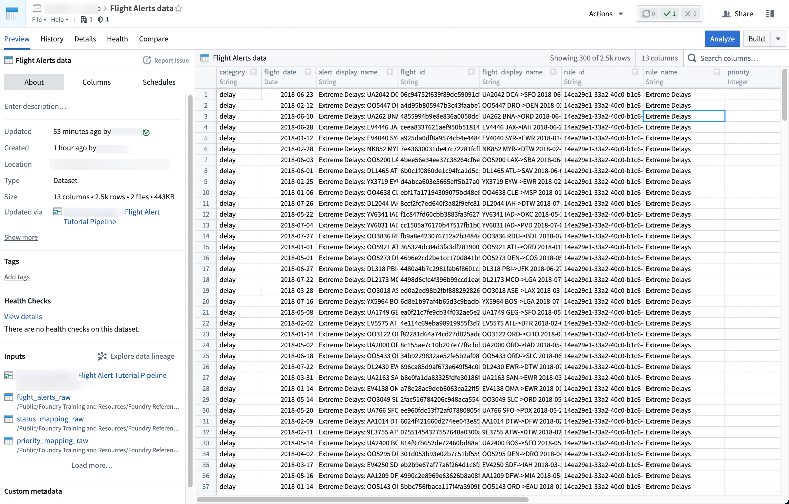

With this last step, you generated your pipeline output. This output is a dataset that can be further explored in other applications in Foundry, such as [Contour](/docs/foundry/contour/analysis-create-path/#starting-an-analysis-from-datasets-in-foundry) or [Code Workbook](/docs/foundry/code-workbook/workbooks-overview/).
