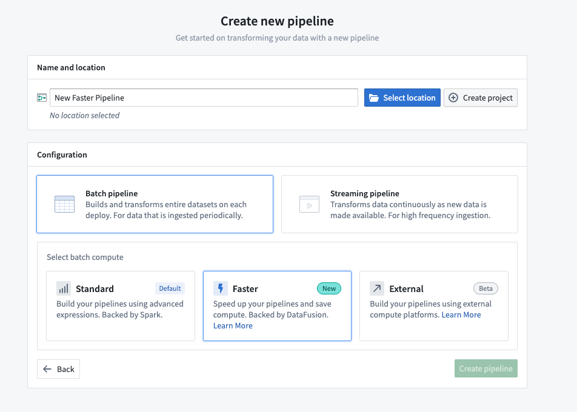
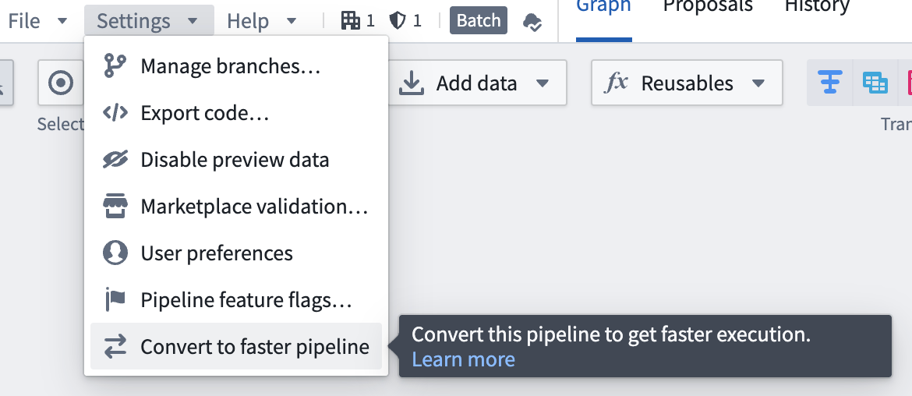
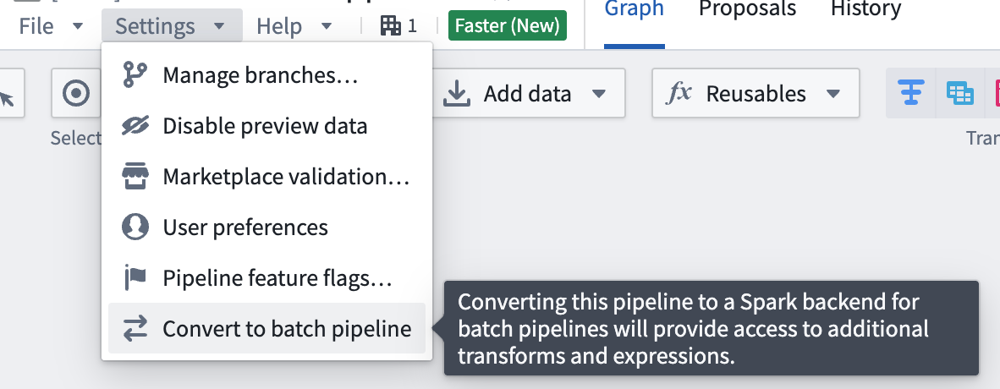
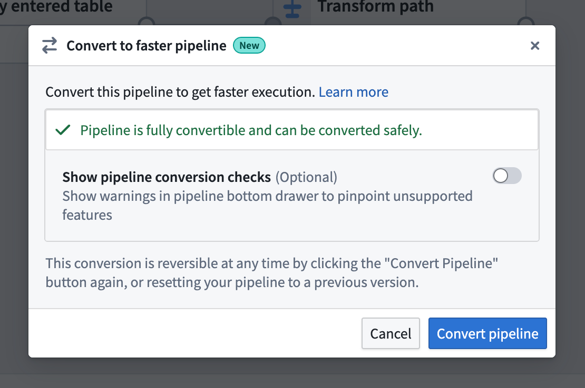
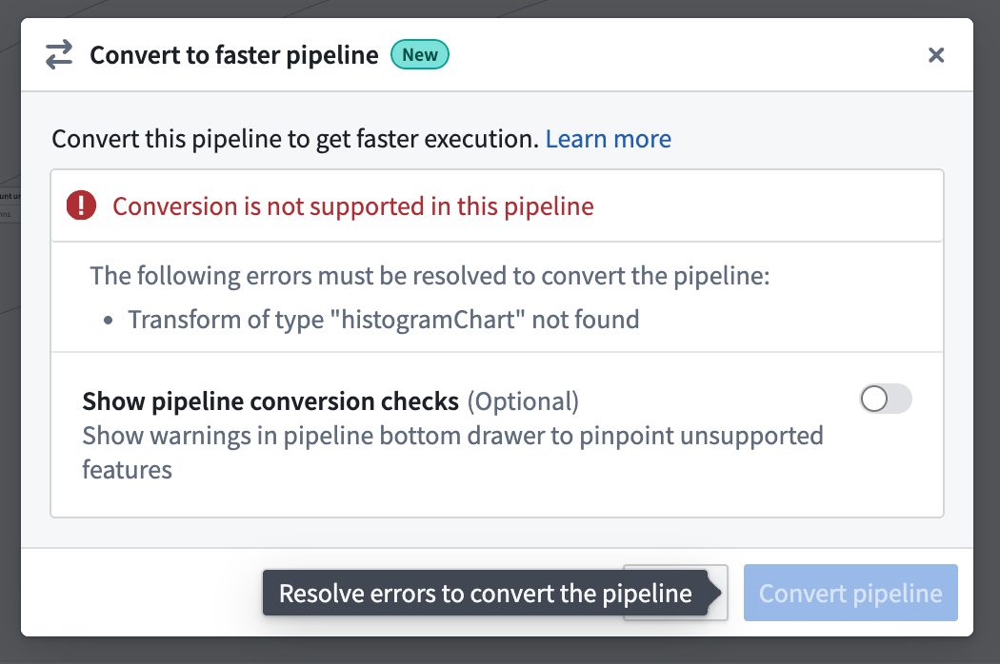
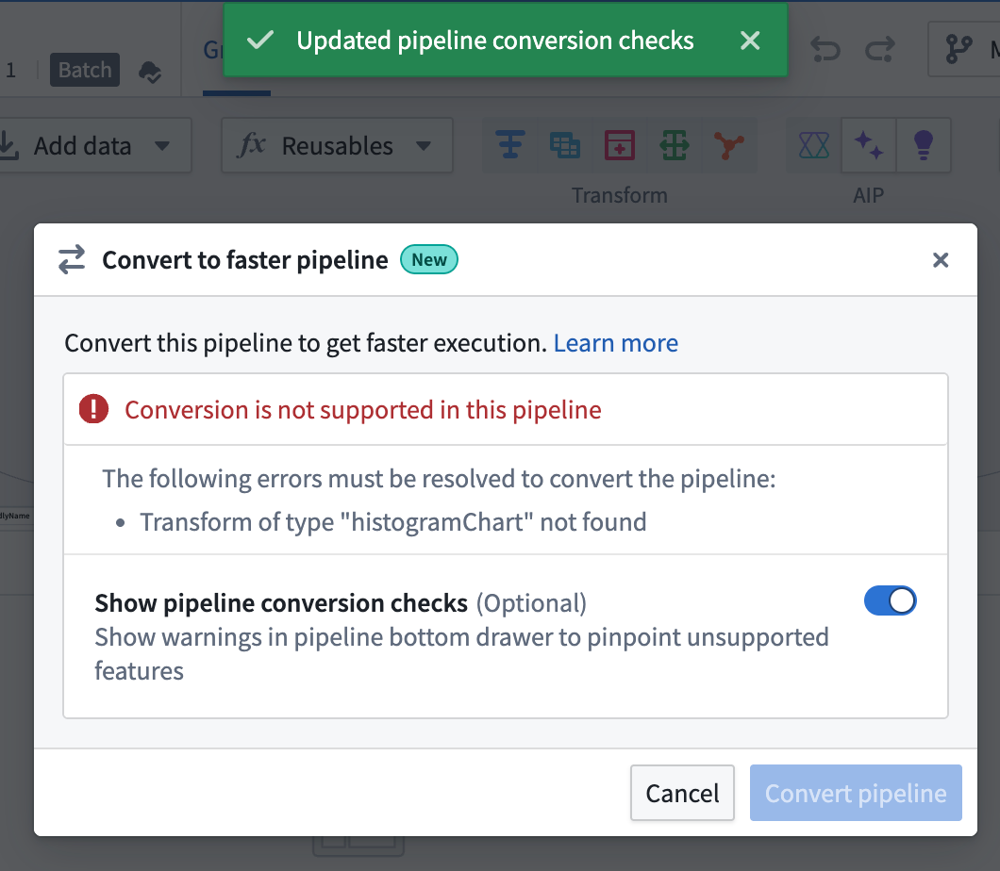
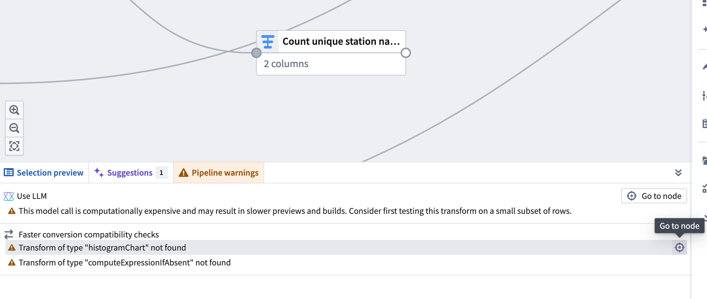

<!-- source: https://palantir.com/docs/foundry/building-pipelines/create-faster-pipeline-pb/ · mirrored 2026-08-18 from Palantir Foundry docs -->

# Faster pipelines in Pipeline Builder

:::callout{theme="neutral"}
Faster pipelines were previously known as *lightweight pipelines*, as the term "lightweight" referred to the reduced time and compute resources required to execute these pipelines as opposed to the size of the data they handle. The name change reflects that faster pipelines reduce both execution time and compute resource usage, even for large-scale datasets.
:::

:::callout{theme="warning"}
If you are unfamiliar with creating pipelines in Pipeline Builder, review the documentation on [how to create a batch pipeline in Pipeline Builder](/docs/foundry/building-pipelines/create-batch-pipeline-pb/) before proceeding.
:::

Pipeline Builder now supports faster pipelines, which can reduce execution times for batch and incremental pipelines. This pipeline uses a backend powered by [DataFusion ↗](https://datafusion.apache.org/), an open-source query engine written in [Rust ↗](https://www.rust-lang.org/). Compared to traditional Spark-based pipelines, faster pipelines can substantially accelerate compute processes.

Faster pipelines are specifically engineered to optimize build times and execute low-latency operations efficiently. In particular, pipelines that run in under 15 minutes will benefit most from faster pipeline configuration.

We encourage you to experiment with different pipeline configurations to improve performance. You can explore the capabilities by testing them on a branch or making a copy of an existing pipeline to compare the new performance with your original configuration.

## Create a new faster pipeline

1. Open Pipeline Builder and select **Create new pipeline**.
2. After entering a name for your pipeline and the desired location, choose **Faster pipeline** under **Pipeline type**.
3. Select **Create pipeline**.

## Convert between faster and standard batch pipelines

You can convert between faster and standard batch pipelines, and vice versa, by following the steps below. This conversion can be reversed at any time by repeating the process and selecting the desired options.

1. To convert a batch pipeline, go to **Settings** and select **Convert to Faster pipeline**.

To convert a pipeline back to a batch pipeline, go to **Settings** and select **Convert to Batch pipeline**.

2. If the pipeline is compatible with the new pipeline type, you will see a dialog box where you can confirm the conversion.

3. If the pipeline is not compatible with the new pipeline type, a warning will appear when you try to convert your pipeline. The warning will list any expressions or transforms that are incompatible with faster pipelines.

You can toggle on **Show pipeline conversion checks** at any point to see anything that's not compatible with the faster pipeline option.

After you toggle on **Show pipeline conversion checks**, a **Faster conversion compatibility checks** section will appear in the **Pipeline warnings** panel at the bottom of the screen. This section lists any transforms and expressions that are not supported with faster pipelines. To quickly locate the node with an unsupported transform, click the **Go to node** icon on the right side of the corresponding row.

## Known limitations

Faster pipelines do not currently support the same set of transforms and expressions as standard batch pipelines. Most notably, unsupported transforms and expressions include LLM features, geospatial functionality, and media set operations.

Due to the differences between faster and batch pipelines, you should always verify results using **Preview** or by examining build outputs.

Most supported expressions in faster pipelines will behave as their batch equivalents. Known limitations include:

* Floating point results may vary in the last digits.
* Decimal overflow will throw an error instead of outputting a `NULL` value.
* Structs cannot be compared with `<`, `>`, `==`, etc.
* `pow` overflow returns `NULL` instead of `inf`.
* Cast functionality may have differences for complex types, such as structs, arrays, maps, and their conversions into strings. For example, nulls may be rendered differently when these types are converted to strings.
* Limited format support for `TimestampToString`, `DateToString`, `StringToTimestamp`, and `StringToDate`.
* Min and max are not supported for complex types, such as structs, arrays, and maps.
* Empty outputs will result in 0 files rather than an empty file.
* Stats, other than row count, are not supported on build.
* Creating time series reference values is not supported.
* Trained model nodes are not supported.

## Pipeline type support comparison

:::callout{theme="success"}
The size recommendations below are intended as a general rule and do not apply to all queries. For the right types of transforms, the faster lightweight engine can process even terabyte-scale inputs on a single node.
:::

If your pipeline does not run into any of the limitations in the section above, we recommend using the faster option first. You can switch to the standard Spark option if your data scale demands it or if there are unsupported transforms and expressions you want to use. You can [convert between the different types of pipelines](#convert-between-faster-and-standard-batch-pipelines).

| Characteristic                     | Standard | Faster |
|------------------------------------|------------------|---------------|
| Optimal (uncompressed) data size   | > 50GB           | 1-50GB        |
| Optimal number of rows\* | > 200 million    | 1-200 million |
| Startup overhead                   | Significant      | Minimal       |
| Memory efficiency                  | Good             | Excellent     |
| Processing speed (small data)      | Slow             | Excellent     |
| Processing speed (medium data)     | Fast             | Excellent     |
| Processing speed (large data)      | Excellent        | Variable      |
| Parallel execution                 | Distributed      | Single-node   |
| Memory spilling                    | Automatic        | Automatic     |

\* The number of rows tolerable to each query engine will vary depending on the schema. These numbers are given as a general guide for common cases.
