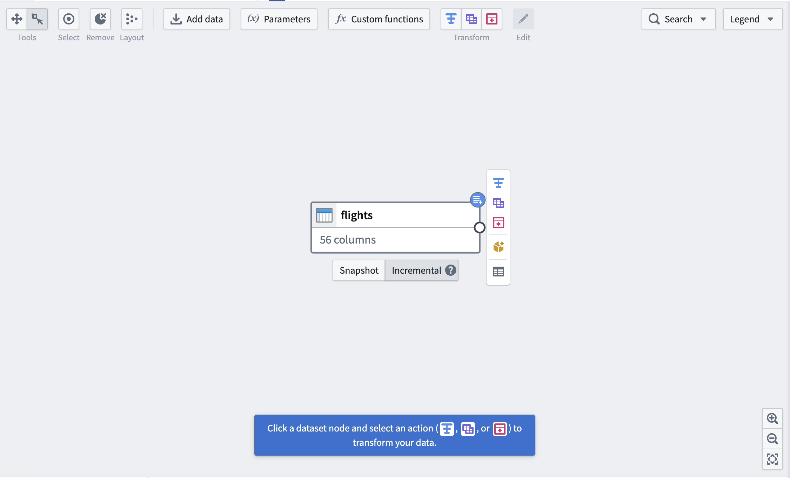
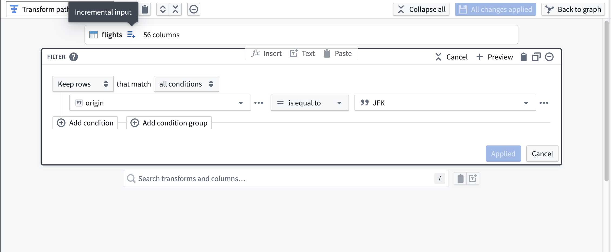
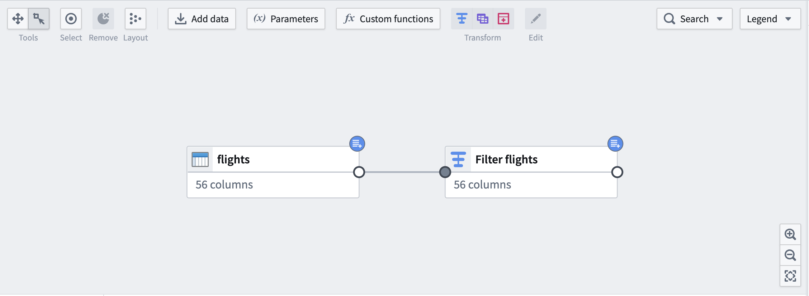
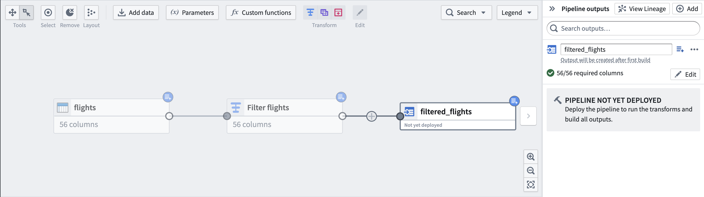
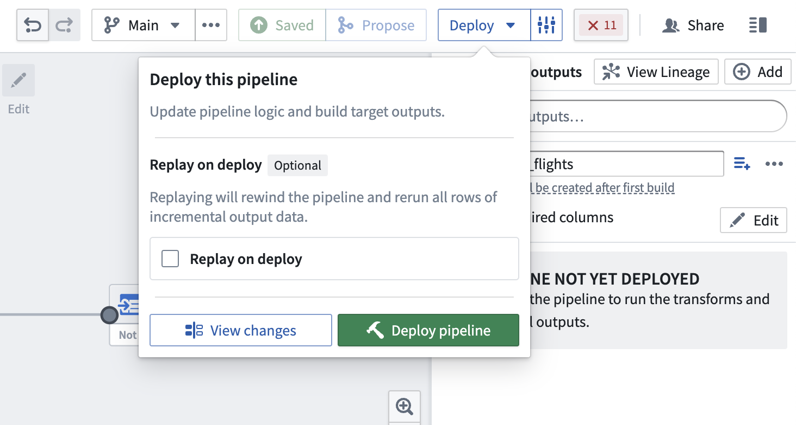
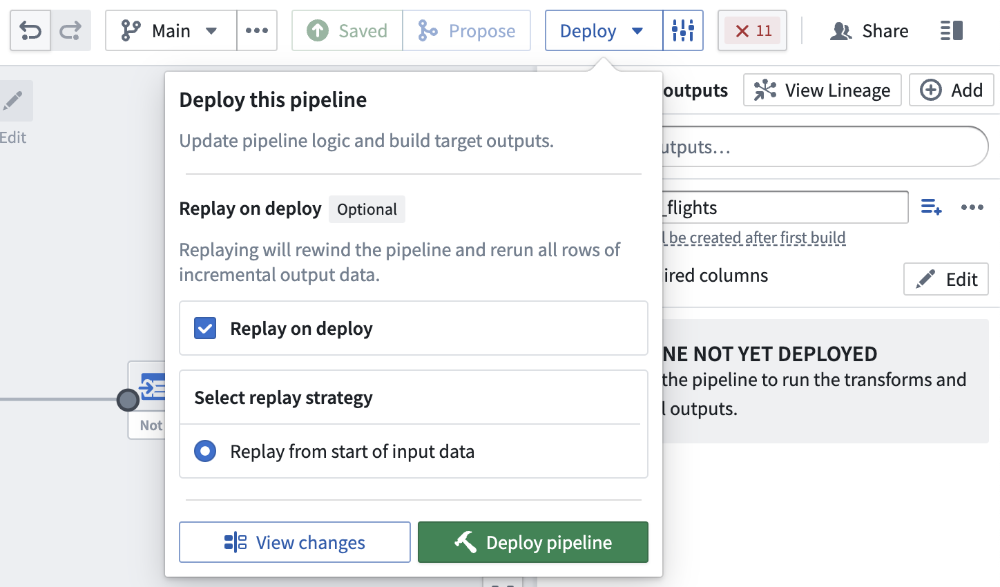

<!-- source: https://palantir.com/docs/foundry/building-pipelines/create-incremental-pipeline-pb/ · mirrored 2026-08-22 from Palantir Foundry docs -->

# Create an incremental pipeline with Pipeline Builder

In this tutorial, we will use Pipeline Builder to create a simple incremental pipeline with an output of a single dataset.

The datasets used below are hypothetical examples to illustrate how incremental computation would be applicable.

:::callout{theme="neutral"}
For incremental pipelines, you have the option to [force incremental behavior for outputs](./../pipeline-builder/breaking-changes.md#force-incremental-behavior-for-outputs) and fail the build if it cannot run incrementally.
:::

## Part 1: Problem statement

Suppose we have an input dataset of `flights` that appends new data every week. We want to filter down to only the flights departing `JFK` airport, then append only those flights to the output `filtered_flights`.

Suppose that the `flights` dataset is 20 million rows, but only 1 million rows are added each week. With incremental computation, the pipeline only needs to consider the latest unprocessed transactions in `flights` instead of all rows as in snapshot computation.

:::callout{theme="success"}
If a pipeline runs regularly, incremental processing can significantly reduce the data scale of each run, saving time and resources.
:::

The following sections walk through how to set up an incremental pipeline.

## Part 2: Validate incremental requirements

:::callout{theme="warning"}
A pipeline will only run with incremental computation if all the considerations in this section are satisfied. For example, your input must update through `APPEND` or `UPDATE` transactions that do not modify existing files. Otherwise, marking your input as incremental will have no effect.
:::

First, check that all incremental constraints are satisfied:

* The input `flights` is updating through `APPEND` transactions or `UPDATE` transactions that do not modify existing files.
* The logic for computing `filtered_flights` from `flights` does not require changing any previously written data in `filtered_flights` during later builds.
  * If you wish to change your pipeline logic (for example, to also include flights departing `LGA` airport), you can update the pipeline. If you want to apply that logic to previously-processed flights, you may want to [replay](#replay-on-deploy) your pipeline.
* If the pipeline includes window functions, aggregations, or pivots, ensure that these are meant to operate on the current transaction only.

For a full list of considerations, reference these important [restrictions](/docs/foundry/pipeline-builder/datasets-computation-modes-for-batch/#incremental-computation-restrictions) for incremental computation in Pipeline Builder.

## Part 3: Create your pipeline

Now, we can initialize a new pipeline (for a step-by-step walkthrough, reference [creating a batch pipeline in Pipeline Builder](/docs/foundry/building-pipelines/create-batch-pipeline-pb/)). Assume that we have imported `flights` as an input dataset.

First, mark your input dataset as **Incremental** using the buttons below the dataset. You will see a blue badge appear in the top right corner to indicate the change.

Next, add a transform to filter `flights` to those departing `JFK` airport. Notice the icon to the right of the dataset input labeled with the tooltip **Incremental input**. Downstream transformations will have this icon to indicate that they are being processed incrementally.

On the graph, downstream nodes will be marked with the same blue badge as the input.

Finally, add an output dataset `filtered_flights`.

## Part 4: Deploy output dataset

You are now ready to [deploy your pipeline](/docs/foundry/pipeline-builder/outputs-deliver-pipeline/).

### Replay on deploy

Sometimes, it may be necessary to reprocess previous input transactions (for example, if the logic changed and the previous version of your output data is now outdated). In these instances, you can select **Replay on deploy** to run the entire input through the pipeline logic. After replaying, your pipeline should continue with incremental computation as new append transactions are added to the input.

:::callout{theme="warning"}
Replaying on deploy will produce a `SNAPSHOT` transaction on the output dataset.
:::

