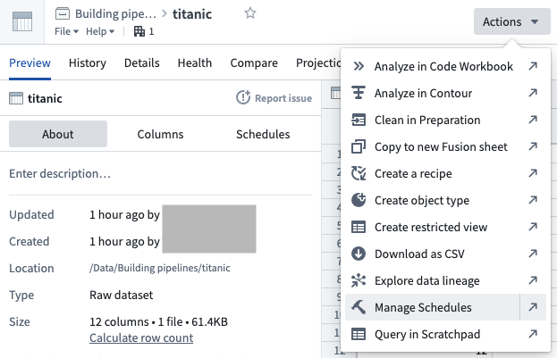
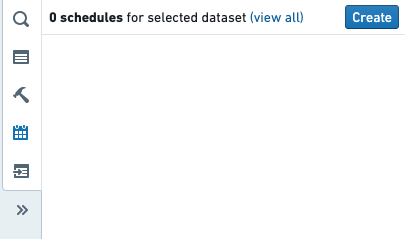
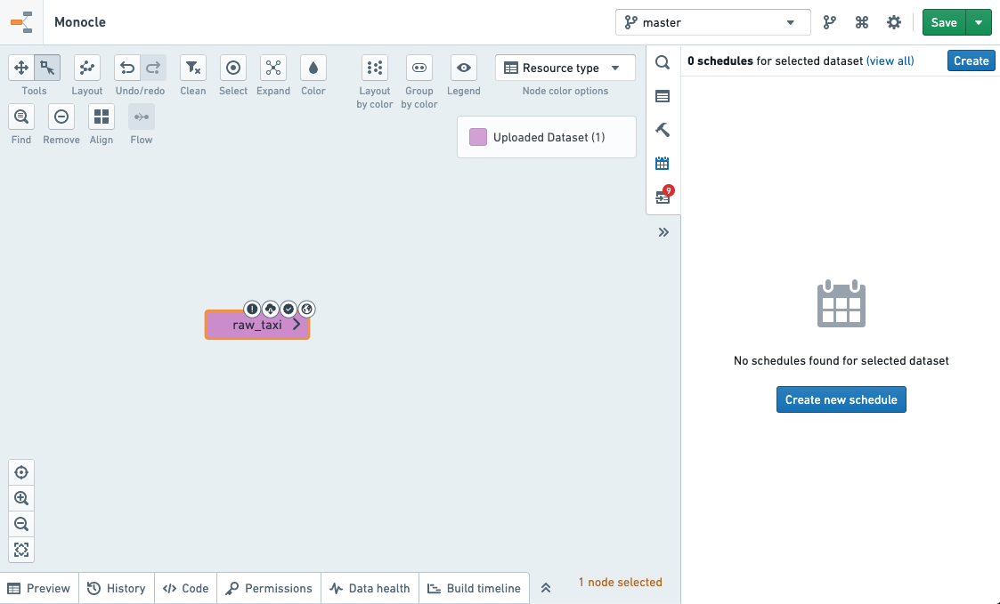
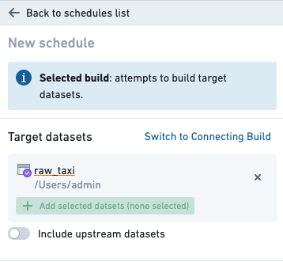
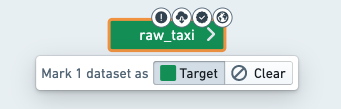
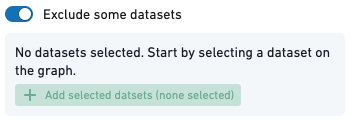
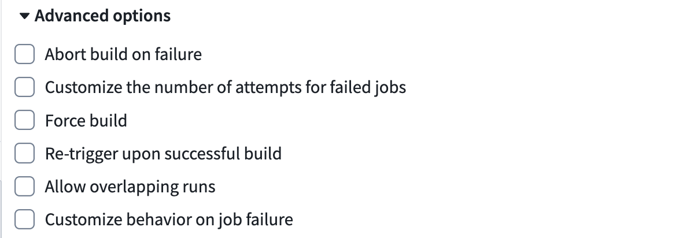

<!-- source: https://palantir.com/docs/foundry/building-pipelines/create-schedule/ · mirrored 2026-08-22 from Palantir Foundry docs -->

# Create a schedule

The [Data Lineage](/docs/foundry/data-lineage/overview/) schedule editor is where you can create new schedules and edit existing schedules. You can also view metrics on existing schedules and see how the schedule will build your datasets.

## Navigate to the schedule editor

The following steps guide you to the Data Lineage schedule editor, where you can create a new schedule:

1. Navigate to the [dataset preview](/docs/foundry/dataset-preview/overview/) of the dataset for which you would like to schedule a build, open the **Actions** menu, and select **Manage Schedules**. <br><br>
    <br><br>

2. This will bring you to a [Data Lineage](/docs/foundry/data-lineage/overview/) graph, with the schedules panel to the right listing all current schedules that affect the dataset.

   To create a schedule, click the **Create schedule** button. <br><br>
    <br><br>

3. This will bring you to the schedule editor. <br><br>
    <br><br>

## Define the schedule

To define a schedule, you will need to complete the following sections.

:::callout{theme="neutral" title="Branch selection"}
When creating schedules in Data Lineage, the schedules apply to the branches (including fallback branches) configured in the graph.
:::

### Target dataset(s)

The target datasets specify the datasets at the end of the build. By default, only these datasets will be built. In other configurations, these datasets may be the last in a line of datasets being built.



Target datasets can be selected by adding them to the graph and marking them as a target.



The datasets will be built on the branch set in the top right of the Data Lineage window. Datasets on the graph will be colored according to how they will affect or be affected by the schedule.

### Excluded datasets

Excluded datasets specify the datasets that will be ignored during graph traversal when determining which datasets to build. All datasets upstream of ignored datasets will not be built.



### When to build

The trigger specifies when the build should run. The build will be run when the condition defined in the trigger is satisfied.

There are two basic types of triggers:

* **Time:** A time trigger is satisfied at specified instants in time.

  [Learn more about time triggers.](/docs/foundry/building-pipelines/triggers-reference/#time-trigger)

* **When dataset(s) update:** Satisfied once a specified datasets update has occurred in the platform.

  [Learn more about event triggers.](/docs/foundry/building-pipelines/triggers-reference/#event-trigger)

Triggers may be combined to create a more complex compound trigger. The method used to combine triggers can be selected using the menu in the trigger editor:

* **Any of these triggers:** The trigger will be satisfied when any of the component triggers are satisfied.

* **All of these triggers:** The trigger will be satisfied when all of the component triggers are satisfied.

* **Advanced configuration:** Explicitly configure how to combine the component triggers.

  When advanced configuration is selected, the component triggers are combined by inserting the keywords `AND` and `OR` between two triggers. A compound trigger can be further combined by putting it inside parenthesis `(` and `)`.

  * `AND` indicates that the compound trigger will be satisfied when both of the component triggers are satisfied.

  * `OR` indicates that the compound trigger will be satisfied when either of the component triggers are satisfied.

  [Learn more about compound triggers.](/docs/foundry/building-pipelines/triggers-reference/#compound-trigger)

### Build type

The build type specifies how to build the selected datasets:

* **Single build:** Build the target datasets (no other datasets will be built).

* **Full build (include upstream):** Build all target datasets and all upstream datasets of this target, except excluded datasets. Datasets built may change if upstream dependencies change.

* **Connecting build:** Build all datasets between the input datasets (excluded) and target datasets (included). If a dataset is between an input dataset and a target dataset but is explicitly added as an input, it will still be built by the schedule. If a dataset is chosen as a target dataset, but there is no build path from an input dataset to the target dataset, the target dataset will not be built.

For a connecting build, all of the datasets connecting the target datasets and upstream datasets must be connected by a job spec path on the branch on which the schedule is set.

We illustrate the above with an example lineage below with datasets `D1, ..., D6`, where two different branches of the dataset D2 are used as inputs to D3 and D4. A connecting build schedule on the master branch with input D1 and targets D5 and D6 will attempt to build only D2, D4 and D6.

This behavior occurs because a connecting build selection between input D1 to target D6 on the master branch will select datasets D2, D4, and D6, since a job spec path exists between datasets D1 and D6. However, a connecting build selection between input D1 to target D5 will not exist, as the job spec path along the master branch is broken.

```
D1 (master) --> D2 (master) --> D4 (master) --> D6 (master)
                 |
                 | D2 (develop)
                 |
                  --> D3 (master) --> D5 (master)
```

To include dataset D3 in the scheduled build for this example, the build should be changed to a full build, which would include D3 as well as the input D1 as it is upstream of D5. Alternatively, to remain as a connecting build selection, the transform which has D2 (develop) as an input and D3 as an output can be edited to include an additional dummy input D7 on the master branch, as below. The connecting scheduled build on the master branch with input D1 and targets D5 and D6 will now build D2, D3, D4, D5, and D6.

```
D1 (master) --> D2 (master) --> D4 (master) --> D6 (master)
                 |
                 | D2 (develop)
                 |
D7 (master) -------> D3 (master) --> D5 (master)
```

:::callout{theme="neutral" title="Connecting build branch selection"}
For a connecting build schedule, if you are using datasets from different branches than the branch containing the schedule, then a connecting job spec path on the same branch must exist between the input and target builds in order for these datasets to be included in the build.
:::

### Build scope

To account for the dynamic nature of data pipelines, the set of datasets to be included in the build is evaluated every time the schedule is triggered. The **build scope** defines the boundaries for the schedule build, these boundaries will remain fixed even as the content of the pipeline changes. There are two scoping options available:

1. **By Projects:** The schedule will be allowed to build only eligible datasets within the selected Projects.
2. **By user account:** The schedule will be allowed to build only datasets that the schedule creator/editor is allowed to build.

#### Project scoping

Project scoping assures the schedule runs only on datasets within the selected Projects. It allows the schedule to run unaffected by changing user permissions. This option is most reliable when the build content is unlikely to change to the extent that it can no longer run within the selected Projects (as described below).

A build cannot be Project scoped in the following cases:

* You do not have permissions to create schedules on the Project.
* You do not have sufficient permissions to build the datasets.
* The schedule settings cover datasets that [remove markings](/docs/foundry/building-pipelines/remove-markings/) (you can see this in [Data Lineage](/docs/foundry/data-lineage/node-coloring/) when the graph is colored by Permissions).
* The schedule settings cover datasets that must build with a user account.
* The schedule content cannot be resolved to a distinct set of Projects.

#### User scoping

With user scoping, the schedule build will be triggered on behalf of the user who last edited (or created) the schedule. Therefore, the build will only include datasets that the user is permitted to build. This option is most reliable when the scheduled pipeline is likely to change and render Project scoping impossible (e.g. datasets are moved to another Project, new datasets require to run with a user account, etc.).

:::callout{theme="warning" title="Warning"}
If the user is deactivated or loses permission to datasets that are essential to the build, the schedule build will fail to start. When scoping by user account, make sure the account has reliable permissions and remember to change the ownership if the user is about to be deactivated.
:::

### Advanced settings

The advanced settings specify additional build options:



* **Abort build on failure:** If any job in the build is unsuccessful, immediately finish the build by canceling all other jobs.

* **Customize the number of attempts for failed jobs:** The number of run attempts for failed jobs. Retried jobs are run as part of the same build. A job is not considered failed until all retries have been attempted or an error occurs indicating that retries cannot be performed. Setting this value to 1 will prevent retries, as the job will only be attempted once. Be aware that not all types of failures can be retried. The number of retries when the schedule runs will be capped to a maximum configured by your administrator.

* **Force build:** Ignore staleness information when running the build. All datasets will be built whether or not they are stale. This option is almost never required. The rare instances in which this option is necessary are:
  1. **Data Connection syncs:** Data Connection syncs are always marked as up to date because they have externally originating inputs; Foundry does not know whether there have been updates to the external data or not. We recommend scheduling Data Connection syncs separately from the rest of a build to ensure that only the syncs get force-built.
  2. **Object Storage v1 (Phonograph) syncs**

:::callout{theme="warning" title="External transform schedules"}
Transforms that make API calls behave differently from Data Connection syncs. These transforms are always considered stale, and any build schedule will trigger them without requiring the **Force build** option.
:::

* **Re-trigger upon successful build:** Repeatedly triggers the schedule to keep building until all the inputs have been processed and the targets of the schedule are no longer stale. For this setting to have an effect, the schedule must:
  1. Contain at least one target output that uses either [incremental transaction limits](/docs/foundry/transforms-python-spark/incremental-transaction-limits/#create-a-build-schedule-to-keep-outputs-up-to-date) for datasets or [incremental batch limits](/docs/foundry/transforms-python-spark/incremental-media-sets/#limit-batch-size-of-incremental-inputs) for media sets. If there are no such outputs in the schedule, a warning with the text `No resources in this schedule require re-triggering` will be displayed.
  2. Have the **Force build** setting disabled.

* **Allow overlapping runs:** By default, a schedule does not start a new run while another run of the same schedule is in progress. Enable this setting to allow runs to overlap. Use this setting to:
  * **Reduce latency in a pipeline with a long sequence of jobs:** A new run can begin processing new input data at the start of the pipeline before an earlier run finishes processing data through the entire pipeline.
  * **Use one schedule to keep multiple datasets up to date:** A single schedule starts builds for each dataset as needed, without requiring a separate schedule for each dataset.

* **Customize behavior on job failure:** By default, when a job fails, the build cancels its dependent jobs. Enable this setting to specify datasets for which a job failure should not cancel dependent jobs. If a job for one of the specified datasets fails, the build continues to run its dependent jobs.

## Save the schedule

When you have finished defining your schedule, click the **Save schedule** button.

This will bring you back to the schedules page where you should see the saved schedule.
