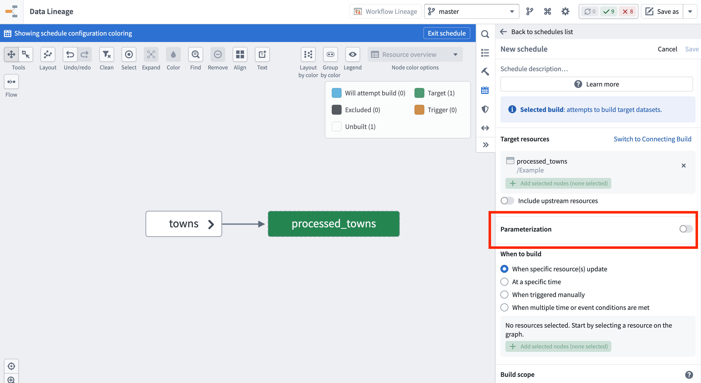
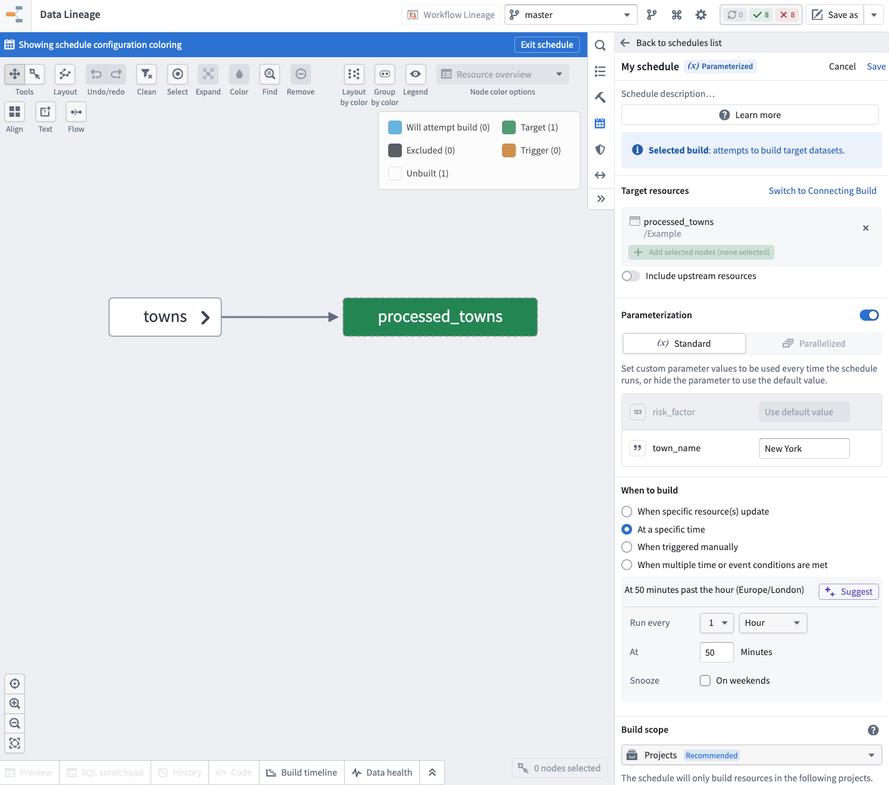
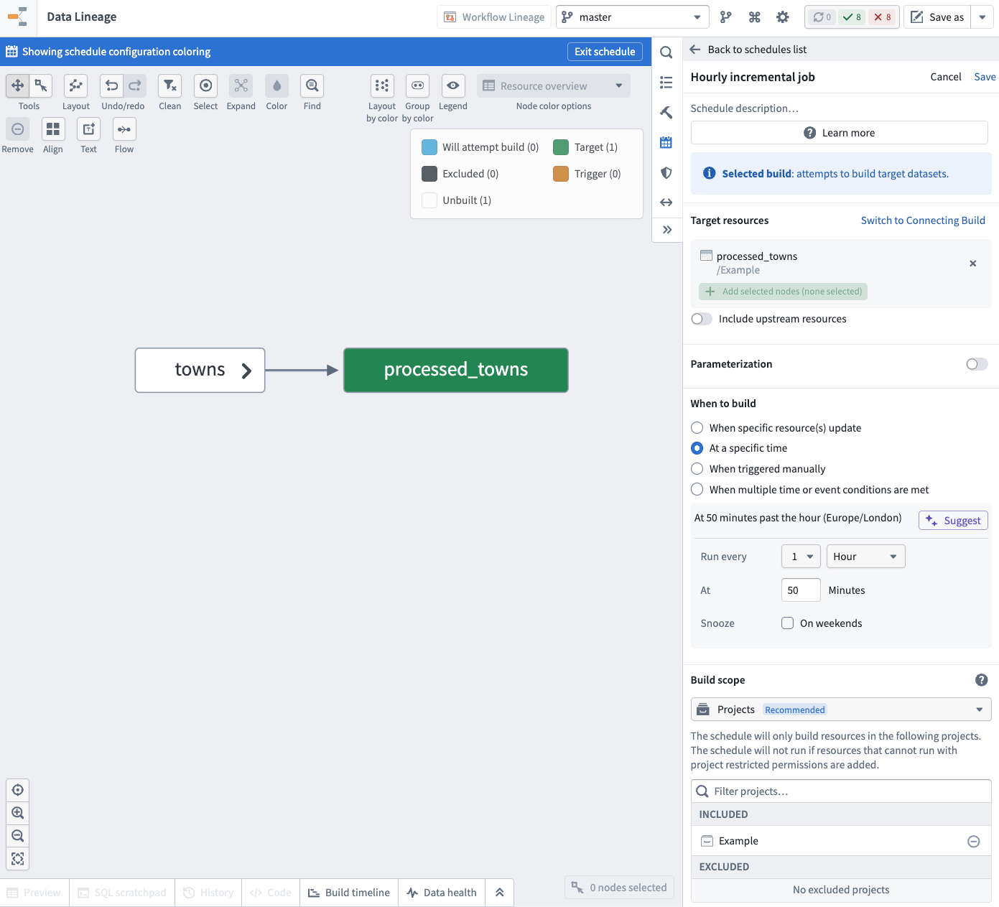
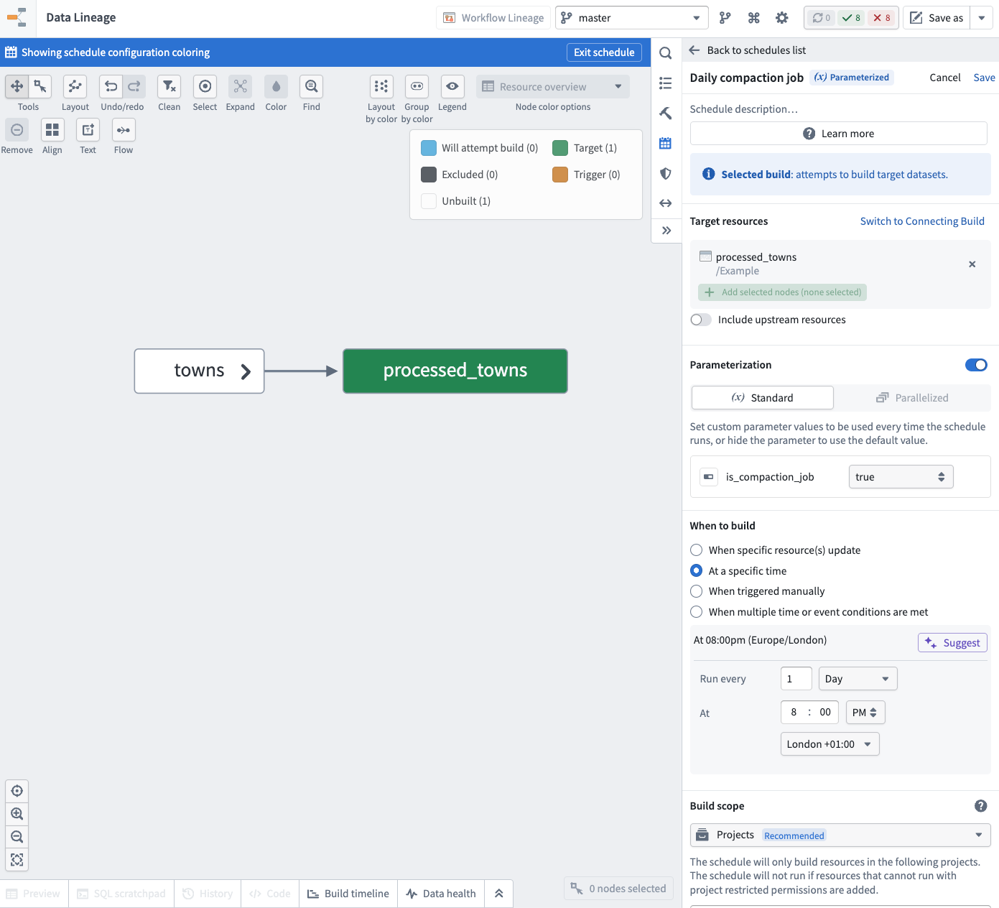
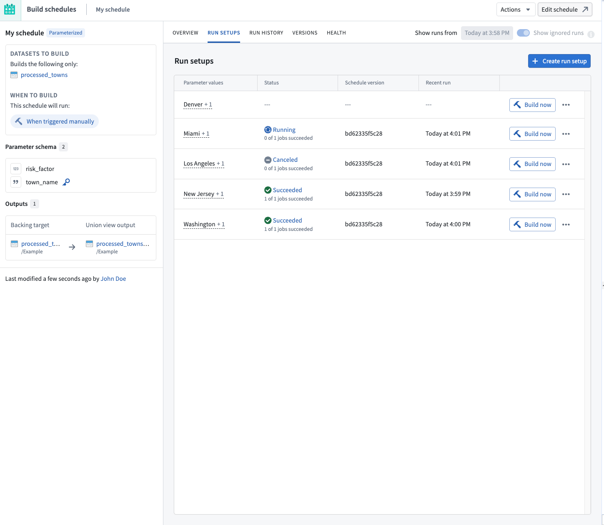
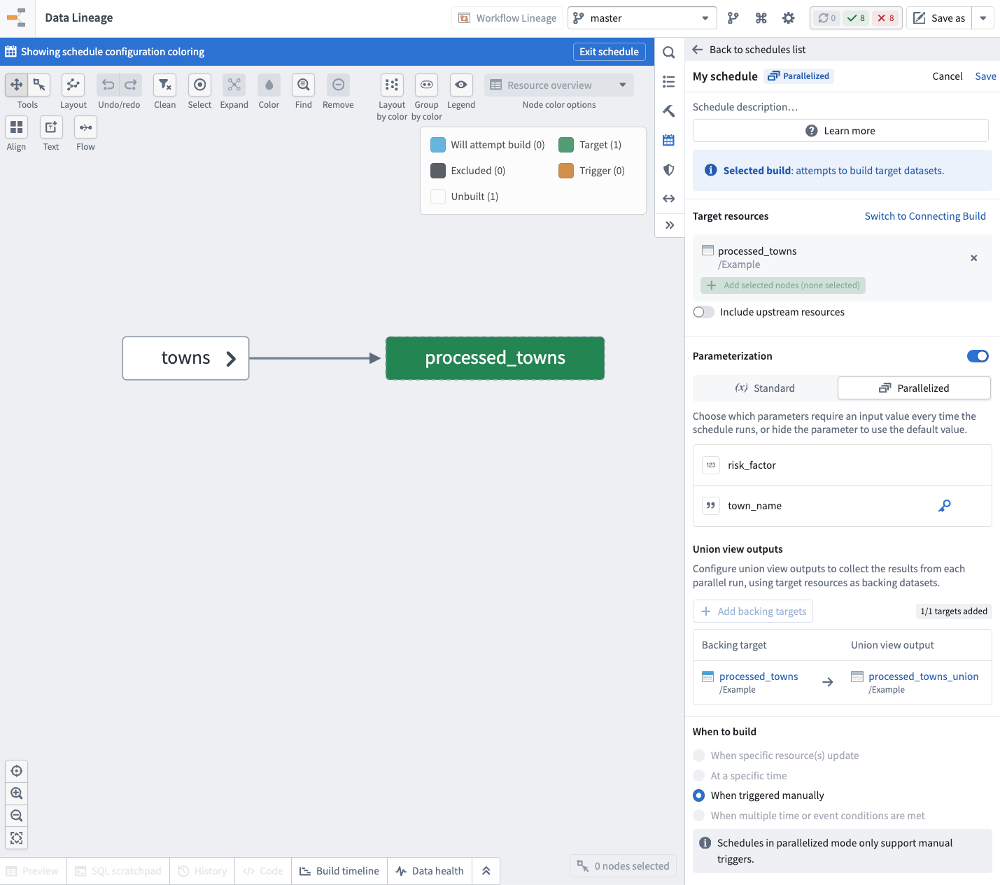

<!-- source: https://palantir.com/docs/foundry/building-pipelines/parameterization/ · mirrored 2026-08-22 from Palantir Foundry docs -->

# Parameterization \[Beta]

:::callout{theme="neutral" title="Beta"}
Schedule parameterization is in the [beta](/docs/foundry/platform-overview/development-life-cycle/) phase of development and may not be available on your enrollment. The feature is currently only available for [Python transforms](/docs/foundry/transforms-python/overview/), and functionality may change during active development.
:::

Parameterization allows transform logic to run with different parameter values.

## Define parameters in Python transforms

To use parameterization, you must first define the parameters in your transform logic and verify that your [repository](/docs/foundry/code-repositories/overview/) meets the following version requirements:

* `transformsVersion` must be `10.96.0` or later.
* `transformsLangPythonPluginVersion` must be `1.1137.0` or later.

If it does not, follow the [repository upgrade guide](/docs/foundry/code-repositories/repository-upgrades/) to ensure your repository meets the version requirements above.

Each parameter has a name, type, and default value.

* **Parameter name:** Declared by the Python variable name.
* **Parameter type:** One of [StringParam](/docs/foundry/api-reference/transforms-python-library/api-stringparam/), [IntegerParam](/docs/foundry/api-reference/transforms-python-library/api-integerparam/), [FloatParam](/docs/foundry/api-reference/transforms-python-library/api-floatparam/), or [BooleanParam](/docs/foundry/api-reference/transforms-python-library/api-booleanparam/).
* **Parameter default value:** The value used when the parameter is not specified, meaning the transform was not built through a parameterized schedule.

The following example Python transform has two parameters named `town_name` and `risk_factor` with default values of `"Seattle"` and `5`.

```python
@transform.using(
    processed_towns=Output('/path/to/output_towns'),
    towns=Input('/path/to/input_towns'),
    town_name=StringParam("Seattle"),
    risk_factor=IntegerParam(5),
)
def compute(processed_towns, towns, town_name, risk_factor):
    ...
    selected_town_name = town_name.value
    selected_risk_factor = risk_factor.value
    ...
```

## Enable parameterization in the schedule editor

Once you have your transform logic in place, [create a new schedule in Data Lineage](/docs/foundry/building-pipelines/create-schedule/), and enable the **Parameterization** option. The parameters defined on your target datasets' transforms will be available here.



## Standard mode

In standard mode, you provide the parameter values on the schedule, and these values are passed to your transforms when the schedule runs.

To use the default value defined on the transform for a parameter, hide that parameter in the schedule.

The following example shows the `risk_factor` parameter hidden, and the `town_name` set to `"New York"` for this schedule.



### Example use case: Periodic snapshot jobs for an incremental transform

Suppose you have an incremental pipeline where you need to run hourly incremental builds, but also run a daily non-incremental build that performs data compaction. You can achieve this using a parameterized schedule by following the steps below:

1. Create a transform with a boolean parameter that indicates the runtime type for the job.

```python
@incremental()
@transform.using(
    processed_towns=Output('/path/to/output_towns'),
    towns=Input('/path/to/input_towns'),
    is_compaction_job=BooleanParam(False),
)
def compute(processed_towns, towns, is_compaction_job):
    towns_df = towns.polars()

    if is_compaction_job.value:
        processed_towns.set_mode("replace")

    processed_towns.write_table(towns_df)
```

2. Create two schedules that build the transform:

* An hourly schedule for your incremental builds. You can skip the parameterization and rely on the default value.



* A daily schedule for your non-incremental archive builds. Enable the parameterization and set the boolean parameter `is_compaction_job` to `true`.



These schedules allow you to run hourly incremental builds and daily non-incremental builds while keeping the same transform logic deployed.

## Parallelized mode (advanced)

Parallelized mode allows you to create a schedule that can run independent parallel builds with different parameter values and aggregate their results.

### Run setups

In parallelized mode, parameter values are not directly provided on the schedule. Instead, they are defined by run setups of the schedule.

A run setup is a set of parameter values, including a unique value for the special **run setup key** parameter. When you create a parallelized schedule, you designate one of the parameters as the run setup key, which is used to identify that run setup.

You can build run setups independently in parallel without waiting for other run setups to finish building. Foundry stores the output data of each successful build in the configured [union view outputs](#union-view-outputs).

To manage the run setups of a schedule, select **Metrics & History** on an existing parallelized schedule, and navigate to the **Run setups** tab.



#### Create a run setup

To create a new run setup:

1. Choose **Create run setup**.
2. Fill in the parameter values for the run setup and provide a unique value for the run setup key parameter.
3. Choose **Save** to create the run setup.

#### Build a run setup

To build an existing run setup:

1. Locate the run setup in the **Run setups** list.
2. Choose **Build now** on the corresponding row.

If the build succeeds, the rows will be available in the configured [union view outputs](#union-view-outputs).

#### Edit a run setup

To change the parameter values of an existing run setup:

1. Locate the run setup in the **Run setups** list.
2. Choose the **(•••)** menu icon on the corresponding row and choose **Edit**.
3. Update the parameter values as needed and choose **Save**.

The next time the run setup is built, it uses the updated parameter values. The old rows from the previous builds will remain in the configured union view outputs until the deployment is rebuilt.

#### Delete a run setup and its output data

To remove a run setup along with the rows it contributed to the union view outputs:

1. Locate the run setup in the **Run setups** list.
2. Choose the **(•••)** menu icon on the corresponding row and choose **Delete**.
3. Confirm the deletion.

When a run setup is deleted, its corresponding rows are removed from the configured [union view outputs](#union-view-outputs).

### Union view outputs

When the build of a parallel run setup succeeds, the contents of the output datasets will not be updated on the main schedule branch. Instead, the contents of the rows are collected inside an output union [view](/docs/foundry/data-integration/views/) that you configure on the schedule.

You can configure the union outputs while creating or editing the schedule. For each target dataset in the schedule, you can select a union view that will be used to store the resulting rows.



### Use action types for parallelized schedules

Parallelized schedules are most useful when the run setups are built by an [action type](/docs/foundry/action-types/overview/). [Learn more about creating an action type that runs a schedule.](/docs/foundry/action-types/trigger-schedule-build/)

When you run a parallelized schedule through an action, Foundry automatically creates a new run setup with the parameter values provided by the action and invokes a build right away.

If there is already an existing run setup with the same value for the run setup key, then the parameter values are updated for this run setup before the build is invoked.

## Limitations

The following limitations apply to all parameterized schedules:

* Parameter types and names defined in a schedule cannot be edited after the schedule has been created. You must create a new schedule to use new parameters.
* Parameterized schedules cannot be included as part of [Marketplace](/docs/foundry/marketplace/overview/) products.

The following additional limitations apply to parallelized mode schedules:

* A schedule can have at most 1,000 run setups at a time.
* Collecting the results of parallel runs in an output union view is only supported for tabular Foundry datasets.
* Schedules in parallelized mode do not support defining automated triggers; they can only be run manually using [run setups](#run-setups) or executing [actions](#use-action-types-for-parallelized-schedules).
